# Cours 1 - Intro à Angular

### 🙈 Application Web ASP.NET Core <u>sans</u> client Angular

Quand on envoie une requête HTTP au serveur sur lequel l'application ASP.NET Core roule, le serveur 
nous renvoie du **HTML**, du **CSS** et du **JavaScript** pour que la page Web à afficher chez
l'utilisateur soit toute prête. 🎁👌

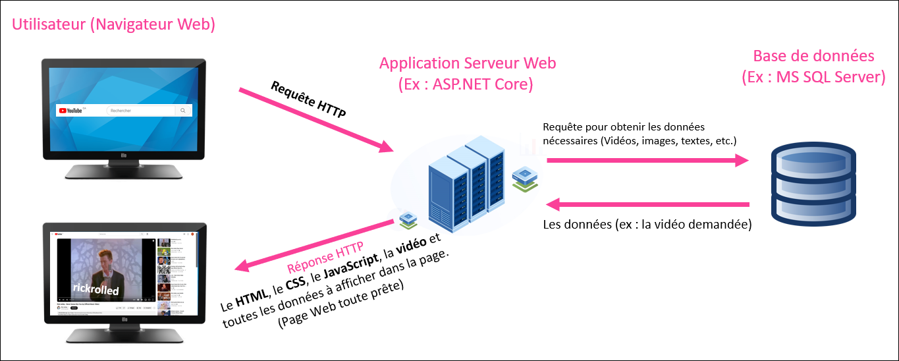

### ✅ Application Web ASP.NET Core <u>avec</u> client Angular

Désormais, il y a une application Web cliente (c'est-à-dire qu'elle est exécutée sur l'ordinateur de 
l'utilisateur) qui contient tout le HTML, le CSS et le JavaScript du site Web visité.

Quand on envoie une requête HTTP au serveur sur lequel l'application ASP.NET Core roule, le serveur
nous renvoie seulement les données à afficher (vidéos, images, morceaux de texte, etc.) sous forme 
de JSON ou de XML et l'application Angular s'occupera de « pluguer » les données dans le HTML. 📦🔍

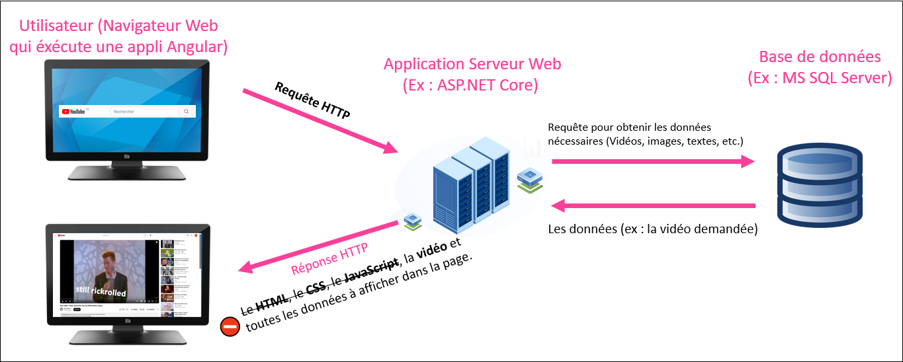

Pour que le navigateur de l'utilisateur ait accès au client Angular, le serveur doit lui envoyer le
projet Angular en entier lorsque l'utilisateur fait sa première requête au site Web.

Par exemple, lorsque je souhaite naviguer sur YouTube, voici ce qu'il se passe, grossièrement :

1. J'envoie ma **première requête HTTP** (`https://www.youtube.ca`) à YouTube.
2. L'application Web serveur de YouTube me retourne les choses suivantes :

    * ⚙ Une application Angular (inclut tous le **HTML**, le **CSS** et le **JavaScript** du site Web)
    * 📦 Les **données** à afficher sur la page d'accueil du site Web (Quelques thumbnails de vidéo, les titres des vidéos, etc.)

3. Ma navigation se poursuit. Par exemple, je clique sur une vidéo. (Ce qui envoie une **deuxième requête HTTP** à Youtube : `https://www.youtube.com/watch?v=dQw4w9WgXcQ`)
4. L'application Web serveur de YouTube me retourne des **données** supplémentaires :

    * 🎥 La vidéo à visionner.
    * 📃 Le titre de la vidéo.
    * 📜 Les commentaires de la vidéo.
    * etc.

### 🎭 Différences avec / sans une application Web cliente

| Aspect | Avec Angular | Sans Angular |
| - | - | - |
| 🏁 Première requête à un site Web | Recevoir l'application cliente Angular en entier. **Plus long** pour charger la page d'accueil. | Recevoir un peu de HTML, de CSS et de JavaScript. |
| 🚩 Requêtes suivantes | Recevoir seulement les nouvelles données à intégrer à la page Web. **Plus court**. | Recevoir le HTML, le CSS et le JavaScript de la nouvelle page Web. |
| ⚡ Charge du serveur | Allégée : il n'a plus besoin de construire les pages Web. (Les views) | Alourdie : il doit construire chaque page Web avant de les envoyer. |
| 🖥 Charge du client | Alourdie : il y a plus de JavaScript qui travaille côté client pour faire évoluer les pages Web dynamiquement. | Allégée : les pages Web arrivent toutes faites. Il y a parfois un peu de JavaScript pour rendre les pages Web dynamiques, mais c'est léger. |
| 📱🖥💻 Portabilité | Flexible : le serveur Web retourne des données sous format JSON / XML ! On pourrait créer une application mobile qui envoie des requêtes au même serveur Web sans problème. | Rigide : Le serveur retourne du HTML, du CSS et du JavaScript... Il faut utiliser la page Web tel quel. |

:::tip

Bien qu'utiliser un framework client comme Angular offre plusieurs avantages pour un site Web dont le contenu est très dynamique, 
pour des sites Web simples et très statiques, (blogs, journaux, recettes, etc.) se passer d'une application cliente est raisonnable.
On pourrait même aller plus loin et simplement utiliser un CMS (Content Management System) comme Wordpress pour ne pas avoir à écrire
la moindre ligne de code.

:::

### 🐟 Autres frameworks

#### ⚙ Frameworks serveurs

Depuis votre premier cours de Web, vous utilisez le framework **ASP.NET Core** pour créer des applications Web **serveur**.
Il existe d'autres frameworks Web serveurs (_back end_) qui peuvent jouer le même rôle. Ils sont généralement similaires,
avec quelques fonctionnalités, avantages et défis différents.

Comme ce type de projet ne roule pas dans un navigateur Web, n'importe quel langage de programmation peut être utilisé.

<center>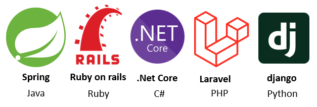</center>

#### 🖥 Frameworks clients

Dans ce cours, nous apprendrons à utiliser le framework **Angular** pour créer des applications Web **cliente**.
Il existe d'autres frameworks Web clients (_front end_) également.

Comme ce type de projet roule dans le navigateur Web de l'utilisateur, JavaScript est un choix relativement obligatoire.

<center>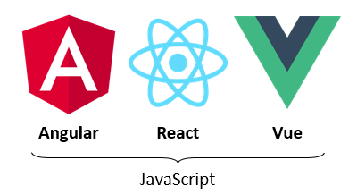</center>

:::warning

Pourquoi ne pas communiquer directement avec la base de données avec un framework client comme Angular ? (Et se passer
d'un framework serveur comme ASP.NET Core) Le projet Angular est envoyé en entier au client et il n'est donc pas du tout
sécuritaire d'interagir avec une base de données dans une application cliente. (L'utilisateur aura accès aux identifiants
de connexion à la base de données et aux requêtes SQL)

:::

### 🛠 Outils à installer (à la maison seulement)

⛔ Ces outils sont déjà installés à l'école. Cette section n'est pertinente qu'à la maison. 🏠

#### NPM
<center></center>

Gestionnaire de paquets 📦 pour JavaScript. Nous aidera à gérer les dépendances pour nos projets Angular.  
Installez simplement [Node.js](https://nodejs.org/fr/), qui inclut NPM. Utilisez les paramètres par défaut lors de l'installation. Pas besoin d'installer Chocolatey.

<center>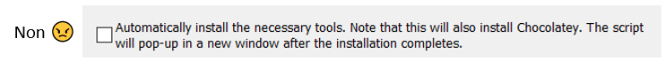</center>

Pour vérifier que NPM est bien installé, ouvrez **PowerShell**  
<center></center>
...et tapez simplement la commande `npm`, qui devrait vous proposer de l'aide pour taper d'autres commandes npm.

#### Angular
<center></center>

Tapez simplement la commande `npm install -g @angular/cli@20.1.3`. (Toujours dans PowerShell) On précise la version `20.1.3` car c'est la même que celle installée au Cégep, ce qui évite des conflits.
N'hésitez pas à ensuite taper la commande `ng version` pour valider qu'Angular s'est bien installé globalement.

### 🧪 Introduction à TypeScript
<center></center>

**TypeScript** est le langage que nous utiliserons (en plus de HTML et CSS) pour travailler sur nos projets Angular. L'extension des fichiers TypeScript est **.ts**.

:::info

Un instant ! **JavaScript** n'est-il pas le seul langage qui peut être interprété par les navigateurs Web ?
Oui, c'est exact. **TypeScript** n'est pas un _vrai langage_. C'est un _superset_ (Dérivé avec plus de contenu)
de **JavaScript**. Lorsque du code **TypeScript** est compilé, il est secrètement converti en **JavaScript** pour être
interprété par le navigateur Web. Pourquoi ne pas directement coder en **JavaScript** alors ? Car **TypeScript** nous apportera
plusieurs avantages importants et quelques fonctionnalités supplémentaires. 

:::

#### Exemple en JavaScript

Cela ressemble assez à **C#** pour que vous puissiez déduire le comportement de ce code.

```js showLineNumbers
function printToConsole(m){
    console.log(m);
}

let message = "Please send";
let n = 5;

message = 5 < 4 ? "Pick a Shoe" : message + " dudes";

for(let i = 0; i < n; i++){
    if(i % 2 == 0){
        printToConsole(message);
    }
}
```

import Tabs from '@theme/Tabs';
import TabItem from '@theme/TabItem';

#### TypeScript VS JavaScript

Voici le même exemple de code, dans les deux langages :

<Tabs>
    <TabItem value="js" label="JavaScript" default>
        ```js showLineNumbers
        multiplyByTwo(n){
            let newValue = n * 2;
            return newValue;
        }
        ```
    </TabItem>
    <TabItem value="ts" label="TypeScript" default>
        ```ts showLineNumbers
        multiplyByTwo(n : number) : number {
            let newValue : number = n * 2;
            return newValue;
        }
        ```
    </TabItem>
</Tabs>

On remarque surtout le typage dans l'exemple en **TypeScript** :
* Le paramètre de la fonction est typé.
* Le paramètre de retour est typé.
* La variable locale newValue est typée.

:::note

Les langages typés (C#, Java, TypeScript, C++, etc.) permettent généralement d'avoir moins d'erreurs lors de l'exécution du code. 
(Les erreurs sont détectées par le compilateur) Les langages non typés (JavaScript, Python, Ruby, etc.) ont plus de chances de
générer des erreurs lors de l'exécution. (Les erreurs ne sont pas détectées à la compilation)

:::

<center>
    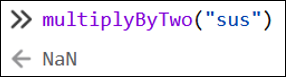  
    Oups ! "sus" multiplié par 2 ne donne pas une donnée valide...
</center>

### 🧰 Classes, variables et fonctions en TypeScript

Exemple de classe simple ඞ :

```ts showLineNumbers
class Crewmate{

    // Propriétés de la classe (publiques par défaut)
    impostor : boolean;
    alive : boolean;

    // Constructeur
    constructor(public color : string, public playerName : string){
        this.impostor = Math.random() < 0.5;
        this.alive = true;
    }

    // Fonction quelconque
    kill() : void{
        console.log(this.playerName + (this.impostor ? " was an impostor" : " was not an impostor"));
        this.alive = false;
    }

}
```

#### Propriétés de classe

* Doivent être typées `impostor : boolean` ou initialisées immédiatement `impostor = false`, au choix. (On peut faire les deux également)
* Peuvent posséder plusieurs types au besoin : `color : string | null` (Cette variable pourrait être `= "blue"` ou encore `= null`)
* Peuvent être undefined à l'aide de `?` : `playerName ?: string` ou carrément `playerName : string | undefined`.
* Pour les utiliser dans une fonction, il faut obligatoirement utiliser le préfixe `this`.

```ts showLineNumbers
class SkibidiCar{

    // Propriétés
    brand : string;
    isNew : boolean = true;
    year : number | null = null;
    driverName ?: string;

    // Constructeur
    ...

}
```

* **brand** : Devra obligatoirement être initialisée avec une chaîne de caractères par le constructeur.
* **isNew** : Initialisée avec true par défaut, mais pourrait être remplie avec `true` / `false` ailleurs.
* **year** : Initialisée avec null par défaut, mais pourrait être remplie avec un nombre ailleurs.
* **driverName** : Pourra être remplie avec une chaîne de caractères ailleurs. (Peut aussi rester `undefined` / vide)

:::note

Les types que nous utiliserons le plus en TypeScript seront `boolean`, `null`, `undefined` (ou `?:` devant le type), 
`number` (Remplace float, int, etc.), `string`, `number[]` et `string[]`. (`[]` signifie tableau)

:::

#### Constructeurs

Si un paramètre du constructeur possède le préfixe `public`, ce paramètre devient automatiquement une propriété de classe.

```ts showLineNumbers
class Imposter{

    impostor : boolean;
    alive : boolean = true;

    constructor(public color : string){
        this.impostor = Math.random() < 0.5;
    }

}
```

Ci-dessus, la classe `Impostor` possède donc 3 propriétés : impostor, alive et **color.** 
De plus, la valeur passée en paramètre au constructeur pour color est automatiquement assignée à la propriété color.

```ts showLineNumbers
// Cet imposteur aura "red" comme valeur pour sa propriété color
let impostor : Impostor = new Impostor("red");
```

Si ce n'est pas clair, voici deux classes dont le fonctionnement et les propriétés sont **identiques** :

<Tabs>
    <TabItem value="no_prefix" label="Sans le préfixe public" default>
        ```js showLineNumbers
        class Cat{

            name : string;
            color : string;

            constructor(name : string, color : string){
                this.name = name;
                this.color = color;
            }

        }
        ```
    </TabItem>
    <TabItem value="prefix" label="Avec le préfixe public" default>
        ```ts showLineNumbers
        class Cat{

            constructor(public name : string, public color : string){}

        }
        ```
    </TabItem>
</Tabs>

#### Fonctions de classe

* Pas obligé de préciser le type de retour, mais c'est souhaitable pour éviter des erreurs.
* Il est obligatoire de préciser le type des paramètres.
* N'oubliez pas le préfixe `this` lorsque vous faites référence à une propriété de classe.
* Il est possible de déclarer des variables locales à l'aide du mot-clé `let`.
    * Si une valeur lui est immédiatement assignée, préciser le type n'est pas obligatoire, mais on peut.

```ts showLineNumbers
playWithToy(toyName : string) : string {
    let msg : string = this.catName + " joue avec " + toyName;
    return msg;
}
```

### 🌳 Environnements de développement

#### Visual Studio code

<center></center>

Nous l'utiliserons pour travailler sur nos projets **Angular**. (Semaines 1 à 15)

#### Visual Studio

<center></center>

Nous l'utiliserons pour travailler sur nos projets **ASP.NET Core**. (Semaines 8 à 15)

### 🐣 Créer un projet Angular

Avec l'explorateur de fichiers Windows, rendez-vous dans le répertoire parent de votre choix, puis faites `shift + clic-droit` -> `Ouvrir PowerShell`.

Tapez ensuite la commande `ng new nomDeVotreProjet`. Vous aurez deux choix à faire :

1. Application zoneless -> `No`
1. Format de feuilles de styles -> `CSS`
2. Activer le rendu côté serveur -> `Non`

:::info

Le Server-Side Rendering (rendu côté serveur) permet de charger plus rapidement la page d'accueil du site Web après une première requête.
En temps normal, recevoir l'application Angular et l'exécuter côté client prend pas mal de temps suite à la première requête, alors pour y remédier,
le serveur, en plus d'envoyer l'application Angular au client, va également préparer un rendu HTML / CSS de la page d'accueil pour l'envoyer
au client et l'afficher dans le navigateur, le temps que l'application Angular soit exécutée. Lors du développement, cette option n'est pas nécessaire.

:::

Le gabarit de départ contient plusieurs fichiers essentiels :

<center>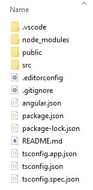</center>

### 🚬 Gestion des dépendances

#### 🐳 node_modules

<center>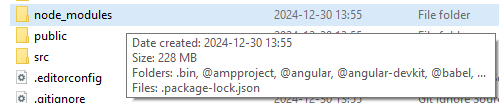</center>

Ce dossier contient toutes les dépendances qui permettent le fonctionnement de notre projet Angular. Cela dit, il pèse au minimum `228 Mo` 
et contient des tonnes et des tonnes de sous-dossiers et fichiers. Nous ne le modifierons jamais manuellement. Nous toucherons seulement
au contenu des dossiers `src` et `public`.

:::warning

Lorsque vous transférez un projet Angular sur un autre disque / ordinateur, sur Git ou que vous l'envoyez à quelqu'un, il est
**indispensable** de d'abord supprimer le dossier `node_modules` pour alléger considérablement le transfert. De préférence, supprimez
également le dossier `.angular`, qui est lourd aussi.

:::

À tout moment, le dossier `node_modules` peut être généré de nouveau en tapant la commande `npm install` (ou `npm i`). N'oubliez pas
de d'abord ouvrir PowerShell dans le dossier qui contient les fichiers du projet à l'aide de `shift + clic-droit`. 
(Le dossier qui contient `src`, `public`, etc.)

<center>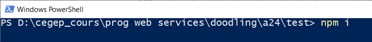</center>

Le dossier `.angular` sera créé sur le pouce lorsque vous exécuterez votre projet à l'aide de la commande `ng serve` plus tard
et sert simplement à mettre en cache certaines données lors de l'exécution.

#### 🍷 Installer une dépendance

Pour pouvoir utiliser certaines librairies dans un projet Angular, on peut se servir de **npm** pour installer la librairie
sous forme de dépendance. Par exemple, pour pouvoir utiliser **Bootstrap**, on doit installer deux dépendances : `jquery` et
`bootstrap`, à l'aide des commandes suivantes :

1. `npm install jquery`
2. `npm install bootstrap`

N'oubliez pas de d'abord ouvrir PowerShell dans le dossier qui contient les fichiers du projet à l'aide de `shift + clic-droit`. 
(Le dossier qui contient `src`, `public`, etc.) Si vos dépendances sont bien installées, elles seront visibles dans le fichier 
`package.json` :

<center>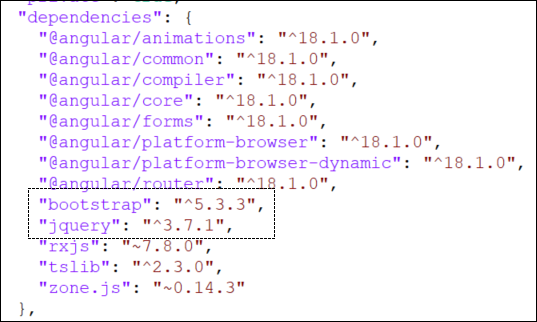</center>

Notons que des fichiers auront été ajoutés dans `node_modules` également.

#### 🩹 Désinstaller une dépendance

Les dépendances peuvent être désinstallées à l'aide de la commande `npm uninstall nomDeLaDependance`.

### 🏁 Ouvrir et exécuter un projet Angular

Il suffit d'ouvrir le dossier dans **Visual Studio Code** à l'aide d'un clic-droit à l'intérieur du dossier lui-même ou sur le dossier.

<center>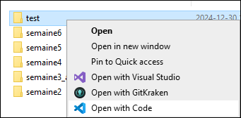</center>

<center>... ou encore ...  </center>
  
<center>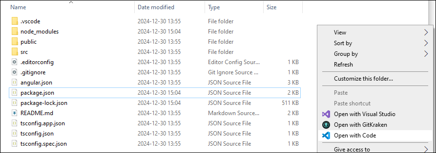</center>

Pour exécuter le projet, ouvrez un terminal (Onglet `Terminal` -> `Nouveau terminal`) puis tapez la commande `ng serve`.

<center>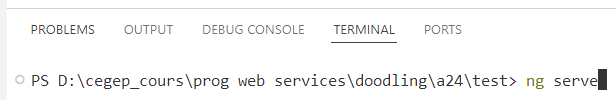</center>

Pour voir votre site Web, ouvrez un navigateur Web de votre choix et tapez l'adresse `localhost:4200`.
Pour le moment, ce sera le gabarit par défaut qui est affiché :

<center>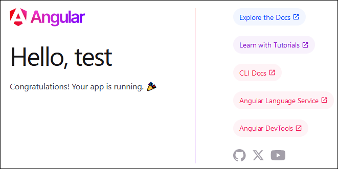</center>
  
  
:::info

Bonne nouvelle ! Dès que vous modifiez un fichier du projet Angular dans Visual Studio, le site Web sera automatiquement
mis à jour lorsque vous sauvegarderez le fichier modifié. Il n'est pas nécessaire de refaire la commande `ng serve`. 🫃

:::

### 🕵️‍♂️ Comprendre les fichiers de base

Pour le moment, tous les fichiers que nous aborderons seront situés dans le dossier `src` et ses sous-dossiers.

<center>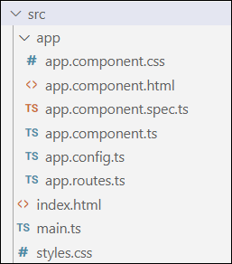</center>

:::warning

Pour respecter la convention de nommage en JavaScript / TypeScript, le nom des fichiers ne doit pas contenir de majuscules.
Essayez de le garder à l'esprit, même si vous êtes habitués à la convention PascalCase en C#.

:::

#### ⛏ main.ts

Nous ne toucherons jamais à ce fichier. En résumé, c'est le _point d'entrée_ lors de l'exécution du code de l'application.
Il sert à créer l'environnement dans le navigateur pour afficher le site Web.

#### 🏡 index.html et styles.css

<center></center>

`index.html` est le principal fichier HTML du projet. C'est, croyez-le ou non, la seule page Web de tout le projet.
Pourtant, son contenu correspond seulement au squelette d'une page Web. En gros, l'application Angular chargera dynamiquement
d'autres morceaux de HTML dans `index.html` (ces morceaux sont des **composants**) lors de la navigation de l'utilisateur,
ce qui donnera l'illusion d'un site Web avec plusieurs pages.

Généralement, on ne modifiera pas `index.html`, mais seulement des **composants**.

<center>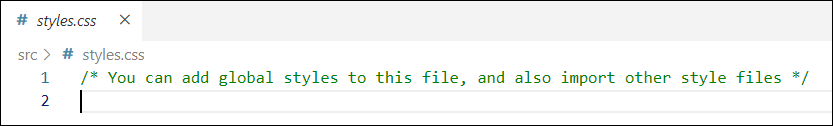</center>

`styles.css` est une feuille de styles globale qui affecte tous les composants du projets Angular. (Bref, tout le HTML
du projet sera touché par les règles CSS que vous ajouterez dans ce fichier.)

#### 📦 Les composants

Un `composant` est un _morceau de page Web_ représenté par du *HTML*, du *CSS* et du *TypeScript*. Par exemple,
voici le composant **app** :

<center>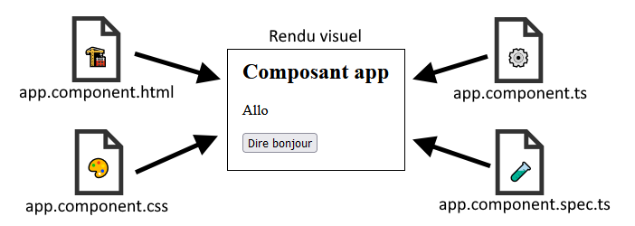</center>

* `app.component.html` contient tout le HTML du composant. (Ici, seulement un \<h2\>, un \<p\> et un \<button\>)
* `app.component.css` contient le CSS qui s'applique au HTML du composant.
* `app.component.ts` contient des fonctions et des variables qui permettent de rendre la page web dynamique. 
(Ex : une fonction décrit ce qu'il se passe quand on clique sur le bouton « Dire bonjour »)
* `app.component.spec.ts` contient des tests unitaires.

À chaque fois qu'on crée un nouveau `composant`, il faudra générer ces 4 fichiers. (Semaine 3)

:::note

Nous n'utiliserons pas les tests unitaires avant la semaine 6. Vous pouvez supprimer le fichier `.spec.tc`
de vos composants pour aérer votre projet si vous le désirez.

:::

#### 🖼 Affichage du composant app

Par défaut, vous remarquerez que c'est le HTML du composant `app` qui est affiché dans le navigateur lorsqu'on 
exécute le projet Angular. Pourtant, le `<body> ... </body>` du fichier `index.html` ressemble seulement à ceci :

<center>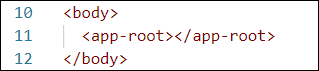</center>

Vous l'aurez compris, l'élément `<app-root></app-root>` permet d'indiquer qu'on souhaite afficher le composant
`app` (donc son HTML) ici ! 🗿

<center>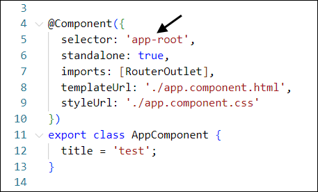</center>

Ci-dessus, on peut voir, dans le fichier `app.component.ts`, que le sélecteur à utiliser pour afficher le composant
`app` est `<app-root>`. On peut également voir que le HTML qui appartient au composant `app` peut être trouvé dans
le fichier `app.component.html` et que le CSS qui y est associé est dans le fichier `app.component.css`.

Bref, pour le moment, si vous souhaitez modifier la page Web qui est affiché, modifiez le HTML situé dans le fichier
`app.component.html`.

Nous n'aborderons pas le fonctionnement d'autres fichiers du projet pour le moment, mais ça viendra ! 🙈

### ✏ Afficher une variable dans la page Web

Il est possible de déclarer des **variables** et des **fonctions** dans la **classe TypeScript** d'un composant.
Ci-dessous, on a déclaré deux **variables** (`prenom` et `nom`) dans la classe du composant `app`.

```ts showLineNumbers
export class AppComponent {
  
  prenom : string = "Jacqueline";
  nom = "Robidoux"; // Rappel : Pas obligatoire de typer si la variable est immédiatement initialisée.

}
```

Pour afficher la valeur de ces variables dans le **template HTML** du composant `app`, nous devrons utiliser
des doubles accolades  
`{{ nom_de_la_variable }}`, comme ceci : 

```html showLineNumbers
<h2>Composant app</h2>

<p>Bonjour {{prenom}} {{nom}}</p>
```

Le résultat :

<center>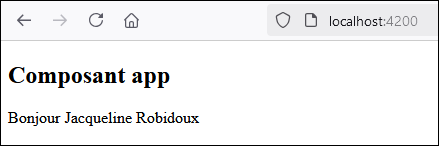</center>


### ✨ Afficher le résultat d'une fonction

On déclare une fonction (qui retourne quelque chose !) dans la **classe TypeScript** du composant :

```ts showLineNumbers
export class AppComponent {
  
  divideByThreePlusTwo(n : number) : string{
    return n + " divisé par 3 plus 2 donne " + (n / 3 + 2);
  }

}
```

On appelle la fonction sans oublier pas les doubles accolades dans le HTML :

```html showLineNumbers
<h2>Composant app</h2>

<p>{{ divideByThreePlusTwo(9) }}</p>
```

Le résultat :

<center>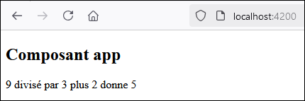</center>

### ⚱ Créer et afficher un objet personnalisé

D'abord, créez une nouvelle classe en tentant de respecter ces indications :

* Son fichier aura l'extension `.ts` et sera en minuscules. (Convention JavaScript / TypeScript)
* Pour bien organiser votre projet, rangez cette classe dans le dossier `app`/`models`.
* Le nom de la classe doit commencer par une majuscule. (C'est une convention aussi)

<center>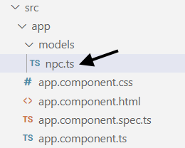</center>

Votre classe pourrait ressembler à ceci. Rappelez-vous que le mot-clé `public` peut être
utilisé pour simplifier la déclaration des propriétés de la classe. De plus, notez que
le mot-clé `export` est nécessaire pour que d'autres classes comme celle du composant `app`
aient accès à la classe que nous déclarons.

```ts showLineNumbers
export class Npc{

    constructor(
        public name : string,
        public dialogue : string,
        public age : number
    ){}

}
```

Nous pourrons maintenant créer une instance de cette nouvelle classe personnalisée dans le composant
`app`. Vous aurez à **importer** la classe pour pouvoir l'utiliser.

<center>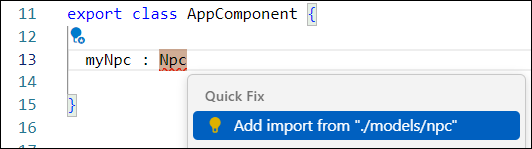</center>

Utilisez le **constructeur** de votre classe pour instancier un nouvel objet :

<center>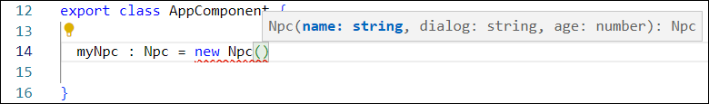</center>

L'instanciation de l'objet devrait ressembler à ceci : 

```ts showLineNumbers
export class AppComponent {
  
  myNpc : Npc = new Npc("Khajiit", "Khajiit has wares... if... you have coin.", 176);

}
```

Il ne reste plus qu'à gérer l'affichage dans la page Web, qui sera un peu plus délicate puisqu'il s'agit
d'un objet sophistiqué avec des propriétés :

```html showLineNumbers
<h2>Composant app</h2>

<p>{{myNpc.name}} est un NPC de {{myNpc.age}} an(s) dont le dialogue est « {{myNpc.dialogue}} »</p>
```

<center>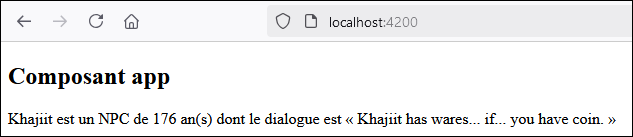</center>

### 📜 Créer et afficher un tableau

En JavaScript (et donc en TypeScript), les tableaux ressemblent à `["chat", "chien", "perruche"]`.

En TypeScript, on peut déclarer un tableau comme ceci :

```ts showLineNumbers
myNumbers : number[] = [1, 4, 5, 2];
```

et afficher ses données dans le HTML comme ceci :

```html showLineNumbers
<p>J'ADORE les nombres {{myNumbers[0]}}, {{myNumbers[1]}}, {{myNumbers[2]}} et {{myNumbers[3]}} !</p>
```

<center>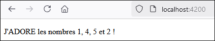</center>

:::note

Lors du Cours 2, nous verrons une méthode plus élégante pour afficher les éléments d'un tableau dans le HTML.

:::

### 📂 Git

**Rappel** : N'hésitez pas à visiter [cette page](https://info.cegepmontpetit.ca/git) du site départemental pour 
retrouver les conventions de la technique en informatique en lien avec l'usage de Git.

Les adultes 👨👩 doivent utiliser Git. L'usage de Git sera évalué pour les quatres TPs du cours. 
Bien entendu, pour les laboratoires, vous pouvez vous contenter de OneDrive si vous êtes paresseux. (Pratiquez-vous au moins une fois
à utiliser Git avec Angular avant le TP1, qui est juste après le labo 3 !)

:::warning

Si vous décidez d'opter pour OneDrive ou une clé USB, n'oubliez jamais de supprimer les dossiers `node_modules` et `.angular` de votre
projet ! Sinon les transferts seront exponentiellement longs !

:::

#### 🐣 Créer un nouveau projet et son repository

D'abord, créez votre projet Angular quelque part sur l'ordinateur. Si jamais il y a un dossier nommé `.git`
dans votre projet Angular, il faut absolument le supprimer pour ne pas avoir de problèmes plus tard.

<center>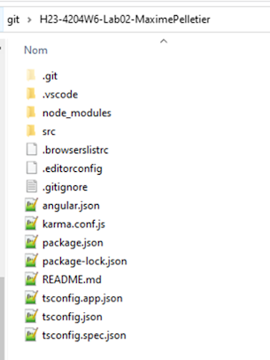</center>

Au Cégep, ce dossier sera invisible à moins d'avoir activé cette option préalablement :

<center>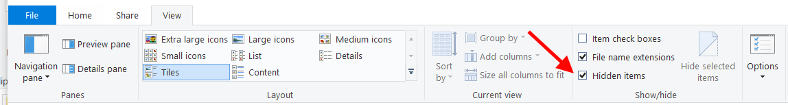</center>

Vous remarquerez que le projet Angular est automatiquement muni d'un fichier `.gitignore`. Il est parfait
pour nos besoins car il permettra d'ignorer les sous-dossiers lourds comme `node_modules` et `.angular`.

Ensuite, initialisez votre repository sur GitHub. (Pour pouvoir le cloner dans **Fork** 🔱 ensuite)

⛔ Assurez-vous qu'il soit privé !

<center>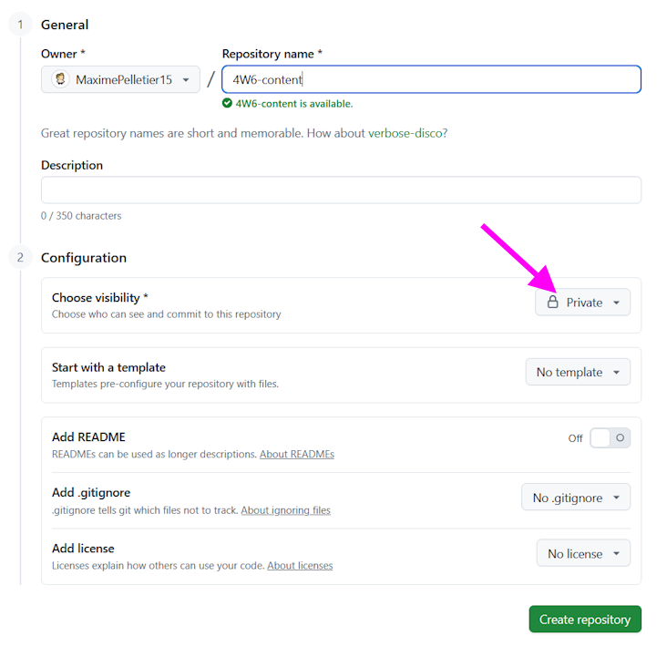</center>

Clonez le repository sur votre ordinateur à l'aide de son URL :

<center>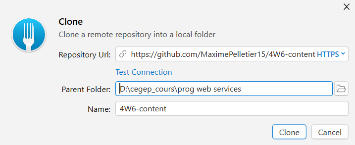</center>

Puis, **glissez votre projet Angular dans le repository**. Vous pourrez donc faire un premier **commit**
pour l'ajout du projet Angular de départ.

<center>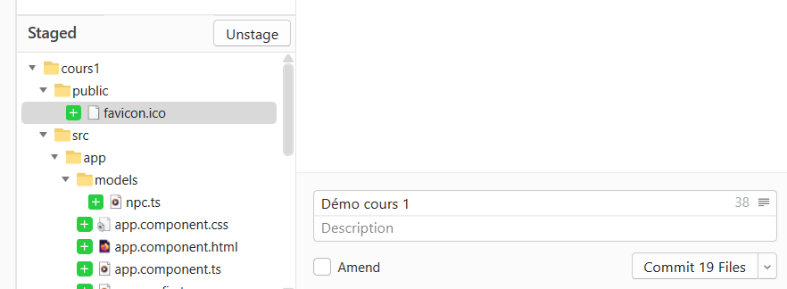</center>

On peut faire son premier push

<center>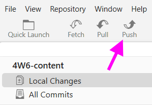</center>

#### 🐑🐑 Cloner un repo pour poursuivre son travail plus tard

Toutes les fois suivantes où vous **clonerez** votre repository, la première chose à faire ensuite sera d'utiliser la commande `npm install` dans votre projet Angular pour générer le dossier `node_modules` ! Gardez à l'esprit que ce dossier sera toujours absent après avoir cloné un projet à cause (ou plutôt grâce) du `.gitignore`.