# Cours 3 - Requêtes HTTP

✅ Une application Web client Angular peut :

* Gérer tout le côté visuel du site Web.
* Gérer le routage (illusion de « changement de page »)
* Rendre une page Web dynamique à l'aide de JavaScript.
* Gérer l'internationalisation / i18n / la traduction.
* Etc. je suis ne suis pas pour tout écrire 😠

🛑 Une application Web cliente Angular **ne doit pas** :

* Se connecter directement à une base de données pour obtenir les
données à afficher. (Vidéos 📽, images 🖼, messages 📃, etc)

Puisque l'application Angular est exécutée sur l'ordinateur du client (de l'utilisateur),
**tout le code HTML, CSS et JavaScript est accessible par nos utilisateurs**. 🙈😩 Donc si
on inclut des identifiants pour se connecter à une base de données... la sécurité
de notre base de données sera compromise.

<center>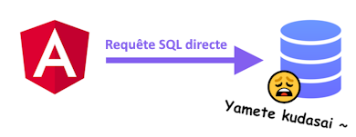</center>

> Oui mais si on utilise seulement des identifiants permettant de faire des SELECT sur certaines tables précises ?

À un certain moment, il faudra faire de la **gestion utilisateurs**, permettre d'ajouter du contenu sur le site Web
(commentaires, articles, vidéos, images, etc... donc des **INSERT** dans la base de données !), etc. Donc il va
falloir qu'une autre application (qui n'est pas un projet **Angular**) s'en occupe.

À partir de la **semaine 8**, nous créerons un **serveur Web ASP.NET Core** nous-mêmes, mais pour le moment, nous allons
envoyer des requêtes à des **serveurs Web existants** pour obtenir des données à afficher dans nos applications Web.

:::info

Beaucoup de d'API Web (serveurs Web auxquel on peut envoyer des requêtes) sont payants 💲, mais il en existe de nombreux qui
sont gratuits 🗿 ou partiellement gratuits et auxquels nous pourrons envoyer des requêtes HTTP en échange de données à 
des fins d'apprentissage.

:::

### 🌐 Exemple d'API Web

[**Last FM**](https://www.last.fm/fr/) est une webradio et un site Web qui propose des données en lien avec la musique.

**Last FM** met à notre disposition une **API** (un serveur Web avec lequel nous pourrons interagir) auquel on peut envoyer
des **requêtes HTTP** pour obtenir des **données** sour format **JSON** ou **XML** pour ensuite utiliser ces données pour 
meubler les pages Web de notre application Angular.

<center></center>

Rendez vous à [cette page](https://www.last.fm/api/intro) pour accéder à la documentation qui décrit toutes les **requêtes disponibles**
avec **Last FM**.

<center>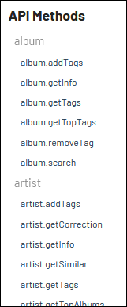</center>

Par exemple, si je souhaite obtenir des informations sur un album en particulier, la requête nommée `album.getInfo` risque
de répondre à mes besoins.

<center>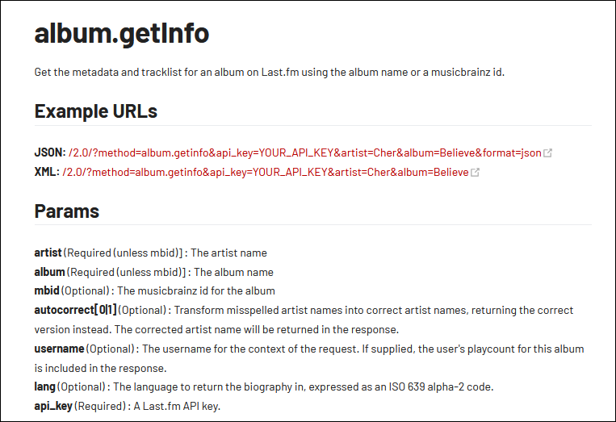</center>

Last FM nous fournit un exemple d'URL complète pour cette requête :

`http://ws.audioscrobbler.com/2.0/?method=album.getinfo&api_key=YOUR_API_KEY&artist=Cher&album=Believe&format=json`

On voit que l'artiste utilisé dans l'exemple fourni est `Cher` et l'album est `Believe`.

La seule chose qu'il resterait à faire pour que cette requête soit fonctionnelle, c'est de remplacer `YOUR_API_KEY` par
une **clé d'API**. Il est possible d'en obtenir une en créant un **compte Last FM**, mais je vous en fournis une ~~car vous êtes paresseux~~
pour vous simplifier la vie.

🔑 Clé d'API : `9a8a3facebbccaf363bb9fd68fa37abf`

On peut même essayer la requête directement dans la barre d'adresse d'un navigateur (L'affichage avec Firefox 🔥🦊 est le plus clair) :

<center>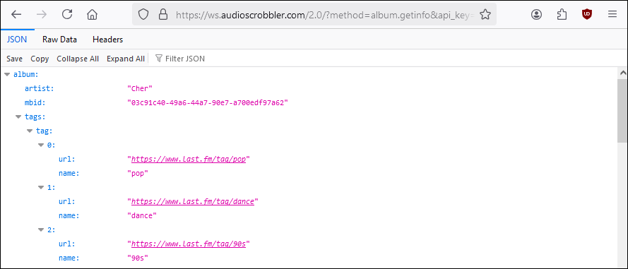</center>

Ce qu'on voit présentement est un **objet JSON**. Nous allons pouvoir extraire des données (liste de chansons, genre, nom de l'album, etc.)
de notre choix afin de les afficher dans notre application Angular. Tout ceci sera automatisé avec du code **TypeScript** dans notre
application.

### 🏗 Prérequis pour faire des requêtes

Dans Angular, il existe une classe nommée `HttpClient` qui simplifie l'envoi de **requêtes HTTP**. Pour y avoir accès dans
un **composant**, voici les étapes à suivre :

#### 🔨 1 - Modifier `app.config.ts`

Dans le fichier ⚙ `app.config.ts`, qui est un fichier de configuration ayant un impact sur tous les composants de l'application
Angular, il faudra ajouter une instruction qui donnera accès à la classe **HttpClient** au reste du projet :

```ts showLineNumbers
export const appConfig: ApplicationConfig = {
  providers: [
    provideZoneChangeDetection({ eventCoalescing: true }),
    provideRouter(routes),
    provideHttpClient() // Cette ligne doit être ajoutée
  ]
};
```

#### 💉 2 - Injecter **HttpClient** dans le composant

```ts showLineNumbers
export class AppComponent {
  
  constructor(public http : HttpClient){}

}
```

C'est aussi simple que cela. L'ajout de `HttpClient` dans le constructeur permettra à Angular d'automatiquement
fournir un objet de type `HttpClient` lorsque le composant `app` sera instancié au chargement de la page Web. (Ce
qui correspond à une **injection de dépendance** 💉)

Dit autrement : « quand la page Web va ouvrir, Angular va, en cachette, faire un `new AppComponent(...)` et lui
fournira un `new HttpClient()` dans son **constructeur**.

:::note

Comme on a vu, le mot-clé `public`, pour le paramètre `public http : HttpClient`, va permettre d'automatiquement
créer une **variable de classe** nommée `http` dans le composant `app`.

:::

### ✈ Envoyer une requête

Si on utilise l'URL de la requête qui a été abordé un peu plus haut, ça pourrait ressembler à ceci dans la classe
de notre composant `app` :

```ts showLineNumbers
async getSongs(){
  let x = await lastValueFrom(this.http.get<any>("http://ws.audioscrobbler.com/2.0/?method=album.getinfo&api_key=9a8a3facebbccaf363bb9fd68fa37abf&artist=Cher&album=Believe&format=json"));
  console.log(x);
}
```

🔍 Avant de jeter un coup d'oeil à ce que `console.log(x)` a imprimé dans la console du navigateur, abordons quelques
éléments clés de cette fonction :

* On voit que l'URL de la requête (`"http://ws.audioscrobbler....."`) a été glissé dans la fonction `this.http.get()`.
C'est une fonction qui est accessible grâce à l'objet `HttpClient` qui a été **injecté** dans le constructeur.
* `this.http.get()` permet d'envoyer des requêtes HTTP de type `GET`. (Exemples d'autres types de requête : `post`, `put`, `delete`, etc.)
* On remarque les éléments `<any>`, `async`, `await` et `lastValueFrom()`, qui seront expliqués en détails plus loin.

Dans la console du navigateur où la fonction `getSongs()` a été appelée, on peut apercevoir ceci suite à l'appel de
`console.log(x)` :

<center>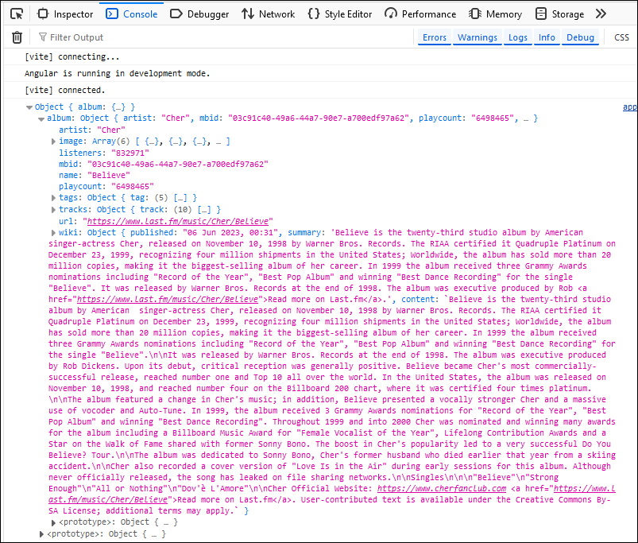</center>

C'est le même **objet JSON** que lorsque nous avions directement testé la requête dans la barre d'adresse du navigateur.
Cependant, cette fois-ci, l'objet JSON a été stocké dans la variable `x` ! On pourrait donc accéder à toutes les données
de l'objet JSON en manipulant la variable `x` qui a été déclarée dans la fonction `getSongs()`.

### 📝 Extraire des données de l'objet JSON

Disons qu'on souhaite afficher le **nom de l'artiste** et le **titre de l'album** :

<center>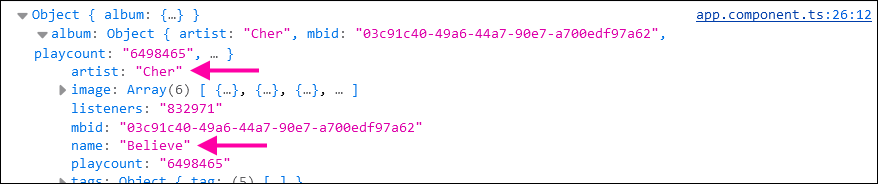</center>

Voici comment on pourrait extraire ces données dans le code :

```ts showLineNumbers
async getSongs(){
  let x = await lastValueFrom(this.http.get<any>("http://ws.audioscrobbler.com/2.0/?method=album.getinfo&api_key=9a8a3facebbccaf363bb9fd68fa37abf&artist=Cher&album=Believe&format=json"));
  console.log(x);

  let nomArtiste : string = x.album.artist; // Contient "Cher"
  let nomAlbum : string = x.album.name; // Contient "Believe"
}
```

Pour déterminer le chemin (Exemple : `x.album.artist`) vers une donnée à extraire, il faut partir de la racine
de **l'objet JSON** et descendre dans sa hiérarchie jusqu'à la propriété voulue.

<center>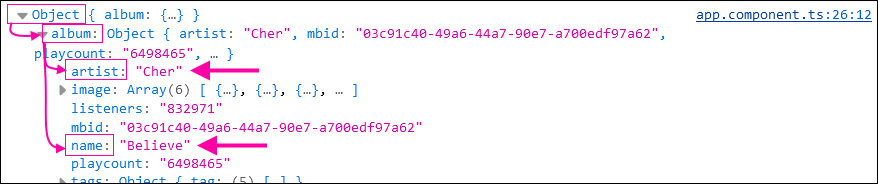</center>
<br/>
> Pourquoi le chemin utilisé dans le code n'est pas `x.Object.album.artist` ?

Comme nous avons rangé **l'objet JSON** dans une variable nommée `x` dans le code, et que `Object` n'est qu'un
_placeholder_ pour représenter la **racine** de l'objet JSON, on doit simplement utiliser `x` lorsqu'on parle de la racine.

:::info

Notez que sans le `<any>` placé dans la fonction `this.http.get<any>(..)`, nous n'aurons pas pu utiliser le chemin
`x.quelqueChose.quelqueChose...`. Sans le `<any>`, TypeScript ne nous aurons pas laissé accéder aux propriétés de
**l'objet JSON** dans la variable `x`. En utilisant `<any>`, on _dit_ à TypeScript que la variable `x` pourrait être
n'importe quoi et le compilateur nous donne la permission d'en faire ce que l'on veut. Notez qu'en contrepartie, si
on essaye d'accéder à des sous-propriétés **qui n'existent pas**, on va générer des erreurs.

:::

#### 🧩 Extraire une donnée un peu plus enfouie

Disons qu'on souhaite extraire l'URL de l'image de taille `medium` pour la glisser dans un élément `` plus tard :

<center>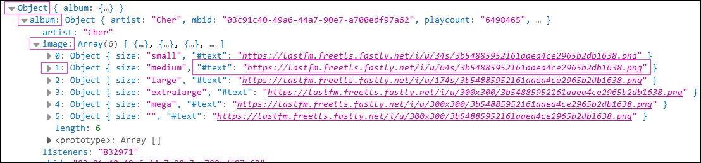</center>

C'est un peu plus pimenté 🌶 puisqu'il y a un tableau impliqué (nommé `image`) et le damné caractère `#` dans le nom de la propriété `#text`.

Voici comment extraire la propriété `#nom` :

```ts showLineNumbers
async getSongs(){
  let x = await lastValueFrom(this.http.get<any>("http://ws.audioscrobbler.com/2.0/?method=album.getinfo&api_key=9a8a3facebbccaf363bb9fd68fa37abf&artist=Cher&album=Believe&format=json"));
  console.log(x);

  let urlImageMedium : string = x.album.image[1]["#text"];
}
```
<br/>
> Pourquoi ce n'est pas plutôt `x.album.image[1].#text` ?

S'il n'y avait pas eu le caractère `#` dans le nom de la propriété `text`, cela aurait été possible d'utiliser `x.album.image[1].text` !
Hélas, `#` est un symbole spécial délicat et pour pouvoir l'utiliser dans le nom d'une propriété, il faut absolument remplacer la syntaxe
`.nomPropriété` par `["nomPropriété"]` pour ne pas que le symbole `#` cause un problème.

### 🎨 Intégration des données dans la page Web

Faisons le nécessaire pour pouvoir afficher les données que nous avons extraites de **l'objet JSON** dans la page Web.

#### 1 - 📦 Préparer des variables pour stocker les données à afficher

```ts showLineNumbers
export class AppComponent implements OnInit {
  
  artistName : string = "";
  albumName : string = "";
  imageUrl : string = "";

  ...
}
```

#### 2 - 🚚 Ranger les données extraites dans ces variables

```ts showLineNumbers
async getSongs(){
  let x = await lastValueFrom(this.http.get<any>("http://ws.audioscrobbler.com/2.0/?method=album.getinfo&api_key=9a8a3facebbccaf363bb9fd68fa37abf&artist=Cher&album=Believe&format=json"));
  console.log(x);

  this.artistName = x.album.artist;
  this.albumName = x.album.name;
  this.imageUrl = x.album.image[1]["#text"];
}
```

#### 3 - 🖼 Afficher les variables dans le HTML

(Vous remarquerez également un bouton qui permet de lancer la requête)

```html showLineNumbers
<button (click)="getSongs()">Chansons de Believe par Cher</button>

<p>Artiste : {{artistName}}</p>
<p>Album : {{albumName}}</p>

```

<center>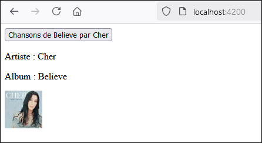</center>

### 📜 Extraire un tableau de données

Disons que je souhaite extraire la liste des chansons de **l'objet JSON** (Le titre et la durée en secondes pour
chaque chanson) ...

<center>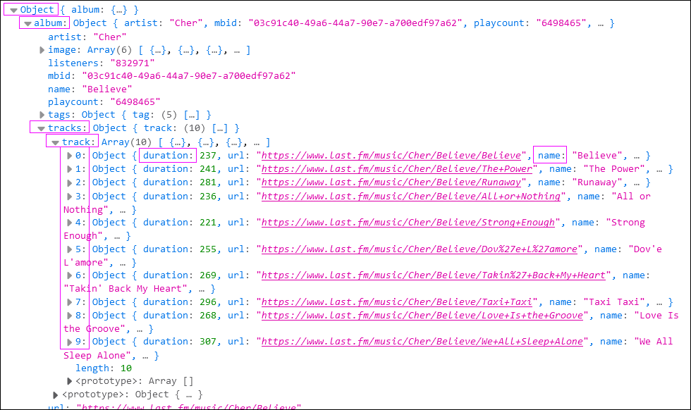</center>

#### ⚱ 1 - Préparer un model (au besoin)

```ts showLineNumbers
export class Song{

    constructor(
        public name : string,
        public duration : number
    ){}

}
```

#### 📦 2 - Préparer un tableau pour y ranger les données

```ts showLineNumbers
export class AppComponent implements OnInit {
  
  artistName : string = "";
  albumName : string = "";
  imageUrl : string = "";
  songs : Song[] = []; // Initialisé avec un tableau vide !

  ...
}
```

#### 🔬 3 - Extraire les données de l'objet JSON

```ts showLineNumbers
async getSongs(){
  let x = await lastValueFrom(this.http.get<any>("http://ws.audioscrobbler.com/2.0/?method=album.getinfo&api_key=9a8a3facebbccaf363bb9fd68fa37abf&artist=Cher&album=Believe&format=json"));
  console.log(x);

  this.artistName = x.album.artist;
  this.albumName = x.album.name;
  this.imageUrl = x.album.image[1]["#text"];

  for(let s of x.album.tracks.track){
    this.songs.push(new Song(s.name, s.duration));
  }
}
```

En gros, on a une boucle _foreach_ qui parcourt le tableau dans l'objet JSON. Chaque enregistrement du tableau
est consécutivement représenté par la variable `s` dans la boucle. Il reste donc juste à accéder à chacune
des sous-propriétés `name` et `duration` pour remplir notre variable `songs`.

<center>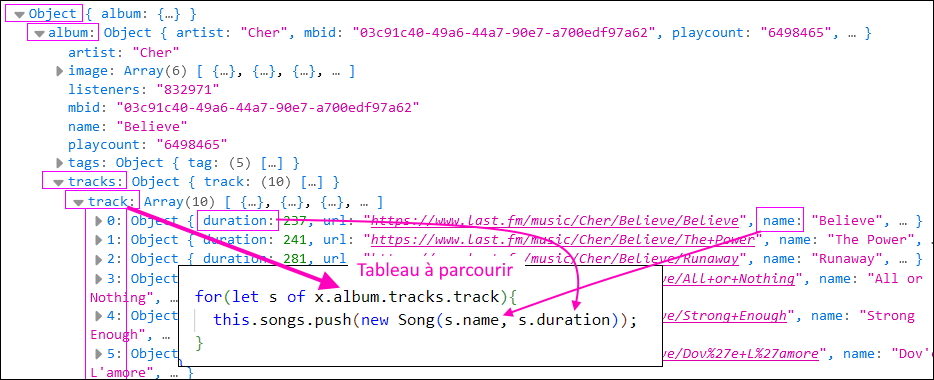</center>

#### 🖼 4 - Afficher les données dans le HTML

Comme c'est un tableau, on va utiliser notre ami `*ngFor`. 😍👌💯😂

```html showLineNumbers
<button (click)="getSongs()">Chansons de Believe par Cher</button>

<p>Artiste : {{artistName}}</p>
<p>Album : {{albumName}}</p>


<ul>
    <li *ngFor="let s of songs">{{s.name}} - {{s.duration}} secondes.</li>
</ul>
```

<center>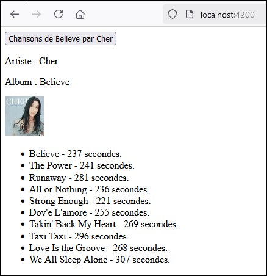</center>

### 📈 Améliorer la requête

#### ⚡ Lancer la requête dès le chargement de la page Web

Dans certaines situations, on souhaite lancer certaines requêtes dès le chargement de la page. (Lorsque vous arrivez
sur la plupart des sites Web, des informations / articles / images / vidéos sont déjà étalées sur la page Web)

Bien que le `constructor()` d'un composant soit exécuté au chargement de la page, c'est une mauvaise pratique d'utiliser
le corps du constructeur pour lancer des requêtes. Le constructeur devrait se limiter à des opérations qui sont essentielles
au fonctionnement de la page et c'est tout.

Nous allons plutôt utiliser la fonction spéciale `ngOnInit()`, qui est automatiquement appelée après que le constructeur
ait été exécuté... mais seulement si le **composant implémente l'interface `OnInit`.**

```ts showLineNumbers
export class AppComponent implements OnInit { // Remarquez le implements OnInit !

  constructor(public http : HttpClient){}

  async ngOnInit(){
    this.getSongs(); // Sera appelée dès que le chargement de la page Web sera terminé.
  }

  async getSongs(){
    let x = await lastValueFrom(this.http.get<any>("http://ws.audioscrobbler.com/2.0/?method=album.getinfo&api_key=9a8a3facebbccaf363bb9fd68fa37abf&artist=Cher&album=Believe&format=json"));
    console.log(x);
  }

}
```

#### 🔑 Ranger la clé d'API dans une constante

Plutôt de _harcoder_ la clé d'API directement dans la requête, il est préférable  de la ranger dans une constante.
Ainsi, si on a plusieurs requêtes, il suffira d'y concaténer la constante. De plus, si jamais la clé d'API change ⛔,
nous n'aurons pas à modifier chaque requête répétitivement.

```ts showLineNumbers
const lastFmKey = "9a8a3facebbccaf363bb9fd68fa37abf"; // Clé d'API

@Component({
  selector: 'app-root',
  standalone: true,
  imports: [CommonModule],
  templateUrl: './app.component.html',
  styleUrl: './app.component.css'
})
export class AppComponent {

  constructor(public http : HttpClient){}

  async getSongs(){
    let x = await lastValueFrom(this.http.get<any>("http://ws.audioscrobbler.com/2.0/?method=album.getinfo&api_key="+lastFmKey+"&artist=Cher&album=Believe&format=json"));
    console.log(x);
  }

}
```

:::warning

Les constantes doivent être déclarées **au-dessus** de la classe du composant. (Au-dessus du bloc `@Component(...)` !)

:::

Si vous préférez utiliser des `template strings` plutôt que la concaténation avec des `+`, voici une alternative :

```ts showLineNumbers
let x = await lastValueFrom(this.http.get<any>(`http://ws.audioscrobbler.com/2.0/?method=album.getinfo&api_key=${lastFmKey}&artist=Cher&album=Believe&format=json`));
```

#### 🛒 Personnaliser la requête (Choisir l'input)

Dans l'exemple abordé, nous étions toujours obligé de rechercher l'album **Believe** de l'artiste **Cher**. Permettons
à l'utilisateur de choisir l'artiste et l'album.

On ajoute deux champs dans le HTML et on utilise `[(ngModel)]` pour exploiter le `two-way binding` :

```html showLineNumbers
Artiste : <input type="text" [(ngModel)]="inputArtist"><br>
Album : <input type="text" [(ngModel)]="inputAlbum"><br>
<button (click)="getSongs()">Chansons de Believe par Cher</button>
```

Les variables `inputArtist` et `inputAlbum` sont intégrées à la requête, de manière à ce que les champs remplis
par l'utilisateur soient utilisés lors de la recherche.

```ts showLineNumbers
export class AppComponent {

  inputArtist : string = "";
  inputAlbum : string = "";

  constructor(public http : HttpClient){}

  async getSongs(){
    let x = await lastValueFrom(this.http.get<any>(`http://ws.audioscrobbler.com/2.0/?method=album.getinfo&api_key=${lastFmKey}&artist=${this.inputArtist}&album=${this.inputAlbum}&format=json`));
    console.log(x);
  }

}
```

#### ☢ Gérer les erreurs

Permettre à l'utilisateur de personnaliser la recherche implique que certaines recherches ne fonctionneront pas ! (L'artiste n'existe pas,
l'album n'existe pas ou bien il y a une typo dans la rédaction d'une donnée)

Oups ! Qui l'eut cru ! Rechercher l'artiste `oeif0u809` et l'album `08f0w9ufe` n'a pas fonctionné. Il n'y a aucune donnée à afficher.
C'est important d'offrir du feedback à l'utilisateur lorsqu'une opération échoue.

<center>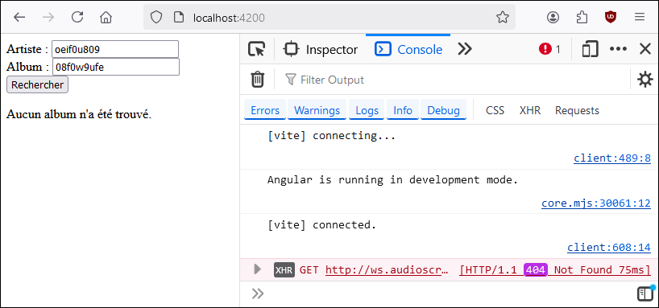</center>

Voici comment je m'y suis pris :

```html showLineNumbers
Artiste : <input type="text" [(ngModel)]="inputArtist"><br>
Album : <input type="text" [(ngModel)]="inputAlbum"><br>
<button (click)="getSongs()">Rechercher</button>

<p>{{errorMessage}}</p> <!-- Affiché seulement si le bloc catch a été exécuté -->

<div *ngIf="artistName != ''"> <!-- Affiché seulement si le bloc try a pu être complété -->
  <p>Artiste : {{artistName}}</p>
  <p>Album : {{albumName}}</p>
  
  
  <ul>
      <li *ngFor="let s of songs">{{s.name}} - {{s.duration}} secondes.</li>
  </ul>
</div>
```

J'ai ajouté une variable `errorMessage : string = "";` dans le composant et un bloc `try ... catch` autour de la requête :

```ts showLineNumbers
async getSongs(){

  try{
    let x = await lastValueFrom(this.http.get<any>(`http://ws.audioscrobbler.com/2.0/?method=album.getinfo&api_key=${lastFmKey}&artist=${this.inputArtist}&album=${this.inputAlbum}&format=json`));
    console.log(x);

    this.artistName = x.album.artist; // Contient "Cher"
    this.albumName = x.album.name; // Contient "Believe"
    this.imageUrl = x.album.image[1]["#text"];

    for(let s of x.album.tracks.track){ // Tableau dans l'objet JSON
      this.songs.push(new Song(s.name, s.duration)); // Extraction des sous-propriétés dans chaque rangée du tableau
    }

    this.errorMessage = ""; // Retirer le message d'erreur s'il y en avait un précédemment.
  }
  catch(error){
    this.errorMessage = "Aucun album n'a été trouvé."
    this.artistName = ""; // Cacher le résultat de la recherche s'il y en avait un précédemment
  }
  
}
```

### ⌛ Asynchronisme

Nous allons enfin aborder l'🐘 dans la pièce : `await`, `async` et `lastValueFrom()`. Quoi ? Vous aviez déjà oublié et
ça ne vous intéresse plus ? Laissez-moi tout de même vous en parler beaucoup trop en détails.

```ts showLineNumbers
async getSongs(){
  let x = await lastValueFrom(this.http.get<any>(`http://ws.audioscrobbler.com/2.0/?method=album.getinfo&api_key=${apiKey}&artist=Cher&album=Believe&format=json`));
  console.log(x);
}
```

Gardez à l'esprit que la requête prend beaucoup de temps. ⌛ (de quelques millisecondes à quelques secondes) 

* Pour que l'exécution du code se « fige » le temps qu'une réponse (l'objet JSON) ait été reçue, nous utilisons l'opérateur `await`.
* Pour avoir le droit d'utiliser l'opérateur `await` dans une fonction, il faut déclarer la fonction avec `async`.
* Pour que l'objet retourné par `this.http.get()` puisse être attendu avec `await`, il faut le convertir en un autre type d'objet
à l'aide de `lastValueFrom()`. (Avant d'être converti grâce à `lastValueFrom()`, l'objet retourné par `this.http.get()` ne pourrait
PAS être jumelé à l'opérateur `await`.)

En bref : `lastValueFrom()` **rend possible** d'attendre que la requête soit terminée. `await` **fait attendre** que la requête soit
terminée et `async` est obligatoire pour avoir le droit d'utiliser `await`.

Bien entendu, ces explications sont très simplifiées, mais si vous les comprenez, c'est un excellent début.

:::info

Toute fonction déclarée `async` ne figera pas l'exécution du code lorsqu'elle sera appelée, à moins qu'on utilise `await`
devant leur appel.

:::

Puisque ça vous intéresse beaucoup, voyons un exemple qui illustre le phénomène :

```ts showLineNumbers
test(){
    console.log("A");
    this.slowRequest(); 
    console.log("C");
  }

async slowRequest(){
  let x = await lastValueFrom(this.http.get("..requête.."));
  console.log("B");
}
```

Dans quel ordre seront imprimées les lettres `A`, `B` et `C` ?

<center>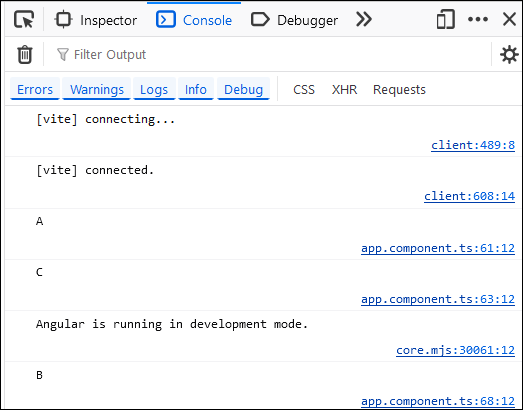</center>
<br/>
> Pourquoi `B` a-t-il été imprimé après `C` ?

Voici comment l'exécution du code s'est déroulée :

1. `console.log("A")` est appelé.
2. La fonction `slowRequest()` est appelée, mais comme c'est une fonction `async`, nous n'attendons pas qu'elle soit
terminée et on passe **immédiatement** à la suite du code.
3. `console.log("C")` est appelé ET la requête est lancée. (Ces deux opérations sont à peu près exécutées en même temps)
4. Quelques millisecondes ou secondes plus tard, la requête se termine et `console.log("B")` est finalement appelé.

Voyons maintenant un scénario légèrement différent :

```ts showLineNumbers
async test(){
    console.log("A");
    await this.slowRequest(); 
    console.log("C");
  }

async slowRequest(){
  let x = await lastValueFrom(this.http.get("..requête.."));
  console.log("B");
}
```

Dans quel ordre seront imprimées les lettres `A`, `B` et `C` ?

<center>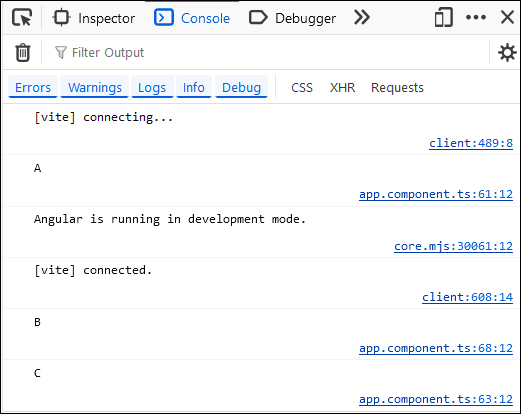</center>
<br/>
> Pourquoi `B` a-t-il été imprimé **avant** `C` ?

Puisque l'opérateur `await` a été utilisé devant l'appel de `slowRequest()` cette fois-ci, on a attendu sur la 
fonction soit totalement résolue avant de passer à la suite et d'imprimer `C`.

Notez que pour pouvoir utiliser l'opérateur `await` dans la fonction `test()`, il a fallu déclarer `test()`
comme étant `async` elle aussi !