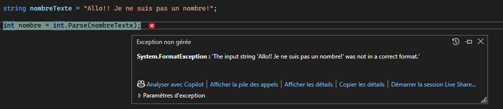

# Intégration des notions


<Row>

<Column>

:::tip Intégration

Pendant les séances d'intégration, il n'y a pas de nouveau contenu. Le but est de consolider ce que tu as vu dans les séances précédentes.

Plusieurs séances d'intégration auront des exercices supplémentaires à compléter durant la séance.

:::

</Column>

<Column>

:::info Travail à faire

Exercices à compléter. Tu peux compléter les exercices ou essayer de refaire ceux qui t'ont posé problème. C'est une bonne préparation à l'examen où les exercices ont le même format.

Tu dois avancer ton travail en cours et poser des questions si tu es actuellement bloqué.

Ton professeur est disponible pour des questions sur tout le contenu vu jusqu'ici.

Tu peux prendre de l'avance en regardant le contenu des semaines qui arrivent.

:::

</Column>

</Row>

## 📝 Qu’est-ce que `TryParse` ?

`TryParse` est une fonction disponible sur plusieurs types de base en C#.  
Elle permet de **convertir une chaîne de caractères** en un type donné **sans lever d’exception** en cas d’échec.

Contrairement à `Parse` qui lève une exception si la conversion échoue, `TryParse` retourne simplement `true` si la conversion réussit, ou `false` sinon.

### Exemple d'une exception


---

### 🔹 Signature générale


Exemple avec `int` :

```csharp
int resultat = 0; 
bool int.TryParse(string? texte, out resultat);
```

 - `texte` : le texte à convertir
 - `resultat` : (mot-clé **`out`**) variable qui contiendra la valeur convertie si la conversion réussit
 - Retourne : true si la conversion a réussi, false sinon

`TryParse` est disponible avec tous les types de données
 - int.TryParse
 - double.TryParse
 - decimal.TryParse
 - bool.TryParse

### 🔹 Exemples d'utilisation

#### Conversion réussie
```csharp
string nombreTexte = "123";
int nombre = 0;

bool conversion = int.TryParse(nombreTexte, out nombre);
        
if (conversion)
{
    Console.WriteLine("Conversion réussie!");
}
Console.WriteLine("Le nombre est : " + nombre);
```
✅ **Resultat attendu** :
```
Conversion réussie!
Le nombre est : 123
```

#### ‼️⚠️ Conversion échouée
```csharp
string nombreTexte = "Allo!! Je ne suis pas un nombre!";
int nombre = 0;

bool conversion = int.TryParse(nombreTexte, out nombre);
        
if (!conversion)
{
    Console.WriteLine("Conversion échouée!");
}
Console.WriteLine("Le nombre est : " + nombre);
```
✅ **Resultat attendu** :
```
Conversion échouée!
Le nombre est : 0
```

## 💪 Exercices supplémentaires

Vous devez réaliser les laboratoires
 [🧪 Labo 3.1A](/laboratoire/laboratoire3.1A) et 
 [🧪 Labo 3.1B](/laboratoire/laboratoire3.1B)

