# Cours 5 - Événements et styles

## 🔍 Variables globales et locales

Nous savons déjà comment déclarer une variable :

```js
// 👶
let age = 4;
```

Toutefois, l'**emplacement** dans le code (dans `script.js`) où cette variable est déclarée est **important**.

### 📌 Variables locales

⛔ Si une variable est déclarée **dans une fonction**, elle **n'existe qu'à l'intérieur de cette fonction**. (On ne peut pas l'utiliser ailleurs)

<center>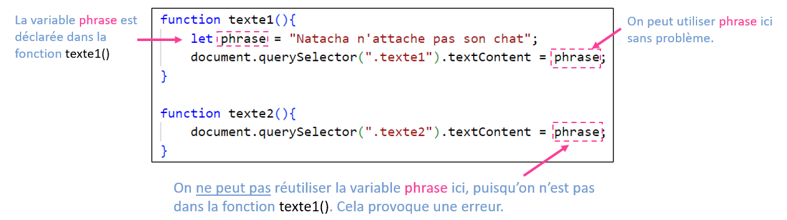</center>

💡 La variable `phrase` est donc une **variable locale** et **existe seulement** dans `phrase1()`.

### 🌐 Variables globales

⛔ Si une variable est déclarée **à l'extérieur de toute fonction** (donc PAS dans une fonction), elle **peut être utilisée n'importe où**.

<center></center>

💡 La variable `gPhrase` est donc une **variable globale** et **existe partout**.

:::important

Afin de différencier plus facilement ces deux types de variables, nous utiliserons la **convention** suivante dans ce cours :

* Toutes les **variables globales** commenceront par la lettre `g`. (Ex : `gCouleur`, `gScore`, `gAge`, etc.)

<center>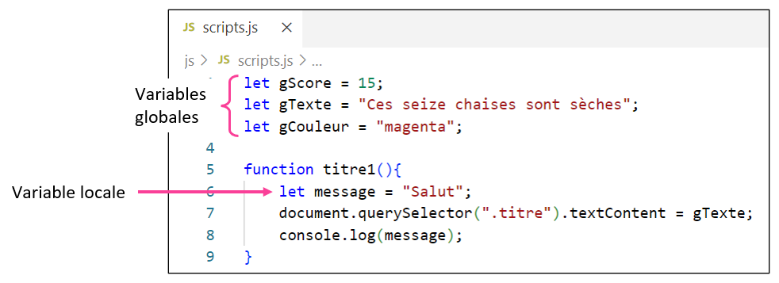</center>

:::

:::warning

Vous vous demandez peut-être :

> Pourquoi ne pas simplement toujours utiliser des variables **globales** ? Les variables **locales** ont clairement des *skill issues* !

🌐 Il faut surtout créer une **variable globale** lorsqu'on en a besoin dans **plusieurs fonctions**. Si une **variable globale** est seulement utilisée dans **une** fonction, autant la rendre **locale** pour que la **quantité de variables globales** reste **petite**.

🔍 Le code est généralement plus clair et facile à comprendre lorsqu'une variable est **déclarée** tout près de l'endroit où elle est **utilisée**.

:::

## 📢 Écouteurs d'événements

Les **écouteurs d'événements** sont des *bidules* qui permettent **d'appeler des fonctions** suite à une **interaction** avec la page Web.

* Exemple 1 : En **cliquant** sur un élément ... son texte change !

<center>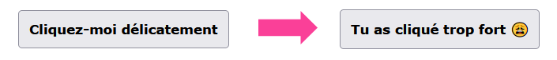</center>

* Exemple 2 : En **survolant** un élément ... une alerte apparait !

<center>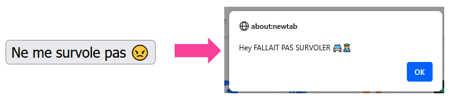</center>

Pour le moment, nous allons voir **trois types d'événements** :

* `click` : Appelle une fonction lorsqu'un élément HTML est **cliqué**
* `mouseover` : Appelle une fonction lorsqu'un élément HTML est **survolé**
* `mouseout` : Appelle une fonction lorsqu'un élément HTML **n'est plus survolé** (la souris sort de l'élément)

### 🥚 Créer un écouteur d'événements

Voici la syntaxe à utiliser :

```js
document.querySelector(".classe").addEventListener("type", nom_fonction);
```

* `document.querySelector(".classe")` permet de cibler un élément HTML spécifique dans la page.
* `type` doit être remplacé par `"click"`, `"mouseover"` ou `"mouseout"`.
* `nom_fonction` doit être remplacé par le **nom de la fonction** qu'on souhaite appeler.

#### 💡 Exemple

```js
document.querySelector(".bouton1").addEventListener("click", changerTexte);
```

✅ La **fonction** `changerTexte()` sera appelée lorsque l'**élément avec la classe `bouton1`** sera **cliqué**.

#### 🔍 Vue d'ensemble

On a cet élément HTML dans la page :

```html
<button class="bouton1">Cliquez-moi délicatement</button>
```

On a cette fonction dans `script.js` :

```js showLineNumbers
function changerTexte(){
    document.querySelector(".bouton1").textContent = "Tu as cliqué trop fort 😩";
}
```

Grâce à l'événement suivant ...

```js
document.querySelector(".bouton1").addEventListener("click", changerTexte);
```

... lorsque nous allons **cliquer** sur l'élément avec la classe `bouton1`, la fonction `changerTexte()` sera **appelée**, ce qui aura pour effet de **changer le texte de l'élément avec la classe `bouton1`** :

<center></center>

### 📍 Où déclarer les écouteurs d'événements ?

Dans le cadre du cours, nous placerons toujours les **écouteurs d'événements** dans une fonction nommée `init()`. (Cette fonction sera automatiquement appelée lorsque la page Web sera **chargée par le navigateur Web**, ce qui rendra automatiquement tous les écouteurs d'événements fonctionnels)

```js showLineNumbers
function init(){

    document.querySelector(".bouton1").addEventListener("click", changerTexte);
    document.querySelector(".bouton2").addEventListener("click", lancerAlerte);

}
```

:::info

On peut mettre **autant** d'écouteurs d'événements **qu'on veut** dans la fonction `init()` !

:::

## 👨‍🎨 Styles (DOM)

À l'aide du **DOM** (Document Object Model), nous allons pouvoir modifier les **styles** d'un élément HTML. On peut appliquer des **styles CSS** sur demande à l'aide de JavaScript !

La syntaxe à utiliser sera la suivante :

```js
document.querySelector(".classe").style.propriété = "valeur";
```

### 🎨 Couleur du texte

Syntaxe :

```js
document.querySelector(".classe").style.color = "nomDeLaCouleur";
```

Exemple :

<center>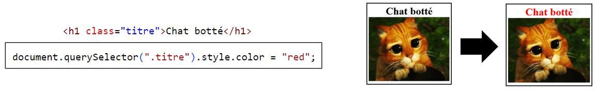</center>

### 🟦 Couleur de fond

Syntaxe :

```js
document.querySelector(".classe").style.backgroundColor = "nomDeLaCouleur";
```

Exemple :

<center>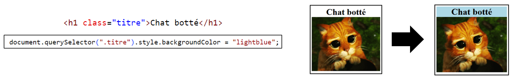</center>

### 🔳 Couleur et largeur de bordure

Syntaxe :

```js
document.querySelector(".classe").style.borderColor = "nomDeLaCouleur";
document.querySelector(".classe").style.borderWidth = "NOMBREpx";
```

Exemple :

<center>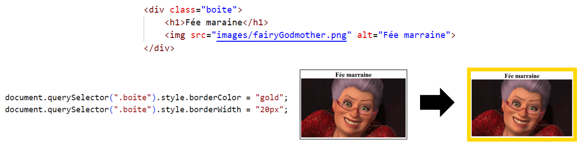</center>

### 📏 Largeur et hauteur d'un élément

Syntaxe :

```js
document.querySelector(".classe").style.width = "NOMBREpx";
document.querySelector(".classe").style.height = "NOMBREpx";
```

Exemple :

<center>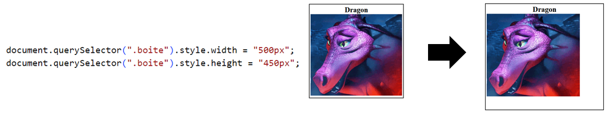</center>

:::note

On a modifié la taille du `<div>` qui contient l'image. (On n'a pas modifié l'`` !)

:::

### 👻 Opacité d'un élément

Syntaxe :

```js
document.querySelector(".classe").style.opacity = 0.5;
```

⛔ Il faut utiliser une valeur entre `0` et `1` pour l'opacité. (`0.5` correspond à 50% d'opacité, par exemple)

Exemple :

<center>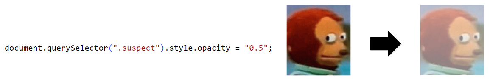</center>

### 🙈 Visibilité d'un élément

Syntaxe pour **rendre invisible** (retirer l'élément de la page) :

```js
document.querySelector(".classe").style.display = "none";
```

Syntaxe pour **rendre visible** (réafficher l'élément dans la page) :

```js
document.querySelector(".classe").style.display = "block";
```

### 🥊 Espacement depuis la gauche / le haut

Syntaxe :

```js
document.querySelector(".classe").style.left = "NOMBREpx";
document.querySelector(".classe").style.top = "NOMBREpx";
```

Exemple :

<center>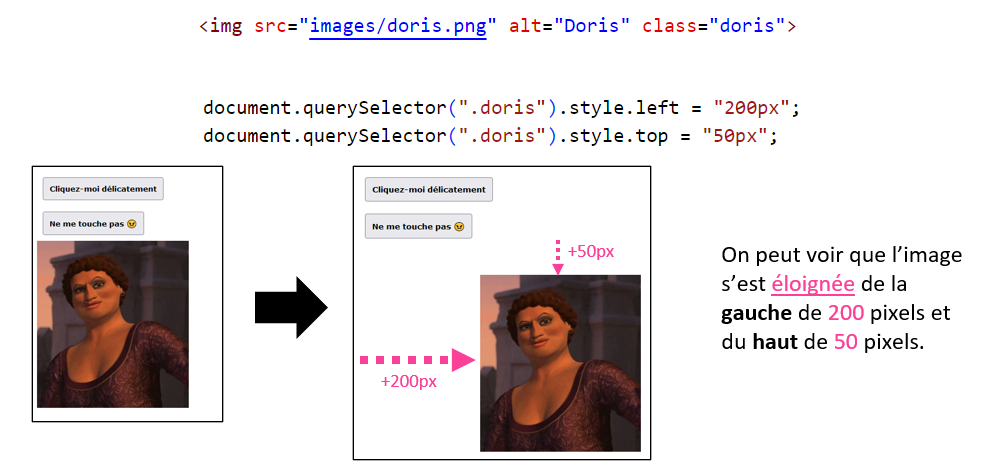</center>

### 🌈 Plus de couleurs

Bien qu'il existe **140 couleurs nommées** en lettres comme ceci :

```js
// "red" est une couleur qui existe :
document.querySelector(".classe").style.color = "red";
```

On peut utiliser des couleurs encore plus précises à l'aide de leur **code héxadécimal** :

```js
document.querySelector(".classe").style.color = "#DC143C";
```

<center>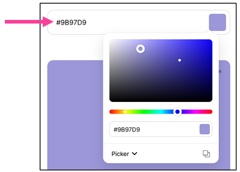</center>

### ✨ Dans une fonction

Bien entendu, on peut modifier les styles dans une **fonction** :

```js showLineNumbers
function texteBleu(){
    document.querySelector(".bouton1").style.color = "blue";
}
```

On peut ensuite tester cette fonction avec un **écouteur d'événements** ou **directement dans la console** :

<center>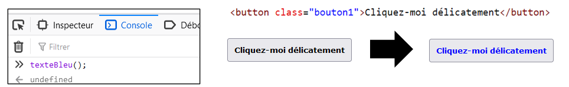</center>

## 🔩 DOM (récapitulatif)

Jusqu'à maintenant, nous avons vu trois modifications possibles qui peuvent être réalisées sur une page Web à l'aide du **DOM** :

* 📝 Manipuler le contenu textuel :

```js
document.querySelector(".classe").textContent = "Texte";
```

* 📢 Ajouter un écouteur d'événements :

```js
document.querySelector(".classe").addEventListener("type", maFonction);
```

* 🎨 Modifier les styles :

```js
document.querySelector(".classe").style.propriété = "valeur de style";
```