# Cours 5 - Plusieurs composants

Utiliser plusieurs composants permettra de « naviguer sur plusieurs pages Web » et permettra également d'éviter
de répéter des portions de page Web similaires.

### 🐣 Créer un nouveau composant

Puisqu'un composant est composé 😏 de quatre fichiers qui doivent respecter une structure très précise 📐,
il existe la commande `ng generate component nomDuNouveauComposant`.

Avant de taper la commande comme un animal, assurez-vous de vous situer dans le dossier `app`. On veut situer la majorité
de nos fichiers HTML / CSS / TypeScript dans le dossier `app`, à part pour quelques exceptions comme les images et les 
fichiers de traduction. (Cours 7)

<center>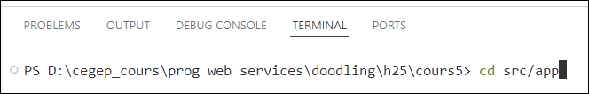</center>

Créez ensuite le ou les composants :

<center>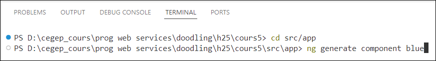</center>

<center>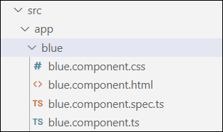</center>

Si vous comptez utiliser `ng serve` plus tard, n'oubliez pas de revenir dans le dossier principal du projet. 
(Ou au pire fermer le terminal et en ouvrir un nouveau)

<center></center>

Il y a deux manières d'intégrer un composant à la page Web :

1. 🎎 **Poupées russes** : afficher un composant spécifique dans un autre composant spécifique. 
Pratique pour réutiliser un affichage répétitif.
2. 🚗 **Routage** : afficher un composant différent selon la route (l'URL) actuelle. Pratique pour
créer une « illusion de navigation entre les pages Web ».

### 🎎 Poupées russes

Ci-dessous, on peut apercevoir trois composants :

* Le composant `app`, qui affiche le composant `red` dans son template HTML.
* Le composant `red`, qui affiche le composant `enfant` dans son template HTML.
* Le composant `enfant`.

<center>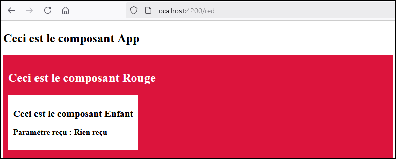</center>

#### 🔨 Afficher un composant dans un autre composant

Disons qu'on souhaite afficher le composant `enfant` quelque part dans le composant `red`...

<center>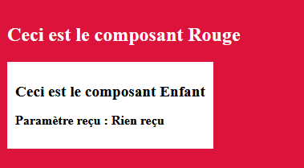</center>

📝 Voici les étapes à suivre :

1. Importer le composant `enfant` dans le composant `red` :

<center>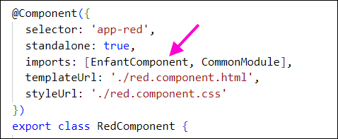</center>

2. Vérifier quel est le `selector` du composant `enfant` :

<center>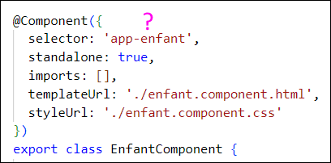</center>

3. Intégrer le `selector` du composant `enfant` dans le HTML du composant `red` à l'endroit désiré :

```html showLineNumbers
<main class="red">
  <h2>Ceci est le composant Rouge</h2>
  <div class="row">
    <app-enfant></app-enfant> <!-- Ici, par exemple -->
  </div>
</main>
```

#### 🕊 Passer un paramètre à un composant

On veut généralement transmettre une ou plusieurs données du composant **parent** vers le composant **enfant**. (Des données
qui seront utilisées dans l'affichage par exemple)

#### 📜 Étapes à suivre

1. Préparer une variable dans le composant `enfant` qui recevra et contiendra la donnée reçue en paramètre. Remarquez
que le décorateur `@Input()` est obligatoire. De plus, une valeur par défaut (`"Rien reçu"`) a été affectée si jamais
aucun paramètre n'est reçu. Si aucune valeur par défaut n'aurait été définie, il aurait fallu permettre à `nomCouleur`
d'être `undefined` à l'aide de `?: string`.

```ts showLineNumbers
export class EnfantComponent {

  @Input() nomCouleur : string = "Rien reçu";

}
```

2. Dans le HTML du composant parent, grâce au `selector` du composant enfant, donner une valeur de notre choix à la 
variable `nomCouleur` :

```html showLineNumbers
<main class="red">
  <h2>Ceci est le composant Rouge</h2>
  <div class="row">
    <app-enfant [nomCouleur]="'écarlate'"></app-enfant> <!-- Valeur hardcodée -->
    <app-enfant [nomCouleur]="red3"></app-enfant> <!-- Valeur dans une variable -->
  </div>
</main>
```

Bien entendu, on peut par le suite faire ce qu'on veut avec la valeur reçue en paramètre dans `nomCouleur`, comme
l'afficher dans le HTML :

```html showLineNumbers
<div class="enfant">
    <h2>Ceci est le composant Enfant</h2>
    <p>Paramètre reçu : {{nomCouleur}}</p>
</div>
```

<center>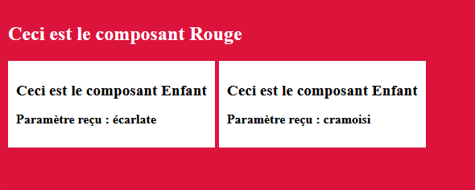</center>

:::tip

On peut envoyer n'importe quel type de donnée en paramètre de composant. Dans l'exemple précédent, on a
envoyé un `string`, mais ça aurait pu être un `number`, un `boolean`, un objet personnalisé, etc.

:::

#### 🍇 Intégration multiple avec *ngFor

Rien ne nous empêche d'utiliser un `*ngFor` pour intégrer un composant enfant plusieurs fois en exploitant
les données qui sont dans une liste :

* Classe du composant parent :

```ts showLineNumbers
export class RedComponent {

  sousRouges : string[] = ["cramoisi", "écarlate", "vermeil", "corail", "carmin"];
  
}
```

* HTML du composant parent :

```html showLineNumbers
<main class="red">
  <h2>Ceci est le composant Rouge</h2>
  <div class="row">
    <app-enfant *ngFor="let r of sousRouges" [nomCouleur]="r"></app-enfant>
  </div>
</main>
```

<center>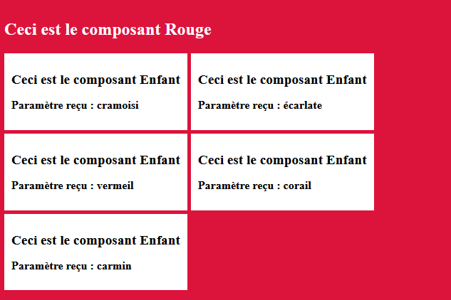</center>

### 🚗 Routage

Ci-dessous, on peut apercevoir le composant `app`, qui sert de **squelette** dans la page Web. Selon la 
**route** (chemin après le domaine dans la barre d'URL) actuelle, un composant différent est intégré
dans la page parmi les composants `blue`, `red`, `yellow` et `pink`.

Ceci nous donne l'impression de pouvoir « naviguer » entre plusieurs pages Web.

<center>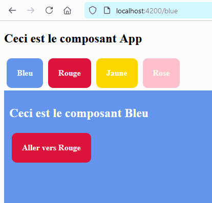</center>

#### 📜 Étapes pour mettre en place :

1. 🏗 Créer et préparer les différents composants impliqués. (Bien entendu)

<center>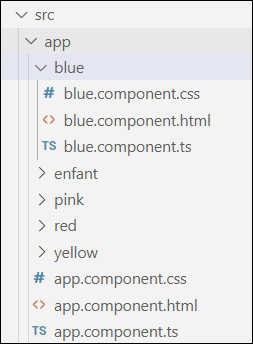</center>

2. 📝 Définir les règles de routage dans le fichier `app.routes.ts` :

```ts showLineNumbers
export const routes: Routes = [
  {path: "", redirectTo: "/blue", pathMatch: "full"},
  {path: "blue", component: BlueComponent},
  {path: "red", component: RedComponent},
  {path: "yellow", component: YellowComponent},
  {path: "pink", component: PinkComponent}
];
```

Les quatre dernières règles devraient être plutôt intuitives. Par exemple, le **chemin** `"blue"` chargera le
composant `BlueComponent`. (Donc si l'URL devient `http://localhost:4200/blue`, le composant `blue` sera affiché)

La première règle est une **règle de redirection**. En gros, si le chemin est vide `""` (par exemple, lorsqu'on
vient d'ouvrir l'application Web), le chemin est automatiquement modifié et devient `/blue`. C'est-à-dire que le chemin
`http://localhost:4200` sera automatiquement remplacé par `http://localhost:4200/blue` au chargement de l'application.
À ce moment, on peut déduire que la deuxième règle s'activera et que ce sera le composant `blue` qui sera affiché.

Et le paramètre `pathMatch` ? Il a deux valeurs possibles : `"full"` ou `"prefix"`. Avec `"full"`, la redirection s'applique
seulement si le chemin actuel correspond exactement au chemin de la règle. Avec `"prefix"`, la redirection s'applique dès
que le chemin actuel **commence** par le chemin de la règle. Voici deux exemples :

* Avec la règle `{path: "bl", redirectTo: "/blue", pathMatch: "prefix"}`, tout chemin commençant par `"bl"` déclencherait
la redirection. (Ex : `http://localhost:4200/blue` ou `http://localhost:4200/black`)

* Avec la règle `{path: "bl", redirectTo: "/blue", pathMatch: "full"}`, le seul chemin qui pourrait déclencher la
redirection est `http://localhost:4200/bl`.

3. ⚓ Mettre l'élément `<router-outlet></router-outlet>` dans le HTML du composant `app`.

```html showLineNumbers
<div class="container">

  <h2>Ceci est le composant App</h2>

  <router-outlet></router-outlet> <!-- Ceci sera remplacé par le composant blue, red, yellow ou pink ! -->
  
</div>
```

On a des règles qui disent quel composant charger selon la route actuelle... mais où est-ce que le composant chargé
par la règle de routage sera affiché ... ? À l'endroit où on aura placé l'élément `<router-outlet></router-outlet>` !

Généralement, c'est le composant `app`, servant de squelette (avec un `<header>`, un `<nav>`, un `<footer>`, mais un `<main>` vide),
qui servira à intégrer les composants chargés par le routage.

4. 🗺 Créer un menu de navigation (au besoin)

Grâce à l'attribut `[routerLink]`, qui est utilisable si on a importé le module `RouterModule` dans le composant désiré, on peut
permettre à l'utiliser de changer la route actuelle grâce à un clic.

```html
<div [routerLink]=['/blue']>Bleu</div>
```

Par exemple, cliquer sur ce `<div>` changera la route actuelle pour `http://localhost:4200/blue`. Si nos règles de routage
sont bien définies, le composant `blue` sera affiché dans la page à l'endroit où il y avait l'élément `<router-outlet>`.

Voici le menu de navigation utilisé dans l'exemple plus haut :

```html showLineNumbers
  <nav>
    <div [routerLink]="['/blue']" style="background-color:cornflowerblue">Bleu</div>
    <div [routerLink]="['/red']" style="background-color:crimson;">Rouge</div>
    <div [routerLink]="['/yellow']" style="background-color:gold">Jaune</div>
    <div [routerLink]="['/allo']" style="background-color:pink">Rose</div>
  </nav>
```

<center></center>

:::tip

Dans par exemple `[routerLink]=['/blue']`, la barre oblique `/` peut être omise. Dans ce cas, `blue` sera
ajouté **à la fin de la route actuelle**. (Alors que `/blue` permet de **remplacer entièrement** la route actuelle)

:::

#### 📬 Paramètres de route

On souhaite parfois envoyer une informatique au prochain composant lorsqu'on change la route. Avec le routage, notez
qu'il est uniquement possible d'envoyer une ou plusieurs données de type `string` puisque la donnée sera passée dans
l'URL.

Ci-dessous, on aimerait charger le composant `yellow` tout en lui transmettant une information comme `"patate"`.

<center></center>

Voici les étapes à suivre :

1. 🚗 Ajouter ou modifier une règle de routage dans `app.routes.ts`

```ts showLineNumbers
export const routes: Routes = [
  {path: "", redirectTo: "/blue", pathMatch: "full"},
  {path: "blue", component: BlueComponent},
  {path: "red", component: RedComponent},
  {path: "yellow", component: YellowComponent}, // Aurait pu être retirée
  {path: "yellow/:legume", component: YellowComponent}, // Nouvelle règle
  {path: ":ahem", component: PinkComponent}
];
```

* La nouvelle règle `"yellow/:legume"` est déclenchée pour n'importe quelle route avec le format `yellow/???`.
* La règle `"yellow"` peut être gardée si on souhaite que charger le composant `yellow` soit encore possible sans fournir de paramètre.

2. 🛠 Adapter le ou les `[routerLink]` qui mènent vers ce composant.

Que ce soit avec une valeur _hardcodée_ :

```html
<div [routerLink]="['/yellow', 'patate']">
```

Ou via une variable :

```html
<div [routerLink]="['/yellow', myVegetable]">
```

L'ajout d'un paramètre de route dans un `[routerLink]` doit être séparé de la route avec une **virgule**.

3. 🎁 Récupérer l'information passée par la route dans le composant chargé

Cela nécessitera d'injecter `ActivatedRoute`. Ce type permet d'accéder aux paramètres qui auront été
glissés dans la route. 

```ts showLineNumbers
export class YellowComponent implements OnInit{
  
  legume : string | null = null;

  constructor(public route : ActivatedRoute) { } // Injection

  ngOnInit() {
    this.legume = this.route.snapshot.paramMap.get("legume"); // Récupération du paramètre
  }

}
```

⛔ Notez que le nom du paramètre (ici, `"legume"`) doit être identique à celui déclaré dans la règle de routage ! (sans le symbole `:`)
De plus, la fonction `ngOnInit()` est plutôt incontournable pour cette tâche. ([Notion du cours 3](/cours/rencontre2.1#-lancer-la-requête-dès-le-chargement-de-la-page-web))

```ts
{path: "yellow/:legume", component: YellowComponent}
```

Ensuite, il nous reste à exploiter le contenu de la variable `this.legume` tel que désiré. (Par exemple, afficher `"patate"` dans 
la page Web)

#### 🛸 Changer la route en TypeScript

Si jamais on désire changer la route à l'aide d'un bout de code TypeScript plutôt qu'avec un clic dans la page Web, voici un exemple simple :

```ts showLineNumbers
export class SomeComponent {

  constructor(public router : Router) { } // Injection

  someFunction() {
    this.router.navigate(["/index"]); // Changement de route
  }

}
```

Notez que l'injection de `Router` est nécessaire pour avoir accès à la fonction `navigate()`. Le tableau fournit
en paramètre à la fonction `navigate()` fonctionne exactement comme celui dans un `[routerLink]`.

#### ☢ Règles ambiguës

Attention, certaines règles ou combinaisons de règles peuvent poser des problèmes. Abordons quelques exemples.

**1 - Règle composée uniquement d'un paramètre**

```ts showLineNumbers
export const routes: Routes = [
  {path: "", redirectTo: "/blue", pathMatch: "full"},
  {path: ":ahem", component: PinkComponent},
  {path: "blue", component: BlueComponent},
  {path: "red", component: RedComponent},
  {path: "yellow", component: YellowComponent},
  {path: "yellow/:legume", component: YellowComponent},
];
```

Hélas, la règle `:ahem` accepte absolument toutes les routes composées d'un seul terme. Cela signifie que les
seules règles qui pourront être déclenchées sont `":ahem"` et `"yellow/:legume"`.

Une alternative envisageable pourrait être de placer cette règle en dernier, puisque **les règles sont « tentées »
dans l'ordre où elles sont listées**.

**2 - Règles identiques**

```ts showLineNumbers
export const routes: Routes = [
  {path: "", redirectTo: "/blue", pathMatch: "full"},
  {path: ":ahem", component: PinkComponent},
  {path: ":salut", component: BlueComponent}
];
```

Bien entendu, ici, la deuxième règle ne pourra jamais être déclenchée. Il n'y a rien à faire, une des
deux règles devra être retirée ou allongée.