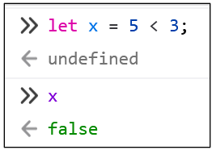
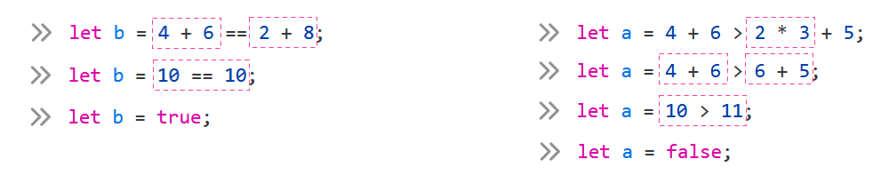

# Cours 6 - Booléens et conditions

## 💡 Booléens

Les **booléens** sont un autre **type de données**. (Comme les **nombres** et les **chaînes de caractères**)

Il existe seulement **deux valeurs possibles** pour les **booléens** :

* `true`
* `false`

Les **booléens** permettent d'exprimer que quelque chose est **vrai** ou **faux**.

* 👀 Ai-je deux yeux ? `true`
* 🍷 Suis-je majeur ? `true`
* 🤔 Mon prénom contient la lettre T ? `false`
* 🔥 Ai-je déjà utilisé un extincteur ? `false`

Bien entendu, on peut **affecter** un **booléen** à une variable :

```js showLineNumbers
let estContent = true;
let estAttentif = false;
```

:::danger

⛔ Attention ! Les **booléens** ne sont pas des **chaînes de caractères**

```js
let livraisonCompletee = "true"; // Probablement une erreur d'inattention
```

La variable `livraisonCompletee` contient une **chaîne de caractères**, pas un **booléen**. 

Les valeurs `"true"` et `true` sont deux choses **totalement différentes** !

:::

## 🥇🥈 Opérateurs de comparaison

Tous ces opérateurs donnent un résultat qui est `true` ou `false`.

Par exemple, `1 < 2` signifie « `1` est-il plus petit que `2` ? » et le résultat sera `true`.

<table>
    <tr>
        <th>Description</th>
        <th>Opérateur</th>
        <th>Exemple</th>
        <th>Résultat</th>
        <th>Explication</th>
    </tr>
    <tr>
        <td>Plus grand que</td>
        <td><center>`>`</center></td>
        <td>`5.5 > 6.5`</td>
        <td>`false`</td>
        <td>`5.5` n'est pas plus grand que `6.5`</td>
    </tr>
    <tr>
        <td>Plus petit que</td>
        <td><center>`<`</center></td>
        <td>`5 < 7`</td>
        <td>`true`</td>
        <td>`5` est bel et bien plus petit que `7`</td>
    </tr>
    <tr>
        <td>Plus grand ou égal à</td>
        <td><center>`>=`</center></td>
        <td>`5 + 2 >= 5`</td>
        <td>`true`</td>
        <td>`7` est bel et bien plus grand (ou égal) à `5`</td>
    </tr>
    <tr>
        <td>Plus petit ou égal à</td>
        <td><center>`<=`</center></td>
        <td>`5 <= 7 - 2`</td>
        <td>`true`</td>
        <td>`5` est bel et bien plus petit (ou égal) à `5`</td>
    </tr>
    <tr>
        <td>Égal à</td>
        <td><center>`==`</center></td>
        <td>`5 - 4 == 7`</td>
        <td>`false`</td>
        <td>`1` n'est pas identique à `7`</td>
    </tr>
    <tr>
        <td>N'est pas égal à</td>
        <td><center>`!=`</center></td>
        <td>`5 != 7`</td>
        <td>`true`</td>
        <td>`5` est bel et bien différent de `7`</td>
    </tr>
</table>

Notez qu'au lieu de directement affecter `true` ou `false` à une variable, on peut le faire via une comparaison :

<center></center>

:::warning

⛔ Attention ! Les opérateurs `==` et `=` sont **totalement différents** !

* `=` Permet **d'affecter** une valeur à une variable :

```js
// x contient 5
let x = 5;
```

* `==` permet de vérifier si deux valeurs sont **identiques** :

```js
// y contient false
let y = 5 == 6;
```

:::

### 🔤 Comparaison de chaînes de caractères

On peut utiliser les opérateurs `==` et `!=` avec des **chaînes de caractères** :

```js
// x contient false, car les deux chaînes ne sont pas identiques
let x = "allo" == "allo_";
```

```js
// y contient true, car les deux chaînes sont bel et bien différentes
let y = "salut" != "_salut";
```

### ⌛ Priorité des opérateurs

L'**ordre de priorité** de tous les opérateurs que nous avons vu jusqu'ici est la suivante :

1. Parenthèses `( ... )`
2. Multiplication et division `*` `/`
3. Addition et soustraction `+` `-`
4. Comparaison `<` `>` `>=` `<=` `==` `!=`
5. Affectation `=`

<center></center>

## ❓ Conditions

### Bloc if

Un **bloc if** exécute un morceau de code **seulement si sa condition est `true`**.

Syntaxe :

```js showLineNumbers
if( ...condition... ){
    // Code à exécuter si la condition est true
}
```

* Les parenthèses `( ... )` contiennent la **condition**, qui doit être un booléen. (`true` ou `false`)
* Les accolades `{ ... }` contiennent le code qui s'exécutera **seulement si la condition est `true`**.

<hr/>

#### Exemples simplissimes

`"Allo"` sera affiché dans la console car la condition est `true` :

```js
if(true){
    console.log("Allo"); // ✅
}
```

Rien ne sera affiché dans la console, car la condition est `false`. (Le bloc `if` est **sauté** / **ignoré** !) 

```js
if(false){
    console.log("Allo"); // 🚫
}
```

<hr/>

#### Exemples plus pertinents

✅ Le contenu textuel de l'élément `.statut` va devenir "Majeur(e)" car `age` est bel et bien supérieur ou égal à `18` :

```js showLineNumbers
let age = 19;

if(age >= 18){
    document.querySelector(".statut").textContent = "Majeur(e)";
}
```

🚫 Il ne va rien se passer car `animal` n'est pas identique à `"chat"` :


```js showLineNumbers
let animal = "chien";

if(animal == "chat"){
    document.querySelector(".message").textContent = "Miaou";
}
```

:::danger

⛔ Attention ! Une erreur **ultra fréquente** est de confondre `==` et `=` dans la condition !

Ci-dessous, on a un problème : la condition est invalide ! Plutôt que de demander si **`x` vaut `5`**, on a mis « Affecte la valeur `5` à la variable `x` », ce qui ne fait pas de sens pour une condition.

```js showLineNumbers
if(x = 5){
    document.querySelector(".message").textContent = "La variable x contient 5";
}
```

✅ Bien entendu, la condition devait plutôt avoir l'air de ceci :

```js showLineNumbers
if(x == 5){
    document.querySelector(".message").textContent = "La variable x contient 5";
}
```

:::

### Bloc else

Chaque bloc `if` **peut** être accompagné par une bloc `else`.

Syntaxe :

```js showLineNumbers
if( ...condition... ){
    // Code à exécuter si la condition est true
}
else{
    // Code à exécuter si la condition est false
}
```

* Le bloc `else` **ne possède JAMAIS de condition**, car il est associé à la même condition que le `if`.
* Le bloc `else` **s'exécute si la condition est `false`**. C'est un « plan de secours ». Ainsi, c'est toujours **soit le `if`, soit le `else` qui s'exécute**. (⛔ Jamais les deux !)

#### Exemple

Ci-dessous, le comportement du code sera différent selon le montant d'argent dans la variable `argent` :

* 😋 Si on a au moins `1.99` $, on va obtenir un paquet de gommes et perdre `1.99` $.
* 😩 Sinon, on sera avisé qu'on n'a pas assez d'argent.

```js showLineNumbers
let argent = 2.15;

if(argent >= 1.99){

    document.querySelector(".message").textContent = "Voici ton paquet de gommes.";
    argent -= 1.99;

}
else{

    document.querySelector(".message").textContent = "Tu n'as pas assez d'argent. Get good !";

}
```

:::warning

<center></center>

S'il y a plusieurs `if` consécutifs, sachez qu'ils sont **totalement indépendants**. 

* Chaque `if` est vérifié (et exécuté si `true`), peu importe le résultat des `if` précédents.

```js showLineNumbers
// temps en minutes
let temps = 21;

if(temps > 15){
    console.log("J'attends patiemment."); // Sera exécuté
}

if(temps > 20){
    console.log("aaaaaaaaa c'est long 💀"); // Sera exécuté
}

if(temps > 25){
    console.log("dodo 😴"); // Ne sera pas exécuté
}
```

:::