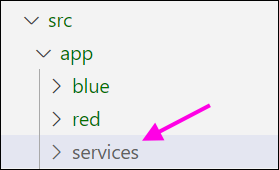
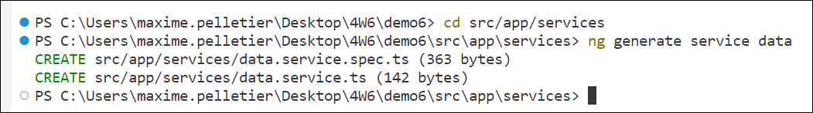

# Cours 6 - Services

⚙ Les services sont des **classes TypeScript** qui ne sont associées à aucun code HTML ou CSS.
Ces classes permettent de rassembler des données (variables) et fonctionnalités (fonctions)
qui pourront être utilisées par **plusieurs composants**.

🔄 Cela permet d'éviter de répéter des variables ou des fonctions similaires dans plusieurs composants.

♻ Les services peuvent également être conçus dans l'optique d'être facilement réutilisés dans un
autre projet Angular plus tard.

### 🐣 Créer un nouveau service

Vous êtes invités à créer un dossier `services` dans le dossier `app` pour y ranger vos services :

<center></center>

La commande `ng generate service nomDeVotreService` permet de créer un nouveau service. Commencez par
vous déplacer vers le dossier de destination à l'aide de la commande `cd` :

<center></center>

Puis, créez votre nouveau service :

<center></center>

Deux nouveaux fichiers ont été générés. N'hésitez pas à supprimer le fichier `...spec.ts`, qui sert
aux tests unitaires.

<center></center>

N'oubliez pas de retourner dans le dossier racine du projet avec `cd ../../..` ou encore de simplement ouvrir un nouveau terminal.

Un service vide ressemblera donc à ceci :

```ts showLineNumbers
import { Injectable } from '@angular/core';

@Injectable({
  providedIn: 'root'
})
export class DataService {

  constructor() { }
  
}
```

### 🚰 Compléter un service

On met quoi dans un service ? Du chocolat ? 🍫 Des voitures ? 🚌 De la bonne foi ? 🗿

Sachant qu'un service peut contenir des **variables** (données) et des **fonctions**, voici quelques bons réflexes
à garder à l'esprit quand on se demande quoi ajouter dans un service :

* 📦 Des données (variables) identiques sont utilisées dans plusieurs composants ? -> Vaut mieux les transférer dans un service.
* ⚙ Des fonctions identiques sont utilisées dans plusieurs composants ? -> Vaut mieux les transférer dans un service.
* 🔮 Certaines fonctions pourront être réutilisées facilement dans un autre projet Angular ? -> Service.

:::warning

Puisqu'un service doit pouvoir être réutilisé facilement dans un autre projet, tentez de seulement rassembler des
variables et fonctions qui sont cohérentes ensemble dans un même service lorsque possible. (Un service devrait être associé
à un **un thème précis**, par exemple plusieurs requêtes **vers la même API Web**)

:::

#### Exemple simple d'un service 

Je sais que plusieurs composants auront besoin de la variable `myNumbers` et de la fonction
`pgcd()`, alors je les réunis dans un service :

```ts showLineNumbers
export class MathService {

  myNumbers : number[] = [2, 34, 420, 73, 69, 1252, 144];

  constructor() { }

  pgcd(x : number, y : number) : number{

    while (x != y){
      if (x > y) x -= y; 
      else y -= x;
    }
    return x;

  }

}
```

### 💉 Injecter un service dans un composant

Pour qu'un composant ait accès aux **variables** et **fonctions** d'un service, on doit injecter ce dernier.

```ts showLineNumbers
export class BlueComponent {

  constructor(public math : MathService){} // Service injecté dans le composant

}
```

Le composant `blue` aura donc accès à `this.math.myNumbers` et à `this.math.pgcd(...)` désormais.

Dans le HTML du composant, utiliser le service ressemblera à ceci :

```html showLineNumbers
<ul>
  <li *ngFor="let n of math.myNumbers">{{n}}</li>
</ul>

<div>{{math.pgcd(145, 25)}}</div>
```

### ✈ Transférer une requête dans un service

Disons qu'on a une requête dans un composant. 😬⛔

```ts showLineNumbers
export class BlueComponent {

  character : Character | null = null;
  inputName : string = ""; // Lié à un <input>

  constructor(public http : HttpClient){}

  async searchCharacter(){
    let x = await lastValueFrom(this.http.get<any>("https://spapi.dev/api/characters?search=" + this.inputName));
    console.log(x);
    this.character = new Character(x[0].name, x[0].episodes.length, x[0].age);
  }

}
```

La requête permet de remplir la variable `character`. `HttpClient` a dû être injecté pour pouvoir faire une requête.

⛔ À partir de maintenant, et pour le reste de la session, **toutes nos requêtes devront être situées dans des services**.
C'est une convention importante à respecter, puisque :

* Les requêtes pourraient aisément être réutilisées dans un autre projet Angular.
* Les composants doivent uniquement contenir du code essentiel à leur affichage et fonctionnement. (On veut des composants légers
et des services qui réunissent le plus de code possible)

Nous allons donc maintenant faire le nécessaire pour transférer la requête dans un service. Le but est de créer une fonction
qui **reçoit le nom du personnage en paramètre** et qui **retourne un objet de type `Character`**.

Voici de quoi aura l'air la requête dans le service :

```ts showLineNumbers
export class SouthParkService {

  constructor(public http : HttpClient) { }

  async searchCharacter(name : string) : Promise<Character>{
    let x = await lastValueFrom(this.http.get<any>("https://spapi.dev/api/characters?search=" + name));
    console.log(x);
    return new Character(x[0].name, x[0].episodes.length, x[0].age);
  }

}
```

On remarque trois principales différences lorsqu'on compare avec la version composant :

* Le nom à rechercher est reçu en paramètre, puisque le service ne peut pas avoir accès à l'`<input>`.
* Plutôt que de glisser le `new Character(...)` dans une variable, on le **retourne**.
* Le type de retour de la fonction est `Promise<Character>`.

:::warning

Le type de retour de toute fonction **async** DOIT être `Promise<...>`. Sans `Promise<...>`,
la donnée retournée par la fonction ne pourra pas être attrapé avec `await`. (Voir exemple plus bas)

:::

Et maintenant, voici de quoi aura l'air le composant sans la requête :

```ts showLineNumbers
export class BlueComponent {

  character : Character | null = null;
  inputName : string = "";

  constructor(public southPark : SouthParkService){}

  async searchCharacter(){
    this.character = await this.southPark.searchCharacter(this.inputName);
  }

}
```

On remarque quelques changements :

* `SouthParkService` a dû être injecté. (Mais plus besoin de `HttpClient` !)
* La requête a disparu. On a simplement à appeler la fonction du service qui contient maintenant
la requête en lui fournissant le nom à chercher en paramètre. N'oubliez pas le **await** puisque
la fonction retourne `Promise<...>`, sinon `this.character` ne va pas bien se remplir.

La fonction du composant et du service **portent le même nom**. Ça peut être mélangeant, alors n'hésitez pas
à renommer une des deux fonctions au besoin.

:::note

On aurait pu préciser le type de retour pour la fonction `searchCharacter()` située dans le composant,
c'est-à-dire `Promise<void>`. Cela dit, quand le type de retour est `void` ou `Promise<void>`, c'est moins
dramatique d'omettre le type de retour.

:::

### 🫃 Cycle de vie des composants et services

#### 🧩 Composants

Le cycle de vie des composants peut-être interprété de manière plutôt simple :

1. Le composant est **instancié** lorsqu'il doit être affiché dans la page Web.
2. Son constructeur puis `ngOnInit` sont appelés.
3. Tant qu'il est **affiché**, tous les événements sont surveillés et déclenchés au besoin.
(Événements `(click)`, changements d'un champ avec `[(ngModel)]`, etc.)
4. Dès que le composant **n'est plus affiché** dans la page Web, il est **détruit**, ses variables
sont réinitialisées et ses événements ne sont plus surveillés.

Bref, si jamais votre composant contenait des variables, gardez à l'esprit qu'elles seront
**rétinialisées** chaque fois que le composant n'est plus visible dans la page Web.

#### ⚙ Services

Pour un service, ça peut être un peu plus nébuleux...

* 🐣 Existe-t-il dès que l'application Web est lancée ? Ou seulement lorsqu'un composant dans lequel il est injecté est affiché dans la page Web ?
* 🥚🥚🥚 Y a-t-il une seule instance de chaque service ? Ou bien chaque composant reçoit sa propre instance du service injecté ?

**Dans notre cas**, puisque nos services seront toujours _provided_ à la racine de l'application... (Voir le code ci-dessous)

```ts showLineNumbers
@Injectable({
  providedIn: 'root' // !!!
})
export class DataService {

  // ...

}
```

... le cycle de vie du service fonctionne comme ceci :

* Le service est instancié **dès qu'un premier composant dans lequel il est injecté est chargé dans la page**.
* Le service **n'est jamais détruit**, même si les composants dans lesquels il est injecté ne sont plus chargés dans la page.
* Il y a **une seule instance** pour chaque service pendant toute l'exécution de l'application. Elle est donc **partagée par tous
les composants dans lesquels le service est injecté**.

:::tip

Grâce à ce fonctionnement, un service peut permettre à plusieurs composants de « communiquer » entre eux. (S'ils utilisent 
simultanément une variable située dans le service) Il existe toutefois d'autres moyens encore plus fiables de faire perdurer
certaines données au fil de la navigation sur un site Web Angular, comme le **stockage local**. (Cours 7)

:::

🔄 Dans tous les cas, lorsqu'on **réactualise la page**, toute l'application est « détruite » (ou réinitialisée)