# Cours 7 - Opérateurs logiques

## ❓ Bloc else if

Les **blocs `else if`** permettent d'avoir **une ou plusieurs conditions alternatives** après un **bloc `if`**.

Syntaxe :

```js showLineNumbers
if( ... Condition 1 ... )
{
    // Code à exécuter si la condition 1 est « true »
}
else if( ... Condition 2 ... )
{
    // Code à exécuter si la condition 1 est « false » et la condition 2 est « true »
}
else
{
    // Code à exécuter si les conditions 1 et 2 sont « false »
}

```

Exemples :

* Ici, on tente d'abord d'exécuter le `if`, mais comme sa condition échoue, on tente d'exécuter le `else if` : sa condition est `true` et le code est exécuté ! Ensuite, on saute le `else` totalement.

```js showLineNumbers
let nbConjoints = 2;

if(nbConjoints == 1)
{
    // 🚫 Pas exécuté car la condition (nbConjoints == 1) est false 
    document.querySelector(".statut"). textContent = "En couple";
}
else if(nbConjoints > 1)
{
    // ✅ (nbConjoints > 1) est true ET la condition (nbConjoints == 1) est false, donc exécuté 
    document.querySelector(".statut"). textContent = "En couple polyamoureux";
}
else
{
    // 🚫 Pas exécuté car un bloc précédent a déjà été exécuté
    document.querySelector(".statut"). textContent = "Célibataire";
}
```

<hr/>

* Cette fois, les deux premiers blocs « échouent », alors le `else` doit être exécuté.

```js showLineNumbers
let nbConjoints = 0;

if(nbConjoints == 1)
{
    // 🚫 Pas exécuté car la condition (nbConjoints == 1) est false 
    document.querySelector(".statut"). textContent = "En couple";
}
else if(nbConjoints > 1)
{
    // 🚫 Pas exécuté car la condition (nbConjoints > 1) est false
    document.querySelector(".statut"). textContent = "En couple polyamoureux";
}
else
{
    // ✅ car tous les blocs précédents ont échoué
    document.querySelector(".statut"). textContent = "Célibataire";
}
```

### 💡 Précisions supplémentaires

On peut avoir plusieurs `else if` sans problème ! Tant qu'ils sont **précédés** d'un bloc `if` :

```js showLineNumbers
let lien = "oncle";

if(lien == "père")
{
    console.log("C'est ton papa ! 👨");
}
else if(lien == "mère")
{
    console.log("C'est ta maman ! 👩");
}
else if(lien == "frère")
{
    console.log("C'est ton frère ! 👦");
}
else if(lien == "soeur")
{
    console.log("C'est ta soeur ! 👧");
}
else
{
    console.log("Euh... c'est quelqu'un 👽");
}
```

<hr/>

Il n'est pas obligatoire de placer un bloc `else` après le / les blocs `else if` (Au pire, rien ne sera exécuté) :

```js showLineNumbers
let economies = 357;

if(economies > 10000){
    console.log("Wow, à quand ton premier yacht ? 🚢");
}
else if(economies < 100){
    console.log("Tu es sûr d'avoir besoin du dernier iPhone à chaque année ? 📱");
}
```

<hr/>

⛔ Attention, rappelez-vous que deux `if` consécutifs seront **totalement indépendants** !

Ci-dessous, on gère le premier `if` tout seul. Ensuite, on gère le deuxième `if` et son `else if` ensemble, sans se préoccuper du premier `if` :

```js showLineNumbers
let couleur = "jaune";

if(couleur == "jaune"){
    document.querySelector(".image").style.borderColor = "yellow"; // ✅
}

if(couleur == "vert"){
    document.querySelector(".image").style.borderColor = "green"; // 🚫
}
else if(couleur != "bleu"){
    document.querySelector(".image").style.borderColor = "red"; // ✅
}
```

## 🧩 Opérateurs logiques

Les opérateurs logiques permettent de **combiner plusieurs comparaisons**.

### Opérateur `&&` (« ET »)

Le résultat est `true` **si les deux conditions sont `true`**.

Ci-dessous, le résultat est `false` car la condition `2 > 3` est `false`.

<center>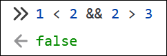</center>

Cette condition fonctionnera seulement pour un `age` situé entre `18` et `29` :

```js showLineNumbers
if(age >= 18 && age < 30){
    console.log("Tu es un jeune adulte ✨");
}
```

### Opérateur `||` (« OU »)

Le résultat est `true` **si au moins une condition est `true`**.

Ci-dessous, le résultat est `true` car la condition `1 < 2` est `true`.

<center>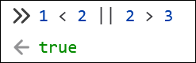</center>

Cette condition fonctionnera si `age` est plus petit `4`, mais aussi si `age` est plus grand que `99` :

```js showLineNumbers
if(age < 4 || age > 99){
    console.log("Tu ne peux pas jouer avec des LEGO 😭");
}
```

<center>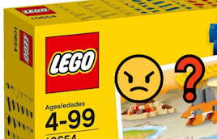</center>

:::warning

⛔ Attention, l'opérateur `||` est constitué de deux barres verticales |, et non la lettre L en minuscule.

:::

### Opérateur `!` (« Inverse »)

Le booléen est inversé. (`true` devient `false`. `false` devient `true`)

Ci-dessous, `1 < 2` donne `true`, mais l'opérateur `!` **inverse le résultat**.

<center>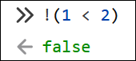</center>

:::note

Nous n'utiliserons pas vraiment l'opérateur `!` dans ce cours, mais il est parfois utile pour simplifier certaines conditions.

:::

Cette condition fonctionnera si `age` n'est ni plus petit que `4`, ni plus grand que `99` :

```js showLineNumbers
if( !(age < 4 || age > 99) ){
    console.log("Tu peux jouer avec des LEGO 😏");
}
```

### 🧠 Exemples plus complexes

Disons qu'on a trois âges :

```js
let ageAnne = 21;
let ageTom = 19;
let ageAli = 18;
```

On veut savoir : « Anne est-elle la plus vieille ? ». Autrement dit, **Anne est-elle plus vieille que Tom ET plus vieille qu'Ali ?** :

```js
// Deviendra 21 > 19 && 21 > 18
ageAnne > ageTom && ageAnne > ageAli
```

:::danger

Attention ! On ne peut pas écrire l'expression comme ceci, ça ne fonctionnera pas :

<center>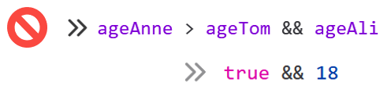</center>

:::

Disons qu'on a trois prix :

```js
let prixPomme = 2.99;
let prixBanane = 1.99;
let prixBleuet = 5.99;
```

On veut savoir : « Au moins un des trois prix est-il plus élevé que 5 ? ». Il faudra vérifier **chaque prix** :

```js
// Deviendra 2.99 > 5 || 1.99 > 5 || 5.99 > 5
prixPomme > 5 || prixBanane > 5 || prixBleuet > 5
```

:::danger

Attention ! On ne peut pas écrire l'expression comme ceci, ça ne fonctionnera pas :

<center>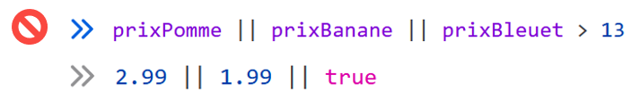</center>

:::

Disons qu'on a trois couleurs :

```js
let couleur1 = "rouge";
let couleur2 = "rouge";
let couleur3 = "bleu";
```

On veut savoir : « Les trois couleurs sont-elles identiques ? ». Il faudra au moins **vérifier deux paires** :

```js
// Deviendra "rouge" == "rouge" && "rouge" == "bleu"
couleur1 == couleur2 && couleur2 == couleur3
```

:::danger

Attention ! On ne peut pas écrire l'expression comme ceci, ça ne fonctionnera pas :

<center>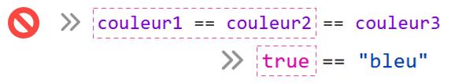</center>

:::

## 🐞 Débogage

Un **bogue**, c'est un défaut de conception ou de réalisation dans un programme. Un **bogue** génère des **comportements inattendus** dans le code.

🔍 Le **débogage**, c'est l'usage de stratégies qui permettent de **trouver** et **corriger** des **bogues**.

Bien qu'il existe des outils de débogages sophistiqués, comme ce sont nos premiers pas en lien avec le **débogage**, nous allons surtout exploiter la **console du navigateur** pour y arriver.

<center>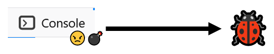</center>

### Ex. 1 : Bogue dans une fonction

Nous avons la fonction suivante dont le but est de **modifier le texte de l'élément `.description`** :

<center></center>

Hélas, lorsqu'on **teste** la fonction dans la console :

<center>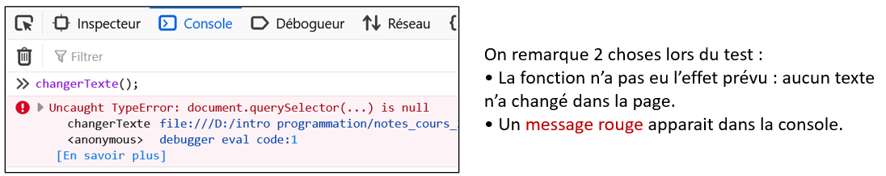</center>

Malheureusement, la console nous répond **en anglais** et ses explications sont limitées. Cela dit :

* On peut devenir que le problème est lié à `document.querySelector(...)`.
* « document.querySelector(...) is null » signifie qu'aucun élément HTML n'a été trouvé avec la **classe** demandée.

Vérifions la **classe** que nous avions utilisé dans le code :

<center>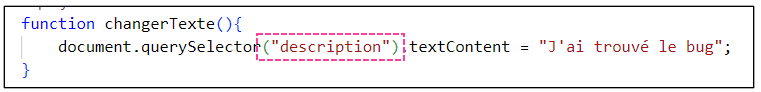</center>

En vérifiant l'**aide-mémoire**, les **notes de cours** ou d'**autres fonctions similaires**, on peut déduire qu'il manque le `.` devant le nom de la classe.

<center>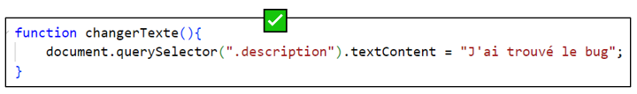</center>

Bien entendu, il ne faut pas oublier de **tester à nouveau** pour s'assurer que tout fonctionne bien.

### Ex. 2 : Deux bogues dans la même fonction

<center>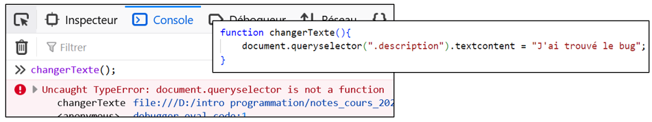</center>

Cette fois-ci, la console nous indique que « `document.queryselector` n'est pas une fonction ».

En vérifiant l'aide-mémoire attentivement, on peut comprendre que le `s` doit être en **majuscule** : `document.querySelector`.

<center>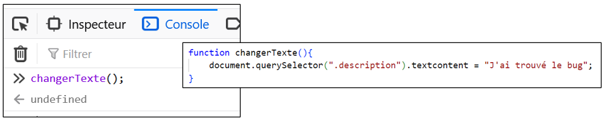</center>

En testant à nouveau, il n'y a plus de message d'erreur, mais **le texte dans la page n'a toujours pas changé** !

* La console ne détecte pas toujours les bogues.
* Le problème était avec `.textcontent`, qui s'écrit plutôt `.textContent`. (Vérifiable dans l'**aide-mémoire**)

<center>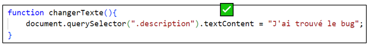</center>