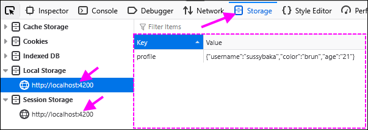
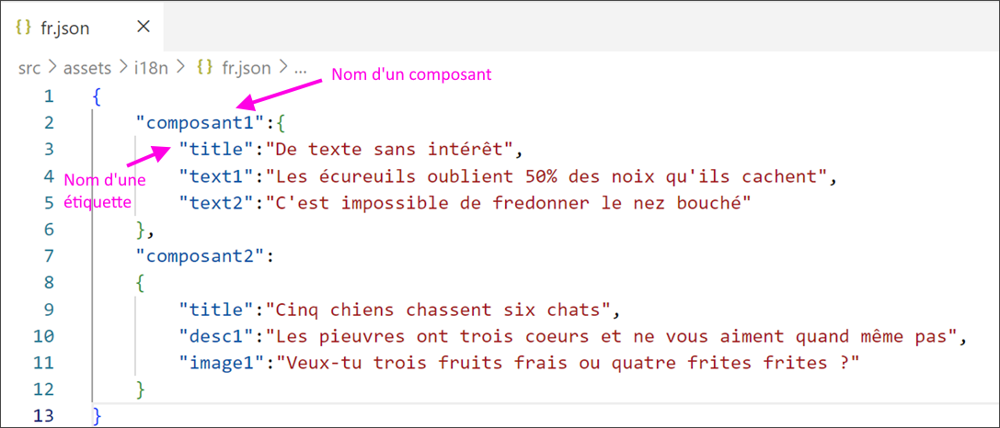
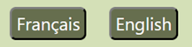
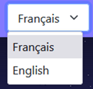
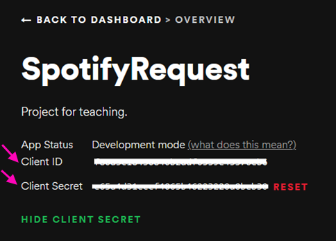
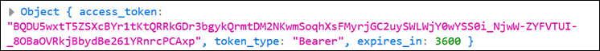

# Cours 7 - Stockage, i18n, token

### 💾 Stockage local

🧹 Tel que vu au cours 6, si on réinitialise la page Web lorsque notre application Angular est en exécution, toutes les données (contenu des variables) sont perdues.

⚙ Même le cycle de vie spécial des **services** ne permet pas de faire perdurer certaines données.

💡 C'est là que le **stockage local** et le **stockage de session** entrent en jeu ! Ces deux types
de stockage permettent de sauvegarder des données <u>dans le navigateur du client</u>.

* Le stockage local est **permanent**. Il ne se nettoie jamais par lui-même.
* Le stockage de session est **temporaire**. Il se nettoie lorsque le navigateur est fermé.

#### 📜 Sauvegarder une donnée de type `string`

Cette opération peut être exécutée dans la fonction TypeScript de votre choix.

```ts showLineNumbers
export class AppComponent{
    
    guestName : string = "";

    myFunctionToSaveSomeThings() : void{

        sessionStorage.setItem("username", this.guestName); // Stockage de session
        localStorage.setItem("nameOfTheUser", this.guestName); // Stockage local

    }

}
```

Pour les deux types de stockages, il suffit d'un paramètre servant de **clé** (vous pouvez
lui donner le nom de votre choix, mais assurez-vous que ce nom soit unique) et un deuxième
paramètre qui contient la **donnée** à sauvegarder.

`sessionStorage` et `localStorage` sont deux outils accessibles depuis n'importe quel
**composant** ou **service**. Pas besoin d'injection de dépendance ou d'importation
pour que ces deux outils fonctionnent.

#### 📫 Récupérer une donnée de type `string`

Cette opération est _généralement_ effectuée dans la fonction `ngOnInit()`, puisqu'on
souhaite accéder à certaines données dès le chargement d'un composant.

Il suffit de préciser **la clé** de la donnée à récupérer en paramètre.

```ts showLineNumbers
export class AppComponent implements OnInit{
    
    guestName : string | null = null;
    guestName2 : string | null = null;

    ngOnInit() : void{

        this.guestName = sessionStorage.getItem("username");
        this.guestName2 = localStorage.getItem("nameOfTheUser");

    }

}
```

:::warning

Comme la fonction `getItem()` retourne une donnée de type `string` ou `null` (puisqu'il n'y
a pas forcément une donnée avec la clé demandée), la variable dans laquelle on glisse la donnée
doit pouvoir être `null`.

:::

#### 💾📦 Sauvegarder une donnée d'un autre type que `string`

Pour toute autre donnée qu'un `string`, il faudra « stringifier » (convertir en `string`) la
donnée avant de la ranger grâce à `JSON.stringify(...)`. Ceci s'applique pour les `boolean`, `number`, tableau, objet personnalisé, etc.

```ts showLineNumbers
export class AppComponent{
    
    guestData : Guest | null = null;
    guestFavs : number[] = [];

    myFunctionToSaveSomeThings() : void{

        if(this.guestData != null){
            localStorage.setItem("guest", JSON.stringify(this.guestData));
        }
        localStorage.setItem("favs", JSON.stringify(this.guestFavs));

    }

}
```

#### 📫📦 Récupérer une donnée d'un autre type que `string`

Puisque la donnée que nous allons récupérer dans le stockage local a été convertie en `string`,
nous allons devoir la **reconvertir** en son type d'origine lorsqu'on la récupère grâce à `JSON.parse(...)`.

```ts showLineNumbers
export class AppComponent implements OnInit{
    
    guestData : Guest | null = null;

    ngOnInit() : void{

        // Récupérer la donnée qui est sous forme de string (ou inexistante)
        let guestStringData : string | null = localStorage.getItem("guest");

        if(guestStringData != null){
            // Reconvertir la donnée en son type d'origine
            this.guestData = JSON.parse(guestStringData);
        }

    }

}
```

:::warning

Remarquez qu'il a fallu procéder en **deux étapes** pour valider qu'une donnée existait avec la
clé demandée avant de la reconvertir en son type d'origine et la stocker dans notre variable
de classe.

:::

#### 🚮 Supprimer des données du stockage local

Que ce soit pour le stockage de session ou le stockage local, il est possible de supprimer
manuellement certaines données si on connait leur **clé** grâce à `removeItem(...)`.

```ts
localStorage.removeItem("preferredLanguage");
```

Si on souhaite vider le stockage **en entier**, on peut prendre le 🐂 par les cornes à
l'aide de `clear()` :

```ts
localStorage.clear();
```

#### 🔍 Vérifier le stockage local dans le navigateur

N'hésitez pas à utiliser l'outil du navigateur qui permet de jeter un coup d'oeil au **stockage local**. On peut
d'ailleurs y supprimer manuellement des données pour simplifier les tests.

<center></center>

### 👅 Internationalisation

Il y a plusieurs manières de traduire les textes dans le HTML d'un projet Angular. Nous utiliserons une méthode
relativement simple.

#### Étape 1 - 📦 Installer deux dépendances

`npm install @ngx-translate/core`  
`npm install @ngx-translate/http-loader`

#### Étape 2 - 🧰 Quelques ajouts dans `app.config.ts`

* Le `TranslateModule` permet d'accéder à certains gadgets pour simplifier les mécanismes de traduction.
* Le `TranslateHttpLoader` est un objet qui permettra de charger les textes depuis des fichiers que nous produirons.

```ts showLineNumbers
export const appConfig: ApplicationConfig = {
  providers: [
    provideZoneChangeDetection({ eventCoalescing: true }), 
    provideRouter(routes),
    // Provider pour HttpClient
    provideHttpClient(),
    // Bloc pour la configuration du module de traduction
    importProvidersFrom( 
      TranslateModule.forRoot({
        loader : {
          provide : TranslateLoader,
          useFactory : HttpLoaderFactory,
          deps : [HttpClient]
        }
      })
    )
  ]
};

// Fonction externe pour l'instanciation du loader de textes
export function HttpLoaderFactory(http : HttpClient){
  return new TranslateHttpLoader(http);
}
```

#### Étape 3 - ⚙ Modification dans le composant à internationaliser

Il faut importer le `TranslateModule` :

```ts showLineNumbers
@Component({
  selector: 'app-composant2',
  standalone: true,
  imports: [TranslateModule], // ✅
  templateUrl: './composant2.component.html',
  styleUrl: './composant2.component.css'
})
```

... et injecter `TranslateService` (un service qui existe déjà par défaut) :

```ts showLineNumbers
export class Composant2Component {

  language : string = "fr";

  constructor(public translator : TranslateService) { 
    this.translator.setDefaultLang(this.language);
    this.translator.use(this.language);
  }

}
```

Le `TranslateService` permettra de choisir la language à afficher. Il faut d'ailleurs choisir une **langue par défaut**
dans le constructeur.

#### Étape 4 - 🏷 Étiqueter tous les textes internationalisés dans le HTML

Il y a plusieurs manières de créer les étiquettes, mais en gros, il s'agit de remplacer tout le texte par
des **clés** qui feront référence à du texte dans un autre fichier.

Attention : Importer le module `TranslateModule` est nécessaire pour tous les composants étiquettés.

* ☝ Option 1 : Translation pipe

```html
<h2>{{ 'nomComposant.title' | translate }}</h2>
```

* ✌ Option 2 : Translation directive en attribut

```html
<h2 [translate]="'nomComposant.title'"></h2>
```

* 🤟 Option 3 : Translation directive en contenu

```html
<h2 translate>nomComposant.title</h2>
```

⛔ Peu importe l'option utilisée, assurez-vous que chaque étiquette ait la forme `nomDuComposant.nomEtiquetteUnique`.

Pour une valeur d'attribut, on peut utiliser **l'option 1** avec le nom de l'attribut entre crochets [] :

```html
<input type="submit" [value]="{{ 'nomComposant.search' | translate }}">
```

#### Étape 5 - 📝 Produire les fichiers de traduction

Dans le dossier `public/assets/i18n` (à créer au besoin), on pourrait par exemple créer les fichiers `fr.json` et `en.json`.
Il faut **un fichier JSON par langue**.

<center></center>
<br/>
#### Étape 5½ - 🧩 Gérer le texte mêlée à des variables

Voici un exemple complet dans lequel **on glisse une variable** au sein d'une phrase à traduire.

**Texte initial non internationalisé :**

```ts
maVariable : string = "Longueuil";
```

```html
<p>Je n'aimerais pas être un cerf à {{maVariable}}</p>
```

**Voici le HTML une fois internationalisé :**

* ☝ Option 1 : Translation pipe

```html
<p>{{ 'composant1.textWithVar' | translate : {x : maVariable} }}</p>
```

* ✌ Option 2 : Translation directive en contenu

(S'il y a plusieurs translateParams, séparez-les par des virgules en restant dans les accolades `{ ... }`)

```html
<p translate [translateParams]="{x : maVariable}">composant2.textWithVar</p>
```

Dans le fichier de traduction, nous aurons ceci (on retrouve le symbole `x` !) :

```json showLineNumbers
{
    "composant2":
    {
        "textWithVar":"Je n'aimerais pas être un cerf à {{x}}",
    }
}
```

Ainsi, selon la langue, nous aurons l'opportunité de placer le `{{x}}` à un emplacement différent dans la phrase.

#### Étape 6 - 🙋‍♂️ Permettre à l'utilisateur de changer la langue

Le but est simplement d'offrir un mécanisme quelconque pour appeler la fonction `this.translator.use("langueQuelconque")'.

* Exemple 1 : 🔘 Des boutons

<center></center>

```html
<button (click)="changeLanguage('fr')">Français</button>
<button (click)="changeLanguage('en')">English</button>
```

```ts
changeLanguage(lang : string){

    this.language = lang; // Pas forcément nécessaire, dépend du composant
    this.translator.use(this.language); // Ceci chargera les textes de la nouvelle langue
    
}
```

* Exemple 2 : 🛴 Un menu déroulant

<center></center>

Assurez-vous de _two-way bind_ le `<select>` avec une variable qui contiendra la langue. (Ici, `language`)

```html
<select name="language" [(ngModel)]="language" (change)="changeLanguage()">
  <option value="fr">Français</option>
  <option value="en">English</option>
</select>
```

```ts
changeLanguage(){

    this.translator.use(this.language);

}
```

#### 🌐 Et pour internationaliser TOUS les composants ?

⛔ Les étapes **3** et **6** doivent seulement être réalisées dans le composant `app`. (Squelette de l'application)

Cela dit, les **étiquettes de traduction** devront être intégrées à tous les composants à traduire.

### 🪙 Requête avec authentification (token)

Certaines Web API requièrent une authentification pour être utilisées. C'est par exemple le cas
de **Spotify**, que nous allons aborder en exemple.

#### Étape 1 - 👤 Créer un compte

Rendez-vous sur [https://open.spotify.com/](https://open.spotify.com/ ) pour créer un compte
si vous n'en avez pas déjà un.

Une fois que vous avez un compte, rendez-vous sur [https://developer.spotify.com/dashboard](https://developer.spotify.com/dashboard) pour **créer une application Spotify**. (Spotify veut simplement que vous remplissiez un formulaire pour décrire votre application qui utilisera leur Web API)

Une fois l'application créée, nous aurons accès à un **Client ID** et un **Client Secret** qui nous
serviront plus tard pour envoyer des requêtes.

<center></center>

#### Étape 2 - 🕵️‍♂️ Hard-coder le Client ID et le Client Secret

Dans le **service** où vos requêtes HTTP à Spotify seront situées, créez des constantes pour y ranger
votre **Client ID** et votre **Client Secret** :

```ts showLineNumbers
const CLIENT_ID : string = "098gf0fd987gdf89g7sd7g9sd";
const CLIENT_SECRET : string = "9dsh79d8m7j9ds7b97nber978675";

@Injectable({
  providedIn: 'root'
})
export class SpotifyService {

  ...

}
```

:::note

En temps normal, dans une vraie application, on demanderait à l'utilisateur de se connecter à **son propre compte**
Spotify et c'est **son ID** et **son secret** qui seraient utilisées par l'application pour envoyer des requêtes à **Spotify**.

:::

#### Étape 3 - 🔌 Utiliser une requête de connexion

Avant de pouvoir envoyer une requête quelconque à Spotify, nous allons devoir nous munir d'un **🪙 token d'authentification**.
Ce **🪙 token** peut être obtenu à l'aide d'une **requête de connexion** :

```ts showLineNumbers
async connect() : Promise<void> {

  // Création d'une en-tête spéciale qui accompagnera la requête de connexion.
  // Cette en-tête contient d'ailleurs le CLIENT_ID et le CLIENT_SECRET !
  let body = new HttpParams().set('grant_type', 'client_credentials');
  let httpOptions = {
    headers: new HttpHeaders({
      'Content-Type': 'application/x-www-form-urlencoded',
      'Authorization': 'Basic ' + btoa(CLIENT_ID + ':' + CLIENT_SECRET)
    })
  };
  let x = await lastValueFrom(this.http.post<any>('https://accounts.spotify.com/api/token', body.toString(), httpOptions))
  console.log(x);
  this.spotifyToken = x.access_token; // Stockage du token

}
```

Dans l'objet JSON obtenu, on peut accéder au **token** grâce à `x.access_token` :

<center></center>

Dans notre cas, le **token** a été rangé dans la variable `spotifyToken`, qui a dû être déclarée dans le service :

```ts showLineNumbers
export class SpotifyService {

  spotifyToken : string; // Utilisée pour stocker le token

  constructor(public http : HttpClient) { }

  ...

}
```

💡 Pour éviter d'avoir à se connecter manuellement (en cliquant sur un bouton par exemple), n'hésitez pas à appeler
la requête de connexion dans la méthode `ngOnInit()` d'un composant :

```ts showLineNumbers
ngOnInit() : void{

  this.spotifyService.connect();

}
```

#### Étape 4 - 🎵 Effectuer des requêtes avec authentification

Une fois le **token obtenu** grâce à la **requête de connexion**, on peut envoyer toutes sortes de requêtes
à la Web API de Spotify. Voici comment joindre le token à une requête :

```ts showLineNumbers
async getArtist(artistName : string): Promise<void> {

  // Création des en-têtes avec le token
  const httpOptions = {
    headers: new HttpHeaders({
      'Content-Type': 'application/json',
      'Authorization': 'Bearer ' + this.spotifyToken
    })
  };
  
  // Requête avec authentification
  let x = await lastValueFrom(this.http.get<any>('https://api.spotify.com/v1/search?type=artist&offset=0&limit=1&q=' + artistName, httpOptions));
  console.log(x);

  // Extraction des données
  this.artist = new Artist(x.artists.items[0].id, x.artists.items[0].name, x.artists.items[0].images[0].url);

}
```

Remarquez les principales différences avec les requêtes des précédents cours :

* Des **en-têtes** (`httpOptions`) sont préparées avant la requête pour y glisser le token.
* Un **deuxième paramètre** a été glissé dans la fonction `this.http.get<any>(...)` : c'est `httpOptions` !

C'est à peu près tout, sinon le fonctionnement est similaire à une requête sans authentification.

:::warning

Un token n'est pas valide éternellement. Selon l'API, le token peut expirer après 5 minutes, 60 minutes, jamais, etc.

:::

### 📜 Exemples de requêtes à Spotify pour le TP2

Voici deux classes qui pourraient vous être utiles dans le contexte du **TP2** (N'oubliez pas de les isoler chacune dans leur propre fichier !) :

```ts showLineNumbers
export class Artist{
  constructor(public id : string, public name : string, public imageUrl : string){}
}

export class Album{
  constructor(public id : string, public name : string, public image : string){}
}
```

Voici trois requêtes permettant d'obtenir des informations sur des **artistes**, **albums** et **chansons**. Vous remarquerez
que **Spotify** nous permet d'utiliser des **ids** pour trouver les informations d'un artiste ou d'un album en particulier.

N'oubliez pas la **requête de connexion** (disponible plus haut) qui vous sera également utile.
 
N'hésitez pas à consulter la [documentation de l'API de Spotify](https://developer.spotify.com/documentation/web-api) !

* Requête pour rechercher un artiste :

```ts showLineNumbers
async getArtist(artistName : string): Promise<Artist> {

  // Création des en-têtes
  const httpOptions = {
    headers: new HttpHeaders({
      'Content-Type': 'application/json',
      'Authorization': 'Bearer ' + this.spotifyToken
    })
  };
  
  // Requête avec authentification
  let x = await lastValueFrom(this.http.get<any>('https://api.spotify.com/v1/search?type=artist&offset=0&limit=1&q=' + artistName, httpOptions));
  console.log(x);
  return new Artist(x.artists.items[0].id, x.artists.items[0].name, x.artists.items[0].images[0].url);

}
```

* Requête pour obtenir les albums d'un artiste précis :

```ts showLineNumbers
async getAlbums(artistId : string): Promise<Album[]> {

  // Création des en-têtes
  const httpOptions = {
    headers: new HttpHeaders({
      'Content-Type': 'application/json',
      'Authorization': 'Bearer ' + this.spotifyToken
    })
  };
  
  // Requête avec authentification
  let x = await lastValueFrom(this.http.get<any>("https://api.spotify.com/v1/artists/" + artistId + "/albums?include_groups=album,single", httpOptions));
  console.log(x);

  let albums : Album[] = [];
  for(let i = 0; i < x.items.length; i++){
    albums.push(new Album(x.items[i].id, x.items[i].name, x.items[i].images[0].url));
  }
  return albums;

}
```

* Requête pour obtenir les chansons d'un album précis :

```ts showLineNumbers
async getSongs(albumId : string): Promise<Song[]> {

  const httpOptions = {
    headers: new HttpHeaders({
      'Content-Type': 'application/json',
      'Authorization': 'Bearer ' + this.spotifyToken
    })
  };

  let x = await lastValueFrom(this.http.get<any>("https://api.spotify.com/v1/albums/" + albumId, httpOptions));
  console.log(x);
  
  let songs : Song[] = [];
  for(let i = 0; i < x.tracks.items.length; i++){
    songs.push(new Song (x.tracks.items[i].id, x.tracks.items[i].name));
  }
  return songs;
}
```

### 🐇 Pour éviter de répéter du code

Comme nous avons besoin des **en-têtes** contenant le **token d'authentification** pour chaque requête, n'hésitez pas
à intégrer ce code à une fonction de votre service :

```ts showLineNumbers
getHttpOptions() : { headers : HttpHeaders } {
  return {
    headers : new HttpHeaders({
      'Content-Type' : 'application/json',
      'Authorization' : 'Bearer ' + this.spotifyToken
    })
  };
}
```

Vous pourrez ensuite utiliser cette fonction comme ceci dans vos requêtes :

```ts 
let x = await lastValueFrom(this.http.get<any>(" ... requête ... ", this.getHttpOptions()));
console.log(x);
```

:::note

Dans quelques cours, nous aborderons les **intercepteurs**, qui permettront d'intégrer facilement le token 
à toutes nos requêtes d'une manière un peu plus intéressante. 

:::