# Cours 8 - Maps, vidéos, pipes

### ▶ Intégration YouTube

Dans la section qui suit, nous aborderons comment intégrer un lecteur vidéo YouTube à une page Web Angular, mais aussi
comment envoyer une requête à l'**API Web de YouTube** pour rechercher et afficher une vidéo.

#### 📽 Lecteur YouTube avec \<iframe\>

Pour afficher une **vidéo YouTube spécifique** dans un composant, suivez les étapes suivantes :

**Étape 1 - 🔍 Trouver une vidéo YouTube de notre choix**

<center>
    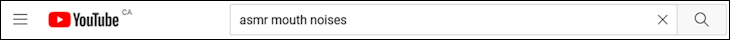
    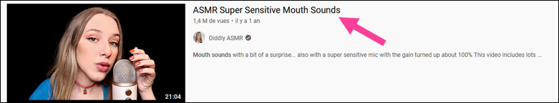
</center>

**Étape 2 - 🚚 Copier le \<iframe\> prémâché dans le composant**

<center>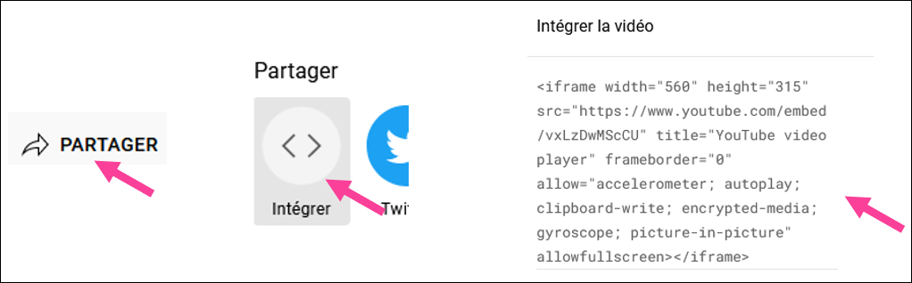</center>

On colle dans le HTML d'un composant :

<center>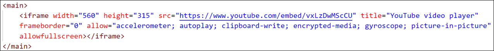</center>
<br/>
:::warning

Il est possible qu'Angular bloque la vidéo puisque c'est une ressource externe.
Dans ce cas, il faudra indiquer à Angular d'ignorer l'origine de la ressource. (Étape 2.5)

:::

**Étape 3 (optionnelle) - 🧼 Contourner le blocage d'une ressource externe**

<center>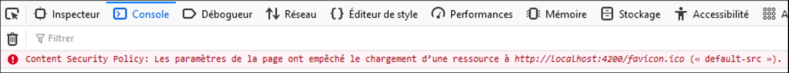</center>

Si vous avez ce problème, voici la solution :

1. Mettre l'URL de la vidéo dans une variable du composant :

```ts showLineNumbers
export class AppComponent{

  videoUrl : string = "https://www.youtube.com/embed/vxLzDwScCu";

}
```

2. Injecter la dépendance `DomSanitizer` dans le composant :

```ts showLineNumbers
export class AppComponent{

  videoUrl : string = "https://www.youtube.com/embed/vxLzDwScCu";

  constructor(public sanitizer : DomSanitizer){} // Injection 💉

}
```

3. Utiliser le `DomSanitizer` pour transformer la ressource externe en « ressource de confiance » :

```ts showLineNumbers
export class AppComponent{

  videoUrl : string = "https://www.youtube.com/embed/vxLzDwScCu";

  constructor(public sanitizer : DomSanitizer){}

  getSafeUrl() : SafeResourceUrl{
    return this.sanitizer.bypassSecurityTrustResourceUrl(this.videoUrl);
  }

}
```

4. Il ne reste plus qu'à utiliser `getSafeUrl()` dans le `src` du `<iframe>` du composant :

```html
<iframe width="560" height="315" [src]="getSafeUrl()"  title="YouTube video player" ...>
```

La vidéo devrait pouvoir être chargée sans problème à ce moment.

**Étape 4 (optionnelle) - 🧠 Meilleur stockage des URLs YouTube**

Si on compte afficher plusieurs vidéos YouTube dans la page, autant mettre la **partie commune**
de l'URL dans une **constante** :

```ts showLineNumbers
const YT_URL = "https://www.youtube.com/embed/"; // Constante

@Component({
    ...
})
export class AppComponent{

  videoUrl_1 : string = "vxLzDwMScCu";
  videoUrl_2 : string = "Yv5saunLRdQ";

  constructor(public sanitizer : DomSanitizer){}

  getSafeUrl() : SafeResourceUrl{
    return this.sanitizer.bypassSecurityTrustResourceUrl(YT_URL + this.videoUrl_1); // Concaténation
  }

}
```

### 📶 Requête YouTube

**L'API Web de YouTube** permet de rechercher des vidéos à l'aide d'une requête contenant un simple texte de recherche.
En gros, c'est un peu comme si on utilisait la barre de recherche sur le site Web de YouTube, mais dans une requête.
De plus, au lieu d'avoir accès à une liste de vidéos cliquables, nous obtiendrons plutôt une liste **d'ids de vidéos**.
Ces **ids** nous permettront d'afficher une vidéo ou plusieurs vidéos à l'aide de la technique vue plus haut avec un
`<iframe>`.

Voici les étapes à suivre pour pouvoir faire des **requêtes YouTube** et afficher les vidéos obtenues :

**Étape 1 - 🔑 Obtenir une clé d'API YouTube**

Commencez par créer un compte Google.

Une fois connecté(e), rendez-vous sur cette page : [https://console.cloud.google.com/apis/credentials?](https://console.cloud.google.com/apis/credentials?)

Pour pouvoir générer une clé d'API (« Create credentials »), vous devrez : 

1. Créer un projet (remplir plusieurs champs d'un formulaire pour décrire votre application à Google)
2. « Configure consent screen » (Choisissez **external**)
3. « Create credentials » puis « API key »

Vous aurez ensuite accès à une clé d'API.

:::danger

Il se peut que Google vous redirige vers une page permettant de fournir vos informations de paiement. ⛔ Ce n'est
absolument pas nécessaire ! Vous devriez pouvoir revenir en arrière et / ou obtenir votre clé d'API sans avoir à faire cela.

:::

**Étape 2 - 🚀 Activer YouTube Data API v3**

<center>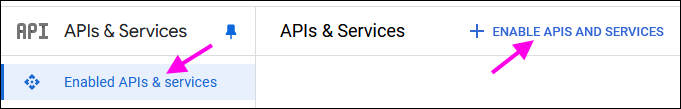</center>

Pour que nos requêtes à **l'API Web de YouTube** fonctionnent, il faudra activer l'API pour notre compte Google.
Cliquez sur « Enable APIs and services », puis cherchez l'API de YouTube pour **l'activer**.

**Étape 3 - 📬 Utiliser la requête YouTube**

Voici la requête à utiliser :

`https://www.googleapis.com/youtube/v3/search?type=video&part=id&maxResults=1&key=VOTRE_CLÉ_API&q=PHRASE_DE_RECHERCHE`

Notez les éléments suivants :

* `maxResults=1` : L'API ne nous retournera que la **première vidéo** trouvée. (Notre phrase de recherche devra être très précise...)
* `key=VOTRE_CLÉ_API` : Remplacez `VOTRE_CLÉ-API` par... votre clé d'API. 🧠
* `q=PHRASE_DE_RECHERCHE` : Remplacez `PHRASE_DE_RECHERCHE` par un `string` de votre choix. Exemple : `"cher believe"`.

:::warning

Avec le forfait gratuit, vous avez une **limite de 10 000 requêtes par jour**. Ça ne devrait pas trop poser problème à moins
que vous appeliez plusieurs requêtes maladroitement **dans une boucle \*ngFor**. Soyez prudents ! 👷‍♂️👷‍♀️🚧

:::

Le résultat JSON pourrait ressembler à ceci :

<center>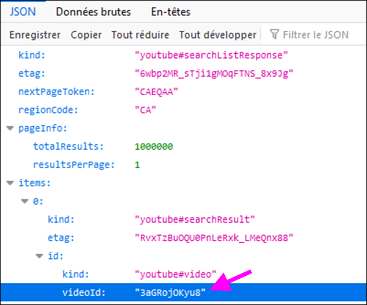</center>

Ce qui nous intéresse le plus est `videoId` car nous pourrons l'utiliser pour afficher la vidéo avec un `<iframe>`.

**Étape 4 - 📽 Afficher la vidéo**

Que faire avec **l'id obtenu** ? Comme on a vu plus haut, il suffit de le glisser à la fin de l'URL `https://www.youtube.com/embed/`
dans un `<iframe>`.

### 🗺 Intégration Google Maps

<center></center>

Notez qu'il faudra activer une autre API (« Maps JavaScript API ») pour pouvoir afficher une **carte Google** dans notre application Web.

**Étape 1 - 📦 Installer une dépendance**

`npm install @angular/google-maps@18.0.4`

:::warning

Le `@18.0.4` à la fin du nom du package permet de spécifier la **version** à installer. Vous devez choisir la même
version que votre version de **Angular**. (À l'école, la version est `18.0.4`) N'hésitez pas à vérifier votre version
d'Angular à l'aide de la commande `ng version`.

:::

**Étape 2 - 🎁 Importation d'un module dans le composant souhaité**

```ts showLineNumbers
@Component({
  selector: 'app-root',
  standalone : true,
  imports: [GoogleMapsModule], // Ici !
  templateUrl: './app.component.html',
  styleUrls: ['./app.component.css']
})
```

**Étape 3 - ⚙ Inclusion d'un script dans `index.html`**

⛔ Remarquez que vous devrez y glisser votre clé d'API Google. (La même que pour YouTube si vous voulez)

Cet élément `<script>` doit être dans le `<head>` du fichier `index.html`. ☢ Pas dans le composant `app` !

` <script src="https://maps.googleapis.com/maps/api/js?key=VOTRE_CLÉ_API"></script>`

**Étape 4 - 📐 Deux variables pour l'affichage de la carte**

Déclarez les variables suivantes dans le composant souhaité. Elles permettront de définir
la **position centrale initiale** de la carte et le **niveau de zoom**.

```ts showLineNumbers
export class AppComponent{

  center : google.maps.LatLngLiteral = {lat : 42, lng : -4};
  zoom : number = 5;

  ...

}
```

**Étape 5 - 🗺 Placer un élément `<google-map>`**

Dans le HTML du composant souhaité, intégrez cet élément HTML qui se servira
d'ailleurs des deux variables créées plus haut.

```html showLineNumbers
<h2>Gougueule mappe</h2>

<google-map
  [center]="center"
  [zoom]="center"
  width="700"
  height="300"
></google-map>
```

<center>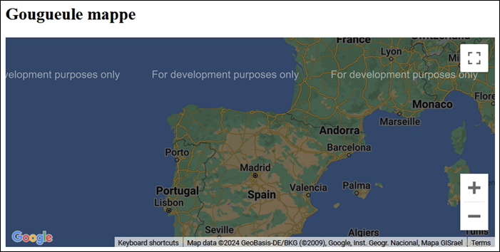</center>

:::warning

Vous aurez très probablement un message d'erreur en lien avec la facturation non activée.
Pas de problème, le seul impact est que la carte est obscurcie ! Vous n'avez pas à activer
la facturation dans ce cours.

<center>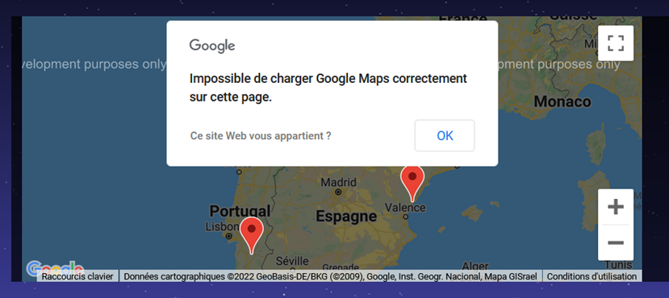</center>

:::

### 🚩 Ajouter des marqueurs sur une carte

Suivez les étapes suivantes pour afficher des marqueurs / épingles 📍 sur une carte Google.

**Étape 1 - 📍 Créer un tableau de marqueurs**

```ts showLineNumbers
export class AppComponent{

  center : google.maps.LatLngLiteral = {lat : 42, lng : -4};
  zoom : number = 5;

  // Tableau de marqueurs
  markers : google.maps.LatLngLiteral[] = [
    {lat : 42, lng : -4},
    {lat : 40, lng : 0},
    {lat : 48, lng : -8}
  ];

  ...

}
```

**Étape 2 - 📋 Intégrer le tableau de marqueurs à la carte**

```html showLineNumbers
<h2>Gougueule mappe</h2>

<google-map
  [center]="center"
  [zoom]="center"
  width="700"
  height="300">
  <map-marker *ngFor="let m of markers" [position]="m">
  </map-marker>
</google-map>
```

**Étape 3 (optionnelle) - 📬 Permettre d'ajouter des marqueurs**

Si jamais vous aimeriez pouvoir ajouter des marqueurs supplémentaires dynamiquement dans le
tableau `markers`, le code pourrait ressembler à ceci :

```ts
this.markers.push({lat : xValue, lng : yValue});
```

Dans le code ci-dessus, `xValue` et `yValue` doivent être des données de type `number`. Attention
de bien respecter la structure de l'objet avec les accolades `{ ... }` et les étiquettes `lat` et
`lng`.

:::warning

Attention ! Les valeurs pour `lat` et `lng` doivent absolument être des `number`. Si jamais vous souhaitez
convertir un `string` (Ex : `"-4.521"`) en `number`, vous pouvez utiliser `parseFloat(monString)`. Ce sera
nécessaire dans le **TP2** puisque l'API **BandsInTown** fournit les coordonnées des concerts sous forme 
de `string`.

:::

### ⚙ Pipes

Les pipes permettent de transformer facilement une donnée affichée dans le HTML. Abordons un exemple
ultra simplifié.

On a la variable suivante : `n : number = 5;`. On a un pipe nommé `timesTwo` qui multiplie par deux.

On pourrait utiliser le pipe comme ceci dans le html :

```html
<p>{{ n | timesTwo}}</p>
```

La valeur affichée sera `10`, en raison de la transformation effectuée par le pipe `timesTwo`.

#### 🐣 Créer un pipe

Utilisez la commande `ng generate pipe nomDeVotrePipe` pour créer un nouveau pipe. N'oubliez pas de commencer
par **créer un dossier pour vos pipes** et **vous déplacer dans le bon dossier avec `cd`** pour créer votre pipe au bon endroit.

<center>
    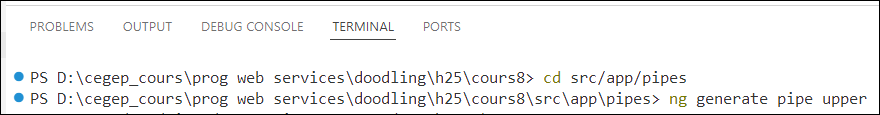
    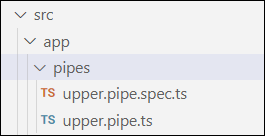
</center>

Comme pour les composants et les services, un **fichier de tests** accompagne le pipe. On peut le supprimer pour le moment.

Vous remarquerez qu'un **pipe vide** ressemble à ceci :

```ts showLineNumbers
import { Pipe, PipeTransform } from '@angular/core';

@Pipe({
  name: 'upper', // Nom du pipe pour l'utiliser
  standalone: true
})
export class UpperPipe implements PipeTransform {

  transform(value: unknown, ...args: unknown[]): unknown {
    return null;
  }

}
```

Dans ce cas-ci, on peut voir que pour utiliser ce pipe, on utilisera le nom `upper`. Exemple : `{{ maVariable | upper }}`

⛔ Notez que pour pouvoir utiliser un pipe dans un composant spécifique, **il faut l'importer**.

```ts showLineNumbers
@Component({
  selector: 'app-root',
  standalone : true,
  imports: [UpperPipe], // Ici !
  templateUrl: './app.component.html',
  styleUrls: ['./app.component.css']
})
```

#### 🎨 Personnaliser un pipe

Il faut remplacer le `return null` par la transformation / les opérations de notre choix, tant qu'on retourne une valeur.
Notez que le paramètre `value` reçu par la fonction `transform(...)` contient la **valeur placée à gauche du pipe**.

Pour simplifier la manipulation du paramètre `value`, remplacez son type par `any`. Attention toutefois : on risque
d'avoir des résultats inattendus si on utilise mal un pipe.

```ts showLineNumbers
transform(value: any, ...args: unknown[]): unknown {
  return null;
}
```

Voici deux exemples de pipes relativement simples :

**1. 📢 Pipe pour mettre du texte en majuscules :**

```ts showLineNumbers
export class UpperPipe implements PipeTransform {

  transform(value: any, ...args: unknown[]): unknown {
    return value.toUpperCase();
  }

}
```

Usage : `{{ monString | upper }}`

**2. 🧼 Pipe pour _sanitize_ une ressource externe :**

```ts showLineNumbers
export class TrustPipe implements PipeTransform {

  constructor(public sanitizer : DomSanitizer){}

  transform(value: any, ...args: unknown[]): unknown {
    return this.sanitizer.bypassSecurityTrustResourceUrl(value); 
  }

}
```

Usage : `<iframe [src]="videoUrl | trust" width="700" ...>`

### 📅 Pipe pour le formatage des dates

Un pipe nommé `date` existe déjà par défaut. Il permet de formater des dates facilement.

Usage : `{{ maDate | date:'format' }}`
Exemple : `{{ '2021-05-26' | date:'MMM d, y' }}` affichera `may 26, 2021`

Liste de (quelques) symboles pour le formatage de la date :

<center>
|symbole|description|
|:-|:-|
|d|Jour|
|MMM|Mois en 3 lettres|
|MMMM|Mois complet|
|MM|Mois en chiffres|
|y ou yyyy|Année complète|
|yy|Année en deux chiffres|
|h|Heure de 1 à 12|
|mm|Minutes|
|ss|Secondes|
|a|AM / PM|
|EEEE|Jour de la semaine|
</center>

⛔ Notez que pour pouvoir utiliser ce pipe dans un composant spécifique, **il faut l'importer**.

```ts showLineNumbers
@Component({
  selector: 'app-root',
  standalone : true,
  imports: [DatePipe], // Ici !
  templateUrl: './app.component.html',
  styleUrls: ['./app.component.css']
})
```

#### 🥖 Dates en français

Par défaut, les dates (noms de mois et jours de la semaine) seront affichées en anglais. Voici la procédure
pour les afficher en français.

**Étape 1 - ⚙ Ajouter la « locale » français dans `app.config.ts`**

```ts showLineNumbers
// Trois lignes à ajouter juste après les autres importations dans le haut du fichier :
import { registerLocaleData } from '@angular/common'; 
import localeFr from '@angular/common/locales/fr'; 
registerLocaleData(localeFr, 'fr'); 

export const appConfig : ApplicationConfig = {
  ...
};
```

**Étape 2 - 📬 Ajouter un 3e paramètre en utilisant le DatePipe pour choisir une langue**

Le deuxième paramètre peut être laissé vide, car il permet de choisir un fuseau horaire.
L'important est de spécifier `fr` comme troisième paramètre.

```html
<p> {{ maDate | date:'EEEE le d MMMM yyyy':'':'fr' }} </p>
```

Cet affichage pourrait par exemple donner `lundi le 15 novembre 2021`.

:::tip

Lorsqu'un pipe nécessite des paramètres, ils sont glissés après le nom du pipe, entre apostrophes :
`nomDuPipe:'param1':'param2':'param3'`. S'il y a plusieurs paramètres, ils sont séparés par des `:`.

:::