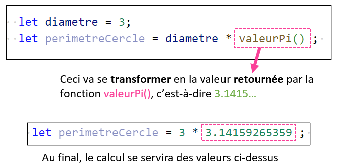
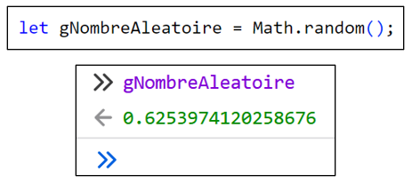
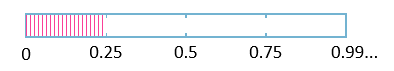
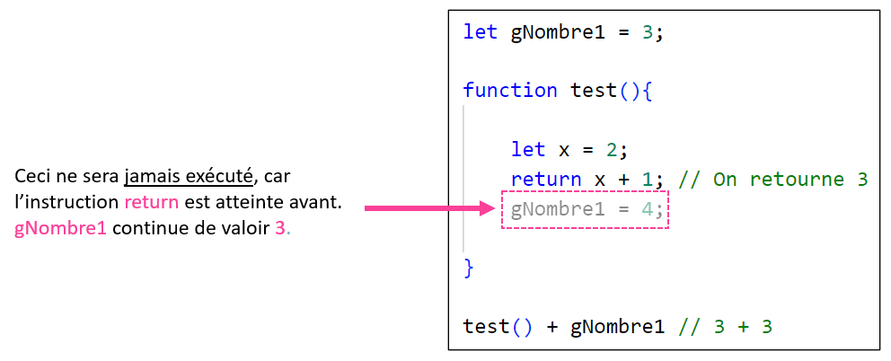
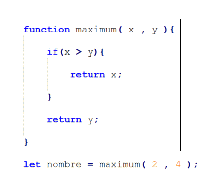
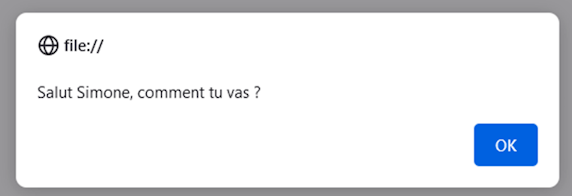

# Cours 11 - Retours

## 📬 Retourner une valeur

Voici un exemple de fonction **avec une valeur de retour** :

```js showLineNumbers
function valeurPi(){

    let pi = 3.14159265359;
    return pi;

}
```

Grâce au **mot clé `return`**, on peut dire que « la fonction `valeurPi()` retournera la valeur `3.14159265359` ».

## 📞 Appeler une fonction avec retour

Voici ce qui se passe lorsqu'on appelle une **fonction avec valeur de retour** comme `valeurPi()` :

<center></center>

<hr/>

<center></center>

### 💡 Exemple un peu plus utile

La fonction `Math.random()` existe par défaut. (Pas besoin de la créer, comme `alert()` et `console.log()` !)

`Math.random()` retourne **un nombre aléatoire entre `0` et `0.99999...`**. Très utile pour simuler le **hasard** ! 🎲

<center></center>

Exemple : on a **25% de chances de gagner 100$** et **75% de chances de perdre 50$** :

```js showLineNumbers
function jouer(){

    let nombreAleatoire = Math.random();

    if(nombreAleatoire < 0.25){

        argent += 100;

    }
    else{

        argent -= 50;

    }

}
```

* Dans la variable `nombreAleatoire`, il y aura une valeur entre `0` et `0.9999...`. On ne sait pas d'avance quelle sera la valeur ! La valeur changera à chaque fois que nous appelerons la fonction `jouer()`.
* Avec ce `if` ... `else`, on a 25% de chances d'exécuter le `if` et 75% de chances d'exécuter le `else`.

<center></center>

## 🛑 Point de non-retour

:::warning

⛔ Notez que dès que l'instruction `return` est exécutée, **on met fin** à la fonction !

<center></center>

:::

## 📜 Exemples variés

Voici une fonction qui retourne `true` si trois variables globales sont **identiques**, et `false` sinon :

```js showLineNumbers
function tousEgaux(){

    if(gNombre1 == gNombre2 && gNombre1 == gNombre3){
        return true;
    }
    return false;

}
```

:::tip

Pas besoin de mettre `return false` dans un bloc `else` ! Ce bout de code sera seulement atteint si le bloc `if` n'a pas été exécuté de toute façon !

:::

Voici une fonction qui reçoit deux **paramètres** (deux nombres nommés `x` et `y`) et qui **retourne le plus grand des deux** :

```js showLineNumbers
function maximum(x, y){

    if(x > y){
        return x;
    }
    return y;

}
```

```js
let nombre = maximum(2, 4); // nombre contient 4
```

<hr/>

<center></center>

<hr/>

Voici une fonction qui reçoit un **paramètre** (une chaîne de caractère nommée `nom`) et qui **retourne une chaîne de caractères qui correspond à un message de salutations** :

```js showLineNumbers
function saluer(nom){

    return `Salut ${nom}, comment tu vas ?`;

}
```

```js
alert(saluer("Simone"));
```

<center></center>