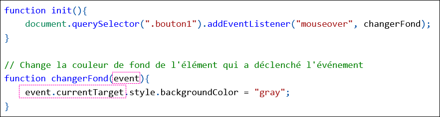
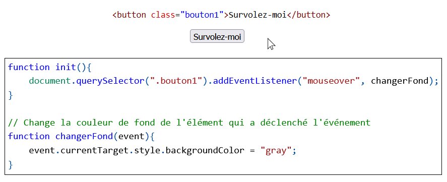

# Cours 12 - currentTarget

## 🔄 Code répétitif

Disons qu'on souhaite que **survoler** l'élément `.bouton1` change sa couleur de fond. On va devoir créer un **écouteur d'événements** et **une fonction qui change la couleur de fond du bouton** :

```js showLineNumbers
function init(){
    document.querySelector(".bouton1").addEventListener("mouseover", changerFond);
}

function changerFond(){
    document.querySelector(".bouton1").style.backgroundColor = "gray";
}
```

Ensuite, disons qu'on souhaite obtenir **le même comportement** pour l'élément `.bouton2` ...

* On doit ajouter un autre **écouteur d'événements**
* On doit ajouter une autre **fonction similaire**

```js showLineNumbers
// Écouteurs d'événements
function init(){
    document.querySelector(".bouton1").addEventListener("mouseover", changerFond1);
    document.querySelector(".bouton2").addEventListener("mouseover", changerFond2);
}

// Changer le fond du .bouton1
function changerFond1(){
    document.querySelector(".bouton1").style.backgroundColor = "gray";
}

// Changer le fond du .bouton2
function changerFond2(){
    document.querySelector(".bouton2").style.backgroundColor = "gray";
}
```

⛔ C'est agaçant : on a deux fonctions presque identiques ... (`changerFond1()` et `changerFond2()`)

Hélas, même en utilisant des **paramètres**, il faut quand même **une fonction par bouton** puisqu'on ne peut pas fournir de paramètre facilement dans un écouteur d'événements :

```js showLineNumbers
// Écouteurs d'événements
function init(){
    document.querySelector(".bouton1").addEventListener("mouseover", fondBouton1);
    document.querySelector(".bouton2").addEventListener("mouseover", fondBouton2);
}

function fondBouton1(){
    changerFond(".bouton1");
}

function fondBouton2(){
    changerFond(".bouton2");
}

// Changer le fond d'un élément de notre choix
function changerFond(classe){
    document.querySelector(classe).style.backgroundColor = "gray";
}
```

## 💡 Solution : currentTarget

Dans le genre de situation abordé plus haut, le *gadget* `currentTarget` est très utile.

Commençons par reprendre le code lorsqu'il y avait seulement l'élément `.bouton1` :

```js showLineNumbers
function init(){
    document.querySelector(".bouton1").addEventListener("mouseover", changerFond);
}

// Changer la couleur de fond de .bouton1
function changerFond(){
    document.querySelector(".bouton1").style.backgroundColor = "gray";
}
```

Puis, dans la fonction `changerFond()`, nous allons faire deux modifications :

* Ajouter un **paramètre** nommé `event`.
* Remplacer `document.querySelector(".bouton1")` par `event.currentTarget`.

<center></center>

<br/>

> Que fait `event.currentTarget` ?

Lorsque la fonction `changerFond()` sera appelée, `event.currentTarget` **sera automatiquement remplacé par** `document.querySelector( ... classe de l'élément qui a déclenché l'événement ... )`.

<hr/>

Par exemple, si c'est **survoler l'élément `.bouton1`** qui a déclenché **l'appel de `changerFond()`**, `event.currentTarget` **va devenir** `document.querySelector(".bouton1")`.

<center></center>

<hr/>

On peut donc appeler la fonction `changerFond()` avec **n'importe quel écouteur d'événements** et c'est **toujours l'élément avec lequel on vient d'interagir qui sera modifié** :

```js showLineNumbers
function init(){
    document.querySelector(".bouton1").addEventListener("mouseover", changerFond);
    document.querySelector(".bouton2").addEventListener("mouseover", changerFond);
    document.querySelector(".bouton3").addEventListener("mouseover", changerFond);
}

// Changer la couleur de fond de l'élément survolé
function changerFond(event){
    event.currentTarget.style.backgroundColor = "gray";
}
```

* Si on survole `.bouton1`, la couleur de fond de `.bouton1` deviendra *gray*.
* Si on survole `.bouton2`, la couleur de fond de `.bouton2` deviendra *gray*.
* Si on survole `.bouton3`, la couleur de fond de `.bouton3` deviendra *gray*.

:::warning

Le *gadget* `event.currentTarget` est seulement utile quand c'est **l'élément avec lequel on interagit** qu'on souhaite modifier.

Par exemple, si on veut changer la couleur de `.texte1` lorsqu'on clique sur `bouton1`, nous n'aurons pas le choix de faire ceci :

```js showLineNumbers
function init(){
    document.querySelector(".bouton1").addEventListener("click", changerCouleur);
}

// Changer la couleur de .texte1
function changerCouleur(){
    document.querySelector(".texte1").style.color = "red";
}
```

❌ Si on avait remplacé `document.querySelector(".texte1")` par `event.currentTarget`, c'est la couleur de `.bouton1` qui serait modifiée plutôt que celle de `.texte1` !

:::

:::danger

⛔ Notez que `currentTarget` ne peut pas être utilisé dans la fonction `init()` ! Ça ne fait tout simplement rien.

```js showLineNumbers
function init(event){
    event.currentTarget.addEventListener("click", changerCouleur); // 🚫
}
```

Il faut toujours indiquer clairement à quel **élément HTML** un écouteur d'événements **est rattaché**.

On ne peut utiliser `event.currentTarget` que dans les fonctions appelées par un écouteur d'évènements, par exemple ici dans la fonction `changerCouleur`.

:::

## 🎲 Autres exemples

Comme `event.currentTarget` peut remplacer `document.querySelector()`, on peut utiliser ...

* `.style.propriété` pour modifier les **styles** de l'élément qui déclenche l'événement.
* `.textContent` pour manipuler le **contenu textuel** de l'élément qui déclenche l'événement.

#### Exemple 1

Lorsque nous survolerons sur l'élément `.texte1`, son contenu textuel va changer :

```js showLineNumbers
function init(){
    document.querySelector(".texte1").addEventListener("mouseover", changerTexte);
}
 
function changerTexte(event){
    event.currentTarget.textContent = "Skibidi";
}
```

#### Exemple 2

Lorsque nous cliquerons sur l'élément `.paragraphe3`, son contenu textuel sera affiché dans la **console** :

```js showLineNumbers
function init(){
    document.querySelector(".paragraphe3").addEventListener("click", afficherTexte);
}
 
function afficherTexte(event){
    console.log(event.currentTarget.textContent);
}
```