import Tabs from '@theme/Tabs';
import TabItem from '@theme/TabItem';

# Cours 14 - Intro Web API

## 😴 Architecture REST

Contrairement aux projets **ASP.NET Core MVC** que vous réalisiez dans le cours **Programmation Web transactionnelle**, nos projets Web dans ce cours respecteront **l'architecture REST**. En gros, comme
notre serveur Web ASP.NET Core ne gèrera plus les _Views_ (Le projet Angular s'occupera du côté visuel et roulera sur l'ordinateur client !) et qu'il se contentera de retourner des **données JSON** lorsqu'il recevra des requêtes, il respecte les **principes REST**.

### 🔒 Les six contraintes REST

**1. 💑 Architecture client-serveur**

La **gestion de l'interface utilisateur** et la **gestion des données** sont séparées. On pourrait même avoir une application cliente mobile qui communique avec le même serveur Web qu'une application Angular.

**2. 🧊 Sans état (statelessness)**

**Peu** ou **pas** de données de session sur le serveur. On laisse cette charge au client autant que possible pour alléger la tâche du serveur.

**3. 💾 Cacheabilité**

Certaines réponses de requête peuvent être **mises en cache**. Ex : on envoie deux fois la même requête
GET à 30 secondes d'intervalle... La deuxième fois, on pourrait utiliser la même réponse qui a été reçue
la première fois (et qui a donc été **mise en cache**) plutôt que d'envoyer la requête à nouveau. Cela peut
alléger la charge du serveur.

**4. 👶🩲 Système en couches**

Des couches intermédiaires peuvent être glissées entre le client et le serveur. (Ex : application pour faire du **load balancing**, application pour assurer la **sécurité**, etc.)

**5. 🖨 Interface uniforme**

Peu importe l’application cliente (mobile ou web ou desktop), on envoie les mêmes requêtes au serveur et le serveur retourne les données dans le même format.

**6. 📬 Code sur demande (optionnel)**^

On peut envoyer du code (Ex : JavaScript) pour « étendre les fonctionnalités du client situationnellement ».

### 📦 Nos prochains projets

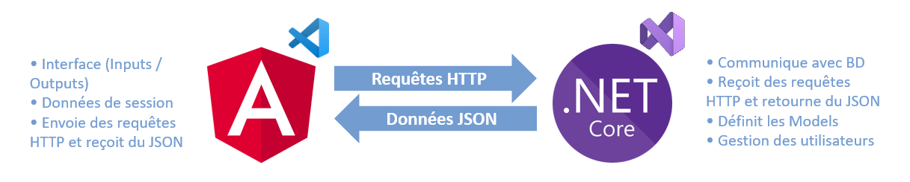

Pour le reste de la session, nous utiliserons simultanément un projet **Angular** et un projet **ASP.NET Core Web API**. (Notez bien : **Web API** et non **MVC** !)

## 🐣 Serveur Web API simple

### 🥚 Création du projet

Avec Visual Studio (Et non **Visual Studio Code**, que nous utiliserons encore pour Angular malgré tout), créez un nouveau projet avec le gabarit **ASP.NET Core Web API** :

<center>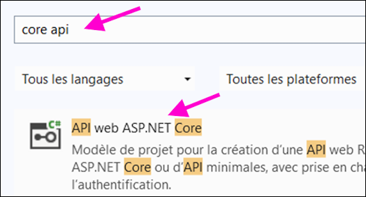</center>

Faites bien attention de ne pas choisir le gabarit MVC ⛔

<center>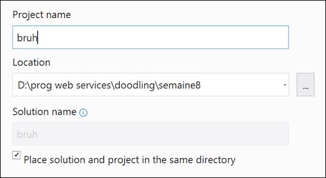</center>

N'hésitez pas à placer la solution dans le même dossier que le projet.

:::note

Généralement, on évite de placer la solution dans le même dossier que le projet si nous avons l'intention d'avoir plusieurs projets au sein de la solution. Or, dans notre cours, nous n'aurons toujours **qu'un seul projet**.

:::

<center>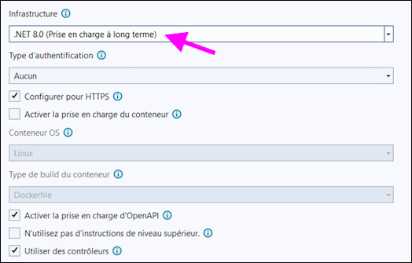</center>

8️⃣ Assurez-vous de choisir **.NET 8**. La version .NET 9 est sortie, mais elle n'est pas installée au Cégep et de toute façon la version **.NET 8** sera supportée à long terme par Microsoft contrairement à la version **.NET 9**.

Parmi les **fichiers de départ**...

* Remarquez le package `Swashbuckle`, qui est installé par défaut. Il nous sera utile pour visualiser la **liste des requêtes disponibles** de notre API Web.

* Vous pouvez supprimer `WeatherForecast.cs` et `WeatherForecastController.cs`. Ce sont des fichiers qui servent d'exemples.

<center>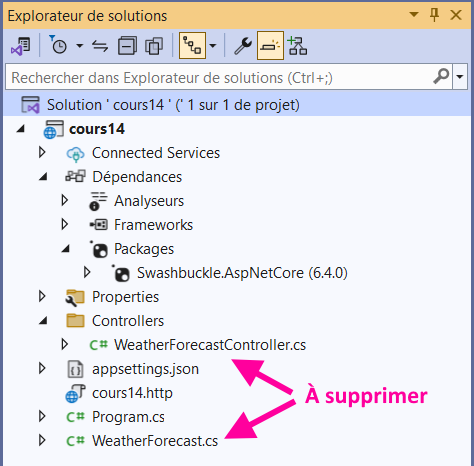</center>

Dans la classe `Program.cs`...

* Les instructions liées à **Swagger** sont associées au package `Swashbuckle`. (Permettra de visualiser la liste des requêtes disponibles de notre API Web)

<center></center>

Il faudra ajouter deux blocs de code dans `Program.cs` pour permettre à notre éventuel **projet Angular** de pouvoir envoyer des requêtes au serveur. 

**Bloc à ajouter AVANT la ligne `var app = builder.Build()`** :

```cs showLineNumbers
builder.Services.AddCors(options =>
{
    options.AddPolicy("AllowAll", policy =>
    {
        policy.AllowAnyHeader();
        policy.AllowAnyMethod();
        policy.AllowAnyOrigin();
    });
});
```

**Bloc à ajouter APRÈS la ligne `var app = builder.Build()`** :

```cs showLineNumbers
app.UseCors("AllowAll");
```

### 🚬 Dépendances

Il y aura trois dépendances à installer pour assurer l'interaction avec la base de données à l'aide d'**Entity Framework** :

<center>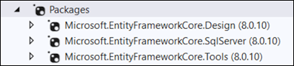</center>

:::warning

Installez la dernière version **8** de ces packages. Au moment d'écrire ces notes, la dernière version est `8.0.14` par exemple.

:::

🏗 N'hésitez pas à faire un **build** (Générer la solution) après l'installation des packages. Cela empêche parfois certains problèmes lorsqu'on génère le premier contrôleur.

### ⚱ Modèle

Ce serait crotté 💩 de créer nos modèles directement à la racine du projet. Comme il n'y a pas de dossiers pour les modèles par défaut, commencez par en créer un :

<center>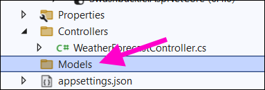</center>

**Exemple de modèle valide :**

```cs showLineNumbers
namespace cours14.Models
{
    public class Toy
    {
        public int Id { get; set; }

        public string Name { get; set; } = null!;

        public string Description { get; set; } = null!;

        public int Price { get; set; }

        // Constructeur (facultatif)
        public Toy(int id, string name, string description, int price)
        {
            Id = id;
            Name = name;
            Description = description;
            Price = price;
        }

        // Constructeur vide (obligatoire si on a mis un autre constructeur)
        public Toy() { }
    }
}
```

Quelques remarques importantes :

* 🔑 La propriété `public int Id` est **nécessaire** pour tous les modèles. Elle sert de clé primaire dans la base de données qui sera générée par **Entity Framework**.

* 🤫 L'expression `= null!;`, utilisable pour les types non-primitifs (tout ce qui n'est pas un `int`, `bool`, `float` ou `double` par exemple), permet de **faire taire** le compilateur lorsqu'il aura peur que cette propriété soit `null`. Le mettre permet **d'éviter d'avoir constamment à vérifier que la propriété n'est pas `null` lorsqu'on l'utilise**. Bref, cet outil permet juste de dire au compilateur `trust me dude la propriété est pas null j'te jure no cap fr`.

* 🏗 Le constructeur est facultatif. Faites-en seulement un si vous aimez utiliser un constructeur pour instancier vos objets. Comme toutes nos propriétés sont `public`, on peut se passer d'un constructeur et remplir toute les propriétés à la main. 

* ⛔ Si vous décidez de créer un constructeur, il faudra aussi **en créer un vide**. Sans ça, **Entity Framework** ne sera pas capable d'instancier des objets lors de certaines interactions avec la base de données.

:::warning

Quand on utilise `= null!;`, on doit s'engager à toujours s'assurer que la propriété est remplie. Évitez donc cette expression lorsque vous souhaitez qu'une propriété puisse rester vide.

:::

### ⚙ Contrôleur

⛔ Lorsque vous allez générer le contrôleur, faites bien attention de choisir un contrôleur pour **API Web** (et non un contrôleur MVC qui retourne des Views...)

<center>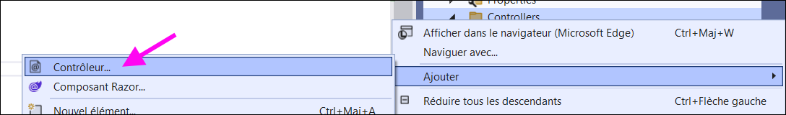</center>

Choisissez le bon type :

<center>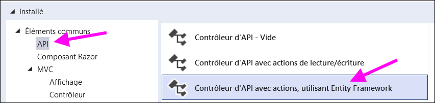</center>

Choisissez le modèle :

<center>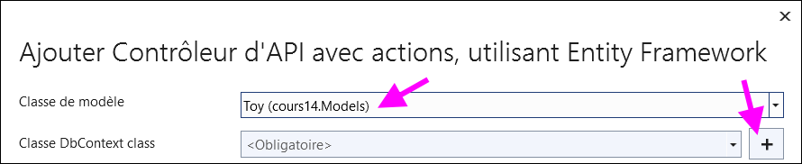</center>

Créez un nouveau DbContext si c'est le premier contrôleur du projet :

<center>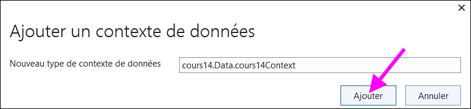</center>

Enfin, on crée le contrôleur :

<center>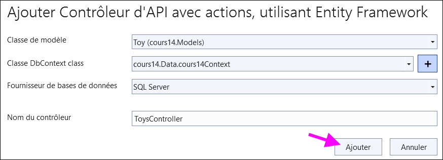</center>

On obtient un résultat similaire à celui-ci :

```cs showLineNumbers
namespace cours14.Controllers
{
    [Route("api/[controller]")]
    [ApiController]
    public class ToysController : ControllerBase
    {
        private readonly cours14Context _context;

        public ToysController(cours14Context context)
        {
            _context = context;
        }

        ...
```

**Quelques remarques :**

* 👨‍👦 Le contrôleur hérite de `ControllerBase` plutôt que `Controller`. La classe `ControllerBase` est plus simple et on en hérite car notre contrôleur n'aura pas besoin de certaines fonctionnalités comme la manipulation de **Views**.

* 🧰 Cinq actions qui englobent les opérations CRUD (Créer, modifier, supprimer et obtenir) sont déjà présentes. Elles conviennent parfois tel quel, mais généralement nous voudrons les personnaliser un peu.

### 💿 Base de données

Comme dans tous les cours de Web de la technique (sauf **420-4D5**), nous utiliserons une approche **Code-First** et donc nous ne taperons pas la moindre ligne de `SQL`. Nous laisserons **Entity Framework** générer et entretenir la base de données à l'aide de nos **modèles** et de notre **DbContext**.

Lorsqu'un premier contrôleur a été généré dans le projet, trois changements ont automatiquement été faits :

1. Ajout d'une chaîne de connexion dans `appsettings.json` :

<center>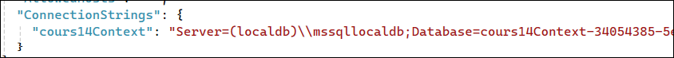</center>

2. Ajout d'une connexion à la base de données dans `Program.cs` :

<center>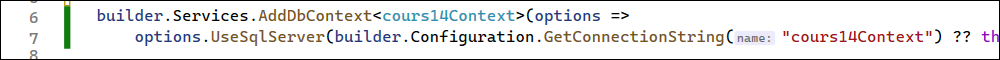</center>

3. Création d'un **DbContext** dans un dossier `Data` : 

```cs showLineNumbers
namespace cours14.Data
{
    public class cours14Context : DbContext
    {
        public cours14Context (DbContextOptions<cours14Context> options) : base(options){}

        public DbSet<cours14.Models.Toy> Toy { get; set; } = default!;
    }
}
```

:::note

Notez qu'il doit y avoir un `DbSet<T>` pour chacun des modèles qu'on souhaite stocker dans la BD. Si on créait un deuxième modèle nommé `Costumer`, il faudrait ajouter un `DbSet<Costumer>` dans le **DbContext**, par exemple.

:::

#### 🥚 Créer la base de données

Tout le **code** nécessaire pour générer la base de données est prêt. (Modèle(s) et DbContext) Il reste à **générer** puis **exécuter** du code SQL pour que la base de données soit créée.

**Étape 1 - 🥵 Ouvrir Powershell**

Si ce n'est pas déjà le cas, affichez PowerShell :

<center>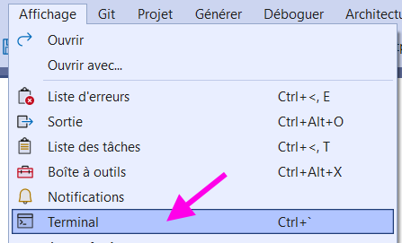</center>

<center>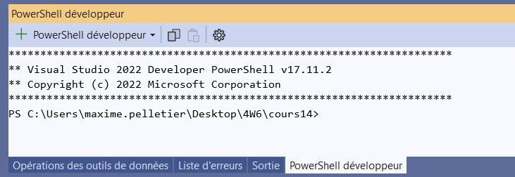</center>

**Étape 2 - 🏠 Installer `dotnet-ef` si vous n'êtes pas au Cégep**

`dotnet tool install --global dotnet-ef`

**Étape 3 - ✨ Générer du code SQL**

:::warning

Avant de taper cette commande, si vous n'avez pas placé la **solution** dans le même dossier que le projet en créant le projet, vous devrez vous déplacer dans un sous dossier à l'aide de `cd nomDuProjet`.

:::

Générer une migration : `dotnet ef migrations add nomDeVotreMigration`

Cette commande générera un **script SQL** à l'aide de notre **DbContext** et de nos **modèles**. (Création de la BD, des tables, etc.) Donnez un nom cohérent à votre migration. (Généralement associé aux objets qui seront ajoutés dans la BD)

:::warning

Il faut créer une nouvelle migration **à chaque fois** qu'un nouveau modèle est ajouté au projet et que le DbContext est modifié ! (Sinon le nouveau modèle ne sera pas stocké en BD...)

Il faut également créer une nouvelle migration lorsqu'un modèle existant est modifié pour que sa table dans la BD s'ajuste.

:::

**Étape 4 - ⚡ Exécuter du code SQL**

Exécuter les migrations : `dotnet ef database update`

Cette commande va exécuter la ou les migrations qui n'ont pas encore été exécutées, ce qui aura pour effet de générer ou mettre à jour la base de données du projet.

:::warning

Comme la base de données ne sera pas située dans le dossier du projet, **il faudra taper cette commande** chaque fois qu'on change d'ordinateur.

Il faudra également taper cette commande à chaque fois qu'une nouvelle migration vient d'être créée.

:::

**🚮 Supprimer une base de données**

Parfois on modifie les modèles à un point tel qu'il est nécessaire de **recréer la base de données en entier** car tenter d'exécuter une nouvelle migration ne peut pas fonctionner.

Dans ce cas, voici les étapes :

**1. ❌ Supprimer la base de données :**

<center>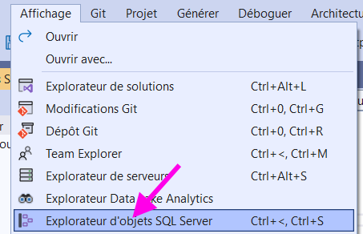</center>

N'oubliez pas de **fermer les connexions existantes** en appuyant sur supprimer.

<center>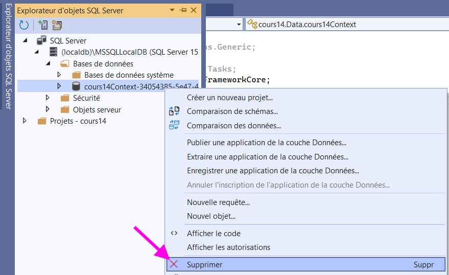</center>

**2. 📂 Supprimer le dossier `migrations` en entier.**

**3. ✨ Refaire une migration.**

`dotnet ef migrations add NomDeLaMigration`

**4. ⚡ Exécuter la migration.**

`dotnet ef database update`

## 🗺 Routage

Si on exécute le projet, on peut visualiser, grâce à Swagger, la liste des requêtes disponibles de notre serveur Web API :

<center>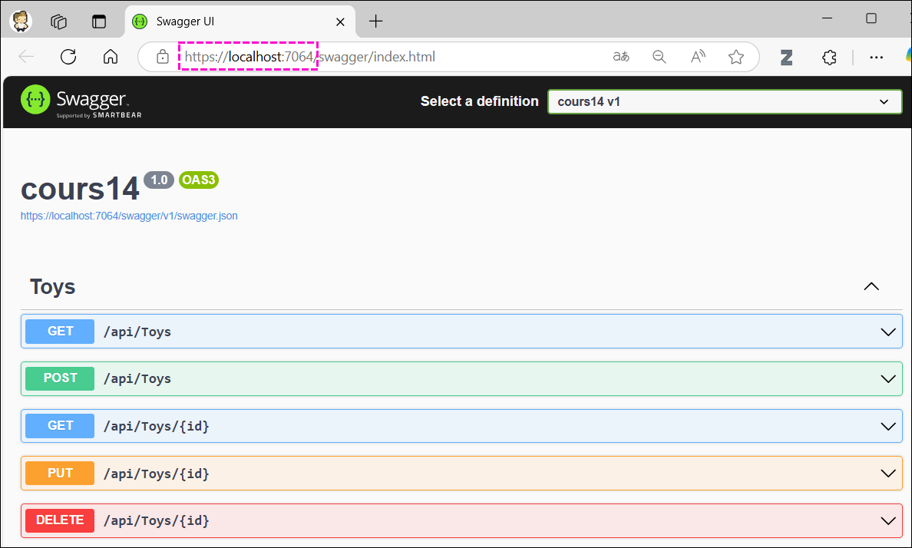</center>

Les requêtes doivent bien entendu être précédées du nom du domaine, ce qui donnerait `https://localhost:7064/api/Toys` par exemple.

Dans cet exemple, le projet possède un seul contrôleur nommé `ToysController` et ce contrôleur contient cinq action, ce qui explique pourquoi il y a **5 requêtes disponibles**.

> Certaines requêtes sont identiques, non ?

Oui, mais c'est acceptable tant que la `méthode` de la requête est différente. (GET, POST, PUT ou DELETE)

Voici de quoi aurait l'air les deux premières requêtes dans notre projet Angular :

<center>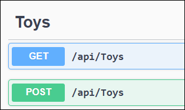</center>

Remarquez bien l'usage de `this.http.GET<any>(...)` et de `this.http.POST<any>(...)`

```ts showLineNumbers
// Exemple de requête GET
let x = await lastValueFrom(this.http.get<any>("https://localhost:7064/api/Toys"));

// Exemple de requête POST
let x = await lastValueFrom(this.http.post<any>("https://localhost:7064/api/Toys", myNewToy));
```

Nous reverrons des exemples de requêtes plus en détails plus loin.

### 🛠 Types de méthode

Notez que ce sont les annotations au-dessus des actions qui déterminent la **méthode de la requête** :

<center>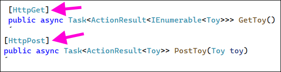</center>

Généralement, les méthodes suivent les conventions suivantes :

* 📬 GET : Retourne des données. Ne modifie aucune donnée.
* 📦 POST : Crée une nouvelle donnée.
* ⚙ PUT : Modifie une donnée existante.
* 🚮 DELETE : Supprime une donnée existante. 

Le type de méthode est seulement une **convention**. En théorie, une action avec l'étiquette `[HttpGet]` pourrait très bien supprimer des données si on l'a implémentée d'une certaine manière. **C'est le code à l'intérieur de l'action qui détermine son comportement.**

### 🌐 Règles globales

Une annotation au-dessus du contrôleur permet de dicter une règle globale pour toutes les actions à l'intérieur du contrôleur :

```cs showLineNumbers
    [Route("api/[controller]")] //  Règle globale
    [ApiController]
    public class ToysController : ControllerBase
    {
        ...
```

Dans ce cas-ci, chaque requête aura la forme `DOMAINE/api/Toys`.

Si on souhaite que le nom de l'action fasse partie de la requête, on peut faire la modification suivante :

```cs showLineNumbers
    [Route("api/[controller]/[action]")] //  Règle globale
    [ApiController]
    public class ToysController : ControllerBase
    {
        ...
```

Dans ce cas-ci, une action nommée `GetToy` serait donc associée à la requête `DOMAINE/api/Toys/GetToy`.

<center>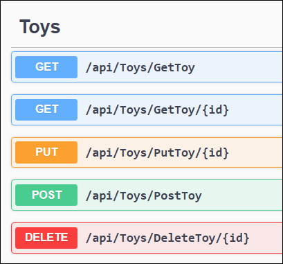</center>

:::note

Il est parfois incontournable ⛔ d'indiquer le nom de l'action dans la requête pour éviter les **conflits de nom** si on a plusieurs actions GET, par exemple.

:::

### 📍 Règles par action

Pour modifier la syntaxe d'une requête spécifique, il suffit d'ajouter une annotation au-dessus de l'action en question :

```cs showLineNumbers
    [HttpGet]
    [Route("/allo/hihi/proute/{id}")] // Règle de routage spécifique
    public async Task<ActionResult<Toy>> GetToy(int id){
        ...
    }
```

<center>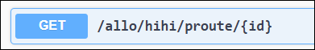</center>

Notez que si on omet la barre oblique au début de la route, la route spécifiée **s'ajoutera** à la fin de la **route globale du contrôleur**...

```cs showLineNumbers
    [HttpGet]
    [Route("allo/hihi/proute/{id}")] // Barre oblique retirée du début
    public async Task<ActionResult<Toy>> GetToy(int id){
        ...
    }
```

<center>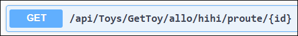</center>

:::warning

Si une action nécessite un `id`, n'oubliez pas de le placer **à la fin de la route**.

⛔ Ceci est invalide :

```cs
[HttpGet("{id}")]
[Route("allo/hihi/proute")]
public async Task<ActionResult<Toy>> GetToy(int id)
{
    ...
```

✅ Ceci est valide :

```cs
[HttpGet]
[Route("allo/hihi/proute/{id}")] 
public async Task<ActionResult<Toy>> GetToy(int id)
{
   ... 
```

:::

### 🤬 Conflits de route

Assurez-vous que toutes vos actions aient **une route différente** ! Si deux requêtes ont exactement la même route, il y aura une erreur !

Voici une liste des éléments qui peuvent permettre de différencier les routes de deux requêtes :

* 🛠 Une méthode différente (GET, POST, PUT et DELETE)
* 🏷 Un nom d'action différent (Si la règle globale du contrôleur contient `[action]`)
* 📫 Un paramètre de route supplémentaire (Ex : un paramètre nommé `id` placé à la fin)
* 🙄 Au pire, une règle de routage spécifique à l'une des actions.

Si jamais une erreur est présente dans l'interface Swagger, vous aurez ce résultat :

<center></center>

Pour voir une explication plus détaillée de l'erreur soulevée, utilisez l'URL fournie. (`https://localhost:7064/swagger/v1/swagger.json`, dans ce cas-ci)

En général, les erreurs les plus fréquentes sont les **conflits de route** ou **oublier l'étiquette `[HttpMETHODE]`** au-dessus d'une action.

## 📶 Requêtes avec Angular

Pour simplifier les interactions avec le serveur, nous allons créer un modèle **identique** dans Angular :

<Tabs>
    <TabItem value="cs" label="Classe du serveur en C#" default>
        ```cs showLineNumbers
        public class Toy
        {
            public int Id { get; set; }
            public string Name { get; set; } = null!;
            public string Description { get; set; } = null!;
            public int Price { get; set; }
        }
        ```
    </TabItem>
    <TabItem value="ts" label="Classe du client en TypeScript">
        ```ts showLineNumbers
        export class Toy{
            constructor(
                public id : number,
                public name : string,
                public description : string,
                public price : number
            ){}
        }
        ```
    </TabItem>
</Tabs>

Notez qu'il faut respecter la convention **PascalCase** en C# et **camelCase** en TypeScript. Les noms des propriétés sont **identiques**, à part pour les minuscules au début des noms côté TypeScript.

Ci-dessous, un exemple pour chacune des cinq requêtes disponibles par défaut dans un contrôleur auto-généré.

<center></center>

### 📦 POST

On doit fournir un **objet complet**. Son `id` doit être `0` puisque la base de données choisira une valeur auto-incrémentée elle-même.

⛔ Contrairement à une requête GET, il faut passer un **2e paramètre** après la requête, pour y glisser l'objet qui sera dans le **corps de la requête POST**. Seules les requêtes `POST` et `PUT` ont un **body**. (Un « corps » ou encore un contenu, si vous préférez)

```ts showLineNumbers
async postToy(){

    // En général, le nom, la description et le prix auraient été choisis par l'utilisateur
    let hardCodedToy = new Toy(0, "LEGO Harry Potter Collector", "À ranger dans le sous-sol d'un homme de 45 ans", 999.99);
    let x = await lastValueFrom(this.http.post<any>("https://localhost:7064/api/Toys/PostToy", hardCodedToy));
    console.log(x);

}
```

Côté serveur, le `toy` sera bien reçu en paramètre par l'action `PostToy()` :

```cs showLineNumbers
[HttpPost]
public async Task<ActionResult<Toy>> PostToy(Toy toy)
{
    _context.Toy.Add(toy);
    await _context.SaveChangesAsync();
    ...
```

### 📬 GET

Get pour un item spécifique (on doit fournir un **un id existant**) :

```ts showLineNumbers
async getOneToy(id : number) : Promise<Toy>{

    let x = await lastValueFrom(this.http.get<Toy>("https://localhost:7064/api/Toys/GetToy/" + id));
    console.log(x);
    return x;

}
```

Get pour tous les items dans la base de données :

```ts showLineNumbers
async getAllToys() : Promise<Toy[]>{

    let x = await lastValueFrom(this.http.get<Toy[]>("https://localhost:7064/api/Toys/GetToy/"));
    console.log(x);
    return x;

}
```

:::warning

Remarquez qu'au lieu de glisser `any` dans `this.http.get<any>`, on a mis `<Toy>` ou `<Toy[]>`. Ça permet d'indiquer à TypeScript quel **type** sera retournée par la requête. (Donc la variable `x` contiendra un `Toy` ou un `Toy[]` dans ce cas-ci)

Comme tous les noms de propriétés de la classe `Toy` correspondent entre le serveur et le client, il n'y a pas de manipulations à faire pour **reconstruire** les objets côté client.

:::

### ⚙ PUT

On doit fournir un objet complet, avec **un id existant**. Si certaines propriétés ont des valeurs différentes de l'objet existant, elles seront modifiées dans la base de données.

⛔ Comme une requête `POST`, il faut passer un 2e paramètre après la requête.

```ts showLineNumbers
async putToy(){

    // En général, le nom, la description et le prix auraient été choisis par l'utilisateur
    let hardCodedToy = new Toy(1, "LEGO Harry Potter Collector", "Château de Poudlard", 1399.99);
    let x = await lastValueFrom(this.http.put<any>("https://localhost:7064/api/Toys/PutToy/" + hardCodedToy.id, hardCodedToy));
    console.log(x);

}
```

### 🚮 DELETE

On doit fournir un **un id existant**. 

```ts showLineNumbers
async deleteToy(id : number) : Promise<Toy>{

    let x = await lastValueFrom(this.http.delete<any>("https://localhost:7064/api/Toys/DeleteToy/" + id));
    console.log(x);
    return x;

}
```