# Cours 15 - Classes et attributs

## 🔖 Classes

Les éléments HTML possèdent parfois **une ou plusieurs** classes :

```html
<div class="spongebob"> ... </div>
<div class="spongebob patrick"> ... </div>
```

(Lorsqu'un élément HTML possède **plusieurs classes**, elles sont séparées par des **espaces**)

Les **classes** permettent d'appliquer des **styles** à plusieurs éléments :

<center>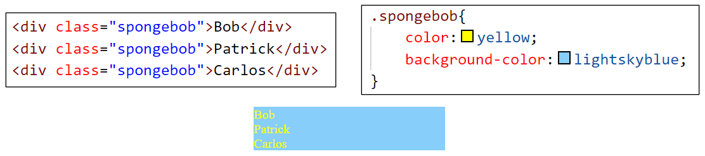</center>

### ✅ Ajouter une classe

Syntaxe :

```js
document.querySelector(".classe").classList.add("nouvelle_classe");
```

<center>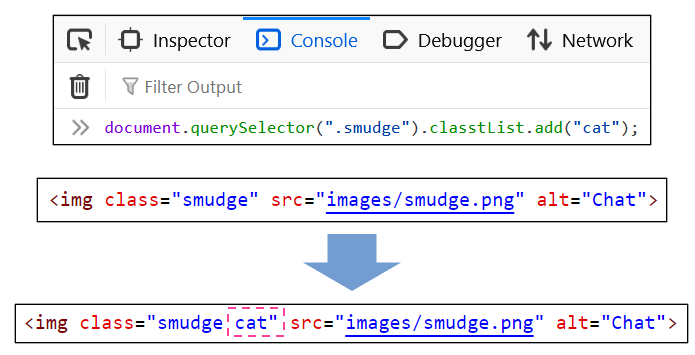</center>

### ❌ Retirer une classe

Syntaxe :

```js
document.querySelector(".classe").classList.remove("classe_a_retirer");
```

<center>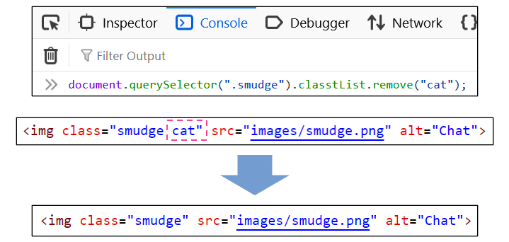</center>

### 🔁 Basculer la présence d'une classe

💡 Si la classe est présente, la **retire**. Si elle est absente, l'**ajoute**.

Syntaxe :

```js
document.querySelector(".classe").classList.toggle("classe_a_basculer");
```

<center>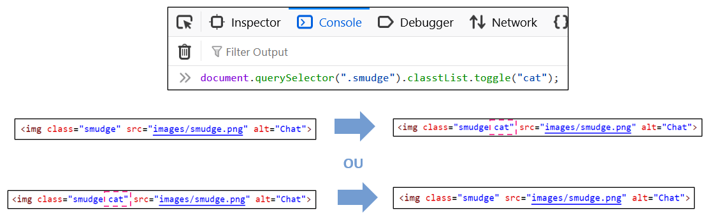</center>

### 🔍 Vérifier si un élément possède une classe

Syntaxe :

```js
document.querySelector(".classe").classList.contains("classe_a_verifier");
```

💡 Cette ligne de code va retourner `true` si la classe est présente et `false` sinon.

<center>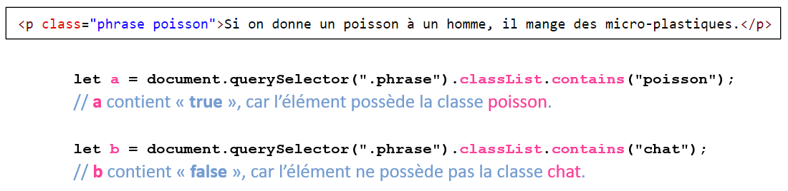</center>

#### Exemple dans une fonction

```html
<div class="texte sobre">Ton thé t'a-t-il ôté ta toux ?</div>
```

Si l’élément `.texte` possède la classe `sobre`, son texte devient `"Je possède la classe sobre 😏"`. Sinon, son texte devient `"Je ne possède pas la classe sobre 😭"`.

```js showLineNumbers
function verifierClasse(){

    if(document.querySelector(".texte").classList.contains("sobre") == true){

        document.querySelector(".texte").textContent = "Je possède la classe sobre 😏";

    }
    else{

        document.querySelector(".texte").textContent = "Je ne possède pas la classe sobre 😭";

    }

}
```

:::warning

⛔ Notez que si plusieurs éléments possèdent **la même classe**, alors `document.querySelector(...)` va seulement réussir à accéder au **premier élément avec cette classe** dans le code HTML :

<center>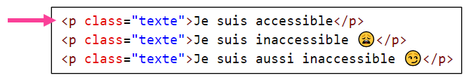</center>

⛔ De plus, notez que si on **retire toutes les classes** d'un élément, il ne sera plus possible de le manipuler facilement à l'aide de `dcoument.querySelector(...)` : 

<center>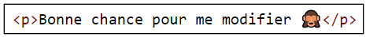</center>

:::

## 📬 Attributs

Les éléments HTML possèdent parfois **un ou plusieurs attributs**. Ils sont situés dans la **balise ouvrante**.

<center>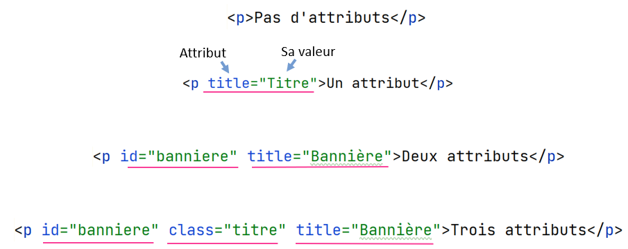</center>

### ✅ Ajouter / modifier un attribut

Syntaxe : 

```js
document.querySelector(".classe").nomAttribut = "valeur";
```

<center>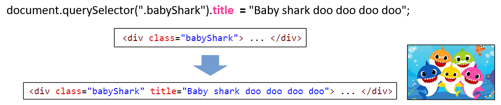</center>

:::info

Notez que si l'attribut **avait déjà une valeur**, elle sera **remplacée** :

<center>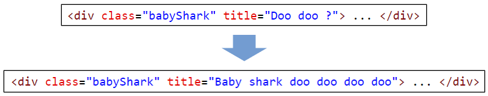</center>

:::

### ❌ Retirer un attribut

Syntaxe :

```js
document.querySelector(".classe").nomAttribut = "";
```

<center>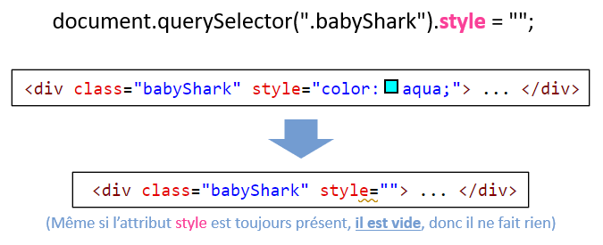</center>

### 🤏 Obtenir la valeur d'un attribut

Exemple :

<center>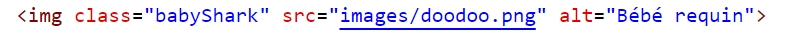</center>

```js
// Cette variable contient "Bébé requin"
let altBabyShark = document.querySelector(".babyShark").alt;
```

Autre exemple :

```js showLineNumbers
if(document.querySelector(".babyShark").alt == "Bébé requin"){

    console.log("Le texte alternatif est valide ! 👶🦈");

}
else{

    document.querySelector(".babyShark").alt = "Bébé requin";
    console.log("Le texte alternatif a été corrigé.");

}
```

## 📜 Récapitulatif (DOM)

Voici un récapitulatif de tout ce qu'on peut faire avec `document.querySelector(...)` :

* Manipuler le contenu textuel : `.textContent = "..."`
* Manipuler les styles : `.style.propriété = "valeur"`
* Ajouter un écouteur d'événements : `.addEventListener("type", fonction)` 
* Ajouter une classe : `.classList.add("maClasse")`
* Retirer une classe : `.classList.remove("maClasse")`
* Basculer une classe : `.classList.toggle("maClasse")`
* Vérifier une classe : `.classList.contains("maClasse")`
* Manipuler les attributs : `.attribut = "valeur"`

N'oubliez pas que tout comme le **contenu textuel** et les **styles**, `currentTarget` peut être utiliser pour manipuler les **classes** et les **attributs** d'un élément HTML **avec lequel on vient de générer un événement** :

* Ajouter une classe : `event.currentTarget.classList.add("maClasse")`
* Retirer une classe : `event.currentTarget.classList.remove("maClasse")`
* Basculer une classe : `event.currentTarget.classList.toggle("maClasse")`
* Vérifier une classe : `event.currentTarget.classList.contains("maClasse")`
* Manipuler les attributs : `event.currentTarget.attribut = "valeur"`

## 📦 Stocker un élément HTML dans une variable

Disons qu'on doit manipuler plusieurs propriétés d'un élément HTML... réécrire `document.querySelector(...)` sans arrêt peut être épuisant ... :

<center>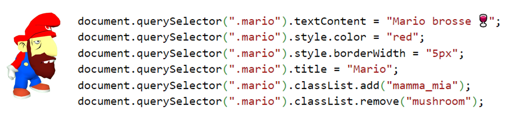</center>

<hr/>

💡 La solution : ranger un **élément HTML** dans une variable !

<center>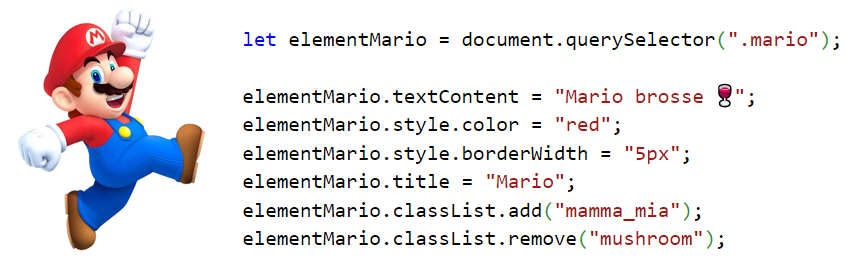</center>

N'hésitez pas à utiliser cette astuce avec **n'importe quel élément HTML** si vous prévoyez modifier plusieurs de ses propriétés.

:::danger

⛔ Attention ! Il n'est pas possible d'utiliser cette astuce **directement dans une variable globale** !

Ceci ne fonctionnera pas :

```js showLineNumbers
let gElementMario = document.querySelector(".mario");
```

✅ Cela dit, on peut y arriver si on **remplir la variable globale dans `init()`** :

```js showLineNumbers
// Vide initialement :
let gElementMario;

function init(){

    // Mais « instantanément » remplie avec l'élément .mario dans init() :
    gElementMario = document.querySelector(".mario");

}
```

> Pourquoi la première méthode ne fonctionne pas ?

En gros, c'est parce que la **page Web n'a pas terminé de charger quand les variables globales sont créées**. (Alors que la fonction `init()`, elle, est seulement exécutée une fois que la page Web a terminé de charger.) Quand la page n'est pas chargée, l'élément `.mario` n'existe pas encore.

:::