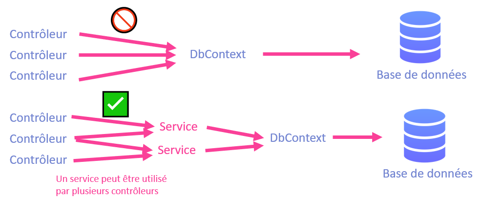

import Tabs from '@theme/Tabs';
import TabItem from '@theme/TabItem';

# Cours 15 - Relations et services

## 💍 Relations

Comme on utilise **Entity Framework**, nos classes doivent respecter certaines contraintes.

1. Posséder un `id` qui servira de **clé primaire** :

```cs showLineNumbers
public class Item{
    public int Id { get; set; } // Indispensable 😩
    public string Name { get; set; } = null!;
    ...
}
```

2. Si une classe possède des **relations**, précéder les **propriétés de navigation** du mot-clé `virtual` :

```cs showLineNumbers
public class NPC{
    public int Id { get; set; }
    public string Name { get; set; } = null!;
    public virtual List<Item> SoldItems { get; set; } = new List<Item>(); // virtual !
    ...
}
```

:::info

Les « propriétés de navigation » sont des propriétés qui permettent de concrétiser la relation entre deux classes / entités.
C'est généralement une simple référence vers une autre classe (ex : `public virtual Item Item { get; set; }`) ou une liste
de références vers une autre classe. (Ex : `public virtual List<Item> Items { get; set; }`)

:::


Puisque nous sommes confrontés au **🦥 Lazy Loading**, vous êtes invités à installer le package `Proxies` dans la dernière version `8.X.X` pour vous simplifier la vie lors du chargement des données depuis la base de données !

<center></center>

Les prochaines sections abordent des exemples pour chaque type de relation possible.

### 🍒 One-To-One

Un `User` possède (optionnellement) une `Subscription`.

```cs showLineNumbers
public class User{
    public int Id { get; set; }
    public string Name { get; set; } = null!;
    public virtual Subscription? Subscription { get; set; } // Propriété de navigation
}
```

:::note

Le `?` après le type `Subscription` permet d'indiquer que la propriété est optionnelle et donc peut être `null`.

:::

Une `Subscription` appartient forcément à un `User`.

```cs showLineNumbers
public class Subscription{
    public int Id { get; set; }
    public int Points { get; set; }
    public DateOnly StartDate { get; set; }
    public virtual User User { get; set; } = null!; // Propriété de navigation
}
```

### 🍇 One-To-Many

Un `Post` peut avoir plusieurs `Comment`.

```cs showLineNumbers
public class Post{
    public int Id { get; set; }
    public string Text { get; set; } = null!;
    public virtual List<Comment> Comments { get; set; } = new List<Comment>(); // Propriété de navigation (liste !)
}
```

Un `Comment` est associé à un seul `Post`.

```cs showLineNumbers
public class Comment{
    public int Id { get; set; }
    public string Text { get; set; } = null!;
    public virtual Post Post { get; set; } = null!; // Propriété de navigation
}
```

### 🍣 Many-To-Many

Un `Ingredient` peut faire partie de plusieurs `Recipe`.

```cs showLineNumbers
public class Ingredient{
    public int Id { get; set; }
    public string Name { get; set; } = null!;
    public virtual List<Recipe> Recipes { get; set; } = new List<Recipe>(); // Propriété de navigation
}
```

Une `Recipe` peut contenir plusieurs `Ingredient`.

```cs showLineNumbers
public class Recipe{
    public int Id { get; set; }
    public string Name { get; set; } = null!;
    public virtual List<Ingredient> Ingredients { get; set; } = new List<Ingredient>(); // Propriété de navigation
}
```

### 😵 Double relation

Lorsque (par exemple) deux classes partagent deux relations, il faut aider **Entity Framework** à déterminer quelles propriétés de navigation correspondent ensemble.

Disons qu'on a les classes `Parent` et `Child`. Un `Parent` a plusieurs `Child`, bien entendu, mais on aimerait aussi noter son `Child` préféré. Il existe donc deux relations entre `Parent` et `Child` :

1. Une relation **Many-To-Many** : Un `Parent` peut avoir plusieurs `Child`, un `Child` _appartient_ à plusieurs `Parent`.
2. Une relation **One-To-Many** : Un `Parent` a **un seul** `Child` préféré, un `Child` peut être l'enfant préféré de plusieurs `Parent`.

```cs showLineNumbers
public class Parent{
    public int Id { get; set; }
    public string Name { get; set; } = null!;

    [InverseProperty("Parents")]
    public virtual List<Child> Children { get; set; } = new List<Child>();

    [InverseProperty("FavoriteChildOf")]
    public virtual Child FavoriteChild { get; set; } = null!;
}
```

```cs showLineNumbers
public class Child{
    public int Id { get; set; }
    public string Name { get; set; } = null!;

    [InverseProperty("Children")]
    public virtual List<Parent> Parents { get; set; } = new List<Parent>();

    [InverseProperty("FavoriteChild")]
    public virtual List<Parent> FavoriteChildOf { get; set; } = new List<Parent>();
}
```

:::note

On remarque l'usage de l'annotation `[InverseProperty("NomDeLaPropriétéInverse")]` au-dessus des **propriétés de navigation**. Cette annotation sert à désigner quelle propriété de l'autre classe est associée à celle précédée de cette annotation. Sans cette annotation, **Entity Framework** n'aurait pas su si `Parents` (dans la classe `Child`) était associée à `Children` ou bien à `FavoriteChild`. (Dans la classe `Parent`)

Bien entendu, d'un point de vue sématique 🧐, les noms des propriétés peuvent nous aider, nous, humains, à comprendre quelles propriétés s'agencent ensemble.

:::


### 🌀 Objets JSON infinis

:::danger

Lorsqu'une **action** du serveur retournera un objet qui possède une relation avec un autre objet, cela générera un **objet JSON infini**. Il faut donc utiliser l'annotation `[JsonIgnore]` stratégiquement pour éviter les **cycles** dans les objets JSON. Un exemple est abordé ci-dessous. 

:::

Reprenons l'exemple **One-To-Many** suivant :
« Un `Post` peut avoir plusieurs `Comment`. Un `Comment` est associé à un seul `Post`. »

<Tabs>
    <TabItem value="cs1" label="Classe Post" default>
        ```cs showLineNumbers
        public class Post{
            public int Id { get; set; }
            public string Text { get; set; } = null!;
            public virtual List<Comment> Comments { get; set; } = new List<Comment>(); // Propriété de navigation (liste !)
        }
        ```
    </TabItem>
    <TabItem value="cs2" label="Classe Comment">
        ```cs showLineNumbers
        public class Comment{
            public int Id { get; set; }
            public string Text { get; set; } = null!;
            public virtual Post Post { get; set; } = null!; // Propriété de navigation
        }
        ```
    </TabItem>
</Tabs>

Si une action quelconque dans un contrôleur retourne un `Post` qui possède un `Comment`, à cause des **propriétés de navigation** `Comments` et `Post`, voici l'**objet JSON** qui sera généré :

```json showLineNumbers
{
    id : 1,
    text : "Salut les amis",
    comments : [
        {
            id : 1,
            text : "Ça va ?"
            post : {
                id : 1,
                text : "Salut les amis",
                comments : [
                    {
                        id : 1,
                        text : "Ça va ?"
                        post : {
                            id : 1,
                            text : "Salut les amis",
                            comments : [
                                {
                                    id : 1,
                                    text : "Ça va ?"
                                    post : {
                                        // etc ... à l'infini 💀
                                    }
                                }
                            ]
                        }
                    }
                ]
            }
        }
    ]
}
```

Comment **briser le cycle** ? En utilisant l'annotation `[JsonIgnore]` au-dessus de **l'une des deux propriétés de navigation**. (Ou bien les deux... mais à ce moment impossible d'avoir un `post` ET ses `comment` simultanément)

Dans cette situation, on pourrait mettre l'annotation dans la classe `Comment` :

```cs showLineNumbers
using System.ComponentModel.DataAnnotations;
using System.Text.Json.Serialization; // Assurez-vous d'utiliser cette librairie et non Newtonsoft !

public class Comment{
    public int Id { get; set; }
    public string Text { get; set; } = null!;

    [JsonIgnore]
    public virtual Post Post { get; set; } // Propriété de navigation
}
```

Désormais, retourner le JSON d'un `Post` impliquera aussi ses `Comment`, mais un `Comment` retourné ne contiendra pas son `Post`. 

## 📦 Data-Transfer Objects

Parfois les données qu'on souhaite envoyer au serveur ne correspondent pas exactement à la structure d'un modèle du serveur. Dans ce cas, l'action `Post` auto-générée lors de la création d'un contrôleur ne convient pas.

Quelques exemples :

* On souhaite envoyer et créer **deux objets** simultanément. (Sachant qu'il est impossible d'envoyer deux `body` dans la requête `Post`)
* On souhaite envoyer un **objet** et une **liste d'`ids`** qui représente ses relations.
* On souhaite envoyer un **objet** et un **fichier image**.

Reprenons l'exemple **Many-To-Many** suivant : 

« Un `Ingredient` peut faire partie de plusieurs `Recipe`. Une `Recipe` peut contenir plusieurs `Ingredient`. »

<Tabs>
    <TabItem value="cs1" label="Classe Ingredient" default>
        ```cs showLineNumbers
        public class Ingredient{
            public int Id { get; set; }
            public string Name { get; set; } = null!;
            public virtual List<Recipe> Recipes { get; set; } = new List<Recipe>(); // Propriété de navigation
        }
        ```
    </TabItem>
    <TabItem value="cs2" label="Classe Recipe">
        ```cs showLineNumbers
        public class Recipe{
            public int Id { get; set; }
            public string Name { get; set; } = null!;
            public virtual List<Ingredient> Ingredients { get; set; } = new List<Ingredient>(); // Propriété de navigation
        }
        ```
    </TabItem>
</Tabs>

Lorsqu'on souhaiter créer (`Post`) une `Recipe`, ce qu'on doit envoyer au serveur, c'est ... :

* Un `string` (le name `Name`)
* Une `List<int>` (l'`id` de chaque `Ingredient` faisant partie de cette `Recipe`)

Or, aucun modèle ne correspond à la combinaison de ces deux types. La solution est donc de créer une autre **classe** qui servira exclusivement à **transférer des données entre le client et le serveur**, d'où le nom **Data Transfer Object**.

<center></center>

```cs showLineNumbers
public class RecipeDTO
{
    public string Name { get; set; } = null!;
    public List<int> IngredientIds { get; set;} = new List<int>();
}
```

**Côté serveur**, on aura une action `Post` qui recevra un objet de ce type :

```cs showLineNumbers
[HttpPost]
public async Task<ActionResult> PostRecipe(RecipeDTO recipeDTO){
    ...
}
```

**Côté client**, on lancera une requête `Post` dont le corps sera un objet avec une **structure identique** ⚠ :

```ts showLineNumbers
async createRecipe(ids : number[], recipeName : string){

    // Ceci est un « objet anonyme », mais comme sa structure est identique au DTO, ça fonctionne.
    let recipeDTO = {
        name : recipeName,
        ingredientIds : ids
    }

    let x = await lastValueFrom(this.http.post<any>("https://localhost:6969/api/Recipes/PostRecipe", recipeDTO));
    console.log(x);
    ...
}
```

:::info

Pourquoi avoir utilisé un **objet anonyme** plutôt qu'avoir créé un modèle `export class RecipeDTO ...` ? Créer un modèle aurait été tout à fait acceptable. (C'est même plus propre !) Cela dit, généralement, un **DTO** risque d'avoir une utilité très limitée (utilisé à un ou deux endroits ?) alors se contenter d'un **objet anonyme** créé sur le pouce est acceptable. Si par contre on finit par utiliser le `RecipeDTO` à plusieurs endroits, vaut mieux en faire un modèle !

:::

## 💋 Gestion de relations

### 🥚 Création

**🍇 One-To-Many**

Reprenons l'exemple **One-To-Many** suivant :
« Un `Post` peut avoir plusieurs `Comment`. Un `Comment` est associé à un seul `Post`. »

<Tabs>
    <TabItem value="cs1" label="Classe Post" default>
        ```cs showLineNumbers
        public class Post{
            public int Id { get; set; }
            public string Text { get; set; } = null!;
            public virtual List<Comment> Comments { get; set; } = new List<Comment>();
        }
        ```
    </TabItem>
    <TabItem value="cs2" label="Classe Comment">
        ```cs showLineNumbers
        public class Comment{
            public int Id { get; set; }
            public string Text { get; set; } = null!;
            public virtual Post Post { get; set; } = null!;
        }
        ```
    </TabItem>
</Tabs>

Lorsque nous allons créer un `Post`, il n'y a aucun défi : la liste `Comments` peut être vide initialement, on doit juste envoyer au serveur un `Text`. (et optionnellement, l'`id` 0)

Par contre, lorsque nous allons créer un `Comment`, il faudra absolument ⛔ indiquer au serveur à quel `Post` il appartient ! Il suffira d'envoyer au serveur un objet qui contient :

* Le `Text` (`string`) du `Comment`.
* L'`Id` (`int`) du `Post` auquel il appartient.

Côté **client**, voici comment on pourrait envoyer les données du nouveau `Comment` :

```ts showLineNumbers
async postComment(id : number, commentText : string){

    let commentDTO = {
        text : commentText, // Texte du comment
        postId : id // Id du post auquel le comment appartient
    };
    let x = await lastValueFrom(this.http.post<any>("https://localhost:6969/api/Comments/PostComment", commentDTO));
    console.log(x);

}
```

Côté **serveur**, voici comment nous pourrions gérer la création du `Comment` pour l'ajouter à la **base de données** :

```cs showLineNumbers
[HttpPost]
public async Task<ActionResult<Comment>> PostComment(CommentDTO commentDTO)
{
    // On essaye de trouver le Post qui possède l'id fourni
    Post? post = await _context.Post.FindAsync(commentDTO.PostId);

    // Aucun Post n'a été trouvé avec cet id ? On s'arrête ici, on ne veut pas créer un Comment incohérent
    if (post == null) return NotFound(new {Message = "Ce post n'existe pas. Il a peut-être été supprimé ?"});

    // On crée le Comment en se servant du Post trouvé
    Comment comment = new Comment { Id = 0, Text = commentDTO.Text, Post = post };

    // On l'ajoute à la base de données
    _context.Comment.Add(comment);
    await _context.SaveChangesAsync();

    // On retourne le nouveau commentaire créé à l'application client
    // On aurait aussi pu faire « return NoContent() », au choix !
    return Ok(comment);
}
```

:::note

    Si nous n'avions pas associer le `Post` trouvé au nouveau `Comment` créé en faisant `Post = post`, il n'y aurait eu
    aucun lien entre le `Post` et le `Comment`dans la base de données. Cette opération est essentielle.    

:::

:::tip

    Pour **🍒 One-To-One**, c'est généralement le même processus. Il y aura un objet indépendant qu'on peut créer sans l'autre initialement, puis il y aura le deuxième objet (dépendant) qu'on devra créer en fournissant l'id du premier.

    Dans la rare situation où **les deux objets doivent être créés simultanément**, il faudra créer un DTO qui contient les données des deux objets pour les créer **simultanément** dans la même action `Post`.

:::

**🍣 Many-To-Many**

Le cas **Many-To-Many** a un avantage : il est possible de créer les deux objets dans n'importe quel ordre, puisque leur **propriété de navigation** est une **liste** qui a très bien le droit d'être vide initialement. 

Reprenons l'exemple **Many-To-Many** suivant : 

« Un `Ingredient` peut faire partie de plusieurs `Recipe`. Une `Recipe` peut contenir plusieurs `Ingredient`. »

<Tabs>
    <TabItem value="cs1" label="Classe Ingredient" default>
        ```cs showLineNumbers
        public class Ingredient{
            public int Id { get; set; }
            public string Name { get; set; } = null!;
            public virtual List<Recipe> Recipes { get; set; } = new List<Recipe>(); // Propriété de navigation
        }
        ```
    </TabItem>
    <TabItem value="cs2" label="Classe Recipe">
        ```cs showLineNumbers
        public class Recipe{
            public int Id { get; set; }
            public string Name { get; set; } = null!;
            public virtual List<Ingredient> Ingredients { get; set; } = new List<Ingredient>(); // Propriété de navigation
        }
        ```
    </TabItem>
</Tabs>

On peut très bien ajouter des `Ingredient` et des `Recipe` dans la base de données sans qu'ils ne soient liés à d'autres objets initialement.

Voici toutefois quelques approches qui pourraient être intéressantes pour **concrétiser la relation** entre ces deux entités :

* (🥚 `Post`) Lorsqu'on crée une `Recipe`, on envoie également une **liste d'ids d'ingrédients** qui serviront à indiquer au serveur quels `Ingredient` sont inclus dans la `Recipe`.
* (✏ `Put`) Après avoir créé une `Recipe`, on peut, par la suite, indiquer quels `Ingredient` lui sont associés en envoyant au serveur **l'id de la recette** ET la **liste d'ids des ingrédients**.
* (✏ `Put`) Après avoir créé une `Recipe`, on peut, par la suite, indiquer, un à la fois, un `Ingredient` qui en fait partie en envoyant au serveur **l'id de la recette** et **l'id d'un ingrédient**.

Voici, par exemple, pour **la première de ces trois options**, la solution en se servant d'un **DTO** :

```cs showLineNumbers
public class RecipeDTO
{
    public string Name { get; set; } = null!;
    public List<int> IngredientIds { get; set;} = new List<int>();
}
```

Côté **client**, voici comment on pourrait envoyer les données de la nouvelle `Recipe` :

```ts showLineNumbers
async postRecipe(recipeName : string, ids : number[]){

    let recipeDTO = {
        name : recipeName, // Nom de la Recipe
        ingredientIds : ids // Ids des ingrédients
    };
    let x = await lastValueFrom(this.http.post<any>("https://localhost:6969/api/Recipes/PostRecipe", recipeDTO));
    console.log(x);

}
```

**Côté serveur**, on aura une action `Post` qui recevra le DTO et créera la `Recipe` :

```cs showLineNumbers
[HttpPost]
public async Task<ActionResult> PostRecipe(RecipeDTO recipeDTO){
    // On préparer une liste pour tous les ingrédients de la recette
    List<Ingredient> ingredients = new List<Ingredient>();

    // On tente de trouver chacun des ingrédients avec les ids fournis
    foreach(int id in recipeDTO.IngredientIds){

        Ingredient? i = await _context.Ingredient.FindAsync(id);

        // Ingrédient inexistant ? On arrête tout ! On ne veut pas créer une recette incohérente.
        if(i == null) return NotFound(new { Message = "Aucun ingrédient n'existe avec l'id " + id + "."});

        ingredients.Add(i);
    }

    // On crée la Recipe en se servant de la liste d'ingrédients préaprées
    Recipe recipe = new Recipe { Id = 0, Name = recipeDTO.Name, Ingredients = ingredients };

    // On l'ajoute à la base de données
    _context.Recipe.Add(recipe);
    await _context.SaveChangesAsync();

    // On retourne la nouvelle Recipe créée à l'application client
    // On aurait aussi pu faire « return NoContent() », au choix !
    return Ok(recipe);
}
```

### 💣 Suppression

La suppression peut sembler évidente, mais il faut faire attention aux **clés étrangères** 🔑😩 !

Reprenons l'exemple **One-To-Many** suivant :
« Un `Post` peut avoir plusieurs `Comment`. Un `Comment` est associé à un seul `Post`. »

<Tabs>
    <TabItem value="cs1" label="Classe Post" default>
        ```cs showLineNumbers
        public class Post{
            public int Id { get; set; }
            public string Text { get; set; } = null!;
            public virtual List<Comment> Comments { get; set; } = new List<Comment>();
        }
        ```
    </TabItem>
    <TabItem value="cs2" label="Classe Comment">
        ```cs showLineNumbers
        public class Comment{
            public int Id { get; set; }
            public string Text { get; set; } = null!;
            public virtual Post Post { get; set; } = null!;
        }
        ```
    </TabItem>
</Tabs>

Si on tente de **supprimer un `Post` sans supprimer ses `Comment`**, la base de données lancera une erreur ! ⛔

✅ La solution : supprimer tous les `Comment` d'un `Post` lorsqu'on le supprime :

```cs showLineNumbers
[HttpDelete("{id}")]
public async Task<IActionResult> DeletePost(int id)
{
    // Chercher le post avec l'id fourni
    Post? post = await _context.Post.FindAsync(id);

    // Il n'existe pas ? On arrête ici
    if (post == null) return NotFound();

    // Supprimer tous les commentaires du post !
    foreach(Comment c in post.Comments)
    {
        _context.Comment.Remove(c);
    }

    // Supprimer le post et enfin, sauvegarder tous les changements
    _context.Post.Remove(post);
    await _context.SaveChangesAsync();

    return Ok(new { Message = "Suppression du post complétée !"});
}
```

:::note

    Notez que nous aurions pu supprimer un `Comment` en toute quiétude sans rien supprimer d'autre.

:::

## ⚙ Services

Les **contrôleurs auto-générés** interagissent directement avec le **DbContext**. Généralement, on n'aime pas ça et on préfèrera introduire une petite _couche_ entre les **contrôleurs** et le **DbContext** qui prendra la forme de **Services**. Toutes nos **opérations sur la base de données** seront encapsulées dans les services.

1. Ça permet d'**éviter de répéter des bouts de code similaires** qui font la même chose.

Exemple : J'ai deux contrôleurs capables de créer des `Patate` ? Au lieu de répéter les lignes de code servant à la **création de patates**, mes deux contrôleurs vont simplement appeler une seule et même méthode dans mon `PatateService`.

2. Ça permet d'**améliorer la cohésion** de nos contrôleurs.

Un peu plus délicat à expliquer. En gros, en programmation, en général, on aime quand une classe possède **une seule responsabilité cohérente**. Si on injecte directement le `DbContext` dans un **contrôleur**, on ouvre la porte à lui permettre de faire pas mal n'importe quoi avec la base de données. C'est à partir de ce moment qu'on n'est plus sûr dans quel contrôleur on pourra retrouver telle ou telle opération. Avec un `PatateService`, on sait qu'on pourra y retrouver toutes les opérations possibles qui concernent les patates et qu'on n'aura pas à aller fouiller dans `HotDogService` pour chercher des opérations sur les patates.

<center></center> 

### 💉 Injection

Il faut **retirer les injections de `DbContext` dans les contrôleurs** et les remplacer par des **injections de services**.

❌ Ceci :

```cs showLineNumbers
public class VideoGamesController : ControllerBase
{
    private readonly semaine8Context _context;

    public VideoGamesController(semaine8Context context) 
    {
        _context = context;
    }
    
    ...
```

✅ Devient :

```cs showLineNumbers
public class VideoGamesController : ControllerBase
{
    private readonly VideoGameService _videoGameService; // Injection d'un service !

    public VideoGamesController(VideoGameService videoGameService)
    {
        _videoGameService = videoGameService;
    }
    
    ...
```

**🥚 Création d'un service**

Pour créer un **service**, créez une **simple classe** dans laquelle on **injecte le DbContext**.

<center></center> 

```cs showLineNumbers
    public class VideoGameService
    {
        private readonly semaine8Context _context; // Injection du DbContext !

        public VideoGameService(semaine8Context context) 
        {
            _context = context;
        }

        ...
```

De plus, il faudra **ajouter une ligne de code** dans `Program.cs` pour configurer **l'instanciation** / le **cycle de vie** de chaque service :

```cs
builder.Services.AddScoped<VideoGameService>();
```

⛔ Cette ligne doit être située quelque part avant la ligne `var app = builder.Build()`.

### 🔍 Exemples

Voici, pour chacune des cinq opérations (GetAll, Get, Post, Put et Delete) auto-générées, un équivalent lorsqu'on utilise les **services**. Il faut surtout retenir que **toute ligne de code qui contenait `_context.QuelqueChose.Méthode(...)` a été déplacée dans un service**.

Notez que la méthode ci-dessous a été ajoutée au **service** puisque c'est une vérification fréquente :

```cs
private bool IsContextValid() => _context != null && _context.VideoGame != null;
```

... qui est équivalent à ...

```cs
private bool IsConstextValid(){
    return _context != null && _context.VideoGame != null;
}
```

<hr/>

**🍇 GetAll**

Contrôleur :

```cs showLineNumbers
[HttpGet]
public async Task<ActionResult<IEnumerable<VideoGame>>> GetVideoGame()
{
    List<VideoGame>? videoGames = await _videoGameService.GetAll();
    if (videoGames == null) return StatusCode(StatusCodes.Status500InternalServerError);

    return Ok(videoGames);
}
```

Service : 

```cs showLineNumbers
public async Task<List<VideoGame>?> GetAll()
{
    if (!IsContextValid()) return null;

    return await _context.VideoGame.ToListAsync();
}
```

<hr/>

**🍎 Get**

Contrôleur :

```cs showLineNumbers
[HttpGet("{id}")]
public async Task<ActionResult<VideoGame>> GetVideoGame(int id)
{
    VideoGame? videoGame = await _videoGameService.Get(id);
    if (videoGame == null) return NotFound();

    return Ok(videoGame);
}
```

Service : 

```cs showLineNumbers
public async Task<VideoGame?> Get(int id)
{
    if(!IsContextValid()) return null;

    return await _context.VideoGame.FindAsync(id);
}
```

<hr/>

**📬 Post**

Contrôleur :

```cs showLineNumbers
[HttpPost]
public async Task<ActionResult<VideoGame>> PostVideoGame(VideoGame videoGame)
{
    VideoGame? newVideoGame = await _videoGameService.Create(videoGame);
    if (newVideoGame == null) return StatusCode(StatusCodes.Status500InternalServerError);

    return Ok(newVideoGame);
}
```

Service : 

```cs showLineNumbers
public async Task<VideoGame?> Create(VideoGame videoGame)
{
    if (!IsContextValid()) return null;

    _context.VideoGame.Add(videoGame);
    await _context.SaveChangesAsync();

    return videoGame;
}
```

<hr/>

**❌ Delete**

Contrôleur :

```cs showLineNumbers
[HttpDelete("{id}")]
public async Task<IActionResult> DeleteVideoGame(int id)
{
    bool deleteSuccess = await _videoGameService.Delete(id);
    if (!deleteSuccess) return NotFound();

    return Ok(new {Message = "Suppression réussie."});
}
```

Service : 

```cs showLineNumbers
public async Task<bool> Delete(int id)
{
    if (!IsContextValid()) return false;
    VideoGame? videoGame = await _context.VideoGame.FindAsync(id);

    if (videoGame == null) return false;

    _context.VideoGame.Remove(videoGame);
    await _context.SaveChangesAsync();

    return true;
}
```

<hr/>

**✏ Put**

Contrôleur :

```cs showLineNumbers
[HttpPut("{id}")]
public async Task<IActionResult> PutVideoGame(int id, VideoGame videoGame)
{
    if (id != videoGame.Id) return BadRequest();

    VideoGame? updatedVideoGame = await _videoGameService.Edit(id, videoGame);

    if (updatedVideoGame == null) return StatusCode(StatusCodes.Status500InternalServerError,
        new { Message = "Le jeu vidéo a été supprimé ou modifié. Veuillez réessyer." });

    return Ok(updatedVideoGame);
}
```

Service : 

```cs showLineNumbers
public async Task<VideoGame?> Edit(int id, VideoGame videoGame)
{
    if (!IsContextValid()) return null;

    _context.Entry(videoGame).State = EntityState.Modified;

    try
    {
        await _context.SaveChangesAsync();
    }
    catch (DbUpdateConcurrencyException)
    {
        if (Get(id) == null) return null;
        else throw;
    }

    return videoGame;
}
```