# Cours 16 - Boucles

Remarquez ce code plutôt répétitif :

<center>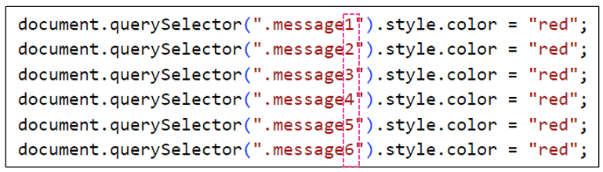</center>

La seule chose qui varie entre ces lignes de code est la **classe** des éléments HTML.

On pourrait rendre le code moins répétitif avec une **fonction avec paramètre**, mais il faudrait quand même
appeler la fonction **6 fois** !

## ➰ Boucles while

Les boucles permettent de **répéter** du code !

Syntaxe :

```js showLineNumbers
while( ... condition ... ){

    // Code à répéter

}
```

C'est un peu comme un `if`, sauf que le code à l'intérieur de la boucle va **s'exécuter à répétition tant que la condition reste `true`**.

<center>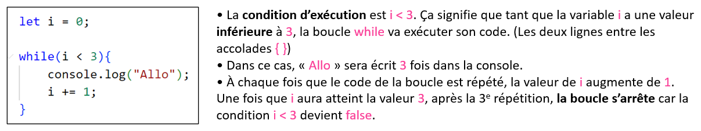</center>

<hr/>

#### Exemple pas-à-pas

<center>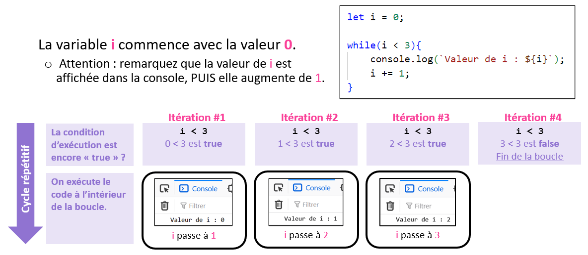</center>

### 💡 Quelques exemples

#### Exemple 1

Cette boucle fera **9 itérations**. (9 répétitions) On se sert de la variable `i` pour ajouter du **contenu textuel** :

<center>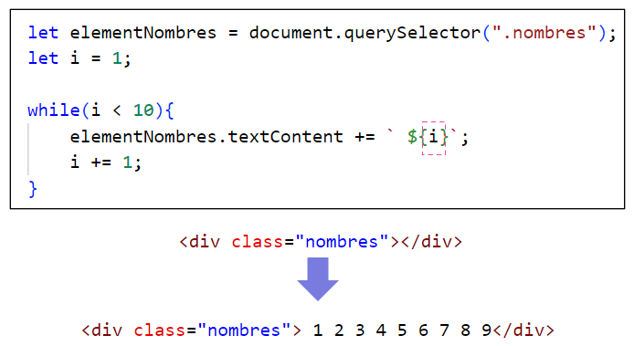</center>

#### Exemple 2

Cette boucle fera **4 itérations**. À chaque itération, on incrémente la variable `valeur` avec la valeur de `i`.

<center>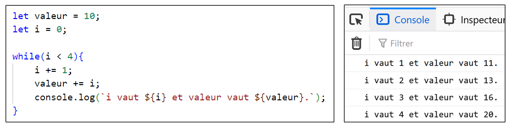</center>

La valeur finale est : `10 + 1 + 2 + 3 + 4`, donc `20`.

#### Exemple 3

Cette boucle fera **3 itérations**. À chaque itération, la classe `image` est ajoutée à un élément HTML.

<center>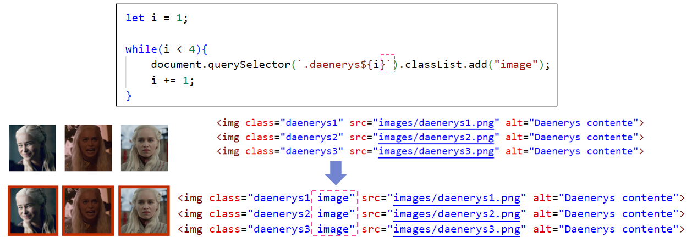</center>

### 🔨 Construire une boucle

Commencez par analyser du **code répétitif** pour **trouver les différences**.

<center>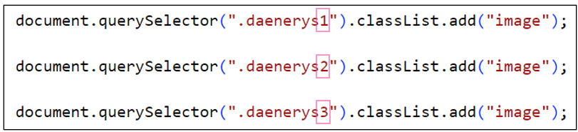</center>

La seule chose qui varie dans ces 3 lignes de code, c'est le **numéro** à la fin de la **classe**.

On a besoin d'une boucle où la variable `i` vaudra `1`, puis `2`, puis `3`.

Squelette de la boucle :

<center>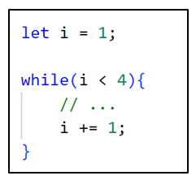</center>

* `i` commencera à `1`. (Grâce à `let i = 1;`)
* `i` va augmenter de `1` à chaque itération. (Grâce à `i += 1;`)
* `i` va s'arrêter à `3`. (Grâce à `i < 4`)

Il reste à intégrer le code et se servir de la variable `i` :

<center>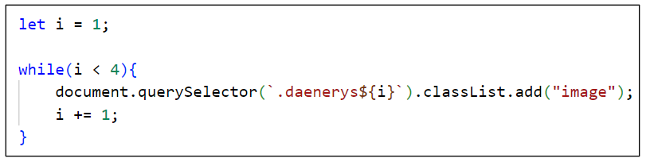</center>

<hr/>

En résumé :

<center>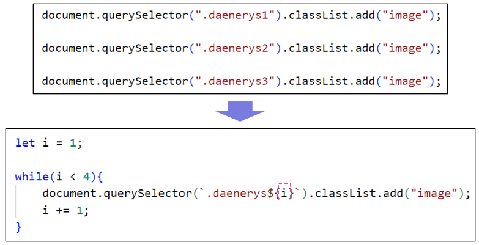</center>

:::tip

S'il y avait eu 3 images supplémentaires avec les classes `daenerys4`, `daenerys5` et `daenerys6`, il suffirait de remplacer la condition de la boucle par `i < 7`, tout simplement !

:::

### 🌌 Boucles infinies

:::danger

⛔ Attention ! Les boucles peuvent **figer la page Web** si elles s'exécutent à l'infini.

```js showLineNumbers
let i = 1;

while(i < 4){
    console.log("Oups ! Boucle infinie.");
}
```

Ici, on a oublié **d'incrémenter la valeur de `i`** dans la boucle, donc `i` vaudra toujours `1` et la condition `i < 4` sera **toujours `true`** !

:::

### 🧩 Exemples avancés

#### Exemple 1

On peut très bien intégrer des blocs `if` (et d'autres types de blocs) dans des boucles `while` :

<center>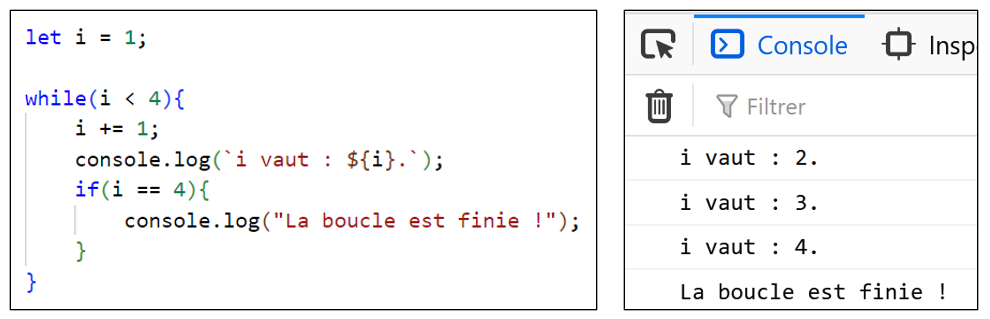</center>

#### Exemple 2

Les **conditions** de nos boucles peuvent être aussi sophistiquées que nécessaire :

<center>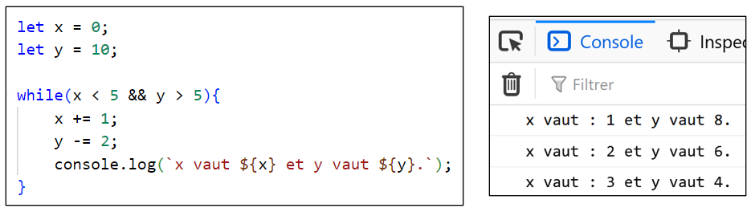</center>

* À chaque itération, `x` augmente de `1` et `y` diminue de `2`.
* À cause de la **condition**, dès que `x` atteindra `5` ou plus OU dès que `y` atteindra `5` ou moins, la boucle s’**arrêtera**.
* Comme `y` diminue plus rapidement que `x` augmente, la boucle s’arrête alors que `x` respecte encore la condition, mais `y` vaut `4` et ne respecte plus la condition.

## 🏁 Boucles do while

Syntaxe :

```js showLineNumbers
do{

    // Code à répéter

}while( ... condition ...);
```

* Très similaire à une boucle `while`, mais la **condition** est vérifiée **APRÈS chaque itération**. (Plutôt qu’avant) Cela signifie qu’il y aura forcément **au moins une itération**.
* Avec une boucle `while`, si la condition était `false` initialement, elle n’effectuerait tout simplement **aucune itération**.

<center>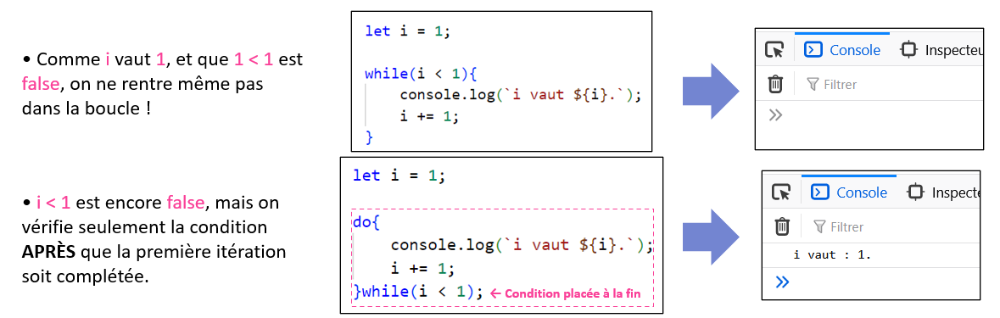</center>