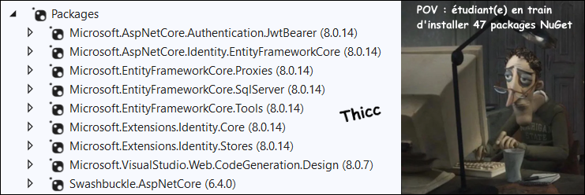
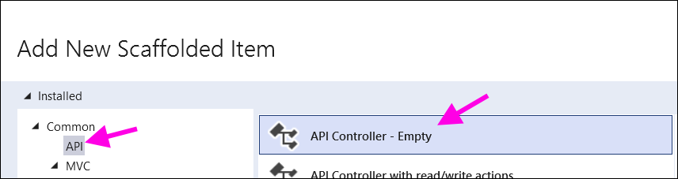
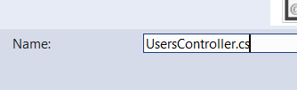
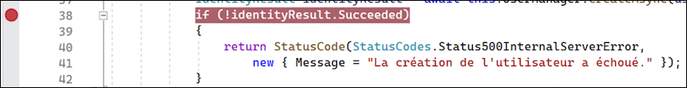
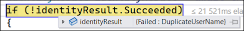

# Cours 16 - Gestion utilisateurs

## 📦 Packages nécessaires

Si vous souhaitez vous débarrasser maintenant de cette étape, voici tous les packages qui seront nécessaires pour nos projets à partir de maintenant. Pour rappel, un package NuGet **donne accès à des fonctionnalités supplémentaires** à notre projet. Notre projet utilisera des **classes** et des **méthodes** provenant de ces nombreux **packages**. Grâce à tous ces packages, on a beaucoup moins de fonctionnalités à coder nous-mêmes.

<center></center>

**Résumé des packages installés** :

* Simplifier les interactions avec la base de données SqlServer : `EntityFrameworkCore.SqlServer` et `EntityFrameworkCore.Tools`.
* Mitiger le comportement du **Lazy Loading** : `EntityFrameworkCore.Proxies`.
* Simplifier la gestion d'utilisateurs : `Identity.EntityFrameworkCore`, `Identity.Core` et `Identity.Stores`.
* Simplifier la gestion de l'authentification : `Authentication.JwtBearer`.
* Simplifier la génération de contrôleurs : `CodeGeneration.Design`.
* Visualisation des requêtes : `Swashbuckle.AspNetCore`.

:::warning

⛔ Installez la dernière version **8.X.X** pour ces packages. (Sauf pour `Swashbuckle`) Ne vous fiez pas seulement à la capture d'écran fournie !

:::

## 👤 Configuration d'`Identity`

Il y aura beaucoup de code **boilerplate** à rédiger pour configurer `Identity` et rendre notre gestion des utilisateurs fonctionnelle. De votre côté, assurez-vous de suivre les prochaines étapes ⛔⛔⛔ **ultra-méga-giga-turbo-bingo-bango attentivement**, car même s'il y a beaucoup de _copié-collé_, il y a certains morceaux qui seront différents d'un projet à l'autre.

<center></center>

### 💋 Étapes préliminaires

**1 - 📰 Se référer au cours 15**

Tout d'abord, répétez toutes les étapes de création d'un projet telles qu'abordées dans le [cours 15](/cours/rencontre8.1).

Arrêtez-vous juste avant la création d'un **modèle**.

**2 - ⚱ Préparer un modèle lié à l'application**

Si votre projet actuel ne contient aucun modèle, commencez par en créer un. (n'importe lequel)

**3 - ⚙ Générer un premier contrôleur**

Si votre projet actuel ne contenait aucun contrôleur, générez un contrôleur à partir d'un modèle pour que le `DbContext` soit généré simultanément.

**4 - 🚮 Supprimer les migrations et la base de données**

Si vous aviez déjà des migrations et / ou une base de données, supprimez-les pour éviter les conflits.

### 📜 Étapes pour configurer Identity

**5 - 📦 Installer les packages**

Si ce n'est pas déjà fait, installez tous les packages indiqués au début de ce cours.

<center></center>

:::warning

⛔ Installez la dernière version **8.X.X** pour ces packages. (Sauf pour `Swashbuckle`) Ne vous fiez pas seulement à la capture d'écran fournie !

:::

**6 - 👤 Classe `User`**

Parmi vos modèles, ajoutez une classe `User` (ou `Utilisateur`) :

```cs showLineNumbers
using Microsoft.AspNetCore.Identity;

namespace serveur16.Models
{
    public class User : IdentityUser
    {
    }
}
```

> La classe est vide ? 😵

Oui. Comme elle hérite de `IdentityUser`, qui elle hérite de `IdentityUser<TKey>`, notre classe `User` possède déjà des tonnes de propriétés héritées telles que `UserName`, `Email`, `Id`, `PhoneNumber`, `PasswordHash`, etc.

⛔ N'ajoutez donc PAS de propriétés génériques à votre classe `User`. Les seules propriétés qu'on pourrait ajouter seraient des propriétés **spécifiques à notre application**, comme des **propriétés de navigation** (relations) ou des propriétés inexistantes dans `IdentityUser` comme `FavoriteColor`, `PersonalScore`, `ShopPoints`, etc. 

**7 - 📚 Modifier le `DbContext`**

Notre `DbContext` doit hériter de `IdentityDbContext<T>`, où `<T>` est notre modèle qui représente les utilisateurs. Pas besoin d'ajouter un `DbSet` pour les utilisateurs puisque la classe parente `IdentityDbContext<T>` contient déjà ce `DbSet`, dont notre `DbContext` héritera.

```cs showLineNumbers
public class serveur16Context : IdentityDbContext<User>
{
    public serveur16Context (DbContextOptions<serveur16Context> options) : base(options) {}

    ...
}
```

**8 - ⚙ Modifier `Program.cs`**

Assurez-vous que le début de votre fichier `Program.cs` ressemble à ceci :

⛔ **L'ordre est important**.

```cs showLineNumbers
var builder = WebApplication.CreateBuilder(args);

builder.Services.AddDbContext<serveur16Context>(options =>
{
    options.UseSqlServer(builder.Configuration.GetConnectionString("serveur16Context") ?? throw new InvalidOperationException("Connection string 'serveur16Context' not found."));
    options.UseLazyLoadingProxies(); // Ceci
});

builder.Services.AddIdentity<User, IdentityRole>().AddEntityFrameworkStores<serveur16Context>(); // Et ceci
```

On remarque surtout deux ajouts importants :

* La ligne `options.UseLazyLoadingProxies();`, qui nous a obligé à transformer la fonction `.AddDbContext<>(...)` en **bloc**.
* La ligne `builder.Services.AddIdentity...`.


Plus bas, ajoutez la ligne de code `app.UseAuthentication()`, à cet endroit :

⛔ **L'ordre est important**.

```cs
app.UseHttpsRedirection();

app.UseAuthentication(); // Ici !

app.UseAuthorization();
```

**9 - 👤 Créer un `UsersController`**

Créez un **contrôleur d'API vide** pour les utilisateurs :

<center></center>

<center></center>

Vous aurez à **injecter** la classe `UserManager<T>`, où `T` est votre modèle qui représente les utilisateurs.

```cs showLineNumbers
[Route("api/[controller]/[action]")] // Utilisez cette règle de routage globale !
[ApiController]
public class UsersController : ControllerBase
{
    private readonly UserManager<User> _userManager;

    public UsersController(UserManager<User> userManager)
    {
        _userManager = userManager;
    }
}
```

La classe `UserManager` fait office de « UserService » et nous aidera à interagir avec le `DbSet<User>` sans qu'on ait à manipuler nous-mêmes notre `DbContext`. Notez que **nous n'aurons donc jamais à créer un `UserService`**.


## 👶 Inscription

**1 - 📬 Création d'un DTO**

(Les DTOs ont été abordés dans le [cours 15](/cours/rencontre8.1))

Créez un DTO qui sera utilisé pour recevoir des données lors de l'inscription :

```cs showLineNumbers
    public class RegisterDTO
    {
        public string Username { get; set; } = null!;
        public string Email { get; set; } = null!;
        public string Password { get; set; } = null!;
        public string PasswordConfirm { get; set; } = null!;
    }
```

:::tip

Sachez que par défaut, les **mots de passe** avec **Identity** doivent respecter les conditions suivantes : 

⛔ 6+ caractères, 1+ majuscule(s), 1+ minuscule(s), 1+ chiffre(s) et 1+ symbole(s) non-alphanumérique(s).

Pour changer ces conditions, vous pouvez ajoutez le code ci-dessous dans `Program.cs` :

```cs
builder.Services.AddIdentity<User, IdentityRole>().AddEntityFrameworkStores<serveur16Context>();

// Ce bloc doit être ajouté en-dessous de la ligne builder.Service.AddIdentity... !
builder.Services.Configure<IdentityOptions>(options =>
{
    options.Password.RequireDigit = false;
    options.Password.RequiredLength = 5;
    options.Password.RequireLowercase = false;
    options.Password.RequireUppercase = false;
    options.Password.RequireNonAlphanumeric = false;
});
```

:::

**2 - 🐣 Action d'inscription**

```cs showLineNumbers
[HttpPost]
public async Task<ActionResult> Register(RegisterDTO register)
{
    // Si Password et PasswordConfirm sont diférérent, on retourne une erreur.
    if (register.Password != register.PasswordConfirm)
    {
        return StatusCode(StatusCodes.Status400BadRequest,
            new { Message = "Les deux mots de passe spécifiés sont différents." });
    }

    // On crée un nouvel utilisateur. Pour le moment on ne remplit que deux propriétés.
    User user = new User()
    {
        UserName = register.Username,
        Email = register.Email
    };

    // On tente d'ajouter l'utilisateur dans la base de données. Ça pourrait échouer si le mot de
    // passe ne respecte pas les conditions ou que le pseudonyme est déjà utilisé.
    IdentityResult identityResult = await this.UserManager.CreateAsync(user, register.Password);

    // Si la création a échoué, on retourne une erreur. N'hésitez pas à mettre un breakpoint ici
    // pour inspecter l'objet identityResult si vous avez du mal à créer des utilisateurs.
    if (!identityResult.Succeeded)
    {
        return StatusCode(StatusCodes.Status400BadRequest,
            new { Message = "La création de l'utilisateur a échoué." });
    }
    return Ok(new { Message = "Inscription réussie ! 🥳" });
}
```

**3 - 📶 Exemple de requête côté Angular**

⛔💿 Si vous n'avez pas généré les migrations et créé la base de données, c'est le bon moment.

⛔ Assurez-vous que les noms des propriétés du DTO **correspondent exactement** à celle du serveur. (À part la minuscule au début)

```ts showLineNumbers
async register(user : string, mail : string, pass : string, passCon : string) : Promise<void> {

    let registerDTO = {
        username : user, 
        email : mail, 
        password : pass, 
        passwordConfirm : passCon
    };

    let x = await lastValueFrom(this.http.post<any>(domain + "api/Users/Register", registerDTO));
    console.log(x);
    
}
```

Si ça ne fonctionne pas, ajoutez un **breakpoint** sur le `if(!identityResult.Succeded)` et survolez la variable `identityResult` lors de l'exécution pour découvrir la nature de l'échec.

<center></center>

<center></center>

:::warning

Pour le moment, on peut **créer des utilisateurs**, mais pas se connecter. Lorsqu'on s'inscrit, on n'est pas automatiquement connecté.

:::

## 🔌 Connexion

Pour **authentifier** les utilisateurs (valider leur identité), nous allons utiliser des **JWT**. (Json Web Token)

:::danger

C'est généralement en réalisant la prochaine section **inattentivement** que les gens créent des problèmes difficiles à déboguer plus tard.
⛔ Soyez vigilant(e) ! Vérifiez les commentaires dans le code ! 😠

:::

**1 - 🔓 Déchiffrement du token**

Ajoutez ce bloc de code ⛔ après les lignes `builder.Services.AddDbContext...` et `builder.Services.AddIdentity...` dans le fichier `Program.cs` :

```cs showLineNumbers
builder.Services.AddAuthentication(options =>
{
    // Indiquer à ASP.NET Core que nous procéderons à l'authentification par le biais d'un JWT
    options.DefaultAuthenticateScheme = JwtBearerDefaults.AuthenticationScheme;
    options.DefaultChallengeScheme = JwtBearerDefaults.AuthenticationScheme;
    options.DefaultScheme = JwtBearerDefaults.AuthenticationScheme;
}).AddJwtBearer(options =>
{

    options.SaveToken = true; // Sauvegarder les tokens côté serveur pour pouvoir valider leur authenticité
    options.RequireHttpsMetadata = false; // Lors du développement on peut laisser à false
    options.TokenValidationParameters = new TokenValidationParameters()
    {
        ValidateAudience = true, ValidateIssuer = true,
        ValidAudience = "http://localhost:4200", // Audience : Client
        ValidIssuer = "https://localhost:6969", // ⛔ Issuer : Serveur -> HTTPS VÉRIFIEZ le PORT de votre serveur dans launchsettings.json !
        IssuerSigningKey = new SymmetricSecurityKey(Encoding.UTF8
            .GetBytes("LooOOongue Phrase SiNoN Ça ne Marchera PaAaAAAaAas !")) // Clé pour déchiffrer les tokens
    };
});
```

**2 - 📬 DTO pour la connexion**

Créez une nouvelle classe qui servira de DTO pour transférer les informations de connexion. Par exemple, ce DTO servirait pour un mode opératoire où le **nom d'utilisateur** et le **mot de passe** suffisent pour se connecter.

```cs showLineNumbers
public class LoginDTO
{
    public string Username { get; set; } = null!;
    public string Password { get; set; } = null!;
}
```

**3 - 🔌 Action de connexion**

En gros, elle enverra un **token** à l'utilisateur s'il a fournit un **nom d'utilisateur** et un **mot de passe** valides. Ce sera la responsabilité de l'application cliente (Angular) de stocker ce **token** quelque part pour pouvoir l'utiliser dans certaines requêtes.

:::danger

1. N'oubliez pas de vérifier le PORT du serveur (issuer) pour le token.
2. Assurez-vous que la clé de chiffrement soit identique à celle dans `Program.cs`.

:::

```cs showLineNumbers
[HttpPost]
public async Task<ActionResult> Login(LoginDTO login)
{
    // Tenter de trouver l'utilisateur dans la BD à partir de son pseudo
    User? user = await _userManager.FindByNameAsync(login.Username);

    // Si l'utilisateur existe ET que son mot de passe est exact
    if (user != null && await _userManager.CheckPasswordAsync(user, login.Password))
    {
        // Récupérer les rôles de l'utilisateur (Cours 22+)
        IList<string> roles = await _userManager.GetRolesAsync(user);
        List<Claim> authClaims = new List<Claim>();
        foreach (string role in roles)
        {
            authClaims.Add(new Claim(ClaimTypes.Role, role));
        }
        authClaims.Add(new Claim(ClaimTypes.NameIdentifier, user.Id));

        // Générer et chiffrer le token 
        SymmetricSecurityKey key = new SymmetricSecurityKey(Encoding.UTF8
            .GetBytes("LooOOongue Phrase SiNoN Ça ne Marchera PaAaAAAaAas !")); // Phrase identique dans Program.cs
        JwtSecurityToken token = new JwtSecurityToken(
            issuer: "https://localhost:6969", // ⛔ Vérifiez le PORT de votre serveur dans launchSettings.json !
            audience: "http://localhost:4200",
            claims: authClaims, 
            expires: DateTime.Now.AddMinutes(30), // Durée de validité du token
            signingCredentials: new SigningCredentials(key, SecurityAlgorithms.HmacSha256Signature)
            );

        // Envoyer le token à l'application cliente sous forme d'objet JSON
        return Ok(new
        {
            token = new JwtSecurityTokenHandler().WriteToken(token),
            validTo = token.ValidTo
        });
    }
    // Utilisateur inexistant ou mot de passe incorrecte
    else
    {
        return StatusCode(StatusCodes.Status400BadRequest,
            new { Message = "Le nom d'utilisateur ou le mot de passe est invalide." });
    }
}
```

**4 - 📶 Exemple de requête côté Angular**

⛔ Assurez-vous que les noms des propriétés du DTO **correspondent exactement** à celle du serveur. (À part la minuscule au début)

```ts ShowLineNumbers
async login(user : string, pass : string) : Promise<void>{

    let loginDTO =  {
        username : user,
        password : pass
    };

    let x = await lastValueFrom(this.http.post<any>(domain + "api/Users/Login", loginDTO));
    console.log(x);

    // 🔑 Très important de stocker le token quelque part pour pouvoir l'utiliser dans les futures requêtes !
    localStorage.setItem("token", x.token);
}
```

## ⚡ Déconnexion

Il suffit de détruire le **token** :

```ts showLineNumbers
logout(){
    localStorage.removeItem("token");
}

```

Dans la _vraie vie_, pour rendre la déconnexion plus 🔒 sécuritaire, il faudrait également invalider le token **côté serveur**. Par souci de simplicité, nous ne gérerons pas cela.

## 🤝 Profiter de l'authentification

### 🔒 Action réservée aux utilisateurs

Pour qu'une **action** du serveur soit **réservée aux utilisateurs authentifiés**, il suffit d'ajouter `[Authorize]` au-dessus :

```cs showLineNumbers
[HttpPost]
[Authorize]
public async Task<ActionResult<Comment>> PostComment(Comment comment)
{
    ...
```

:::tip

Alternativement, on peut mettre `[Authorize]` **tout en haut d'un contrôleur** pour que **toutes** ses actions nécessitent l'authentification :

```cs showLineNumbers
[Route("api/[controller]/[action]")]
[ApiController]
[Authorize]
public class CommentsController : ControllerBase
{
    ...
```

Si jamais une des actions de ce contrôleur fait exception et doit être utilisable par les visiteurs non authentifiés, on pourra ajouter `[AllowAnonymous]` au-dessus de l'action en question :

```cs showLineNumbers
[HttpGet]
[AllowAnonymous]
public async Task<ActionResult<IEnumerable<Comment>>> GetComment()
{
    ...
```

:::

### 🔒 Exemple de requête utilisant le token

```ts showLineNumbers
async postComment(text : string) : Promise<void>{

    let token = localStorage.getItem("token");
    let httpOptions = {
        headers : new HttpHeaders({
        'Content-Type' : 'application/json',
        'Authorization' : 'Bearer ' + token
        })
    };

    let newComment = new Comment(0, text, 0, 0);

    // Remarquez que le token a été join en 3e paramètre dans la requête POST
    let x = await lastValueFrom(this.http.post<Comment>(domain + "api/Comments/PostComment", newComment, httpOptions));
    console.log(x);
}
```

:::info

Pour des requêtes `Get` et `Delete`, le token est joint en **2e paramètre**. Pour des requêtes `Post` et `Put`, le token est joint en **3e paramètre** puisque le **body** occupe la place du 2e paramètre.

:::

### 🕵️‍♂️ Déterminer qui envoie la requête

Grâce au token, cette ligne de code suffit pour déterminer quel utilisateur authentifié envoie la requête :

```cs showLineNumbers
[HttpPost]
[Authorize]
public async Task<ActionResult<Comment>> PostComment(Comment comment)
{
    // Trouver l'utilisateur via son token
    User? user = await _userManager.FindByIdAsync(User.FindFirstValue(CLaimTypes.NameIdentifier));

    if(user == null){
        return Unauthorized();
    }

    ...
```

Déterminer **qui envoie la requête** peut être très utile pour `Post` des objets qui possèdent une relation avec un utilisateur (Si une propriété de navigation existe entre les deux classes) :

```cs
User? user = await _userManager.FindByIdAsync(User.FindFirstValue(CLaimTypes.NameIdentifier));

if(user != null)
{
    // On remplit la propriété de navigation
    comment.User = user;

    _context.Comment.Add(comment);
    await _context.SaveChangesAsync();
}
```

Ou encore pour retourner un ou des objets qui **appartiennent à l'utilisateur** (Si une propriété de navigation existe entre les deux classes) :

```cs showLineNumbers
[HttpGet]
[Authorize]
public async Task<ActionResult<IEnumerable<Comment>>> GetMyComments()
{
    User? user = await _userManager.FindByIdAsync(User.FindFirstValue(CLaimTypes.NameIdentifier));

    if (user == null) return Unauthorized();

    return user.Comments;
}
```

## 🛑 Intercepteurs

À force d'implémenter des requêtes qui nécessitent d'y joindre le **token** dans Angular ...

```ts showLineNumbers
// Avec un bloc comme celui-ci
let token = localStorage.getItem("token");
let httpOptions = {
    headers : new HttpHeaders({
    'Content-Type' : 'application/json',
    'Authorization' : 'Bearer ' + token
    })
};
```

on répète souvent le même morceau de code.

La solution est d'**utiliser un interceptor**.

### 🥚 Créer un interceptor

Utilisez la commande suivante pour créer un interceptor dans votre projet Angular :

`ng generate interceptor nomDeVotreInterceptor`

Un interceptor ressemblera à ceci initialement :

```ts showLineNumbers
export const authInterceptor : HttpInterceptorFn : (req, next) => {
    return next(req);
};
```

> Que fait ce code ?

Rien ! À chaque fois qu'une requête est envoyée avec un `HttpClient`, elle est interceptée... mais sans être modifiée.

Voici un exemple d'interceptor personnalisé :

```ts showLineNumbers
export const authInterceptor : HttpInterceptorFn : (req, next) => {
    console.log("Trois tortues trotaient sur un trottoir 🐢🐢🐢");
    return next(req);
};
```

Désormais, à chaque fois qu'une requête sera envoyée avec `HttpClient`, ce message apparaîtra dans la console du navigateur.

### 🔑 Intercepteur pour l'authentification

Cet interceptor permettra de **joindre le token à la requête** systématiquement. On peut donc retirer le bloc répétitif avec `httpOptions` partout ailleurs dans le code !

```ts showLineNumbers
export const authInterceptor : HttpInterceptorFn : (req, next) => {

    req = req.clone({
        setHeaders:{
            "Content-Type" : "application/json",
            "Authorization" : "Bearer " + localStorage.getItem("token") // changez la clé si vous avez stocké le token ailleurs
        }
    });

    return next(req);
};
```

* Le paramètre `req` représente l'objet de la requête. (Son URL, ses en-têtes, son corps, etc.)
* La fonction `clone()` permet de modifier cet objet.
* La fonction `next()` permet d'envoyer la requête une fois modifiée.

:::note

Si une requête **ne nécessite pas l'authentification** et qu'on joint quand même le **token** (ou encore aucun token) automatiquement à cause de l'interceptor, est-ce que ça pose problème ? **Non !** Aucun soucis. Pas besoin de se mettre à trier les différentes requêtes dans l'interceptor.

:::