# Cours 17 - Tableaux

Parfois, on doit stocker plusieurs **données similaires**.

Exemple : stocker le nom et l'âge de 7 étudiant(e)s

<center>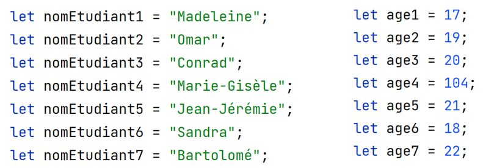</center>

⛔ Problème : ça fait beaucoup de variables, et elles sont toutes similaires.

## 🎰 Tableaux

### 🥚 Créer un tableau

Les **tableaux** permettent de ranger des données similaires.

Syntaxe pour créer un tableau :

<center>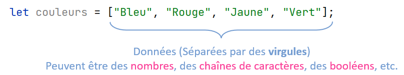</center>

D'autres exemples :

```js showLineNumbers
let nomsEtudiants = ["Madeleine", "Omar", "Conrad", "Marie-Gisèle", "Jean-Jérémie", "Sandra", "Bartolomé"];
let ages = [17, 19, 20, 104, 21, 18, 22];
```

### 📬 Accéder aux données d'un tableau

Syntaxe :

<center>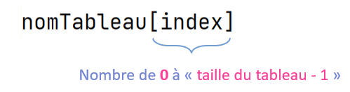</center>

Exemple :

```js
let couleurs = ["Bleu", "Rouge", "Jaune", "Vert", "Violet"];
```

* Accéder à la donnée `"Bleu"` et la ranger dans une variable : 
```js
let a = couleurs[0]; // a contient "Bleu"
```
* Accéder à la donnée `"Violet"` :
```js
couleurs[4]
```

<center>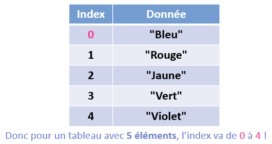</center>

### 📝 Modifier les données d'un tableau

Syntaxe :

```js
nomTableau[index] = nouvelle_valeur;
```

Exemple :

```js
let personnages = ["Mario", "Luigi", "Peach", "Bernard"];
```

Disons qu'on veut remplacer la donnée `"Bernard"` par `"Yoshi"` :

```js
personnages[3] = "Yoshi";
```

Résultat :

<center>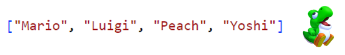</center>

### 🐍 Obtenir la taille d'un tableau

La **taille** d'un tableau correspond au **nombre de données** qu'il contient.

Syntaxe : 

```js
nomTableau.length
```

Exemples :

```js showLineNumbers
let ages = [17, 19, 20, 104, 21, 18, 22];

let longueur = ages.length; // longueur contient 7

let message = `Le tableau ages contient ${ages.length} éléments.`;
// "Le tableau ages contient 7 éléments."
```

:::tip

`length` permet également d'accéder facilement **à la dernière valeur d'un tableau**. Comme l'**index** d'un tableau **commence à `0`** et que le tableau contient **`length` éléments**, cela signifie que le **dernier index** est `length - 1` :

```js
let derniereValeur = ages[ages.length - 1];
// derniereValeur contient 22
```

:::

### 🧰 Utiliser les données d'un tableau

#### Exemple 1

```js showLineNumbers
let prix = [4.5, 3.99, 7.2, 8.4];
let quantites = [2, 3, 4, 3];

let valeurTotaleArticle1 = prix[0] * quantites[0];
//       ↑ contient 4.5 * 2, donc 9
```

#### Exemple 2

```js showLineNumbers
let couleurs = ["Bleu", "Rouge", "Violet", "Rose"];
let elementMessage = document.querySelector(".message");

elementMessage.textContent = `Mes couleurs préférées sont ${couleurs[0]} et ${couleurs[2]}`;
// "Mes couleurs préférées sont Bleu et Violet"
```

### 💧 Ajouter un élément à la fin d'un tableau

Syntaxe :

```js
monTableau.push( ... valeur ... );
```

Exemple :

```js
let couleurs = ["Bleu", "Rouge", "Jaune", "Vert"];

couleurs.push("Violet");
// couleurs vaut ["Bleu", "Rouge", "Jaune", "Vert", "Violet"]
// couleurs.length vaut maintenant 5
```

<center>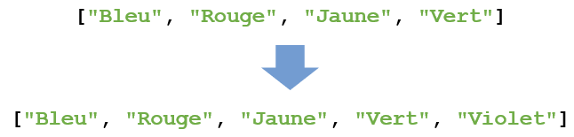</center>

### ❌ Retirer le dernier élément d'un tableau

Syntaxe :

```js
monTableau.pop();
```

Exemple :

```js
let notes = [68, 71 93, 78];

notes.pop();
// contient maintenant [68, 71, 93]
```

<center>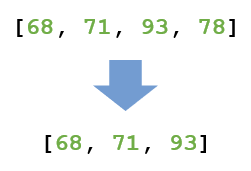</center>

### 🚮 Retirer un ou plusieurs éléments consécutifs n'importe où dans un tableau

Syntaxe :

<center>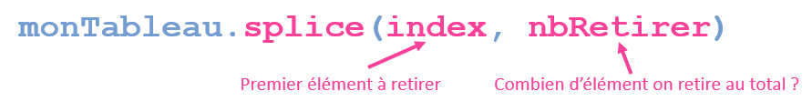</center>

Exemple :

```js
let couleurs = ["Bleu", "Rouge", "Jaune", "Vert", "Orange", "Violet"];

couleurs.splice(0, 2);
// couleurs contient maintenant ["Jaune", "Vert", "Orange", "Violet"]
```

L'élément à **l'index `0`** est le premier à être retiré et est inclus dans le nombre total d'éléments à retirer.

Autre exemple :

```js
let couleurs = ["Bleu", "Rouge", "Jaune", "Vert", "Orange", "Violet"];

couleurs.splice(2,1);
// couleurs contient maintenant ["Bleu", "Rouge", "Vert", "Orange", "Violet"]
```

`"Jaune"` était à l'index `2` et seulement 1 élément a été retiré.

## ➰ Parcourir un tableau

Tentons de calculer la **somme de tous les éléments** d'un tableau :

<center>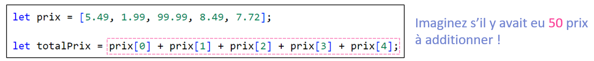</center>

Bonne nouvelle : les **boucles** et les **tableaux** sont **meilleurs amis** 🧽⭐

<center>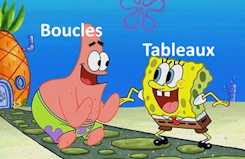</center>

Les boucles sont **très utiles pour accéder à tous les éléments d'un tableau séquentiellement**.

### 🔨 Construire une boucle pour parcourir un tableau

Dans de nombreuses situations, il faut **parcourir un tableau en entier** :

* Afficher tous les éléments
* Calculer la somme ou la moyenne de plusieurs nombres
* Trouver le maximum ou le minimum parmi plusieurs nombres
* Trier les éléments d'un tableau en ordre croissant ou décroissant
* etc.

Une **boucle** servant à **parcourir un tableau** ressemblera à ceci :

<center>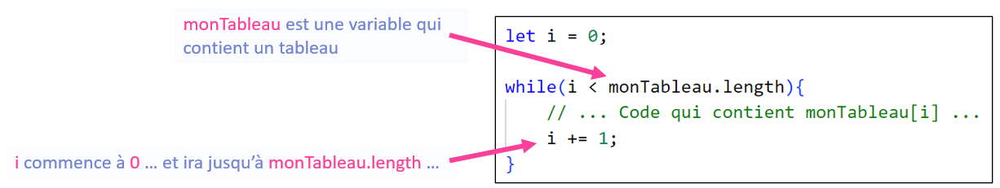</center>

* `monTableau` est le nom de votre variable qui contient un tableau.
* L'objectif est de parcourir `monTableau[0]`, `monTableau[1]`, `monTableau[2]`, etc. jusqu'à la fin du tableau.

On aura toujours besoin d'une variable `i` qui commence à `0` (au début du tableau) et  qui se rend jusqu'à `length - 1`, qui correspond à la **fin du tableau**.

Par exemple, avec ce tableau :

```js
let lettres = ["a", "b", "c"];
```

On aura besoin d'une boucle qui parcourir les index `0`, puis `1`, puis `2`. 

C'est à dire qui parcourt tous les index, de `0` à `lettres.length - 1`.

### 🎲 Quelques exemples

#### Exemple 1 : Tout afficher

Afficher toutes les données d'un tableau dans la **console**.

💡 Il faut s'assurer, à chaque itération, d'afficher la valeur de `monTableau[i]` dans la **console**.

<center>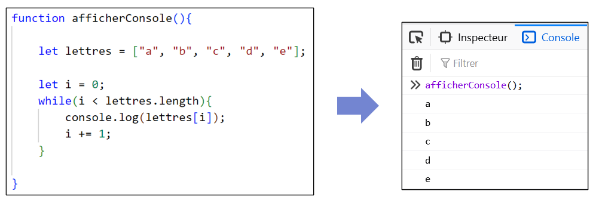</center>

:::info

Pourquoi on met `i < lettres.length` plutôt que `i < 5` ? Car `lettres.length` vaut `5` ! Pas besoin de compter les **index** du tableau manuellement.

:::

<hr/>

#### Exemple 2 : Calculer la somme

Calculer la **somme** des éléments d'un tableau.

💡 Nous aurons besoin d'une variable `total` pour stocker la **somme**. Sa valeur initiale sera `0`.

<center>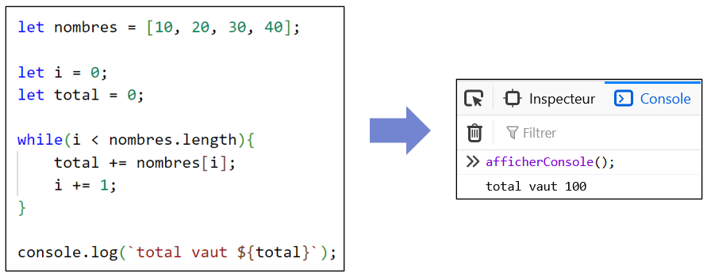</center>

La boucle fera **4 itérations** et la variable `total` accumulera les valeurs `0 + 10 + 20 + 30 + 40`.

<center>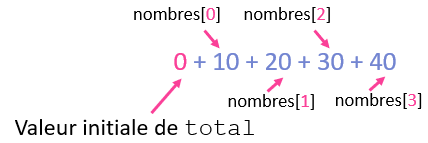</center>

<hr/>

#### Exemple 3 : Trouver une valeur

Chercher le mot `"chat"` dans un tableau et afficher un message dans la **console** s'il y a lieu.

<center>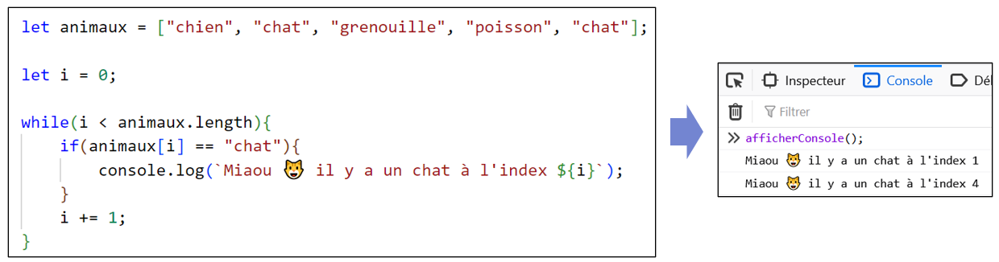</center>

<hr/>

#### Exemple 4 : Augmenter toutes les valeurs

**Augmenter de 5** toutes les valeurs dans le tableau.

<center>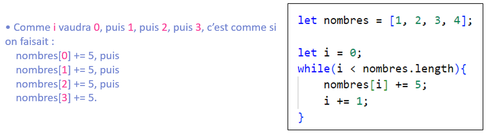</center>

Résultat :

<center>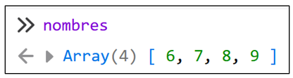</center>