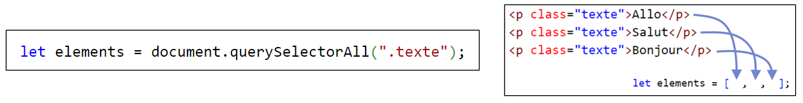
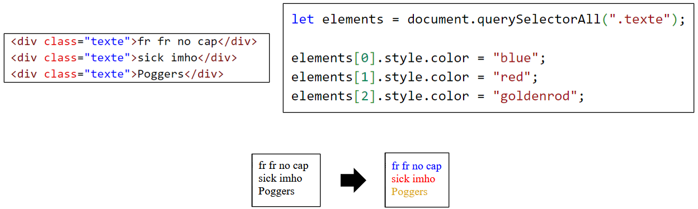
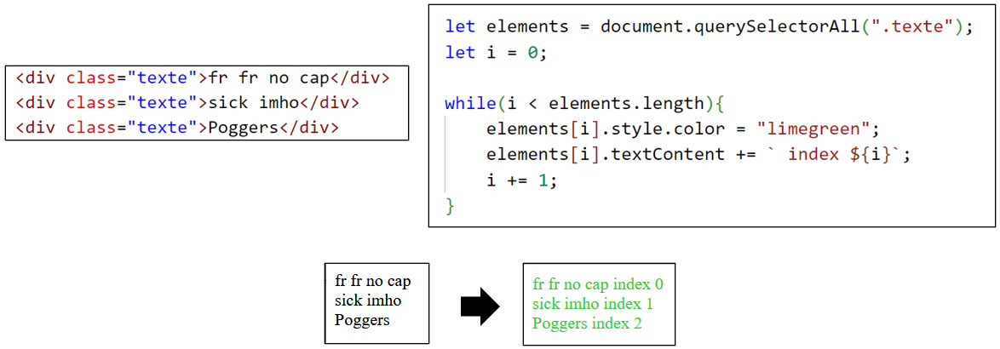
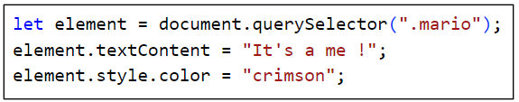
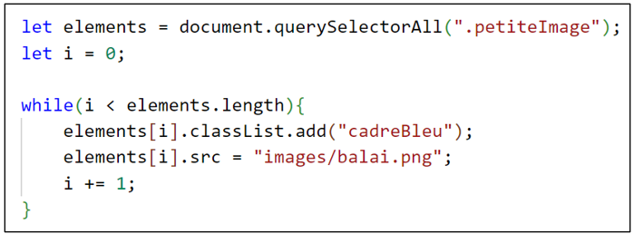

# Cours 18 - Tableaux d'éléments HTML

:::info

Rappel : on peut stocker un élément HTML dans une variable pour simplifier sa manipulation par la suite !

```js showLineNumbers
let elementMario = document.querySelector(".mario");

elementMario.style.borderColor = "red";
elementMario.textContent = "Mario brosse 🍷";
elementMario.title = "Plombier italien";
elementMario.style.color = "crimson";
elementMario.classList.add("peach"); // 🍑
```

<center></center>

:::

## 🎰 document.querySelectorAll

Disons qu'on souhaite modifier plusieurs éléments **avec la même classe**;;

```html
<p class="texte">Allo</p>
<p class="texte">Salut</p>
<p class="texte">Bonjour</p>
```

Solution : Ranger tous les éléments **avec la même classe** dans un **tableau** à l'aide de ...

```js
let elements = document.querySelectorAll(".classe");
```

<center></center>

<hr/>

Une fois qu'on a notre **tableau d'éléments**, on peut les modifier en utilisant leur **index** :

<center></center>

<hr/>

On peut aussi utiliser une **boucle** qui modifie les éléments de l'index `0` jusqu'à `tableau.length` :

<center></center>

:::warning

Il faut bien comprendre la différence entre `querySelector()` et `querySelectorAll()` !

* `querySelector()` permet d'obtenir **un seul élément**. (Le **premier** dans la page Web avec la classe demandée)

<center></center>

* `querySelectorAll()` permet d'obtenir un **tableau de plusieurs éléments** qui partagent tous la classe demandée.

<center></center>

:::