# Cours 19 - Planificateurs et événements clavier

## ⏳ Planificateurs

Les **planificateurs** permettent d'**appeler des fonctions** ... avec un **délai**.

### ⌚ setTimeout

`setTimeout` permet d'appeler une fonction **une seule fois**, dans **X millisecondes**.

Syntaxe :

```js
setTimeout(maFonction, tempsEnMillisecondes);
```

Exemple : ceci appelera la fonction `afficherNom()` dans `3000` millisecondes. (C'est-à-dire 3 secondes)

```js
setTimeout(afficherNom, 3000);
```

Autre exemple : afficher puis cacher une image.

<center>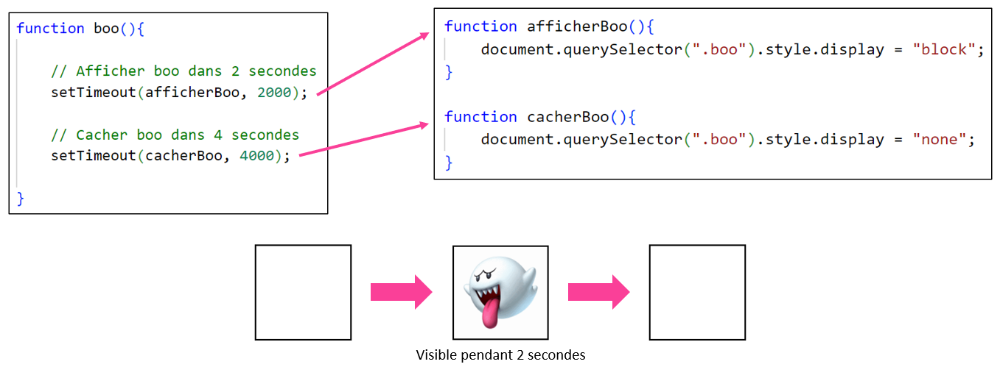</center>

### ➰ setInterval

`setInterval` permet d'appeler une fonction **à répétition**, toutes les **X millisecondes**.

Syntaxe :

```js
setInterval(maFonction, tempsEnMillisecondes);
```

Exemple : ceci appelera la fonction `afficherAlerte()` toutes les `3000` millisecondes. (Toutes les 3 secondes, donc)

```js
setInterval(afficherAlerte, 3000);
```

Autre exemple : afficher puis cacher une image à répétition.

<center>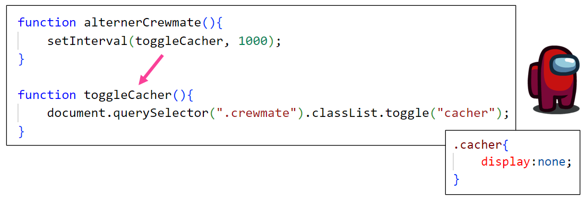</center>

### 🛑 Mettre fin à un intervalle

Il existe une fonction pour **arrêter un planificateur à intervalles** !

Syntaxe :

```js
clearInterval(variable_qui_contient_un_planificateur_a_intervalles);
```

Voici les deux étapes à suivre pour utiliser `clearInterval()` correctement :

1. Au moment d'utiliser `setInterval()`, on doit « stocker le planificateur à intervalles » dans une **variable globale** :

<center>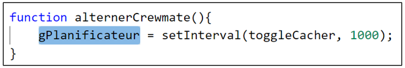</center>

2. Lorsqu'on souhaite **arrêter le planificateur**, on utilise `clearInterval()` comme ceci :

<center>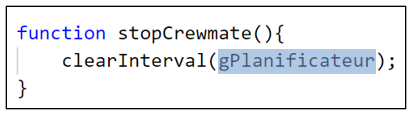</center>

## 🐛 Conversion en nombres

Les **chaînes de caractères** contiennet parfois des **nombres**.

Quelques exemples : `"2"`, `"1.5"`, `"25px"`, etc.

Si on tente de les additionner sous cette forme, bien entendu, ils se **concatènent** :

<center>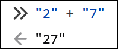</center>

Cela dit, on peut **convertir** une **chaîne de caractères** en **nombre** !

* On peut utiliser `parseInt( valeur )` pour convertir une **chaîne de caractères** en **nombre entier** :

<center>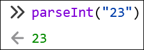</center>

* On peut utiliser `parseFloat( valeur )` pour convertir une **chaîne de caractères** en **nombre à virgule** :

<center>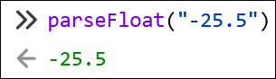</center>

Pour pouvoir additionner des nombres qui sont sous forme de **chaîne de caractères**, il faut donc commencer par les **convertir en nombre**.

Exemple : Additionner `"5"` et `"2.5"` :

<center>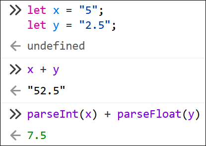</center>

:::tip

Notez que si la chaîne de caractères est également composée de **lettres** qui suivent le **nombre**, elles seront **ignorées** :

<center>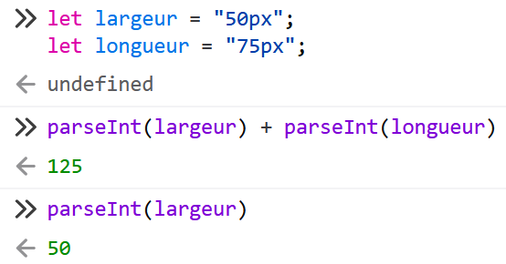</center>

:::

## 👇 Événements clavier

Il existe un **type** d'**écouteur d'événements** qui permet de détecter lorsque l'utilisateur **appuie sur une touche** du clavier.

### 🥚 Création de l'écouteur d'événements

Comme d'habitude, on crée l'**écouteur d'événements** dans la fonction `init()` :

```js showLineNumbers
function init(){

    // Écouteur d'événements clavier
    document.addEventListener("keydown", toucheClavier);

}
```

:::info

Remarquez que l'écouteur d'événements **n'est pas attaché à un élément HTML en particulier** ! Il est directement associé au « document », c'est-à-dire la page Web **en entier**.

:::

### 🔍 Déterminer la touche appuyée

Pour déterminer quelle **touche** a été appuyée par l'utilisateur lors d'un **événement clavier**, il faudra utiliser `event.key` dans la **fonction appelé par l'événement**.

Exemple :

```js showLineNumbers
function toucheClavier(event){

    // On obtient et stocke la touche appuyée dans la variable touche
    let touche = event.key;

}
```

⛔ Notez que l'ajout du paramètre `event` dans les parenthèses de la fonction est **obligatoire**.

Que contiendra la variable `touche` exactement ? Une **chaîne de caractères** qui varie selon la touche appuyée :

<center>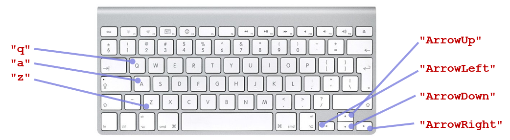</center>

### 📦 Exemple complet

Sachant qu'il est possible d'**appeler une fonction lorsqu'une touche est appuyée** et qu'on peut **déterminer quelle touche a été appuyée**, créons une fonction qui permet de **changer la couleur de fond d'un élément** selon la touche appuyée.

<center>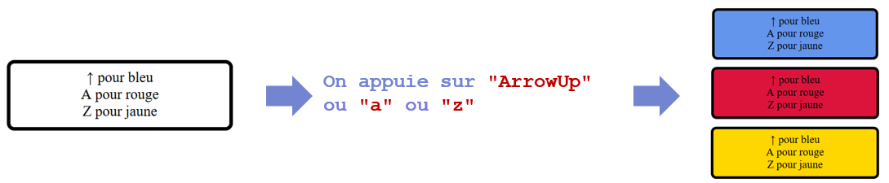</center>

**Étape 1** : Créer l'écouteur d'événement de type `keydown` qui appelera `changerCouleurFond()`.

```js showLineNumbers
function init(){

    document.addEventListener("keydown", changerCouleurFond);

}
```

**Étape 2** : Préparer la fonction `changerCouleurFond()` et **déterminer la touche appuyée**.

```js showLineNumbers
function changerCouleurFond(event){

    let touche = event.key;


}
```

**Étape 3** : Changer la couleur de fond selon la valeur de `touche`.

```js showLineNumbers
function changerCouleurFond(event){

    let touche = event.key;
    let element = document.querySelector(".bouton1");

    // Si on a appuyé sur ↑
    if(touche == "ArrowUp"){ 
        element.style.backgroundColor = "cornflowerblue";
    }

    // Si on a appuyé sur A
    if(touche == "a"){ 
        element.style.backgroundColor = "crimson";
    }

    // Si on a appuyé sur Z
    if(touche == "z"){ 
        element.style.backgroundColor = "gold";
    }

}
```

### 👞 Déplacer un élément dans la page

Disons qu'on a l'élément suivant dans la page :

<center>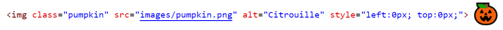</center>

On aimerait, lorsqu'on appuie sur la touche `"ArrowRight"`, déplacer l'image **vers la droite** dans la page.

<center>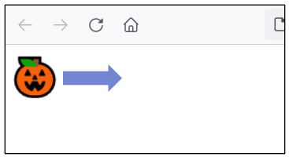</center>

#### 🔽🔼 Rappel : styles `left` et `top`

Les styles `left` et `top` permettent d'**espacer un élément** depuis la **gauche** et le **haut**.

* `left` : nombre de pixels d'espacement **à gauche** de l'élément. (Similaire à margin-left)
* `top` : nombre de pixels d'espacement **en haut** de l'élément. (Similaire à margin-top)

<center>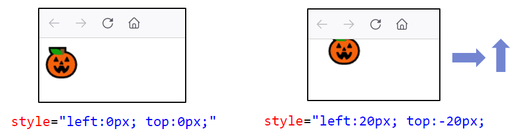</center>

#### 🚗 Déplacer un élément

Pour changer la valeur du style `left` ou `top`, c'est plutôt *délicat*. Voici les étapes à suivre :

```js showLineNumbers
// 1 - Ranger la valeur actuelle du style left dans une variable
let valeurLeft = document.querySelector(".pumpkin").style.left; // "0px"

// 2 - Se débarrasser de "px" et ne garder qu’une valeur numérique
valeurLeft = parseInt(valeurLeft); // "0px" devient -> 0

// 3 - Augmenter ou réduire la valeur numérique
valeurLeft += 5; // 0 devient -> 5

// 4 - Changer le style left de l'élément avec la nouvelle valeur sans oublier de remettre "px" après le nombre
document.querySelector(".pumpkin").style.left = `${valeurLeft}px`;
```

Bien entendu, pour modifier le style `top`, c'est **la même chose**. Il suffit de remplacer `left` partout par `top` !

:::tip

Si vous souhaitez utiliser une méthode **plus compacte**, il y a ceci :

```js showLineNumbers
let valeurLeft = document.querySelector(".pumpkin").style.left;
document.querySelector(".pumpkin").style.left = `${parseInt(valeurLeft) + 5}px`;
```

... Ou encore cela :

```js showLineNumbers
let element = document.querySelector(".pumpkin");
element.style.left = `${parseInt(element.style.left) + 5}px`;
```

:::

#### Exemple : élément qu'on peut déplacer vers le bas et vers le haut

```js showLineNumbers
function init(){

    document.addEventListener("keydown", deplacerCitrouille);

}

function deplacerCitrouille(event){

    let touche = event.key;
    let element = document.querySelector(".pumpkin");

    if(touche == "ArrowUp"){
        element.style.top = `${parseInt(element.style.top) - 5}px`;
    }
    if(touche == "ArrowDown"){
        element.style.top = `${parseInt(element.style.top) + 5}px`;
    }

}
```

:::info

Gardez à l'esprit, pour déplacer un élément ...

* Vers le **haut** : Réduire la valeur de `top`
* Vers le **bas** : Augmenter la valeur de `top`
* Vers la **gauche** : Réduire la valeur de `left`
* Vers la **droite** : Augmenter la valeur de `left`

:::