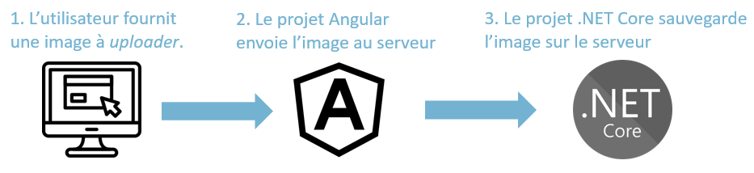
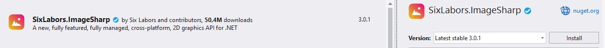
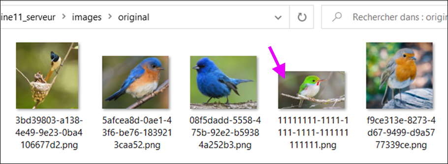
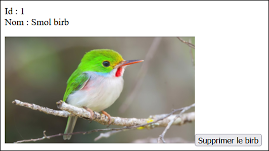

# Cours 20 - Serveur d'images

En résumé, nous allons voir comment ...

**Faire l'envoi d'une image du client au serveur :**

<center></center>

**Faire la demande au serveur pour afficher une image sur le client :**

<center></center>

## 👜 FormData

Un **FormData** est un objet qui peut contenir plusieurs données. Le **FormData** est très flexible : on peut mettre n'importe quelle quantité de donnée à l'intérieur, tant qu'on choisit une 🔑 **clé unique** pour chaque donnée.

**Côté client**, pour ajouter une donnée au **FormData** : `monFormData.append("clé", valeur);`

```ts showLineNumbers
async postSomething(){

    let formData = new FormData();

    formData.append("age", 20);
    formData.append("visibility", false);
    formData.append("name", "Yolande");

    let x = await lastValueFrom(this.http.post<any>(domain + "Examples/PostExample", formData));
    console.log(x);
}
```

**Côté serveur**, pour recevoir et récupérer les données du **FormData** :

```cs showLineNumbers
[HttpPost]
public async Task<ActionResult> PostExample(){

    // Récupération des données « brutes » sous  forme de string.
    string? ageString = Request.Form["age"];
    string? visibilityString = Request.Form["visibility"];
    string? name = Request.Form["name"];

    if(ageString == null || visibilityString == null || name == null) 
        return BadRequest(new { Message = "Il manque des morceaux !"});

    try{
        // Conversion des données en leur type initial au besoin
        bool visibility = bool.Parse(visibilityString);
        int age = int.Parse(ageString);

        // Faire quelque chose avec name, visibility et age maintenant qu'ils sont récupérés ...
    }
    catch(Exception e){
        if(e is FormatException){
            return BadRequest(new { Message = "Certaines données n'ont pas le bon type"});
        }
        else if(e is OverflowException){
            return BadRequest(new { Message = "Nombre fourni trop grand ou trop petit."});
        }
        else throw;
    }

}
```

## 📄 Envoyer un fichier au serveur

Toute la procédure ci-dessous se déroule **côté client**.

**Étape 1 - 👶 Préparer un ViewChild**

Un **ViewChild** est une **référence** vers un élément HTML identifié avec une **template reference variable**. Dans ce cas-ci, ça nous permettra d'accéder aux fichiers qui auront été joints à un `<input type="file">`.

L'élément HTML (Remarquez bien le `#myFileInput`, qui nous permettra d'accéder à l'élément avec un **ViewChild**) :

```html
<input #myFileInput type="file" name="image" accept="images/*">
```

:::warning

Chaque **template reference variable** doit être unique dans la page Web. Si on avait un deuxième `<input>` avec une **template reference variable**, il faudrait que ce soit, par exemple, `#myFileInput2`. (Ou n'importe quoi d'autre d'unique)

:::

Notez bien que le **ViewChild** fait référence à `"myFileInput"` (sans le #) ici :

```ts showLineNumbers
export class AppComponent{

    // Référence vers l'<input> dans la page Web
    @ViewChild("myFileInput", {static : false}) pictureInput ?: ElementRef;

    ...

}
```

**Étape 2 - 📂 Envoyer le ou les fichiers au serveur**

On utilise un **FormData**, dans lequel on glisse le ou les fichiers à envoyer au serveur. Il y a quelques manipulations à faire pour aller **récupérer le fichier dans l'`<input>` grâce au ViewChild**.

```ts showLineNumbers
async uploadPicture() : Promise<void>{

    // Il faut vérifier si l'<input> est actuellement visible dans la page !
    if(this.pictureInput == undefined){
        console.log("Input HTML non chargé.");
        return;
    }

    // On récupère le premier (ou le seul) fichier dans l'<input> !
    let file = this.pictureInput.nativeElement.files[0];

    if(file == null){
        console.log("Input HTML ne contient aucune image.");
        return;
    }

    // Préparation du FormData avec l'image
    let formData = new FormData();
    formData.append("monImage", file, file.name);

    // Envoi au serveur
    let x = await lastValueFrom(this.http.post<any>(domain + "Pictures/PostPicture", formData));
    console.log(x);

}
```

:::warning

Si un **token** est impliqué, il faut absolument retirer la ligne `"Content-Type" : "application/json"` de vos en-têtes de requêtes (que ce soit
dans un **interceptor** ou non) sinon **l'envoi de l'image échouera !**

:::

:::tip

N'hésitez pas à joindre **plusieurs fichiers** au **FormData** !

```ts showLineNumbers
let i = 1;
for(let f of this.pictureInput.nativeElement.files){
    // La clé sera "image1", puis "image2", etc.
    formData.append("image" + i, f, f.name);
    i++;
}
```

:::

## 💾 Sauvegarder une image sur le serveur

**Étape 1 - 📦 Préparer un modèle qui « contiendra » l'image**

Nous stockerons l'image **dans le File System**, mais il faut tout de même une **référence** à l'image dans la base de données. (Nom du fichier et son type)

```cs showLineNumbers
public class SimpleImage{
    
    public int Id { get; set; }

    // Deux seules propriétés nécessaires pour faire référence à une image
    public string FileName { get; set; } = null!;
    public string MimeType { get; set; } = null!;
}
```

* Le `FileName` sera un **Guid** suivi de l'extension. (Ex : `"11111111-1111-1111-1111-111111111111.png"`)
* Le `MimeType` sera le type du fichier. (Ex : `"image/png"`)

**Étape 2 - 📚 Installer une librairie pour la gestion des images**

Exemple : `SixLabors.ImageSharp`

Cela permettra, entre autres, de manipuler les dimensions d'une image. Choisissez la **dernière version stable**. Pas forcément `3.0.1` comme dans l'image.

<center></center>

**Étape 3 - ⚙ Réaliser l'action `Post`**

```cs showLineNumbers
[HttpPost]
public async Task<ActionResult<SimpleImage>> PostPicture()
{
    try
    {
        IFormCollection formCollection = await Request.ReadFormAsync();
        IFormFile? file = formCollection.Files.GetFile("monImage"); // ⛔ Même clé que dans le FormData 😠

        if (file == null) return BadRequest(new { Message = "Fournis une image, niochon" });

        Image image = Image.Load(file.OpenReadStream());

        SimpleImage si = new SimpleImage
        {
            Id = 0,
            FileName = Guid.NewGuid().ToString() + Path.GetExtension(file.FileName),
            MimeType = file.ContentType
        };

        // ⛔ Ce dossier (projet/images/big) DOIT déjà exister 📂 !! Créez-le d'abord !
        image.Save(Directory.GetCurrentDirectory() + "/images/big/" + si.FileName);

        // 🤏 Optionnel mais souhaitable : réduire la taille de l'image pour sauvegarder une
        // copie miniature. Remarquez qu'on a utilisé un sous-dossier différent ! 📂
        image.Mutate(i => i.Resize(
            new ResizeOptions() { Mode = ResizeMode.Min, Size = new Size() { Height = 200 }}));
        image.Save(Directory.GetCurrentDirectory() + "/images/smol/" + p.FileName);

        _context.SimpleImage.Add(si);
        await _context.SaveChangesAsync();

        // La seule chose dont le client pourrait avoir besoin, c'est l'id de l'image.
        // On aurait pu ne rien retourner aussi, selon les besoins du client Angular.
        return Ok(si.Id);
    }
    catch (Exception)
    {
        throw;
    }
}
```

:::info

En général, il est préférable de sauvegarder les images dans le **File System** plutôt que dans la **base de données**. Les raisons de cette décision sont déjà abordées dans le cours `4204D5`, mais en résumé, c'est pour des raisons de performance.

:::

:::tip

Sauvegarder une version **miniature** d'une image est très intéressant : lorsqu'on affiche une galerie d'images, on peut se contenter, initialement, d'afficher seulement les miniatures. Si jamais un utilisateur souhaite voir l'image originale, c'est à ce moment qu'on enverra une réponse HTTP un peu plus lourde avec la vraie image.

:::

## 🔍 Afficher une image sur le client

**Côté serveur**, on prépare une **action** qui retournera **le fichier** d'une image. ⛔ Assurez-vous que cette action **ne nécessite pas l'authentification**.

Le client Angular aurait seulement besoin de fournir la **taille** (si plusieurs choix existent) et surtout l'**id** de l'image.

```cs showLineNumbers
[HttpGet("{size}/{id}")]
public async Task<ActionResult<SimpleImage>> GetPicture(string size, int id)
{
    SimpleImage? si = await _context.SimpleImage.FindAsync(id);
    if (si == null) return NotFound();

    // Si la size fournit ne correspond pas à "big" OU "smol", erreur.
    if (!Regex.Match(size, "big|smol").Success) return BadRequest(new { Message = "La taille demandée n'existe pas."});

    // Récupération du fichier sur le disque
    byte[] bytes = System.IO.File.ReadAllBytes(Directory.GetCurrentDirectory() + "/images/" + size + "/" + si.FileName);
    return File(bytes, si.MimeType);
}
```

**Côté client**, une requête `Get` peut **directement être intégrée dans le HTML** (Pas besoin de `HttpClient` !) :

```html

```

:::info

Comme la requête est directement intégrée au HTML et que `HttpClient` n'a pas été utilisé, impossible de joindre un token à la requête et donc impossible d'appeler une action du serveur **qui nécessite l'authentification**. Une solution à ce potentiel problème est abordé plus bas.

:::

## 🚮 Supprimer une image du serveur

Lorsqu'on supprime l'image « de la base de données », ⛔ il ne faut absolument pas oublier de **supprimer le fichier du disque** également !

```cs showLineNumbers
[HttpDelete("{id}")]
public async Task<IActionResult> DeletePicture(int id)
{
    SimpleImage? si = await _context.SimpleImage.FindAsync(id);
    if (si == null) return NotFound(new { Message = "Aucune image trouvée avec cet id."});

    // Supprimer toutes les éventuelles tailles existantes du disque
    System.IO.File.Delete(Directory.GetCurrentDirectory() + "/images/big/" + si.FileName);
    System.IO.File.Delete(Directory.GetCurrentDirectory() + "/images/smol/" + si.FileName);
    
    _context.SimpleImage.Remove(si);
    await _context.SaveChangesAsync();

    return Ok();
}
```

## 🔒 Image avec authentification

Parfois, on souhaiter limiter l'accès aux images. (Que ce soit pour empêcher les utilisateurs non authentifiés ou encore certains utilisateurs qui n'ont pas les permissions sur une certaine image)

**Étape 1 - 🔐 Modifier l'action qui retourne une image**

Que ce soit en ajoutant `[Authorize]` ou en **vérifiant qui envoie la requête**, faites le nécessaire pour exiger l'authentification.

```cs showLineNumbers
[HttpGet("{size}/{id}")]
[Authorize] // 😩
public async Task<ActionResult<SimpleImage>> GetPicture(string size, int id)
{
    SimpleImage? si = await _context.SimpleImage.FindAsync(id);
    if (si == null) return NotFound();

    // Si la size fournit ne correspond pas à "big" OU "smol", erreur.
    if (!Regex.Match(size, "big|smol").Success) return BadRequest(new { Message = "La taille demandée n'existe pas."});

    // Récupération du fichier sur le disque
    byte[] bytes = System.IO.File.ReadAllBytes(Directory.GetCurrentDirectory() + "/images/" + size + "/" + si.FileName);
    return File(bytes, si.MimeType);
}
```

**Étape 2 - 🔑 Modifier le projet Angular**

* Il faudra une variable de type `SafeResourceUrl`.
* Il faudra une requête servant à récupérer un `blob`. (Binary Large Object)

Variable dans le composant :

```ts showLineNumbers
export class AppComponent{

    birbImage ?: SafeResourceUrl;

    ...

}
```

HTML du composant :

```html

```

Requête pour remplir la variable :

```ts showLineNumbers
async requestPicture(id : number){
  
    let x = await lastValueFrom(this.http.get("https://localhost:7124/api/Birbs/GetBirbPictureWithAuth/miniature/" + id, 
        { responseType : "blob", headers : this.getHttpOptions() }));

    this.birbImage = this.domSanitizer.bypassSecurityTrustUrl(URL.createObjectURL(x));
}
```

:::note

Remarquez le `responseType :` qui a été précisé ! Il y a également un **token** qui a été joint après l'étiquette `headers :`.

:::

## 🌱 Image dans le seed

**Étape 1 - 📂 Ajouter l'image dans les fichiers du serveur**

Il faudra manuellement ajouter l'image aux fichiers du serveur en lui donnant un nom qui correspond à un **Guid** suivi de l'extension du fichier :

<center></center>

⛔ Assurez-vous que le nom de votre fichier soit unique, bien entendu.

**Étape 2 - 🌰 Ajouter les données de l'image dans le seed**

Pour rappel, ceci se passe dans le `DbContext`.

```cs showLineNumbers
protected override void OnModelCreating(ModelBuilder builder){
    
    base.OnModelCreating(builder);

    Birb b1 = new Birb(){
        Id = 1,
        Name = "Smol birb",
        FileName = "11111111-1111-1111-1111-111111111111.png",
        MimeType = "image/png"
    };
    builder.Entity<Birb>().HasData(b1);

    // Optionnel : si on veut plusieurs tailles de l'image et qu'on ne veut pas créer les copies manuellement
    byte[] file = File.ReadAllBytes(Directory.GetCurrentDirectory() + "/images/original/" + b1.FileName);
    Image image = Image.Load(file);
    image.Mutate(i => i.Resize(new ResizeOptions(){ Mode = ResizeMode.Min, Size = new Size() { Width = 320 } }));
    image.Save(Directory.GetCurrentDirectory() + "/images/miniature/" + b1.FileName);

}
```

Après avoir fait une **migration** et une **mise à jour de la base de données**, ça devrait fonctionner.

<center></center>

## 📷 Prévisualiser l'image sélectionnée

Si vous aimeriez que l'utilisateur puisse voir l'image qu'il s'apprête à envoyer au serveur après l'avoir jointe à l'`<input>` de type `file`, vous pouvez utiliser la technique suivante qui suit.

Dans le HTML :

```html showLineNumbers
<input #memePicture type="file" name="memeImage" accept="images/*" (change)="imgFileSelected($event)"> <!-- Remarquez le (change) -->
 <!-- La prévisualisation de l'image sera cet élément  ! -->
<button (click)="createMeme()">Envoyer</button>
```

Dans le TypeScript :

```ts showLineNumbers
export class PostMemeComponent {

    @ViewChild("memePicture", {static:false}) memePicture ?: ElementRef;
    imageSrc = "/assets/images/placeholder.png";

    // Remplacera l'image affichée par celle jointe par l'utilisateur
    imgFileSelected(event: any) {
        if (event.target.files && event.target.files[0]) {
        this.imageSrc = URL.createObjectURL(event.target.files[0]);
        }
    }

    ...

}
```