# Cours 22 - switch et for

Il existe plusieurs types de boucles... mais nous avons surtout pratiqué les boucles `while`.

<center>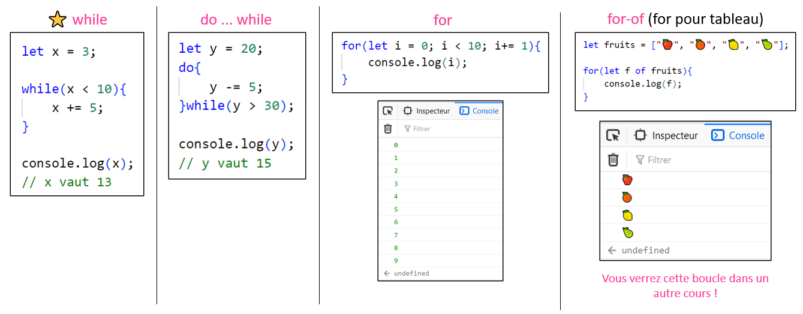</center>

Nous avons peu pratiqué `do while` et nous ne connaissons pas encore `for` 🤔

Étant donné que les boucles `for` sont utilisées dans **99% des cas** dans la vraie vie, nous nous concentrerons sur elles !

<center>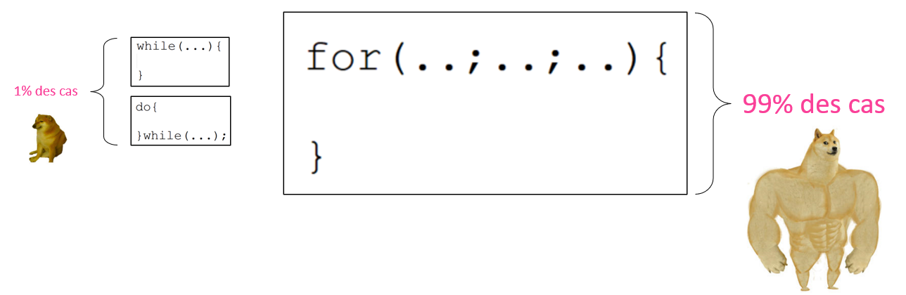</center>

## ➰ Boucles for

### 📕 Présentation

Pour les boucles `for` une variable, une condition et une incrémentation de la variable sont **intégrées directement** dans la structure de la boucle. C'est idéal si on connait d'avance le **nombre d'itérations** que l'on souhaite faire.

Syntaxe :

```js showLineNumbers
for( ... création de variable ... ; ... condition ... ; ... incrémentation ... ){

    // Code

}
```

<table>
<tr><td><center>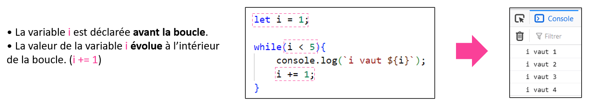</center></td></tr>
</table>

<table>
<tr><td><center>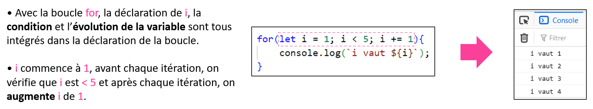</center></td></tr>
</table>

:::note

Les boucles `while` et `for` sont **interchangeables** ! Les deux peuvent faire le même travail dans la grande majorité des cas. La principale différence est la **syntaxe**.

<center>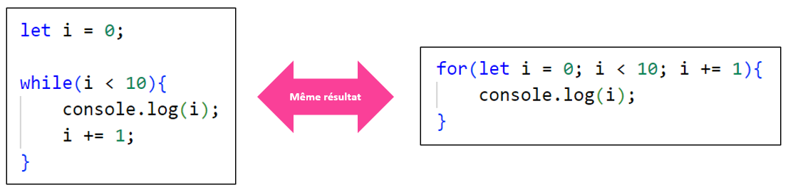</center>

La syntaxe de la boucle `for` est généralement considérée comme **plus élégante** si on connait d'avance le **nombre d'itérations** que doit faire la boucle.

Vous êtes encouragés à **favoriser la boucle `for`** car on a moins de chance d'oublier de mettre le `i += 1;` qu'avec une boucle `while` !

:::

:::info

> Quand doit-on utiliser une boucle `while` dans ce cas ?

Lorsqu'on **ne sait pas d'avance combien d'itérations la boucle doit faire**.

Exemple : J'achète des potions **tant que** j'ai assez d'argent pour en acheter.

<center>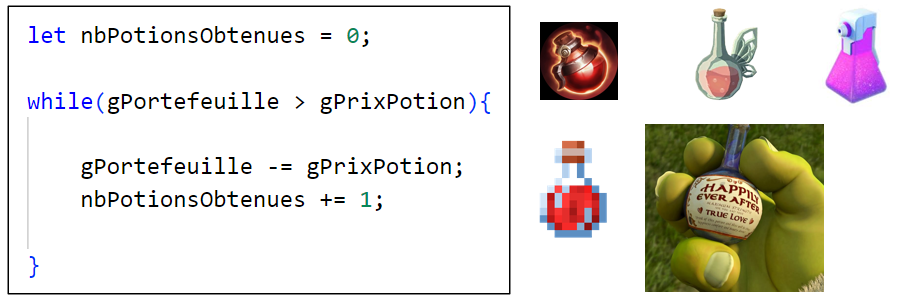</center>

<center>(Ceci aurait été possible sans boucle, c'est juste pour l'exemple)</center>

> Pourquoi avoir seulement utilisé les boucles `while` jusqu'ici ?

* Elles sont un meilleur point de départ pour apprendre.
* Elles sont légèrement plus flexibles que les boucles `for`. (Pas besoin de savoir le nombre d'itérations d'avance)

:::

### 🎲 Quelques exemples

#### Somme

Calculer la somme des nombres de 1 à 100

<center>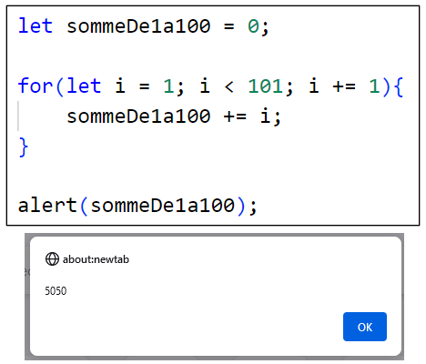</center>

<hr/>

#### Changer plusieurs styles

Donner une largeur de 200 pixels aux éléments avec les classes `.chien1`, `.chien2`, ..., `.chien16`.

<center>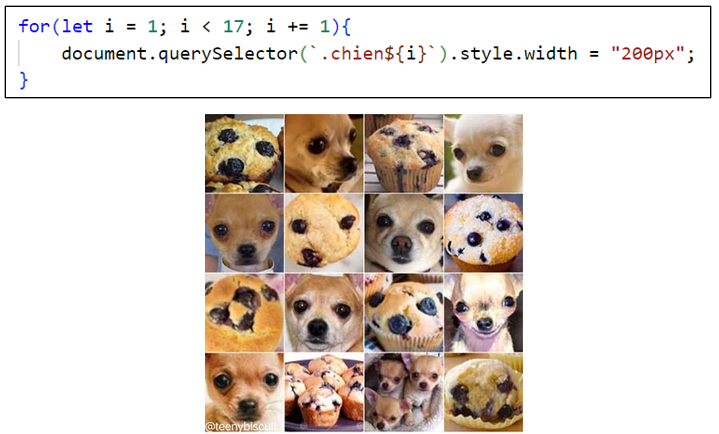</center>

<hr/>

#### Augmenter toutes les valeurs d'un tableau

<center>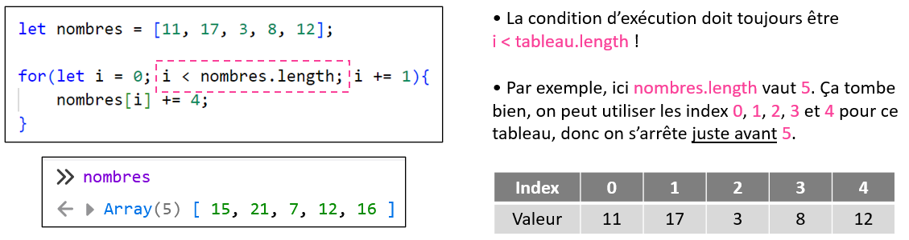</center>

### ⛔ Retirer des éléments d'un tableau

Exemple : Retirer tous les `"rat"` dans le tableau

<center>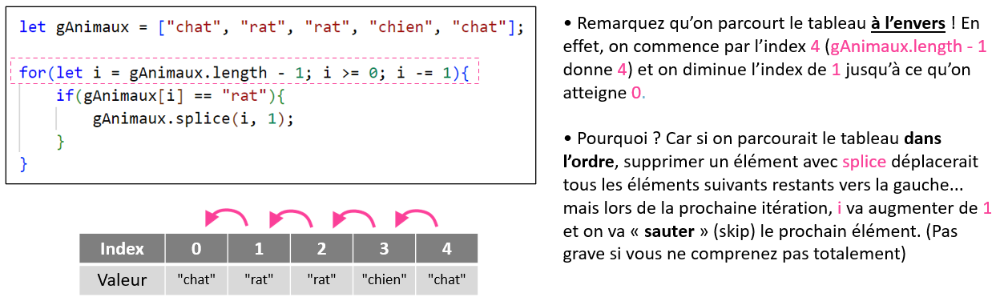</center>

<hr/>

Regardez ce qui se produit si on parcourt le tableau en ordre croissant plutôt qu'à l'envers :

<center>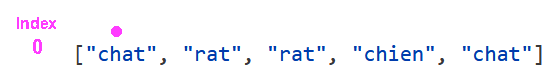</center>

## ✅ Blocs switch

Jusqu'à maintenant, nous avions utilisé les blocs `if`, `else` et `else if`.

<center>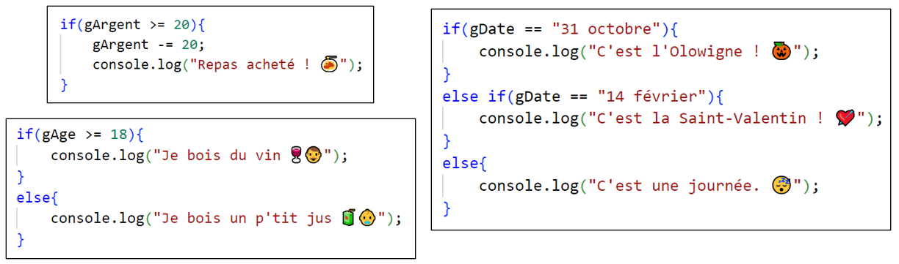</center>

<hr/>

Nous allons voir deux nouvelles **structures conditionnelles**

* Les blocs `switch`
* Les conditions ternaires (au prochain cours)

:::note

Ces deux nouvelles structures sont **utilisées très fréquemment** et il est important de les **maîtriser** au même titre que les `if` et `else`.

Les blocs `if`, `else` et `else if` permettent déjà de **tout faire**, mais les `switch` et les **conditions ternaires** permettent de gérer certains cas **plus élégamment**.

:::

### 📕 Présentation

Les `switch` permettent d'exécuter un bloc de code selon une **valeur** reçue.

<center></center>

<hr/>

Remarquez que l'équivalent avec `if`, `else if` et `else` est moins joli :

<center>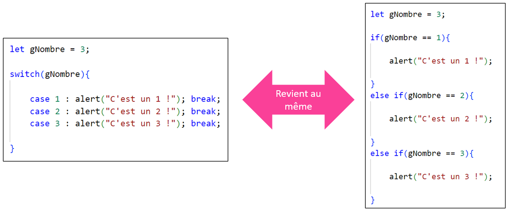</center>

### 🛑 Instruction `break`

> À quoi servent les `break` ?

Avec un `switch`, lorsqu'un `case` est choisi, **tout le reste des `case` suivants sont exécutés...** à mions qu'un `break` soit rencontré !

<center>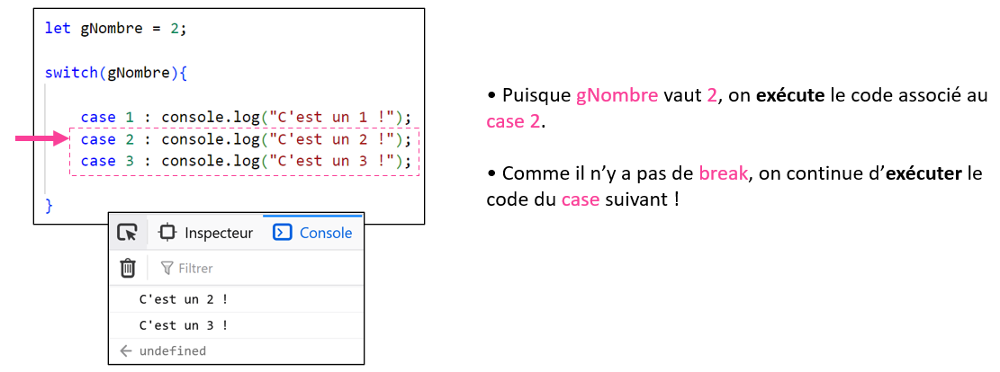</center>

<hr/>

<center>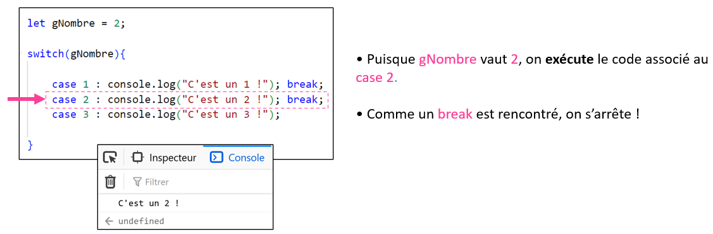</center>

### 🤷‍♂️ Cas `default`

Lorsque nécessaire, on peut ajouter un « cas par défaut ». Si aucun `case` n'est valide, ce sera le bloc `default` qui sera exécuté.

<center>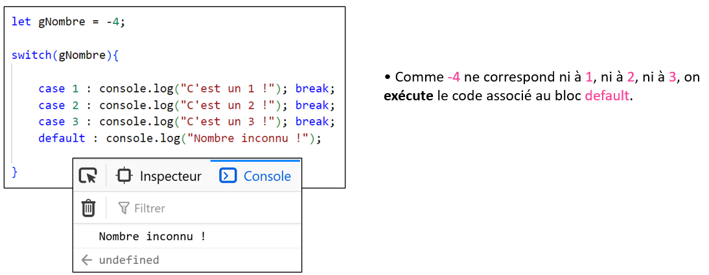</center>

:::tip

Les blocs `switch` fonctionnent également très bien avec les **chaînes de caractères** !

```js showLineNumbers
let typeProjectile = "Boule de feu";

switch(typeProjectile){

    case "Balle de plomb" : gPointsDeVie -= 50; break;
    case "Boule de feu" : gPointsDeVie -= 80; break;
    case "Jet d'eau" : gPointsDeVie -= 1; break;
    case "Piano" : gPointsDeVie -= 200; break;
    default : gPointsDeVie -= 10;

}
```

:::