# Cours 22 - Git et librairies JS

## 🎨 Librairies JS

Les [notes de cours](../../static/files/4204W6_semaine12.pptx) sont disponibles sous format PowerPoint 😳👉👈

Vous n'aurez pas besoin de **Masonry** durant le **TP4**, seulement de **Glide JS**.

## 🔱🦑 Git à deux

La plupart des notions qui suivent seront à la fois abordées avec **GitKraken** et **Fork**.

Fonctionnement général :

* Nous n'allons jamais **merge** dans `main`. (Seulement une fois, à la fin du TP)
* À chaque nouvelle fonctionnalité à implémenter, on crée une **branche** à partir de la branche `dev`.
* Une fois une fonctionnalité terminée, on **merge** `dev` dans la branche de la fonctionnalité pour d'abord résoudre les conflits.
* Une fois les conflits résolus, on pourra faire l'inverse : **merge** la branche de la fonctionnalité dans `dev`.
* Puis on recommence pour la prochaine fonctionnalité.
* Chaque partenaire travaille toujours **seul(e) sur sa propre branche**.

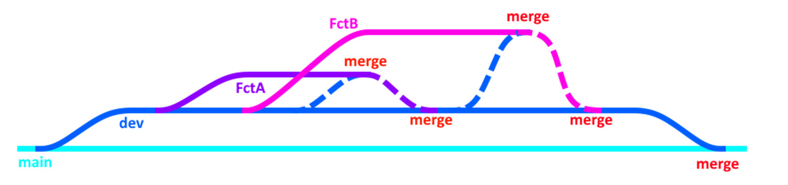

:::tip

* N'oubliez pas de faire des **push** fréquents si vous souhaitez que votre partenaire puisse voir vos commits, branches et merges.
N'oubliez pas de faire un **pull** si vous souhaitez voir le progrès de votre partenaire. (Surtout avant de merge dans `dev`)

:::

### 🥚 Setup initial du repo

#### 🦑 GitKraken

1. Créez le repo Git et y insérer les fichiers de départ des projets.

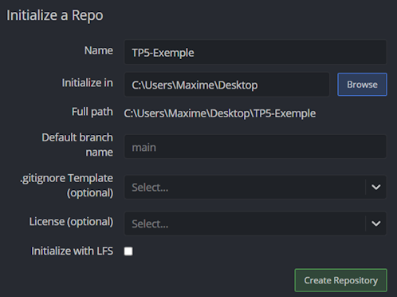

2. **Commit** les fichiers de départ sur `main`, puis créer une branche `dev`, puis **push** et ajouter le partenaire en collaborateur.

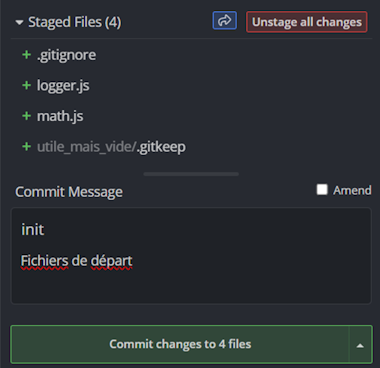

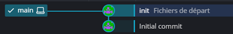

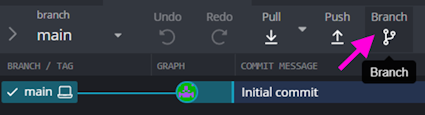

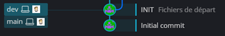  
Initialement, `dev` et `main` seront superposés tant que ces deux branches n'auront aucun code différent.

 

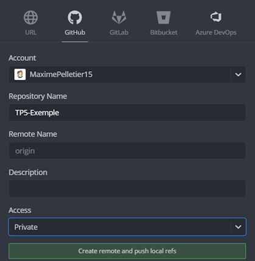

3. Le partenaire devra ensuite **cloner** le repo. (Assurez-vous de voir la branche `dev` tous les deux)

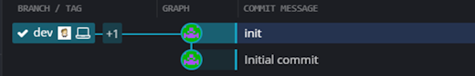

4. Créer une sous-branche dans `dev` par fonctionnalité :

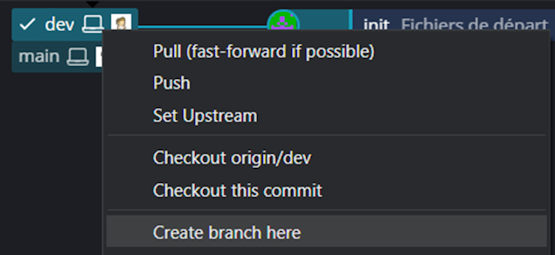

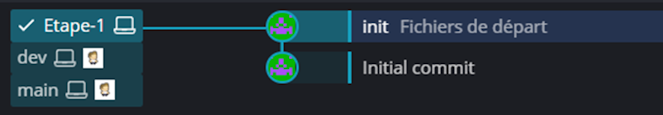  
C'est seulement une fois que vous aurez fait un commit dans vos sous-branches qu'elles ne seront plus superposées verticalement !

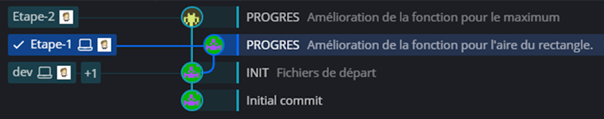

:::danger

Attention de bien sélectionner (double-clic) la bonne branche avant de commencer à coder !

:::

#### 🔱 Fork

1. Créer le repo sur Github

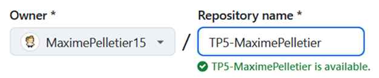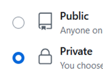

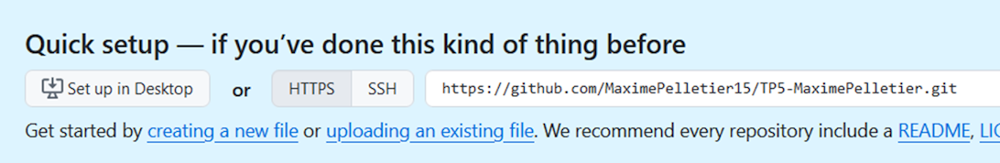

2. Cloner le repo avec **Fork** et y glisser les fichiers de départ.

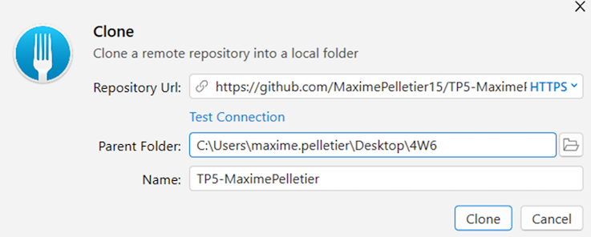

3. Commit les fichiers de départ sur `main`, puis créer une branche `dev` puis push `dev`.

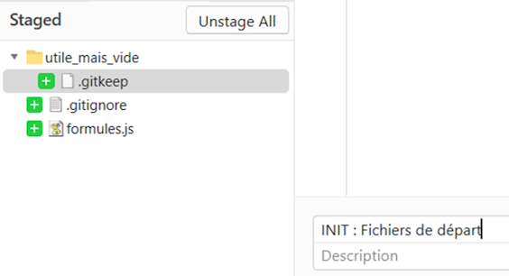

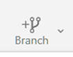

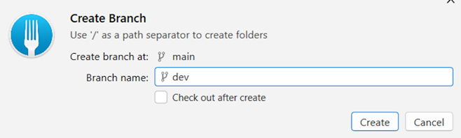  
N'oubliez pas de push `dev` !

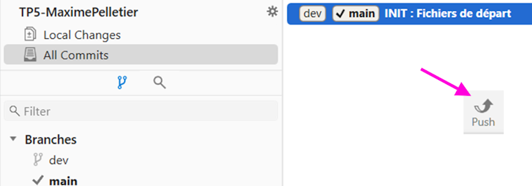

4. Ajouter le partenaire en collaborateur et cloner de son côté

5. Faire chacun votre sous-branche dans `dev`

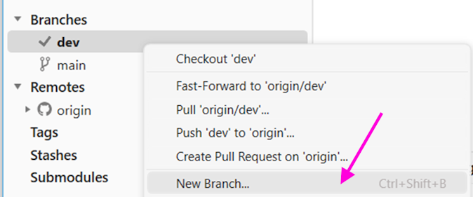

Tant que vous n'aurez pas chacun fait un commit dans votre sous-branche, elles seront toutes embarqués les unes sur les autres comme ceci :

:::danger

Attention de bien sélectionner (double-clic) la bonne branche avant de commencer à coder !

:::

### 🌌 Merge de branches

#### 🦑 GitKraken

Il est crucial de **d'abord merge `dev` dans votre sous-branche**, de résoudre les conflits sur votre sous-branche, puis, une fois que vous avez tout testé, de finalement **merge votre sous-branche dans `dev`**. De cette manière, `dev` est censée être toujours fonctionnelle.

S'il n'y a aucun autre merge dans `dev` depuis que vous avez créé votre sous-branche, il n'y aura pas de conflits et vous pourrez directement **merge dans `dev`**.

1. Sélectionner votre branche et merge `dev` dedans :

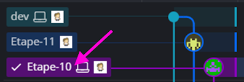

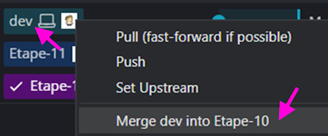

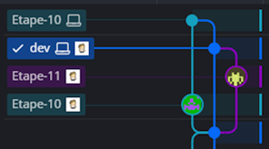

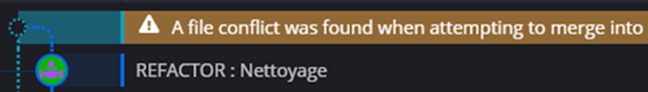

2. Résoudre les conflits (s'il y en a)

Il faudra « fusionner » du code qui a été rédigé par vous avec du code rédigé par votre partenaire. La présence du partenaire est fortement souhaitable pour comprendre l'utilité, la compatibilité, l'incompatibilité et la redondance de certains morceaux de code !

Dans **GitKraken**, il y a un outil pour comparer les fichiers et faire des changements manuels au besoin.

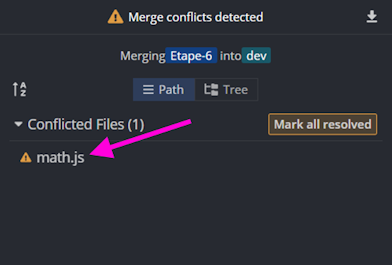

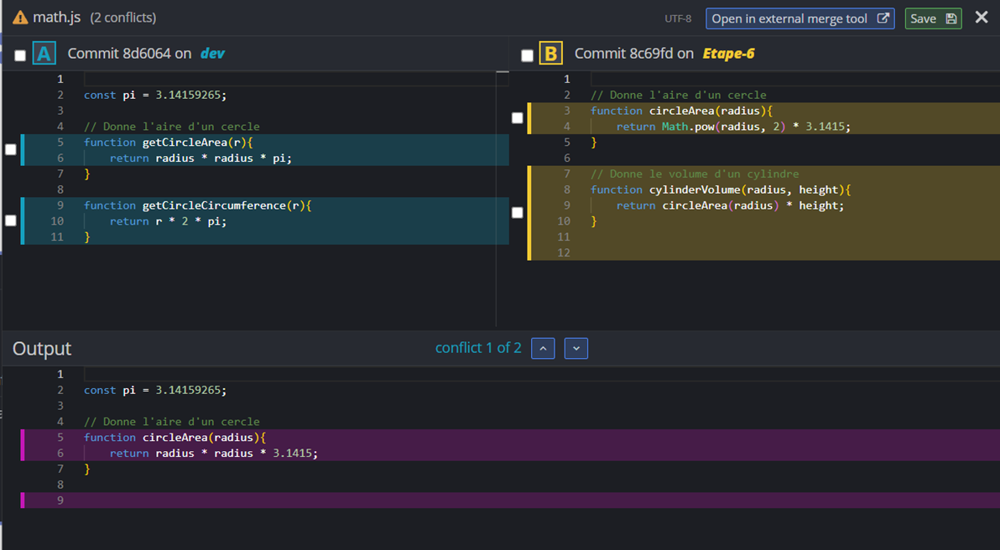  
(Votre objetif est de vous s'assurer que l'**output** correspond au résultat souhaité !)

 
:::warning

S'il y a plusieurs fichiers en conflit, réglez-les dans l'ordre suivant :

1. Modèles
2. Services
3. Contrôleurs / composants

Inutile de gérer les conflits pour les migrations ! Au pire, supprimez les migrations et recréez-en sur votre prochaine branche.

:::

3. ⛔ TESTEZ votre code.

S'il y a des bugs, faites un commit supplémentaire sur votre sous-branche pour les régler AVANT de **merge dans `dev`**.

4. Merge dans `dev`

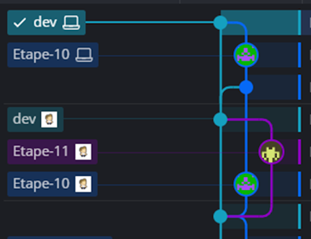

:::tip

Dans le cas où vous terminé plusieurs fonctionnalités d'affilé sans que votre partenaire n'ait le temps de faire ses merges, vos merge seront sans conflits :

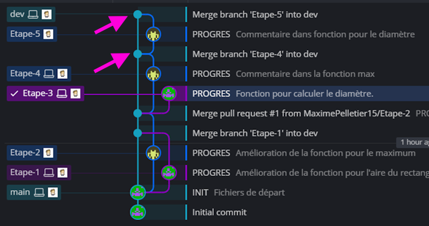

:::

#### 🔱 Fork

Il est crucial de **d'abord merge `dev` dans votre sous-branche**, de résoudre les conflits sur votre sous-branche, puis, une fois que vous avez tout testé, de finalement **merge votre sous-branche dans `dev`**. De cette manière, `dev` est censée être toujours fonctionnelle.

S'il n'y a aucun autre merge dans `dev` depuis que vous avez créé votre sous-branche, il n'y aura pas de conflits et vous pourrez directement **merge dans `dev`**.

1. Sélectionner votre branche et merge `dev` dedans :

    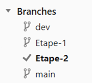
    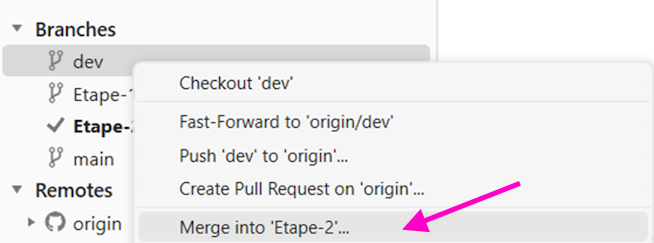

2. Résoudre les conflits (s'il y en a)

🚪 Notez qu'il faudra faire la gestion de conflits dans `Visual Studio` et dans `VS Code`. L'exemple ci-dessous est avec `VS Code`.

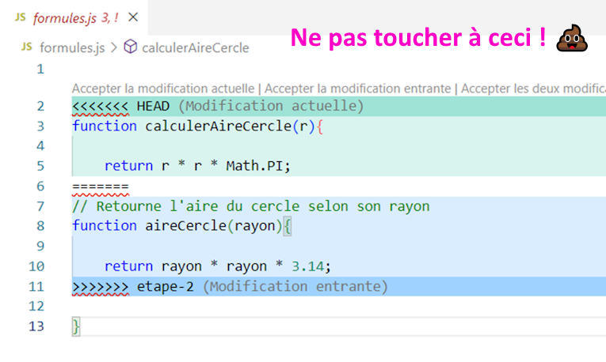

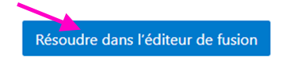

L'objectif est de s'assurer que le **code en bas** correspond au résultat souhaité. Vous pouvez l'éditer manuellement au besoin en vous servant des deux versions en conflit qui sont en haut.

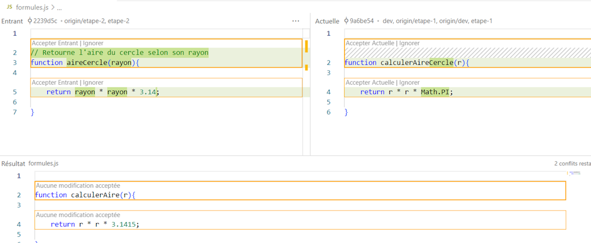

Il va falloir faire un aller-retour entre VS Code et Fork **pour chaque fichier**.

:::warning

S'il y a plusieurs fichiers en conflit, réglez-les dans l'ordre suivant :

1. Modèles
2. Services
3. Contrôleurs / composants

Inutile de gérer les conflits pour les migrations ! Au pire, supprimez les migrations et recréez-en sur votre prochaine branche.

:::

3. Retourner dans **Fork** pour conclure le merge

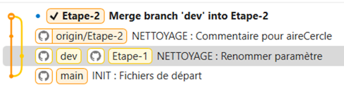

4. ⛔ TESTEZ votre code.

S'il y a des bugs, faites un commit supplémentaire sur votre sous-branche pour les régler AVANT de **merge dans `dev`**.

5. Merge dans `dev`

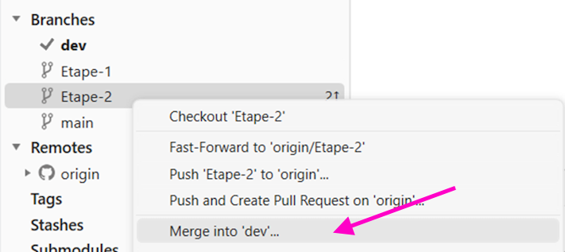

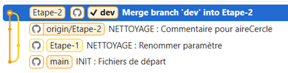

### 🤕 Erreurs fréquentes

#### 🌿 J'ai travaillé sur la mauvaise branche

Par exemple, avoir fait un commit sur `dev` plutôt que dans une sous-branche : 

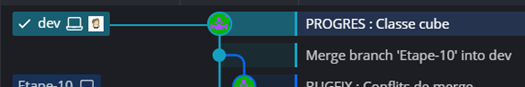

Commencez par **créer une nouvelle branche** à partir de ce commit de trop :

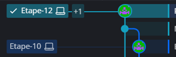

Sélectionner `dev` :

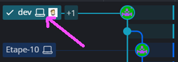

Pour ensuite faire un clic-droit sur le **commit précédent** et réinitialiser la branche `dev` à ce commit :

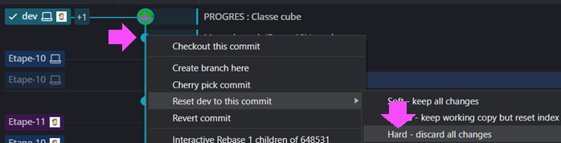

Pour le moment, cela va « dupliquer » la branche `dev` :

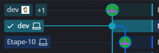

Il suffira de faire un **push** (« force push ») pour que seule la nouvelle branche `dev` soit conservée :

#### ⏳ Revenir en arrière (annuler un commit)

Disons qu'on souhaite annuler le tout dernier commit qu'on a fait :

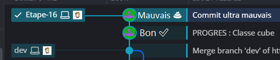

Faites un clic-droit sur le commit précédent et **réinitialisez votre branche** à celui-ci :

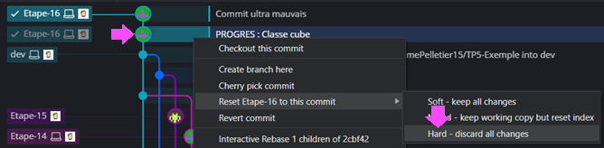

Après avoir fait un **push** (force push), vous devriez avoir ce résultat :

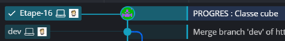

#### 💥 Merge simultané accidentel

Disons que votre partenaire et vous avez fait un **merge** dans `dev` en même temps... Vous aurez des problèmes lors de votre prochain **pull** puisque la branche `dev` existera en deux versions !

Avant les merge :

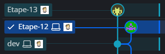

Merge réalisé par la personne 1 :

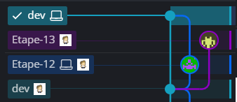

Merge réalisé par la personne 2 :

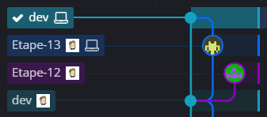

Lorsque les deux personnes feront un **push**, la première personne qui fera un **pull** aura ce problème : il y a deux versions de `dev` !

La solution sera de **merge** `dev` dans `dev` (oui oui) Alternativement, on peut aussi merge la branche `dev` générée par notre partenaire dans notre sous-branche à nous pour ne pas avoir à **gérer les conflits** directement sur `dev`. 

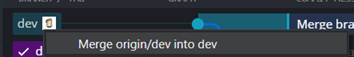

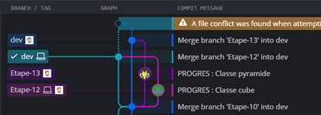

Résultat : (N'oubliez pas de **push** `dev` ensuite !)

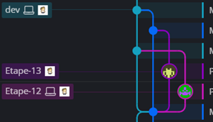

