# Cours 23 - Création d'éléments

## ❓ Conditions ternaires

En gros, ce sont des « `if` ... `else` » *miniatures* pour **choisir une valeur** selon une **condition**.

<center>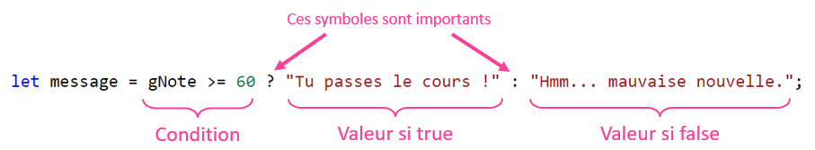</center>

Voici le code **identique** avec un `if ... else` :

```js showLineNumbers
let message;

if(gNote >= 60){
    message = "Tu passes le cours !;
}
else{
    message = "Hmm... mauvaise nouvelle.";
}
```

<hr/>

#### Exemple 1 : retourner une valeur

<center>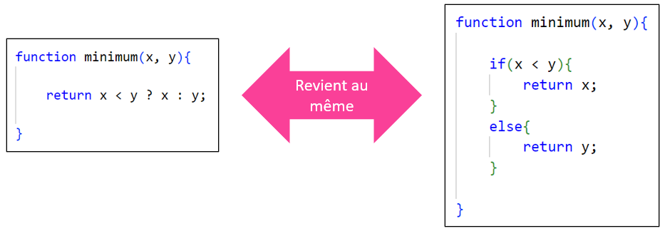</center>

<hr/>

#### Exemple 2 : choisir une valeur d'attribut

(Pourrait aussi fonctionner pour du contenu textuel, un style, une classe, etc.)

<center>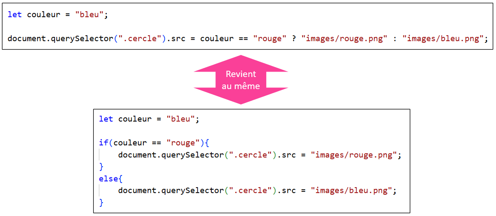</center>

## 🥚 Création d'éléments HTML

**Étape 1** : Créer l'élément

Pour le moment, nous aurons un `<p></p>` vide qui n'a pas encore été ajouté dans la page Web.

<center>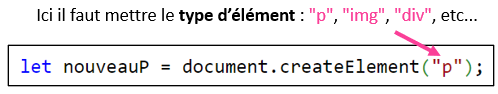</center>

**Étape 2** : Personnaliser

On peut ajouter un contenu textuel, des attributs, des styles, des classes, etc.

<center>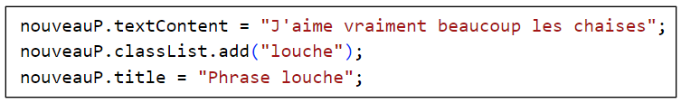</center>

**Étape 3** : Intégrer à la page Web

Il faut « glisser » le nouvel élément dans un **élément parent** de notre choix.

<center>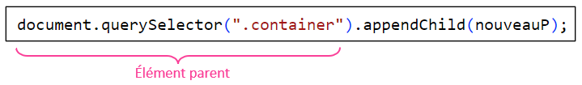</center>

<hr/>

**Récapitulatif**

```js showLineNumbers
// Étape 1 : Créer l'élément
let nouveauP = document.createElement("p");

// Étape 2 : Personnaliser
nouveauP.textContent = "J'aime vraiment beaucoup les chaises";
nouveauP.classList.add("louche");
nouveauP.title = "Phrase louche";

// Étape 3 : Intégrer à la page
document.querySelector(".container").appendChild(nouveauP);
```

<center>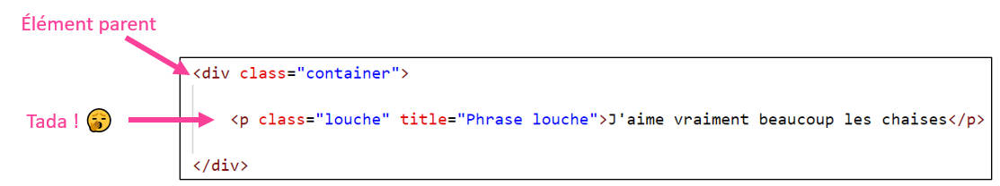</center>

<hr/>

#### Autre exemple : créer un ``

<center>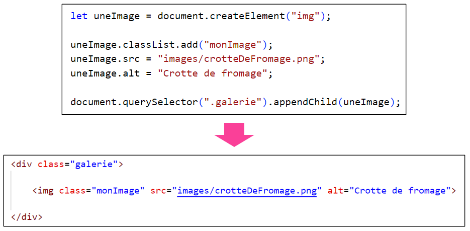</center>

:::info

Notez que `appendChild()` ajoute le nouvel élément HTML **à la fin** de l'**élément parent** :

<center>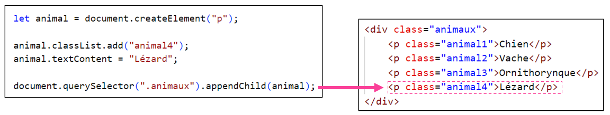</center>

Ici, l'élément `.animaux` contenait déjà trois **éléments enfants**. Le nouvel élément a été ajouté **à la fin**.

:::

## 🚮 Supprimer un élément HTML

On peut également supprimer des éléments HTML dans la page.

Il suffit d'utiliser la fonction `.remove()` sur un élément HTML obtenu avec `document.querySelector(...)` :

<center></center>

:::tip

Si plusieurs éléments **possèdent la même classe**, on peut utiliser `document.querySelectorAll(...)` pour supprimer un des éléments obtenus :

```js
let elements = document.querySelectorAll(".animal");
elements[3].remove();
```

Par exemple, j’obtiens un tableau avec tous les éléments qui possèdent la classe `.animal`, puis je supprime celui à l’index `3` dans le tableau. (Donc le **4e** dans la page Web)

:::

## 🌌 null et undefined

Il existe deux types de variables « vides ». Nous allons les différencier dans cette section.

### 🤷‍♂️ undefined

Lorsqu'une variable est déclarée, mais **qu'aucune valeur ne lui est affectée**, elle est `undefined`.

<center>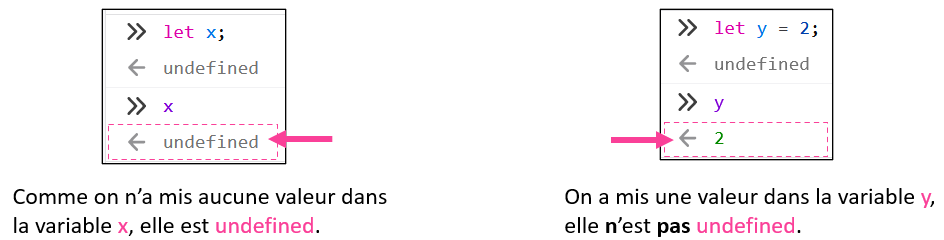</center>

:::warning

Généralement, nous n'aimons pas qu'une variable reste `undefined`. On doit lui donner une valeur dès que possible pour éviter que cela génère des problèmes.

Par exemple, ici, on additionne `x` et `y` alors qu'on a oublié que `x` était encore `undefined`. On obtiendra `NaN` (Not a Number), qui est le résultat d'un calcul incohérent.

<center>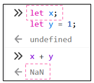</center>

:::

### 🔌 null

Il existe également des variables `null`. Contrairement à une variable `undefined`, lorsqu'une variable est `null`, c'est généralement **volontaire** plutôt qu'être une **maladresse**.

Par exemple, parmi les **variables globales**, on a déclaré `gPlanifJeu`, qui servira à stocker un **planificateur à intervalles**. Initialement, on lui donne la valeur `null` pour indiquer clairement qu’il n’y a pas encore de planificateur stocké dans cette variable.

```js
let gPlanifJeu = null;
```

Au moment de créer et stocker le **planificateur**, on pourrait commencer par vérifier que `gPlanifJeu` est `null` (donc vide) pour s’assurer de ne pas écraser un autre **planificateur** existant.

```js showLineNumbers
function lancerJeu(){

    if(gPlanifJeu == null){
        gPlanifJeu = setInterval(updateJeu, 50); // Lancer le jeu
    }
    else{
        console.log("La partie est déjà lancée : il y a déjà un planificateur stocké dans gPlanifJeu !");
    }

}
```

### 🚮 Mieux supprimer un élément HTML

On sait déjà comment **supprimer un élément HTML**, mais il faudrait commencer par **vérifier qu'il existe** pour éviter des erreurs. 🐞

Voici ce qui se produit si on essaye de **supprimer un élément qui n'existe pas** :

<center>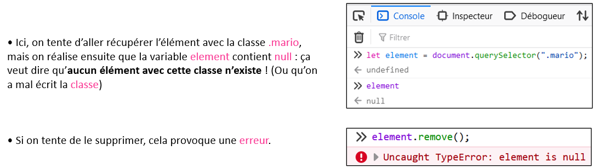</center>

<hr/>

Pour éviter ce problème, lorsqu'on n'est pas sûr qu'un élément existe (il a peut-être déjà été supprimé), on peut procéder comme ceci :

<center>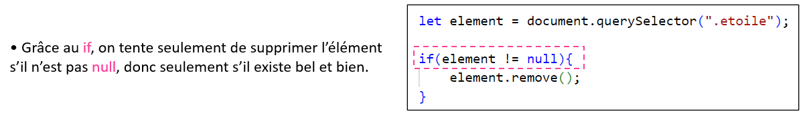</center>
