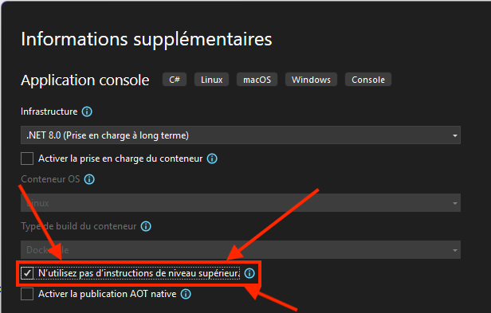
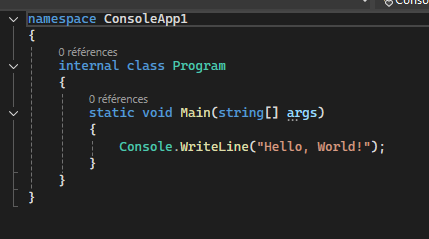

# 🧪 TP1 – Créateur de personnage

## 🎯 Objectif
Créer un programme console qui permet à un joueur de créer un personnage de jeu en choisissant son nom, son âge, et une classe. Le programme affiche ensuite un résumé personnalisé avec des caractéristiques influencées par les choix de l’utilisateur.

🧱 **Éléments obligatoires**

| Élément | Détail |
|--------|--------|
| Lecture console | Lire le nom, l’âge, le choix de classe via `Console.ReadLine()` |
| Conversion de types | Utiliser `int.TryParse()` pour l’âge, comparer les chaînes pour valider la classe |
| Validation de données | Vérifier que l’âge est un entier positif, que la classe est G, M ou V, et que le nom n’est pas vide |
| Affichage clair | Utiliser `Console.WriteLine()` avec concaténation classique : `"Nom : " + nom` |
| Variables | Stocker les infos du joueur (nom, âge, classe, pv, force, intelligence, vitesse) |
| Initialisation | Donner des valeurs par défaut aux variables globales |
| Méthodes simples | Utiliser des méthodes comme `InitialiserStats()` et `AfficherPersonnage(...)` avec paramètres |
| Méthode avec retour | Ajouter `ObtenirVitesseParClasse(char)` qui retourne un `double` |
| Conditions (`if`, `else if`) | Modifier les stats selon la classe et l’âge |
| Commentaires | Ajouter des commentaires dans le code |

---

## 🧑‍💻👩‍💻 Création du projet
:::tip Note

À la création du projet, assurez-vous de cocher l'option **N'utilisez pas d'instructions de niveau supérieur**.

De cette façon votre projet sera créé comme dans l'image ici 👇 .

:::

## 🧮 Variables globales

Avant `Main`, vous devez déclarer des **variables globales** pour contenir :

- Le nom du personnage
- L’âge
- La classe (lettre : G, M ou V)
- Les points de vie (PV)
- La force
- L’intelligence
- La vitesse

**Note** : Les types ne sont pas donnés volontairement — à vous de les déterminer selon la donnée.

---

## 🧠 Contenu de `Main()`

La méthode `Main()` doit :

1. Afficher un titre pour le programme
2. Appeler des méthodes pour :
   - Lire et valider le nom
   - Lire et valider l’âge
   - Lire et valider la classe
   - Initialiser les statistiques du personnage selon les règles
   - Initialiser la vitesse du joueur
   - Afficher le résumé du personnage

---

## 🔧 Méthodes à implémenter

### `LireNom()`

- **Paramètres** : aucun  
- **Retour** : nom saisi par l’utilisateur (ou `"Anonyme"` si invalide)

Valide que le nom n’est pas vide.

---

### `LireAge()`

- **Paramètres** : aucun  
- **Retour** : un entier représentant l’âge

Valide que l’âge est un entier positif. 
Si l’entrée n’est pas valide, retourne 18 par défaut.

:::tip Note
Regarder la méthode `TryParse` pour vous aider.
:::

---

### `LireClasse()`

- **Paramètres** : aucun  
- **Retour** : un caractère `'G'`, `'M'`, ou `'V'`

Valide que la Classe est :
- Guerrier → `'G'` ou `'g'`
- Magicien → `'M'` ou `'m'`
- Voleur → `'V'` ou `'v'`

Si l’entrée n’est pas valide, retourne `'G'` par défaut.

:::tip Note
Regarder les fonctions `ToUpper`, `ToLower` et `ToString` pour vous aider.
:::

---

### `InitialiserStats()`

- **Paramètres** : aucun  
- **Retour** : aucun

Affecte les bonnes valeurs aux statistiques selon la classe et l’âge.

:::info 🎲 Modificateurs par classe

| Classe   | PV  | Force | Intelligence |
|----------|-----|-------|--------------|
| Guerrier | 20  | 15    | 5            |
| Magicien | 12  | 5     | 18           |
| Voleur   | 15  | 10    | 10           |

:::

:::info 📈 Modificateurs par âge

- **Âge ≤ 40** → -5 Intelligence, -5 Force
- **Âge > 40** → +10 Intelligence, +10 Force, -10 PV

:::

---

### `ObtenirVitesseParClasse(char classe)`

- **Paramètres** : un caractère représentant la classe  
- **Retour** : un nombre décimal (`double`) représentant la vitesse

| Classe | Vitesse |
|--------|---------|
| G      | 2.0     |
| M      | 2.5     |
| V      | 3.5     |

---

### `AfficherPersonnage(...)`

- **Paramètres** : nom, âge, classe, PV, force, intelligence, vitesse  
- **Retour** : aucun

Affiche les statistiques du personnage.

---

## 📜 Rappel des règles d’affaires

- **Nom invalide** (vide ou espaces) → `"Anonyme"`
- **Âge invalide** (non entier ou négatif) → `18`
- **Classe invalide** → `'G'` par défaut

---

### 🎲 Modificateurs par classe

| Classe   | PV  | Force | Intelligence |
|----------|-----|-------|--------------|
| Guerrier | 20  | 15    | 5            |
| Magicien | 12  | 5     | 18           |
| Voleur   | 15  | 10    | 10           |

---

### 📈 Modificateurs par âge

- **Âge ≤ 40** → -5 Intelligence, -5 Force
- **Âge > 40** → +10 Intelligence, +10 Force, -10 PV

---

# 🧾 Grille de correction – TP1 : Créateur de personnage

:::danger ⚠️☢️🔥ATTENTION!!!
 **⚠️ Compilation obligatoire :**
 - ✅ Le code compile : correction complète selon les critères ci-dessous.
 - ❌ Le code **ne compile pas** : note maximale **60%**.
:::
---

## 🔍 Évaluation détaillée

:::info ✅ Le code compile sans erreur **Obligatoire**
Tout code qui n'est pas fonctionnel doit être placé en commentaire.
:::

:::note 🧾 Les **variables globales** - /10 points   
 - Toutes les variables sont présentes.
 - Les variables sont bien utilisés.
 - Les variables sont du bon type.
:::

:::note 🔤 Lecture du **nom** - /10 points
 - Création de la méthode.
 - Utilisation d'une valeur de retour.
 - Les variables sont du bon type.
 - Bon fonctionnement du code.
 - Application la bonne valeur lors que l'information entrée n'est pas valide.
:::

:::note 🔢 Lecture de l'**âge** - /10 points
 - Création de la méthode.
 - Utilisation d'une valeur de retour.
 - Les variables sont du bon type.
 - Bon fonctionnement du code.
 - Application la bonne valeur lors que l'information entrée n'est pas valide.
:::

:::note 🎭 Lecture de la **classe** - /10 points
 - Création de la méthode.
 - Utilisation d'une valeur de retour.
 - Les variables sont du bon type.
 - Bon fonctionnement du code.
 - Application la bonne valeur lors que l'information entrée n'est pas valide.
:::

:::note 🧠 Initialisation des statistiques - /20 points
 - Création de la méthode.
 - Les variables sont du bon type.
 - Application correcte des **modificateurs** selon la **classe**.
 - Application correcte des **modificateurs** selon l’**âge**.
:::

:::note 🧠 Initialisation de la vitesse - /10 points
 - Création de la méthode.
 - Présence et utilisation du paramètre.
 - Les variables sont du bon type.
 - Bon fonctionnement du code.
:::

:::note 🖨️ Affichage du personnage - /10 points
 - Création de la méthode.
 - Présence et utilisation des paramètres.
 - Les variables sont du bon type.
 - Affichage final clair avec `Console.WriteLine()`.
:::

:::note 📝 Méthode `Main` - /10 points
 - Utilisation correcte des fonctions.
 - Utilisation correcte des variables globales.
:::

:::note 📝 Commentaires - /10 points
 - Présence de commentaires pour les règles d'affaire
:::

---
### 💯 Total : **100 points**

---
## 📎 Annexe – Jeu de tests (Cas de validation)

| Cas | Entrée nom | Entrée âge | Entrée classe | Nom attendu | Âge attendu | Classe attendue | PV | Force | Intelligence | Vitesse |
|-----|------------|------------|----------------|-------------|-------------|------------------|----|--------|---------------|---------|
| 1 – Nom, âge et classe valides (G) | Arthur | 25 | G | Arthur | 25 | G | 20 | 10 | 0 | 2.0 |
| 2 – Nom vide, âge valide, classe M | *(vide)* | 30 | M | Anonyme | 30 | M | 12 | 0 | 13 | 2.5 |
| 3 – Nom valide, âge invalide (lettre), classe V | Lila | abc | V | Lila | 18 | V | 15 | 5 | 5 | 3.5 |
| 4 – Nom valide, âge négatif, classe invalide | Fred | -5 | X | Fred | 18 | G | 20 | 10 | 0 | 2.0 |
| 5 – Nom avec espace, âge > 40, classe minuscule ‘m’ | Jean Pierre | 50 | m | Jean Pierre | 50 | M | 2 | 15 | 28 | 2.5 |
| 6 – Tous invalides | *(vide)* | -1 | Z | Anonyme | 18 | G | 20 | 10 | 0 | 2.0 |
| 7 – Classe minuscule 'v', âge = 40 | Zoe | 40 | v | Zoe | 40 | V | 15 | 5 | 5 | 3.5 |
| 8 – Classe minuscule 'g', âge = 41 | Max | 41 | g | Max | 41 | G | 10 | 25 | 15 | 2.0 |

> 🔎 Règles appliquées :
> - Nom vide → `"Anonyme"`
> - Âge non entier ou négatif → `18`
> - Classe invalide → `'G'` par défaut
> - **Modificateurs par classe** :
>   - G : PV 20, Force 15, Intel 5
>   - M : PV 12, Force 5, Intel 18
>   - V : PV 15, Force 10, Intel 10
> - **Âge ≤ 40** → -5 Intelligence, -5 Force
> - **Âge > 40** → +10 Intelligence, +10 Force, -10 PV
