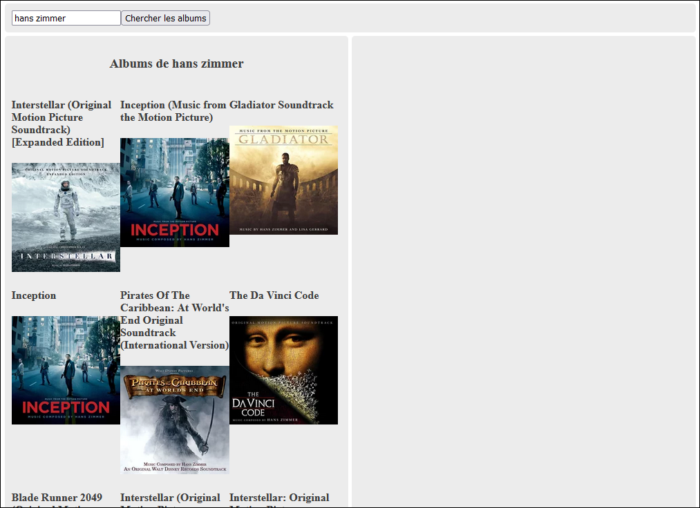
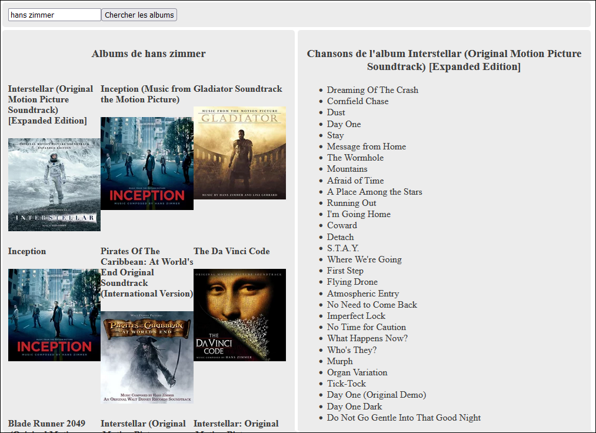

# TP1 (5%)

⏰ Date de remise : 10 février à 23h59. (Remise sur Git uniquement)

### 📜 Présentation du TP

Ce premier TP sera plutôt court. 🤏 Il faudra créer une application Web client Angular permettant de
rechercher les albums d'un artiste et les chansons d'un album.

* Le TP doit être fait de manière individuelle.
* L'usage du framework Angular est obligatoire.
* L'API Web de Last FM devrait être utilisée.
* Attention au **plagiat**. Il est interdit de copier en partie ou complètement le code d'une autre personne.
* L'interface graphique de votre page Web n'a pas à être jolie ou identique à celle illustrée dans les exemples.
Il suffit qu'elle soit simple à utiliser et claire. Ne perdez pas trop de temps avec le CSS.

Clé d'API Last FM fournie : `9a8a3facebbccaf363bb9fd68fa37abf`

Requêtes à utiliser :

* Chercher les albums d'un artiste : [https://www.last.fm/api/show/artist.getTopAlbums](https://www.last.fm/api/show/artist.getTopAlbums)
* Chercher les chansons d'un album : [https://www.last.fm/api/show/album.getInfo](https://www.last.fm/api/show/album.getInfo)

### ⚙ Fonctionnalités

On doit pouvoir chercher (et afficher) les albums d'un artiste en écrivant son nom :

On doit pouvoir chercher (et afficher) les chansons d'un album en cliquant sur sa pochette :

### ⚠ Exigences supplémentaires

1. Lorsque l'artiste recherché n'existe pas (et génère une erreur), un message d'erreur est affiché. 🐞

2. Lorsqu'on lance une nouvelle recherche, les résultats précédents (albums et chansons) doivent être nettoyés. (Exception :
quand on clique sur un album, on doit laisser la liste d'albums intacte et on a juste à nettoyer les précédentes chansons) 🧹

3. Les chansons d'un album sont seulement recherchées si on clique sur sa pochette. (Ne recherchez pas automatiquement toutes
les chansons de tous les albums d'un artiste ! C'est trop gourmand ! 🍗)

4. Vous ne devez utiliser qu'un seul composant. (`app`) ☝

5. Il est obligatoire de créer (et d'utiliser) une classe pour les albums. 📦

### 🔱🦑 Usage de Git

Utiliser Git sera obligatoire pour ce TP. (Et tous les suivants)

* Vous devez inviter l'enseignant ([https://github.com/MaximePelletier15](https://github.com/MaximePelletier15)) comme collaborateur dès le début du TP.
* Un minimum de trois commits est attendu. (Au moins 1 par fonctionnalité + le commit initial)
* Un titre et une description claire pour chaque commit. (Voir les [normes du département](https://info.cegepmontpetit.ca/git) au besoin)
* ⛔ Faites un push à chaque commit ! Protégez votre travail ! ⛔

### ⚖ Grille de correction

|Critère|Points|
|:-|-|
|Requête pour obtenir les albums et extraction des données JSON|4 pts|
|Requête pour obtenir les chansons et extraction des données JSON|4 pts|
|Affichage des albums|2 pts|
|Affichage des chansons|2 pts|
|Gestion des inputs de l'utilisateur (champ textuel, bouton cliquable et album cliquable)|4 pts|
|Gestion des erreurs|0.5 pt|
|Nettoyage d'anciens résultats|0.5 pt|
|Usage d'une classe pour les albums|1 pt|
|Usage de Git approprié|2 pts|
|Pénalité en lien avec certaines exigences non respectées (interface graphique difficile à utiliser, requêtes inutiles et usage de plusieurs composants)|-3 pts|
|Total|20 pts|

