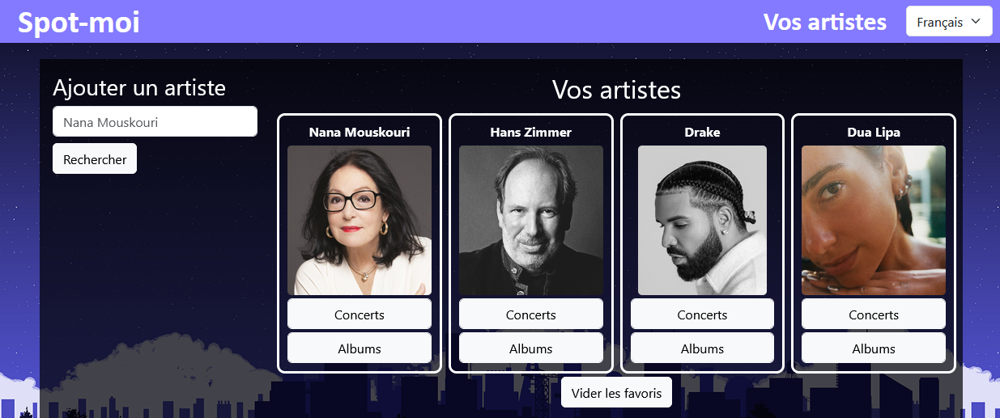
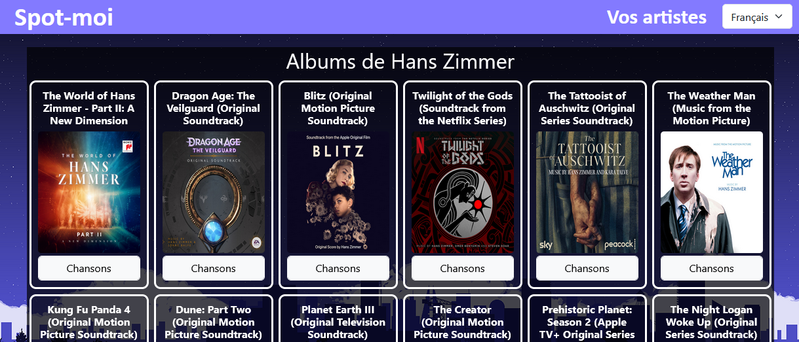
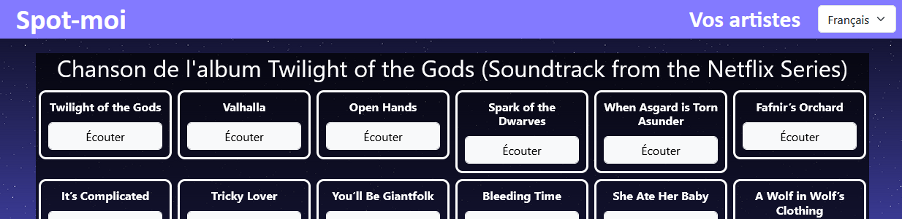
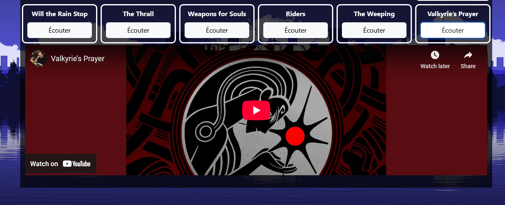
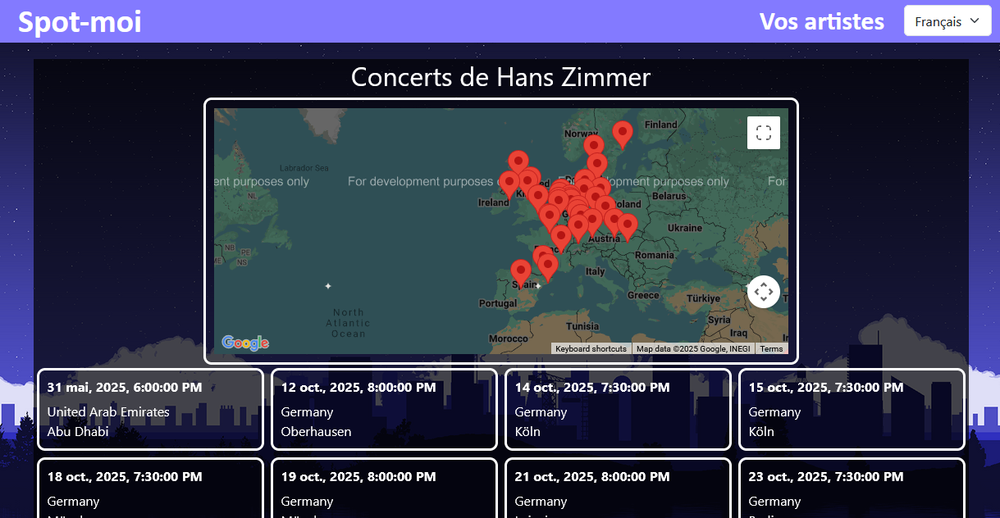

# TP2 - Spot-moi (20%)

🎁📦 Tout le HTML et le CSS de l'application vous sont fournis. [Cliquez ici](../../static/files/tp2_html_css.zip).

:::warning

Les fichiers de départ correspondent à du HTML et à du CSS vanille. Il faudra adapter le HTML et le CSS à la structure
d'un projet Angular ! (Diviser en composant, retirer les parties répétitives comme le `<head>`, `<header>`, `<footer>`, etc.)
Notez que vous devrez installer `jquery` et `bootstrap` pour que l'apparence du site Web soit fonctionnelle. De plus, vous devrez
déplacer les images dans un dossier du projet Angular et réparer les `src` des éléments ``.

:::

## 📝 Consignes

* 📅 Date de remise : **11 mars 23h59**
* 🅰 Le framework Angular doit être utilisé **en version 18**. (Comme au Cégep)
* 👤 Le projet doit être fait individuellement. Attention au plagiat.
* ⏰ Vous avez 4 cours (12h en classe !) consacrés au TP, **profitez-en**. (_Narrator : "... and nobody did"_)
* 🐙 Vous devez utiliser au minimum **5 composants**, c'est-à-dire un par page + le composant `app`.
* 👅 L'application doit être disponible en français et en anglais.

En résumé, nous réaliserons une **application Web client** permettant d'explorer des données
musicales en utilisant les API **Spotify**, **Youtube** et **BandsInTown**. Nous utiliserons
également **Google Maps**.

Si vous avez du mal à commencer le TP, suivez les instructions dens la section [😵 Ses tro compliquais](/tp/tp2#-ses-tro-compliquais).

## 👨‍🎨👩‍🎨 Page d'accueil

À partir de la page d'accueil, l'utilisateur pourra rechercher des artistes (API Spotify) pour les afficher. Rechercher un artiste
l'affiche et l'ajoute automatiquement aux « favoris ». (Favoris veut simplement dire que si on réactualise la page, les artistes
recherchés resteront présents) 

Il y aura également un bouton pour nettoyer tous les artistes. (Tous les favoris) Sous chaque artiste, il y a un bouton pour aller vers
la **page des concerts de l'artiste** et un bouton pour aller vers la **page des albums de l'artiste**.

## 💿 Page des albums

Accessible en cliquant sur le bouton « Albums » sous un artiste de la page d'accueil.

* On affiche le nom de l'artiste en haut.
* On affiche tous les albums de l'artiste (titre et pochette) à l'aide d'une requête à **Spotify**.
* Un bouton sous chaque album permet de naviguer vers la **page des chansons de l'album**.

## 🎵 Page des chansons

Accessible en cliquant sur le bouton « Chansons » sous un album dans la page des albums.

* On affiche le titre de l'album en haut.
* On affiche le titre de toutes les chansons de l'album à l'aide d'une requête à **Spotify**.
* Un bouton sous chaque chanson permet d'afficher la chanson dans un **lecteur YouTube** pour la faire jouer
à l'aide de **l'API de YouTube**.
  * ⛔ N'envoyez pas de requête pour une chanson qui n'a pas été cliquée !

:::warning

Pour que la requête YouTube fonctionne dans 99.99% des cas (ce qui est nécessaire pour ce TP), assurez-vous
de fournir le **nom de l'artiste** ET le **nom de la chanson** dans la recherche. Autrement, une chanson
avec un nom trop générique risque de donner un résultat invalide.

:::

## 🎤 Page des concerts

Accessible en cliquant sur le bouton « Concerts » sous un artiste dans la page d'accueil.

* On affiche le nom de l'artiste en haut.
* On affiche tous les concerts (date en français **avec un pipe** et heure, pays, ville) à l'aide de l'API **BandsInTown**.
    * 📶 Requête : `https://rest.bandsintown.com/artists/MON_ARTISTE/events?app_id=API_KEY`
    * 🔑 Clé d'API fournie : `2b32475766802ac01eefda45e9e42ea0`
* On affiche une carte **Google** avec un marqueur pour chaque concert.
    * 👻 Affichez un message spécial sous la carte si l'artiste n'a aucun concert.
    * 💡 Sachant que l'API **BandsInTown** vous fournit la latitude et longitude pour chaque concert, placer les marqueurs est possible facilement.

:::warning

**BandsInTown** vous fournira la latitude et la longitude pour chaque concert... sous forme de `string`. N'oubliez pas
de convertir ces valeurs en `number` avec la fonction `parseFloat(monString)`.

:::

## 🤬 Exigences supplémentaires

* 🐙 Vous devez utiliser au minimum **5 composants**, c'est-à-dire un par page + le composant `app`.
* 👅 L'application doit être disponible en français et en anglais.
* ⚙ Aucune requête ne doit être présente dans les composants ! **Utilisez des services**.
    * <u>Deux</u> services ferait du sens. Un pour Spotify, un pour YouTube + BandsInTown, par exemple.
* 💾 Le **stockage local** a été utilisé pour ranger les artistes dans les favoris.
* 📶 Vous devez faire **au moins 8 commits** clairs. L'enseignant(e) doit être invité(e) sur Git dès le début du TP.
* 📦 Il est obligatoire d'utiliser au moins 3 classes : `Album`, `Artist` et `Show`.

## ✅ Grille de correction

|Critère|Points|
|:-|:-|
|**⚙ Fonctionnement général** * 5 composants sont utilisés. * Les classes `Album`, `Artist` et `Show` existent et sont utilisées. * Le routage, les paramètres de route et les boutons de navigation sont fonctionnels. * 2 ou 3 services sont utilisés, avec aucune requête dans un composant. * L'application est disponible en français et en anglais.| 1 pt 1 pt 8 pts 2 pts 5 pts|
|**👨‍🎨 Page d'accueil (Artistes)** * Mini-formulaire de recherche * Requête à Spotify * Affichage des artistes * Artistes sauvegardés dans le stockage local * Bouton pour nettoyer le stockage local| 1 pt 3 pts 2 pts 3 pts 1 pt|
|**💿 Page des albums** * Nom de l'artiste en haut * Requête à Spotify * Affichage des albums (titre et pochette)| 0.666 pt 3 pts 2 pts|
|**🎵 Page des chansons** * Nom de l'album en haut * Requête à Spotify * Affichage des chansons * Affichage du lecteur YouTube sur demande avec résultat valide.| 0.666 pt 3 pts 1 pt 5 pts|
|**🎤 Page des concerts** * Nom de l'artiste en haut * Affichage des concerts (Date en français **avec un pipe**, heure, pays et ville) * Requête à BandsInTown * Affichage de la carte Google avec marqueurs| 0.666 pt 4 pts 5 pts 5 pts|
|**📰 Git** * Au moins 8 commits ont été réalisés. * Les commits sont clairs et respectent les conventions du département. * L'enseignant a été invité en tant que collaborateur.| 1 pt 3 pts 1 pt|
|**☢ Pénalités variées** * Pénalité par tranche de 24h de retard entamée. Oui, cinq minutes, c'est un retard. * Retard de 6+ jours. * Interface particulièrement déformée ou difficile à utiliser. * Non-respect de l'architecture Angular.| -10% pts -100% pts -10 pts -10 pts|
|Total|60 pts|

## 😵 Ses tro compliquais

La réalisation d’un projet Angular avec plusieurs composants, modèles et services peut être intimidante. Voici une séquence suggérée (loin d’être incontournable) pour avancer dans le projet :

1. 📦 Créer tous les composants dont vous aurez besoin. (Cours 5)
    * Le composant `app` servira seulement de squelette pour la page. (header, footer, ..) Donc comptez un composant de plus pour chacune des pages dont vous aurez besoin. (C'est-à-dire **4**)
    * ⛔ Le HTML et le CSS de départ fournis ne conviennent pas du tout à la structure d'un projet Angular ! Il faudra tout restructurer
sous forme de composants. Par exemple, n'oubliez pas que les éléments `<head>` et `<body>` sont déjà présents dans `index.html` et que
seul le composant `app` contiendra les éléments `<header>` et `<footer>`.
    * Configurez le routage de votre application. Êtes-vous capable d’accéder à tous les composants que vous avez créés ?
2. ⚙ Préparer des services qui serviront à implémenter vos requêtes et stocker certaines données. (Cours 6)
    * À combien d’API ferez-vous des requêtes ? Cela pourrait influencer le nombre de services pertinents à préparer.
3. ⚱ Préparer des modèles pour encapsuler les données. (Cours 1)
    * Quel type de données aurez-vous à afficher dans vos pages Web ? Vous pourriez déjà préparer les classes de vos modèles en conséquence.
4. ✅ Rendre vos composants fonctionnels, un à la fois. (Cours 5 à 8)
    * Le gros du travail ! Un composant à la fois, compléter l’interface HTML puis rendre fonctionnels les formulaires et requêtes qui permettent à l’utilisateur d’interagir avec la page.
    * ⚠⚠⚠ Généralement, la dynamique ressemble à ceci quand on navigue vers une autre page :
      1. Un paramètre de route contient le **nom** ou **l'id Spotify** de l’artiste / l’album à chercher. On tente de récupérer ce paramètre.
      2. On lance une requête à l’API appropriée grâce au paramètre de route reçu.
      3. On obtient les données dans un objet JSON et on les affiche.
5. 👅 Internationaliser. (Cours 7)
    * Si tout fonctionne et que vous êtes satisfait(e) de votre application, c’est l’heure de tout traduire !
