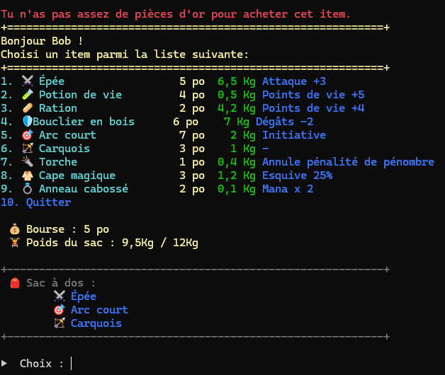

# 🧪 TP2 – Mini-système d’inventaire

---

## 🎯 Objectif du TP2

Bâtir, en console C#, une gestion de l'inventaire du personnage
### Inventaire
- 👤 **Un personnage** avec minimum :
  - un **nom**
  - une **force** (force = poids maximal transportable)
- 🛠️ **Une liste d’équipement** (description, prix, poids, effet)
- 🎒 **Un sac à dos** de taille fixe contenant des indices vers la liste d’équipement
- 📜 **Un menu interactif** qui permet :
  - d’acheter des items  
  - d’ajouter des items au sac  
  - tout en respectant **la bourse** et **la limite de poids**

  

## 🔹 Progression

### Partie 1 – Inventaire
1. Initialiser le personnage  
2. Définir les constantes et la liste d’équipement  
3. Implémenter les petites fonctions (*getters*)  
4. Gérer le sac à dos  
5. Implémenter l’achat  
6. Construire le menu d’équipement  

### Bonus – facultatif
7. Amélioration de l’affichage (facultatif)  

## Étape 1 — Personnage

### 1️⃣ Déclarer les variables globales

```csharp
static string gNomPersonnage = "";
static int gForce = 10;
static int gBourse = 20;
```

---

### 2️⃣ Dans Main

Appeler la fonction `InitialiserPersonnage()` :

```csharp
static void Main(string[] args)
{
    InitialiserPersonnage();
}
```

---

### 3️⃣ Fonction InitialiserPersonnage

Crée la fonction `InitialiserPersonnage` :

```csharp
static void InitialiserPersonnage()
{
    // Ici on a le choix :
    // 1. On peut réutiliser notre code fait au TP1
    // 2. ou initialiser simplement les variables 'gNomPersonnage' et 'gForce'

   
    
}
```

---

### 4️⃣ Fonction Tests

Crée une fonction `Tests` que tu utiliseras pour vérifier chaque nouvelle fonction que tu créeras.

```csharp
static void Tests()
{
    Console.WriteLine($"Nom : {gNomPersonnage}");
    Console.WriteLine($"Force : {gForce}");
    Console.WriteLine($"Bourse : {gBourse} po");
}
```

Appelle-la aussi dans `Main` :

```csharp
static void Main(string[] args)
{
    InitialiserPersonnage();
    Tests();
}
```


### ✅ **Résultat attendu**  
Ton programme affiche le personnage généré avec son nom, sa force et sa bourse de départ.


## Étape 2 — Définir les constantes et la liste d’équipement

### 1️⃣ Constantes

On commence par définir des constantes pour représenter :  

- **Valeurs invalides** (quand un prix ou un poids n’existe pas)  
- **Colonnes de la liste d’équipement** (pour extraire description, prix, poids, effet)

```csharp
const int INVALIDE = -1;               // prix ou poids invalide
const string DESC_INVALIDE = "INVALIDE"; // description invalide

const int EQUIP_DESC = 0;  // Exemple : "Épée"
const int EQUIP_PRIX = 1;  // Exemple : 5 po
const int EQUIP_POIDS = 2; // Exemple : 2,5 Kg
const int EQUIP_EFFET = 3; // Exemple : "Attaque +3", "Points de vie +5"
```

---

### 2️⃣ Liste d’équipement

On crée un tableau de chaînes de caractères (`string[]`).  
Chaque item est représenté par une ligne avec le format suivant :

```
"Nom;Prix;Poids;Effet"
```

Exemple enrichi avec des **emojis Windows** 🎉 :

```csharp
// 👇 Liste d'équipement enrichie + emojis Windows
static string[] gListeEquipement = {
    "🗡️ Épée;5; 6,5 ;Attaque +3",
    "🧪 Potion de vie;4; 0,5 ;Points de vie +5",
    "🥖 Ration;2;4,2;Points de vie +4",
    "🛡 Bouclier en bois;6;7,0;Dégâts -2",
    "🎯 Arc court;7;2,0;Initiative",
    "🏹 Carquois;3;1,0;-",
    "🔦 Torche;1;0,4;Annule pénalité de pénombre",
    "🧥 Cape magique;3;1,2;Esquive 25%",
    "💍 Anneau cabossé;2;0,1;Mana x 2"
};
```

---

### 3️⃣ Vérification

Ajoute un appel dans la fonction `Tests()` pour vérifier que les items sont bien enregistrés :  

```csharp
static void Tests()
{
    Console.WriteLine("=== Liste d’équipement ===");
    for (int i = 0; i < gListeEquipement.Length; i++)
    {
        Console.WriteLine($"Item brut : {gListeEquipement[i]}");
    }
}
```

---

✅ **Résultat attendu** :  
Quand tu exécutes `Tests()`, la console doit afficher la liste brute des items, par exemple :

```
=== Liste d’équipement ===
Item brut : 🗡️ Épée;5; 6,5 ;Attaque +3
Item brut : 🧪 Potion de vie;4; 0,5 ;Points de vie +5
Item brut : 🥖 Ration;2;4,2;Points de vie +4
...
```
---

## Étape 3 — Implémenter les petites fonctions (*getters*)

### 🎯 Objectif

Créer des fonctions qui permettent **d’accéder aux informations d’un item** dans la liste d’équipement.  
Ces fonctions (*getters*) simplifient le code et évitent de répéter la logique de découpage (`Split`) dans tout le programme.

---

### 1️⃣ Les getters à écrire

- `ObtenirPrixEquipement(int indexItem)` → retourne le **prix** d’un item.  
- `ObtenirPoidsEquipement(int indexItem)` → retourne le **poids** d’un item.  
- `ObtenirDescriptionEquipement(int indexItem)` → retourne la **description** (nom) d’un item.  
- `ObtenirEffetEquipement(int indexItem)` → retourne l’**effet** d’un item.  

---

### 2️⃣ Instructions générales

Chaque getter doit :

1. Vérifier si l’index est valide (entre `0` et `gListeEquipement.Length - 1`)  
   - Si invalide → retourner `INVALIDE` (ou `DESC_INVALIDE` pour la description).

2. Récupérer la ligne correspondante dans `gListeEquipement`.  
   - Exemple : `string item = gListeEquipement[indexItem];`

3. Découper la chaîne en utilisant `.Split(';')`.  
   - Cela donne un tableau de sous-chaînes.  
   - Exemple : `string[] infos = item.Split(';');`

4. Retourner la bonne valeur selon la constante :  
   - `EQUIP_PRIX` → prix (convertir en `int`)  
   - `EQUIP_POIDS` → poids (convertir en `double`)  
   - `EQUIP_DESC` → description (string)  
   - `EQUIP_EFFET` → effet (string)

---

### 3️⃣ Pseudo-code : Exemple pour le prix

```pseudo
fonction ObtenirPrixEquipement(indexItem)
    si indexItem < 0 ou indexItem >= longueur(gListeEquipement)
        retourner INVALIDE

    item = gListeEquipement[indexItem]
    infos = item.Split(';')
    prixTexte = infos[EQUIP_PRIX]
    prixNombre = convertir_en_int(prixTexte)
    retourner prixNombre
fin fonction
```

---

### 4️⃣ Test rapide

Dans la fonction `Tests()`, affiche les infos de tous les items :

```csharp
static void Tests()
{
    for (int i = 0; i < gListeEquipement.Length; i++)
    {
        Console.WriteLine(
            $"{ObtenirDescriptionEquipement(i)} " +
            $"- {ObtenirPrixEquipement(i)} po " +
            $"- {ObtenirPoidsEquipement(i)} Kg " +
            $"- Effet : {ObtenirEffetEquipement(i)}"
        );
    }
}
```

---

✅ **Résultat attendu** :  
La console doit afficher une liste lisible avec description, prix, poids **et effet** pour chaque item.


---

## Étape 4 — Gérer le sac à dos

### 🎯 Objectif

Mettre en place les fonctions qui permettent de :

- 📦 Afficher le contenu du sac à dos  
- 🔍 Trouver une case libre dans le sac  
- ➕ Ajouter un item dans le sac (en tenant compte de la place et du poids)  
- ⚖️ Calculer le poids total du sac  

---

### 1️⃣ Constantes et déclaration du sac

```csharp
const int VIDE = -1;      // Espace du sac vide
const int SAC_PLEIN = -1; // Sac plein

// Sac à dos contenant des indices vers la liste d'équipement
static int[] gSacADos = { VIDE, VIDE, VIDE, VIDE, VIDE };
```

👉 Le sac contient uniquement des **indices** pointant vers `gListeEquipement`.  

Exemple :  

- `gSacADos[0] = 2` → premier item du sac est `gListeEquipement[2]` (Ration).  
- `gSacADos[1] = 0` → deuxième item du sac est `gListeEquipement[0]` (Épée).  

---

### 2️⃣ Afficher le sac à dos

But : lister les items présents, ou afficher "Aucun item" si le sac est vide.

```pseudo
fonction AfficherSacADos()
    afficher "Sac à dos :"
    mettre une variable vide = vrai
    pour chaque case du sac
        si case ≠ VIDE
            afficher description de l'item
            vide = faux
    fin pour
    si vide == vrai
        afficher "Aucun item."
fin fonction
```

---

### 3️⃣ Trouver un espace libre

```pseudo
fonction TrouverIndexEspaceLibreSacAdos()
    pour i de 0 à longueur du sac
        si sac[i] == VIDE
            retourner i
    retourner SAC_PLEIN
fin fonction
```

---
### 4️⃣ Calculer le poids du sac

```pseudo
fonction ObtenirPoidsDuSacADos()
    poidsTotal = 0
    pour i de 0 à longueur du sac
        poids = ObtenirPoidsEquipement(sac[i])
        si poids != INVALIDE
            poidsTotal += poids
    retourner poidsTotal
fin fonction
```


---

### 5️⃣ Ajouter un item au sac

But : vérifier les conditions avant d’ajouter.

1. Vérifier s’il reste une case libre avec `TrouverIndexEspaceLibreSacAdos`.  
   - Si aucune → message "Sac plein".

2. Vérifier si le poids total + poids du nouvel item ≤ force du personnage.  
   - Si trop lourd → message "Trop lourd".

3. Sinon, placer l’item dans la case libre.

```pseudo
fonction AjouterAuSacADos(indexItem)
    indexLibre = TrouverIndexEspaceLibreSacAdos()
    si indexLibre == SAC_PLEIN
        afficher "Sac plein"
        retourner faux

    si PoidsDuSac() + PoidsItem(indexItem) > force
        afficher "Item trop lourd"
        retourner faux

    sac[indexLibre] = indexItem
    afficher "Item ajouté au sac"
    retourner vrai
fin fonction
```

---

### ✅ Test rapide

Dans la fonction `Tests()`, ajoutez :

```csharp
// Test 1 : sac vide
AfficherSacADos();
Console.WriteLine($"Poids du sac : {ObtenirPoidsDuSacADos()}");

// Test 2 : ajouter un item valide (ex. une potion)
AjouterAuSacADos(1); // Potion
AfficherSacADos();
Console.WriteLine($"Poids du sac : {ObtenirPoidsDuSacADos()}");

// Test 3 : ajouter plusieurs items
AjouterAuSacADos(0); // Épée
AjouterAuSacADos(2); // Ration
AfficherSacADos();
Console.WriteLine($"Poids du sac : {ObtenirPoidsDuSacADos()}");

// Test 4 : remplir le sac puis tenter d’ajouter encore
for (int i = 0; i < 10; i++)
{
    AjouterAuSacADos(1); // Tentatives multiples
}
AfficherSacADos();
Console.WriteLine($"Poids du sac : {ObtenirPoidsDuSacADos()}");

```

---

### 🎬 Résultat attendu

- **Test 1** → "Aucun item" + poids = 0  
- **Test 2** → Potion ajoutée, poids > 0  
- **Test 3** → Plusieurs items listés, poids augmente  
- **Test 4** → Messages "Sac plein" ou "Trop lourd" quand on dépasse les limites  

## Étape 5 — Achat d’un item

### 🎯 Objectif

Créer une fonction `AcheterItem` qui permet :

- de vérifier si l’item est valide  
- de vérifier si la bourse contient assez d’or  
- d’ajouter l’item au sac à dos si possible  
- de retirer le prix de la bourse lorsque l’achat est réussi  

---

### 1️⃣ Étapes de l’achat

1. Vérifier la validité de l’index  
   - Si invalide → afficher `"Item invalide"` et retourner `false`.  

2. Vérifier la bourse  
   - Si `gBourse < prix` → afficher `"Pas assez de pièces d’or"` et retourner `false`.  

3. Tenter d’ajouter l’item au sac  
   - Si `AjouterAuSacADos` retourne `true`  
     - Déduire le prix de `gBourse`  
     - Retourner `true`  

4. Sinon → retourner `false`.  

---

### 2️⃣ Pseudo-code

```pseudo
fonction AcheterItem(indexItem)
    prix = ObtenirPrixEquipement(indexItem)

    si prix == INVALIDE
        afficher "Item invalide"
        retourner faux

    si gBourse < prix
        afficher "Pas assez d'or"
        retourner faux

    si AjouterAuSacADos(indexItem) == vrai
        gBourse -= prix
        retourner vrai

    retourner faux
fin fonction
```

---

### ✅ Tests rapides

Ajoutez dans `Tests()` :

```csharp
// Test 1 : acheter une potion
AcheterItem(1); // Potion
AfficherSacADos();
Console.WriteLine($"Bourse : {gBourse} po");

// Test 2 : acheter une épée
AcheterItem(0); // Épée
AfficherSacADos();
Console.WriteLine($"Bourse : {gBourse} po");

// Test 3 : tenter d’acheter sans assez d’or
gBourse = 1; // volontairement trop bas
AcheterItem(0); // Essaye d’acheter une épée
Console.WriteLine($"Bourse : {gBourse} po");
```

---

### 🎬 Résultat attendu

- **Test 1** → Potion ajoutée au sac, bourse diminuée de 4 po  
- **Test 2** → Épée ajoutée au sac, bourse diminuée de 5 po  
- **Test 3** → Message `"Pas assez de pièces d’or"`, sac inchangé, bourse inchangée  

## Étape 6 — Menu interactif d’équipement

### 🎯 Objectif

Mettre en place un **menu en console** qui permet au joueur :

- de voir la liste des équipements disponibles  
- de choisir un item à acheter  
- de voir sa bourse et le poids total de son sac à dos  
- de quitter l’achat quand il le souhaite  

Ce menu boucle tant que le joueur ne choisit pas l’option *Quitter*.

---

### 1️⃣ Structure générale

```pseudo
fonction ChoisirEquipementDeDepart()
    répéter indéfiniment
        afficher message de bienvenue + nom du personnage
        afficher la liste des items (description, prix, poids, effet)
        afficher option Quitter

        afficher la bourse et le poids du sac
        afficher le contenu du sac

        lire le choix de l’utilisateur

        si choix == Quitter
            sortir de la boucle

        sinon si choix valide
            appeler AcheterItem(choix - 1)

        sinon
            afficher "Choix hors liste"
fin fonction
```

---

### 2️⃣ Points importants

- Utiliser les getters (`ObtenirDescriptionEquipement`, `ObtenirPrixEquipement`, `ObtenirPoidsEquipement`, `ObtenirEffetEquipement`).  
- Le menu doit **se répéter** jusqu’à ce que l’utilisateur choisisse *Quitter*.  
- Si le choix est invalide, afficher un message d’erreur clair.  

---

### 3️⃣ Exemple de sortie console

```
Bonjour Aragon !
Choisi un item parmi la liste suivante :

1. 🗡️ Épée               5 po   6.5 Kg  Attaque +3
2. 🧪 Potion de vie       4 po   0.5 Kg  Points de vie +5
3. 🥖 Ration              2 po   4.2 Kg  Points de vie +4
4. 🛡 Bouclier en bois    6 po   7.0 Kg  Dégâts -2
...
10. Quitter

💰 Bourse : 20 po
🏋️ Poids du sac : 0 Kg / 10 Kg

🎒 Sac à dos :
Aucun item.

▶  Choix :
```

---

### ✅ Tests rapides

Dans la fonction `Tests()` ou directement via `Main()` :

```csharp
ChoisirEquipementDeDepart();
```

- **Test 1** → Entrer un nombre invalide → message `"Choix hors liste"`.  
- **Test 2** → Acheter une potion → sac contient une potion, bourse diminuée.  
- **Test 3** → Acheter trop d’items → messages `"Sac plein"` ou `"Trop lourd"`.  
- **Test 4** → Choisir l’option *Quitter* → retour au programme principal.  

---

### 🎬 Résultat attendu

Le joueur interagit avec un menu simple en console, peut acheter des items tant qu’il a de l’or et de la place, et sort avec l’option *Quitter*.


---

### 🎯 Objectif

Créer un **menu interactif** permettant au joueur de se déplacer dans le donjon jusqu’à ce qu’il choisisse de quitter.

---


### 1️⃣ Instructions

1. Créer une fonction `MenuNavigation()`.
2. Marquer la case de départ comme visitée (`donjonVisite[posX, posY] = true;`).
3. Dans une boucle infinie (`for(;;)` ou `while(true)`), faire :  
   - Afficher le donjon (`AfficherDonjon()`)  
   - Afficher les options de déplacement (`AfficherOptionsDeplacement()`)  
   - Afficher l’option `Q → Quitter`  
   - Lire le choix de l’utilisateur  
   - Si choix = `Q` → sortir de la fonction  
   - Sinon → appeler `DeplacerJoueur(choix)`  
4. Répéter tant que l’utilisateur n’a pas quitté.

---

### 2️⃣ Pseudo-code

```pseudo
fonction MenuNavigation()
    marquer la case (posX, posY) comme visitée

    répéter indéfiniment
        afficher donjon
        afficher options de déplacement
        afficher "Q → Quitter"

        lire le choix du joueur

        si choix == "Q"
            sortir de la boucle

        sinon
            DeplacerJoueur(choix)
fin fonction
```

---

### 3️⃣ Test rapide

Ajoute dans `Main()` :

```csharp
MenuNavigation();
```

---

### 🎬 Résultat attendu

- Le joueur voit le donjon et sa position (`😃`).  
- Les salles visitées changent de couleur (ou état).  
- Les options de déplacement disponibles s’affichent selon la position.  
- Entrer une direction valide → déplace le joueur.  
- Entrer `Q` → quitte la navigation.  

# 🎨 Bonus – Amélioration de l’affichage (Facultatif)

---
## Étape 7 — Amélioration de l’affichage (Facultatif)
### 🎯 Objectif

Rendre l’affichage du menu et du sac à dos plus agréable visuellement en utilisant :

- ✅ Les **emojis** et caractères Unicode  
- ✅ Les **barres ASCII**  
- ✅ La **couleur** (`Console.ForegroundColor`)  
- ✅ Le **nettoyage d’écran** (`Console.Clear()`)  
- ✅ Le **padding** pour aligner les colonnes  

Ces améliorations sont **facultatives** et n’influencent pas la logique du programme.

---


### 1️⃣ Activer les emojis et caractères étendus

```csharp
// Activer les emojis et caractères étendus (Windows)
Console.OutputEncoding = System.Text.Encoding.UTF8;
```

Cela permet d’afficher des icônes comme 🎒, ⚔, 💰 directement dans la console.

---

### 2️⃣ Barres ASCII décoratives

```csharp
// Design ASCII
static string gBar = "+===========================================================+";
static string gBarThin = "+-----------------------------------------------------------+";
```

👉 Utilisez `Console.WriteLine(gBar);` pour encadrer le menu ou le contenu du sac.

---

### 3️⃣ Nettoyer l’écran avant d’afficher le menu

```csharp
Console.Clear();
```

👉 Cela permet de supprimer l’affichage précédent et de montrer uniquement le menu actuel.

---

### 4️⃣ Couleur de texte

```csharp
Console.ForegroundColor = ConsoleColor.Yellow;
Console.WriteLine("Texte en jaune");

Console.ForegroundColor = ConsoleColor.Red;
Console.WriteLine("Erreur : pas assez de pièces d’or !");

Console.ResetColor();
```

👉 Toujours remettre les couleurs par défaut avec `Console.ResetColor()`.

---

### 5️⃣ Aligner les colonnes avec padding

```csharp
// Exemple dans une boucle d’affichage des items
Console.Write($"{i + 1}. {ObtenirDescriptionEquipement(i),-20} ");
Console.Write($" {ObtenirPrixEquipement(i),4} po");
Console.Write($" {ObtenirPoidsEquipement(i),4} Kg");
Console.WriteLine($" {ObtenirEffetEquipement(i),-8}");
```

- `,-20` → réserve 20 caractères pour aligner les noms d’items à gauche.  
- `,4` → réserve 4 caractères, alignés à droite (utile pour les nombres).  

👉 Résultat : une liste bien alignée même si les noms/prix/poids ont des tailles différentes.

## 🧾 Grille de correction (TP2)

| Élément de correction | Barème | Pondération |
|--- | ---: | ---: | 
| Affichage de la liste d'équipement | 10 / 8 / 6 / 3 / 0 | 15 points |
| Affichage du sac à dos | 10 / 8 / 6 / 3 / 0 | 20 points |
| Achat d'un item | 10 / 8 / 6 / 3 / 0 | 50 points |
| Fonctionnement du menu | 10 / 8 / 6 / 3 / 0 | 15 points |
| Bonus (Affichage avancé) | 10 / 8 / 6 / 3 / 0 | 10 points |
| **Total** |  | **100 points** |

### ✅ Barème

Le tableau ci‑dessous décrit ce que signifient les notes 10 / 8 / 6 / 3 / 0 pour un élément évalué.

| Niveau | Critères (description) | Score |
|---|---|---:|
| Excellent | Les critères d'évaluation sont atteints et le code est exemplaire : lisible, bien structuré, sans bugs, commentaires appropriés et gestion des cas limites. | 10 |
| Très bien | La plupart des critères d'évaluation sont atteints. Quelques lacunes mineures n'empêchent pas la bonne exécution de la fonctionnalité. | 8 |
| Correct | Plusieurs lacunes sont constatées et nuisent partiellement à l'application (bugs mineurs, code répétitif, validations incomplètes). | 6 |
| Insuffisant | Les lacunes sont telles que l'application ne peut pas fonctionner convenablement (fonction manquante, grosse erreur logique, validations absentes). | 3 |
| Inexistant | Non réalisé : la fonctionnalité est absente ou ne compile pas. | 0 |

