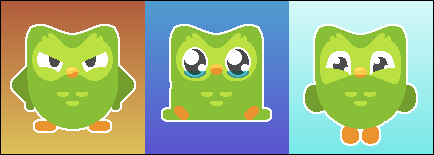
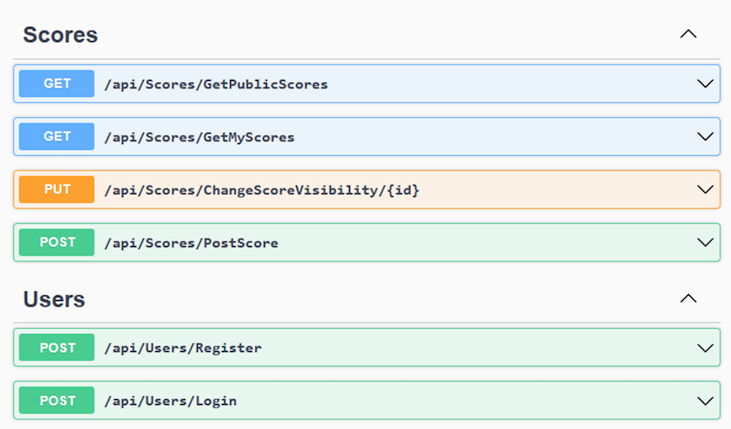
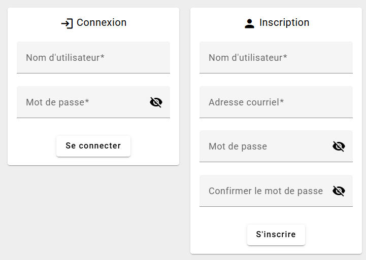
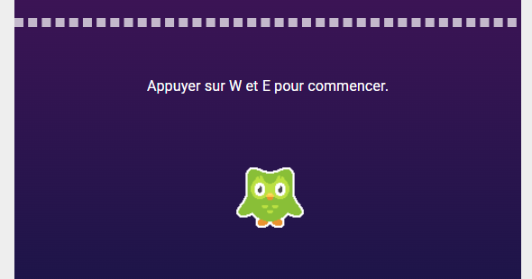
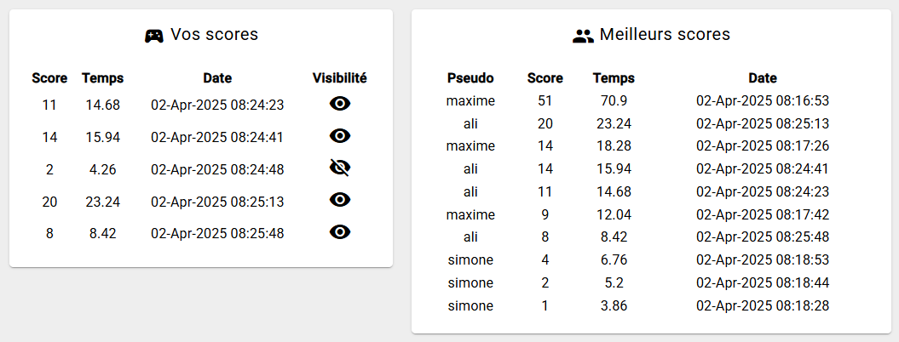

# TP3 - Flappy Birb (10%)

Le [projet Angular est fourni](../../static/files/tp3.zip) pour ce TP. 

Vous devrez créer le serveur Web API **à partir de zéro**. 

Une fois le serveur ASP.NET Core créé, vous êtes invités à immédiatement taper la commande `dotnet new gitignore` en vous situant dans le dossier de votre projet serveur. Sinon, vous pouvez aussi créer manuellement un fichier nommé `.gitignore` et ajouter trois lignes dedans : `.vs`, `bin` et `obj`.

## 📝 Consignes

* 📅 Date de remise : **19 avril 23h59**
* 🏗 Les frameworks Angular et ASP.NET Core doivent être utilisés.
* 👤 Le projet doit être fait individuellement. Attention au plagiat.
* ⏰ Vous avez 2 cours (6h en classe !) consacrés au TP, **profitez-en**.
* 🖥 Il faudra respecter la structure du projet Angular fourni et le rendre fonctionnel.
* 🥚 Il est obligatoire de créer un nouveau projet ASP.NET Core de zéro. **Il est interdit de partir d'un laboratoire existant !**

En résumé, nous complèterons un **projet Web client Angular** et créerons un **projet Web serveur ASP.NET Core** qui collaboreront ensemble pour proposer un jeu et un système de classement (scoreboard) à des utilisateurs authentifiés.

:::danger
 
Si votre travail est suspecté de plagiat (code copié d'un(e) autre étudiant(e), code généré par IA, notions non abordées en classe, etc.), deux choses peuvent se produire :
 
* Le plagiat est prouvé par nos outils : Note de 0, automatiquement.
* Le plagiat est plutôt évident, mais une validation est requise : vous serez convoqué(e) au bureau de votre enseignant(e). Vous devrez répondre à certaines questions pour prouver que vous comprenez et maîtrisez le code qui a été utilisé dans votre TP. Si vous ne réussissez pas à répondre à certaines questions, vous aurez la note de 0. (Si vous ne comprenez pas votre propre code, c'est que vous avez plagié, d'une manière ou d'une autre.)
 
:::

Voici une vue d'ensemble des requêtes à implémenter :

## 👥 Gestion des utilisateurs

Il faut qu'on puisse s'inscrire, se connecter et se déconnecter. Le fonctionnement doit correspondre à celui enseigné dans ce cours.

## 🏆 Création de scores 

Il est possible de sauvegarder (créer) un score après avoir joué. Pour savoir quelles sont les propriétés d'un score, vérifiez la question **📊 Afficher les scores**.

## 📊 Afficher les scores

Si on est **authentifié**, on peut voir nos scores personnels. (À gauche) En cliquant sur l'oeil 👁 à côté d'un score, on peut le rendre privé / public. C'est **la seule** propriété d'un score qui est modifiable.

Qu'on soit **authentifié ou non**, on peut voir les **10 meilleurs scores publics**, **classés par score décroissant**.

:::warning

Lorsqu'on modifie la visibilité d'un score, trouvez le moyen de mettre à jour immédiatement la liste des scores publics affichés. Il faut également modifier l'oeil 👁 du score : un oeil biffé veut dire privé, un oeil normal veut dire public.

:::

## 🤬 Suppléments agaçants

* 🔒 L’accès aux données et la modification des données doit être sécuritaire.
* ⚙ Le projet ASP.NET Core doit posséder un service pour les scores. (Interdit d'injecter le **DbContext** dans un contrôleur)
* 📬 Le projet Angular doit utiliser un service pour les requêtes HTTP.
* 📶 Un **intercepteur** doit être utilisé pour joindre le token d’authentification aux requêtes dans le projet Angular.
* 🌱 Un seed doit être complété : deux utilisateurs et quatre scores doivent être inclus dans la base de données par défaut. (Chaque utilisateur doit posséder un score privé et un score public)

:::warning

⛔ Précision sur un bug mineur connu :

Dans le projet Angular de départ, **lorsqu’on quitte le composant `Play`**, la page Web est **réactualisée**. (C’est nécessaire pour que l’état du jeu ne se duplique pas en revenant plus tard sur `Play`) Donc si on est sur le composant `Play` et qu’on va vers un autre composant (`Login` ou `Scores`), **on observera un petit hoquet et la page Web sera rafraîchie**.

Un symptôme courant est d’observer une erreur dans la console du navigateur lorsqu’on lance une requête dans la fonction `ngOnInit()` du composant `Scores`. Pas de panique, la requête restera fonctionnelle une fois la page rafraîchie et vous ne perdrez pas de points. Mettre une requête à cet endroit risque d’être nécessaire dans tous les cas.

:::

## ✅ Grille de correction

|Critère|Points|
|:-|:-|
|**👥 Gestion des utilisateurs** * Inscription * Connexion * Déconnexion| 0.5 pt 0.75 pt 0.25 pt|
|**🏆 Gestion des scores** * Création de scores * Modifier la visibilité d'un score * Afficher les scores publics * Afficher nos scores personnels| 1 pt 1.25 pt 1 pt 0.5 pt|
|**⛄ Divers** * L'application est sécuritaire * Le seed est réalisé tel que demandé * Usage d'un service côté serveur * Usage d'un service côté client * Usage d'un intercepteur| 1 pt 1 pt 1 pt 0.25 pt 0.5 pt|
|**📰 Git** * Respect des contraintes départementales * Au moins 6 commits cohérents * Enseignant(e) invité(e) avant la remise| 0.5 pt 0.25 pt 0.25 pt|
|**☢ Pénalités possibles** * Pénalité par tranche de 24h entamée * Retard de 6 jours ou plus * Interface client Angular déformé ou non respecté * Réutilisation d'un labo au lieu d'avoir créé un projet serveur| -10% -100% -2 pts -2 pts|
|Total|10 pts|

