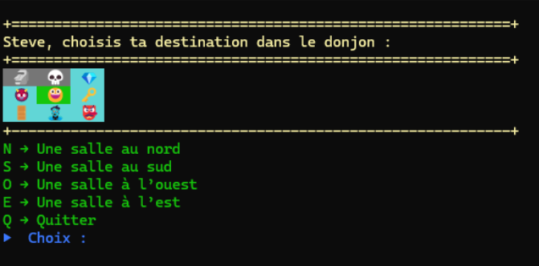
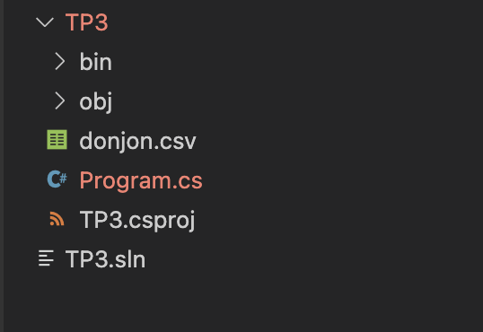
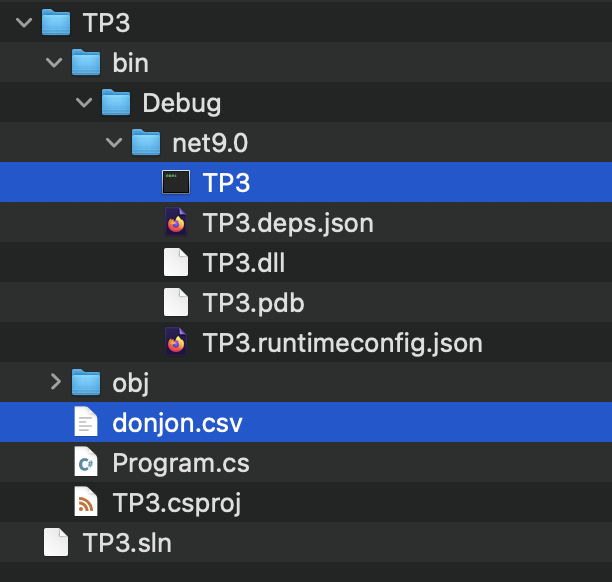
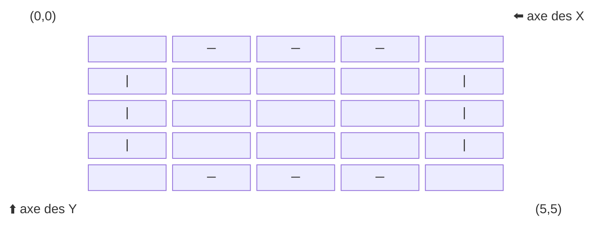
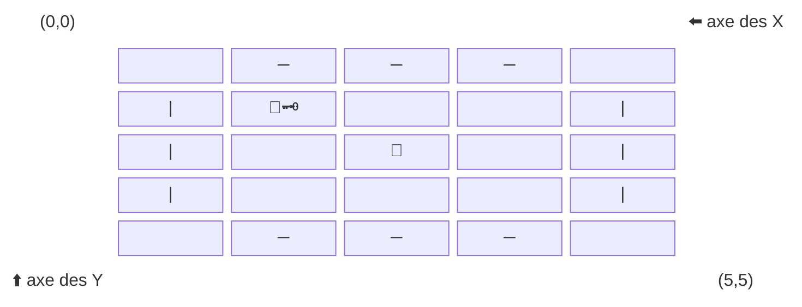

# 🧪 TP3 – Super RPG Infini

---

## 🎯 Objectif du TP3

Bâtir, en console C#, un petit jeux en trois parties :

### Partie 1 – Navigation dans un donjon
- 🏰 **Un donjon 3x3** représenté par une grille
- 👣 **Déplacement du joueur** (Nord, Sud, Est, Ouest)
- ✅ **Suivi des salles visitées**
- 🎭 **Affichage de la position du joueur** et du donjon en console
- 🔄 **Boucle de navigation** avec option *Quitter*
- 🏆 **Fin de partie**



---

### Partie 2 – Créer de nouveaux donjons
- Préparer le fichier donjon.csv
- Charger le nouveau donjon

### Partie 3 – Évènements dans les salles du donjon
- 🎭 **Affichage avancée** du donjon et de la position du joueur
- Évènements dans les salles du donjon
- Résolution des évènements
- Fin de la partie avancée

---


## 🔹 Progression

##### Partie 1 – Donjon
1. Définir les variables et le tableau du donjon  
2. Afficher le donjon avec la position du joueur  
3. Proposer des déplacements valides (N, S, E, O)  
4. Mettre à jour la position et marquer les salles visitées
5. Créer un menu de navigation complet
6. Fin de la partie

---
## 🏰 Partie 1 – Navigation dans un donjon

---
### Étape 1 — Définir les variables et le tableau du donjon

#### 🎯 Objectif

Mettre en place un **donjon simple sous forme de grille (3x3)** dans lequel le joueur pourra se déplacer.  
Chaque salle est représentée par un emoji pour rendre l’affichage plus visuel.

---


#### 1️⃣ Définir le donjon

On utilise un **tableau à 2 dimensions (`string[,]`)** pour représenter le donjon.  
Chaque case contient un symbole qui représente une salle.

```csharp
// Ajout d'un donjon (3x3)
static string[,] donjon = new string[3, 3]
{
    { "🗿", "💀", "💎" },
    { "👹", "🧙‍", "🗝" },
    { "🚪", "🧟", "👺" }
};
```

👉 Ici le donjon est une **grille de 3 lignes × 3 colonnes**.  
Exemple visuel :

```
🗿   💀   💎
👹   🧙‍   🗝
🚪   🧟   👺
```

---

#### 2️⃣ Suivi des salles visitées

On doit savoir si une salle a déjà été visitée par le joueur ou non.  
On crée donc un **tableau parallèle de booléens (`true` ou `false`)** :

```csharp
// Pour savoir si une pièce a été visitée ou non
static bool[,] donjonVisite = new bool[3, 3];
```

👉 Au départ toutes les cases contiennent `false` (non visitées).  
On mettra `true` lorsqu’un joueur entre dans une salle.

---

#### 3️⃣ Position du joueur

On garde la position du joueur avec deux entiers :

```csharp
// Position du joueur dans le donjon
static int positionLigne = 0, positionColonne = 0;
```

- `positionLigne` → ligne (0 = première ligne, 1 = deuxième, etc.)  
- `positionColonne` → colonne (0 = première colonne, 1 = deuxième, etc.)  

👉 Au départ le joueur est placé en haut à gauche (0,0).

---

#### ✅ Test rapide

Ajoute un affichage temporaire dans `Tests()` :

```csharp
Console.WriteLine("=== Donjon initial ===");
for (int ligne = 0; ligne < donjon.GetLength(0); ligne++)
{
    for (int colonne = 0; colonne < donjon.GetLength(1); colonne++)
    {
        Console.Write(donjon[ligne, colonne] + " ");
    }
    Console.WriteLine();
}

Console.WriteLine($"Position du joueur : ({positionLigne},{positionColonne})");
```

#### 🎬 Résultat attendu

```
=== Donjon initial ===
🗿 💀 💎 
👹 🧙‍ 🗝 
🚪 🧟 👺 
Position du joueur : (0,0)
```

---

👉 Prochaine étape : afficher le donjon **avec la position du joueur mise en évidence** (par exemple avec "😃" à la place de la case).

### Étape 2 — Afficher le donjon avec la position du joueur

#### 🎯 Objectif

Mettre en place une fonction qui permet :

- d’afficher le donjon (3x3) en console  
- de montrer la position du joueur avec un emoji distinct (ex. 😃)  
- de différencier les salles visitées et non visitées  

---

#### 1️⃣ Instructions

1. Parcourir toutes les cases du donjon avec **deux boucles imbriquées** (une pour les lignes, une pour les colonnes).  
2. Pour chaque case :  
   - Si la position du joueur correspond à la case (`positionLigne`, `positionColonne`) → afficher un emoji spécial pour représenter le joueur.  
   - Sinon → afficher l’emoji de la salle.  
3. Modifier la couleur ou le style selon si la salle a déjà été visitée (`donjonVisite[ligne, colonne] == true`).  
4. N’oubliez pas de revenir à la ligne après chaque rangée pour bien afficher la grille 3x3.  
5. 💡 Astuce : vous pouvez aussi changer la **couleur de fond** avec `Console.BackgroundColor` pour encore mieux différencier les cases.  

---

#### 2️⃣ Pseudo-code

```pseudo
fonction AfficherDonjon()
    pour ligne de 0 à 2
        pour colonne de 0 à 2
            si (ligne == positionLigne et colonne == positionColonne)
                afficher "emoji joueur"
            sinon si (donjonVisite[ligne, colonne] == vrai)
                afficher "emoji de la salle en mode visité"
            sinon
                afficher "emoji de la salle en mode non visité"
        fin pour
        saut de ligne dans la console
    fin pour
fin fonction
```

---

#### 3️⃣ Test rapide

Dans votre fonction `Tests()` :  

- Marquez la salle de départ comme visitée (`donjonVisite[positionLigne, positionColonne] = true`).  
- Appelez `AfficherDonjon()`.  
- Simulez la visite d’une autre salle en modifiant `donjonVisite[ligne, colonne]` et affichez de nouveau.  

---

#### 🎬 Résultat attendu

- Le joueur apparaît avec un emoji distinct (😃 par exemple).  
- Les salles visitées apparaissent dans un style différent (ex. gris).  
- Les salles non visitées apparaissent normales (ex. cyan).  
- On peut aussi utiliser une **couleur de fond différente** pour mieux distinguer les cases.  
- La grille 3x3 du donjon est correctement affichée.  

---

### Étape 3 — Afficher les options de déplacement

#### 🎯 Objectif

Permettre au joueur de voir **dans quelles directions il peut se déplacer** à partir de sa position actuelle dans le donjon.

---

#### 1️⃣ Schéma du donjon (coordonnées)

```
    (0, 0) ──► colonne

      │
      ▼
    ligne
```

- `positionLigne` → position verticale (lignes)
- `positionColonne` → position horizontale (colonnes)

---

#### 2️⃣ Instructions

1. Crée une fonction `AfficherOptionsDeplacement()`.
2. Vérifie la position actuelle du joueur avec `positionLigne` et `positionColonne`.
3. Si un déplacement est possible, affiche la direction correspondante :
   - Nord (N) → `positionLigne > 0`
   - Sud (S) → `positionLigne < donjon.GetLength(0) - 1`
   - Ouest (O) → `positionColonne > 0`
   - Est (E) → `positionColonne < donjon.GetLength(1) - 1`
4. Si une direction n’est pas possible (bord du donjon), ne rien afficher pour cette direction.

---

#### 3️⃣ Pseudo-code

```pseudo
fonction AfficherOptionsDeplacement()
    si positionLigne > 0
        afficher "N → Une salle au nord"

    si positionLigne < donjon.GetLength(0) - 1
        afficher "S → Une salle au sud"

    si positionColonne > 0
        afficher "O → Une salle à l’ouest"

    si positionColonne < donjon.GetLength(1) - 1
        afficher "E → Une salle à l’est"
fin fonction
```

---

#### ✅ Test rapide

Ajoute dans ta fonction `Tests()` :

```csharp
AfficherOptionsDeplacement();
```

Déplace manuellement `positionLigne` et `positionColonne` pour vérifier que les directions affichées sont correctes selon la position.

---

#### 🎬 Résultat attendu

- Si le joueur est en haut à gauche `(0,0)` → seulement Est et Sud sont possibles.  
- Si le joueur est au centre `(1,1)` → toutes les directions sont possibles.  
- Si le joueur est en bas à droite `(2,2)` → seulement Nord et Ouest sont possibles.  

### Étape 4 — Menu de navigation

#### 🎯 Objectif

Créer un **menu interactif** permettant au joueur de se déplacer dans le donjon jusqu’à ce qu’il choisisse de quitter.

---


#### 1️⃣ Instructions

1. Créer une fonction `MenuNavigation()`.
2. Marquer la case de départ comme visitée (`donjonVisite[positionLigne, positionColonne] = true;`).
3. Dans une boucle infinie (`for(;;)` ou `while(true)`), faire :  
   - Afficher le donjon (`AfficherDonjon()`)  
   - Afficher les options de déplacement (`AfficherOptionsDeplacement()`)  
   - Afficher l’option `Q → Quitter`  
   - Lire le choix de l’utilisateur  
   - Si choix = `Q` → sortir de la fonction  
   - Sinon → appeler `DeplacerJoueur(choix)`  
4. Répéter tant que l’utilisateur n’a pas quitté.

---

#### 2️⃣ Pseudo-code

```pseudo
fonction MenuNavigation()
    marquer la case (positionLigne, positionColonne) comme visitée

    répéter indéfiniment
        afficher donjon
        afficher options de déplacement
        afficher "Q → Quitter"

        lire le choix du joueur

        si choix == "Q"
            sortir de la boucle

        sinon
            DeplacerJoueur(choix)
fin fonction
```

---

#### 3️⃣ Test rapide

Ajoute dans `Main()` :

```csharp
MenuNavigation();
```

---

#### 🎬 Résultat attendu

- Le joueur voit le donjon et sa position (`😃`).  
- Les salles visitées changent de couleur (ou état).  
- Les options de déplacement disponibles s’affichent selon la position.  
- Entrer une direction valide → déplace le joueur.  
- Entrer `Q` → quitte la navigation.  


### Étape 5 — Déplacer le joueur

#### 🎯 Objectif

Mettre à jour la **position du joueur** dans le donjon en fonction du choix de direction, et marquer la nouvelle salle comme visitée.

---

#### 1️⃣ Instructions

1. Créer une fonction `DeplacerJoueur(string choix)`.
2. Vérifier la direction choisie (`N`, `S`, `O`, `E`).
3. Mettre à jour `positionLigne` ou `positionColonne` seulement si le déplacement est possible (ne pas sortir du donjon).
4. Si le choix est invalide → afficher `"Choix invalide."`.
5. Marquer la nouvelle position comme **visitée** dans `donjonVisite`.

---

#### 2️⃣ Pseudo-code

```pseudo
fonction DeplacerJoueur(choix)
    si choix == "N" et positionLigne > 0
        positionLigne--
    sinon si choix == "S" et positionLigne < donjon.GetLength(0) - 1
        positionLigne++
    sinon si choix == "O" et positionColonne > 0
        positionColonne--
    sinon si choix == "E" et positionColonne < donjon.GetLength(1) - 1
        positionColonne++
    sinon
        afficher "Choix invalide"

    donjonVisite[positionLigne, positionColonne] = vrai
fin fonction
```

---

#### 3️⃣ Test rapide

Ajoute dans ta fonction `Tests()` :

```csharp
positionLigne = 1; positionColonne = 1; // départ au centre
AfficherDonjon();

DeplacerJoueur("N"); // vers le nord
AfficherDonjon();

DeplacerJoueur("O"); // vers l’ouest
AfficherDonjon();

DeplacerJoueur("X"); // choix invalide
```

---

#### 🎬 Résultat attendu

- Le joueur (`😃`) se déplace dans le donjon selon les directions valides.  
- Si une case est revisitée → elle reste marquée comme visitée (`donjonVisite[ligne, colonne] = true`).  
- Un choix invalide affiche `"Choix invalide."` et ne déplace pas le joueur.  

### Étape 6 — Fin de la partie

#### 🎯 Objectif

Valider que le joueur la position du jouer et regarder s'il a récupérer la clé.

---

#### 1️⃣ Instructions
1. Ajouter une variable globale pour savoir le joueur possede la clé
```csharp
// Devient true lorsqu'on est sur "🗝"
static bool possedeCle = false;
```
👉 Lorsque l'on se déplace dans la salle contenant `"🗝"`, la variable `possedeCle` devient égale à `true`
2. Créer une fonction `FinDePartie()`.
3. Vérifier si le joueur est sur la porte de sortie `"🚪"`.
4. Vérifier si le joueur a récupérer la clé pour débarrer la porte `"🗝"`.
5. Si le joueur est sur la porte, **mais il n'est pas en possession de la clé**, afficher `"La porte est verrouillée. Vous avez besoin de la clé."`.
6. Si le joueur est sur la porte **et qu'il possede la clé**, afficher un message de victoire `"  🎉 Victoire! 🥳  "` et **retourne la valeur `true`**.

---

#### 2️⃣ Pseudo-code

```pseudo
fonction FinDePartie()
    si donjon[positionLigne, positionColonne] != "🚪"
        retourne faux
    
    si !possedeCle
        afficher "La porte est verrouillée. Vous avez besoin de la clé."
        retourne faux
    sinon
        afficher "  🎉 Victoire! 🥳  "
        retourne vrai
fin fonction
```

---

#### ✅ Test rapide

Ajoute dans ta fonction `Tests()` :

```csharp
possedeCle = false;
positionLigne = 2; positionColonne = 0; // départ sur la porte
FinDePartie(); // On a besoin de la clé

positionLigne = 0; positionColonne = 0; // une position différente de la porte
FinDePartie(); // On n'est pas sur la porte, la fonction n'affiche rien

possedeCle = true;
positionLigne = 2; positionColonne = 0; // départ sur la porte
FinDePartie(); // Victoire!
```

---

#### 🎬 Résultat attendu

- Lorsque le joueur est sur une casse différente de `"🚪"`, la fonction n'affiche rien et elle retourne `false`.
- Lorsque le joueur est sur une casse différente de `"🚪"`, mais qu'il ne possède pas la `"🗝"`, la fonction affiche que la porte est barrée et elle retourne `false`.  
- Lorsque le joueur est sur la casse `"🚪"` et qu'il possèede la `"🗝"`, la fonction affiche un message de victoire, elle retourne `true` et le jeu se termine (on quitte la boucle du menu de navigation).
:::danger Attention!
Tu devras placer la fonction FinDePartie() au bon endroit dans ta boucle du menu de navigation pour être capable de quitter le seul lors de la victoire
:::
---


## 🔹 Progression

##### Partie 2 – Créer de nouveaux donjons
1. Préparer le fichier donjon.csv
2. Charger le nouveau donjon

---
## 🗺️ Partie 2 – Créer de nouveaux donjons

---
### Étape 1 — Préparer le fichier donjon.csv

#### 🎯 Objectif

Mettre en place un **fichier csv (donjon.csv)** dans lequel le vous pourrez créer de nouvelles cartes pour votre jeu. 

---


#### 1️⃣ Définir le donjon

On reprendra le donjon de base.

```csharp
static string[,] donjon = new string[3, 3]
{
    { "🗿", "💀", "💎" },
    { "👹", "🧙‍", "🗝" },
    { "🚪", "🧟", "👺" }
};
```

On pourra ensuite le transformer en fichier csv
```
🗿;💀;💎
👹;🧙‍;🗝
🚪;🧟;👺
```

Sauvegarder donjon.csv à la **racine de votre projet** (dans le même dossier que Program.cs)
<Row>
<Column>



</Column>
<Column>

</Column>
</Row>

---

#### ✅ Test rapide

Ouvrir le fichier `donjon.csv` avec **Excel**.

### Étape 2 — Charger le nouveau donjon

#### 🎯 Objectif

Lire le fichier donjon.csv au lancement de l'application et placer le donjon lu dans la variable `string[,] donjon`.

---


#### 1️⃣ Instructions

1. Créer une fonction `ChargerDonjonCSV()`.
2. Trouver le chemin du projet.
3. Ouvrir le fichier donjon.csv.
4. Lire le contenu du fichier.
5. Assigner le contenu du fichier à la variable `string[,] donjon`.

---

#### 2️⃣ Pseudo-code

```pseudo
fonction ChargerDonjonCSV()
    chemin = chemin vers donjon.csv

    lignes = new List<string>();
    ouvrir le fichier

    répéter tant que ce n'est pas la fin du fichier
        Lire une fichier
        ajouter la ligne à la liste `lignes`

    nbLignes = Compter le nombre de lignes
    nbColonnes = Compter le nombre de colonnes

    réinitialiser donjon avec la bonne taille
    réinitialiser donjonVisite avec la bonne taille

    répéter pour chaque ligne

        récupérer la ligne courante dans la liste
        // séparer les éléments de la ligne
        elements = ligne.split(";")

        répéter pour chaque colonne
            assigner l'élément à la bonne case du donjon

    fermer le fichier
fin fonction
```

---

#### 3️⃣ Trouver le chemin vers le fichier

Pour trouver le chemin du fichier donjon.csv, nous utiliserons l'emplacement de programme comme point de départ. Toutefois, le programme est exécuter dans le dossier bin/Debug/net8.0 si l'on utilise .net 8 ou sinon bin/Debug/net9.0 pour la version 9 de .net.
Nous devrons donc revenir vers l'arrière de 3 dossiers en utilisant le chemin relatif.

<Row>
<Column>



</Column>
<Column>

</Column>
</Row>

##### Comment faire

```csharp
// new DirectoryInfo() donne l'emplacement du programme compilé
// donc le dossier_tp3/bin/Debug/net8.0/ ou encore dossier_tp3/bin/Debug/net9.0/ 
// on remonte de trois niveaux pour atteindre le dossier du projet
DirectoryInfo di = new DirectoryInfo("../../../");      
// On utilise di.FullName pour obtenir le chemin complet du dossier du projet
StreamReader objFichier = new StreamReader(di.FullName + "/donjon.csv");
```

---

#### 4️⃣ Utiliser une liste `List`

##### Référence

Vous pouvez vous référez au besoin à la documention de [Notions C#](https://info.cegepmontpetit.ca/notions-csharp/documentation/liste-generique-list-t)

:::info C'est quoi une liste
- Une liste est une `collection` de variables ou d'objets. 
- Dans le contexte du cours de 1P6, la liste ressemble beaucoup à un tableau 1D
    - **La différence** c'est que la **taille du tableau est fixe** dès le départ, alors qu'une **liste s'agrandie** lorsqu'on lui ajoute un item. 
:::

##### Créer une liste
On crée une nouvelle liste avec le **mot clé** `new` plus de détail
```csharp
List<string> lignesDuFichier = new List<string>();
```
- `List` type utilisé pour créer une liste
- `<string>` type de données contenu dans la liste
    - L'équivalent pour un tableau serait `string[]`
- `new List<string>()` création d'une nouvelle liste
    - L'équivalent pour un tableau serait `new string[taille]`
    - Pour le tableau `taille` doit être connu dès le départ

##### Ajouter des données

Il suffit d'utiliser la fonction `Add`
```csharp
List<string> liste = new List<string>();

liste.Add("nouveau texte dans la liste");
```

##### Lire les données

On peut lire les donner comme un tableau
```csharp
List<int> liste = new List<int>();
// ...
int deuxiemeElement = liste[1] // pour accéder à l'item à l'index 1

// parcourir la liste pour accéder aux éléments 1 à 1
for(int i = 0; i < liste.Length; i++) 
{
    int element  = liste[i];
}
```

##### Besoin d'en plus?

Pour avoir plus d'informations, pouvez vous référez à la documention de [Notions C#](https://info.cegepmontpetit.ca/notions-csharp/documentation/liste-generique-list-t)

---

#### ✅ Test rapide

Ajoute dans `Tests()` :

```csharp

AfficherDonjon();
```
---

#### 🎬 Résultat attendu

- Le nouveau donjon devrait pourvoir s'afficher correctement!


## 🔹 Progression

##### Partie 1 – Évènements
- Évènements dans les salles du donjon
- Résolution des évènements
- Fin de la partie avancée

## 🗺️ Partie 3 – Évènements dans les salles du donjon

#### 🎯 Objectif

Lorsqu'on se déplace, nous pourrons maintenant intérragir avec les différentes salles du donjon.

---

#### 1️⃣ Instructions

1. Déclancher un évènement en arrivant sur une salle.
2. Déterminer le type d'évènement de la salle.
3. Utiliser un item au besoin.
4. Résoudre l'évènement
5. Fin de la partie par manque de PV

---


## 🗺️ Bonus

---

### Étape 1 — 🎭 **Affichage avancée**

#### 🎯 Objectif

Afficher le donjon par salle, cacher les salles qui n'ont pas été utilisés, utiliser notre personnage et transporter la clé!

---

#### 1️⃣ Instructions

1. Créer une fonction `AfficherSalle`.
2. Créer une constante pour la taille de la salle
    - `const int TAILLE_SALLE = 5;`
2. Position le correctement le curseur dans l'écran.
3. Afficher les murs de la salle.
4. Afficher le personnage.
5. Afficher la clé avec le personnage.
6. Afficher le contenu de la salle.
7. Créer une fonction `AfficherDonjonPlusPlus`.

---

#### 2️⃣ La logique
Ajouter 2 constantes pour le afficher les murs
```csharp
const char MUR_H = '─';
const char MUR_V = '│';
```

##### Étape 1 - Dessiner les murs de la salle
Commencons par uniquement dessiner les murs de la salle.
Exemple pour une salle de 5x5


- `"─"` mur horinzontal
- `"|"` mur vertical

##### Étape 2 - Dessiner le contenu de la salle
Ensuite on dessine le contenu de la salle


- `"👹"` le contenu de la salle en position (2,2)
- `"🧙"`le personnage en position (1,1) s'il est présent dans la salle
-  `"🗝"` la clé à côté du personnage s'il est en possession de la clé

---

#### 3️⃣ Pseudo-code
```pseudo
fonction AfficherSalle(rangee, colonne)
    
    depart_x = trouver la position de départ sur les X
    depart_y = trouver la position de départ sur les Y

    personnage = assigner le bon personnage

    Répéter pour i de 1 à 3
        Positionner le curseur à (depart_x + i, depart_y)
        Dessiner un mur horizontal
        Positionner le curseur à (depart_x + i, depart_y + taille_de_la_salle)
        Dessiner un mur horizontal
        Positionner le curseur à (depart_x, depart_y + i)
        Dessiner un mur vertical
        Positionner le curseur à (depart_x + taille_de_la_salle, depart_y + i)
        Dessiner un mur vertical

    milieu_x = depart_x + taille_de_la_salle / 2
    milieu_y = depart_y + taille_de_la_salle / 2

    Positionner le curseur à (milieu_x , milieu_y)
    Dessiner le contenu de la salle

    Si les personnage est dans la salle
        Positionner le curseur à (depart_x + 1, depart_y + 1)
        Afficher le personnage
        Si le personnage possède la clé
            Dessiner la clé
fin fonction
```

#### 4️⃣ Afficher le personnage
Ajouter 3 constantes pour afficher votre personnage dans le donjon
```csharp
const string MAGE = "🧙";
const string VOLEUR = "🥷";
const string GUERRIER = "🦹";
```

Utiliser la bonne constante pour afficher votre personnage selon sa classe

#### 5️⃣ Trouver la position de départ
Considérons que nos points de départ sont les coins suppérieur gauche de chaque de nos salles.

Si nous avons un donjon de 2x2 et notre constante `const int TAILLE_SALLE = 5;`, les différents points de départ seraient
 - (0, 0)
 - (5, 0)
 - (0, 5)
 - (5, 5)

Alors le parcours de notre donjon sera 
```pseudo
Répéter pour rangée de 0 à nombre de rangées du donjon - 1
    Répéter pour colonne de 0 à nombre de colonnes du donjon - 1
        AfficherSalle(rangée, colonne);
```

Nous aurons donc les appels à `AfficherSalle` suivant
- AfficherSalle(0,0)
- AfficherSalle(0,1)
- AfficherSalle(1,0)
- AfficherSalle(1,1)

🤔 En sachant que nos salles ont une taille de 5x5 cases dans la consoles, que **changer de colonne augmente l'axe des X** et que que **changer de colonne augmente l'axe des Y**
```csharp🐈
int departX = ? * TAILLE_SALLE;
int departY = ? * TAILLE_SALLE;
```

---

#### 6️⃣ Positionner le curseur de la console
Pour placer le curseur d'écriture de la console à un emplacement précis, il suffit d'utiliser la fonction `Console.SetCursorPosition` et ensuite on écrit avec `Console.Write`
```csharp
Console.SetCursorPosition(1,1);
Console.Write("🙀");
Console.SetCursorPosition(2,2);
Console.Write("🐈");
Console.SetCursorPosition(1,4);
Console.Write("🐱");
```
Résultat
``` 

 🙀   🐱
   🐈
```

---

#### 7️⃣ Créer `AfficherDonjonPlusPlus`

Créer une nouvelle fonction `AfficherDonjonPlusPlus()`, nous n'utiliserons plus `AfficherDonjon()`

```pseudo

Répéter pour toutes les rangees de donjon
    Répéter pour toutes les colonnes de donjon
        AfficherSalle(rangee, colonne)
```

---

#### ✅ Test rapide

Ajouter dans `Tests()` :

```csharp

AfficherDonjonPlusPlus()
```
---

#### 🎬 Résultat attendu

- Le nouveau donjon devrait pourvoir s'afficher correctement!

