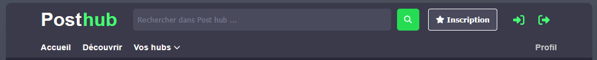
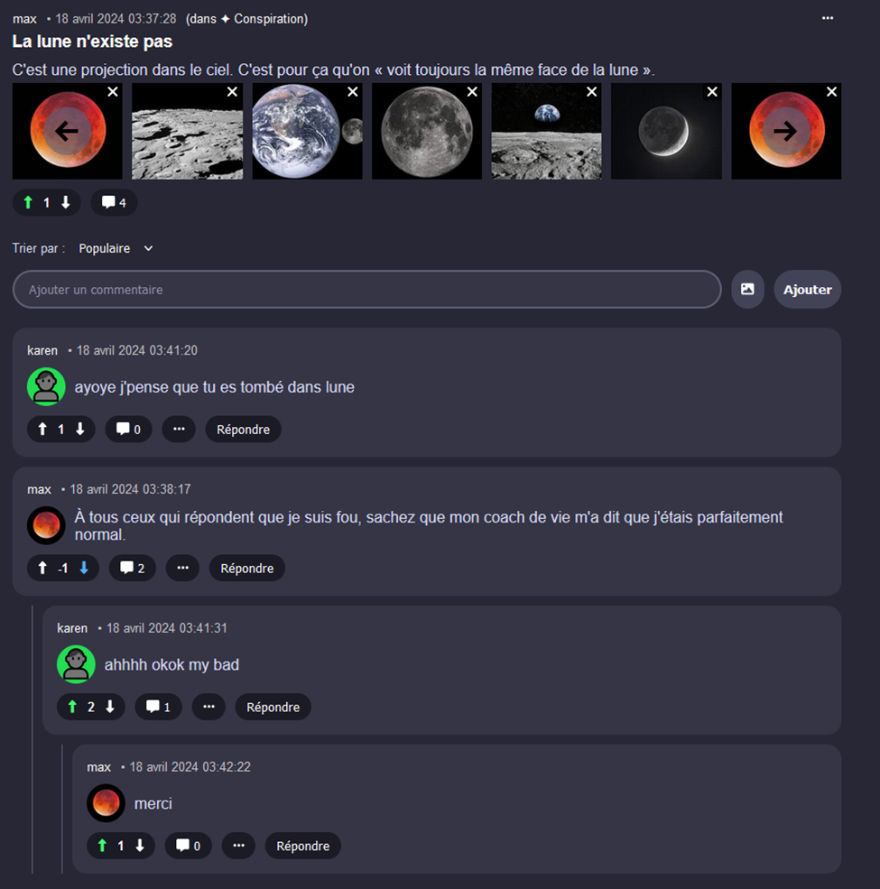
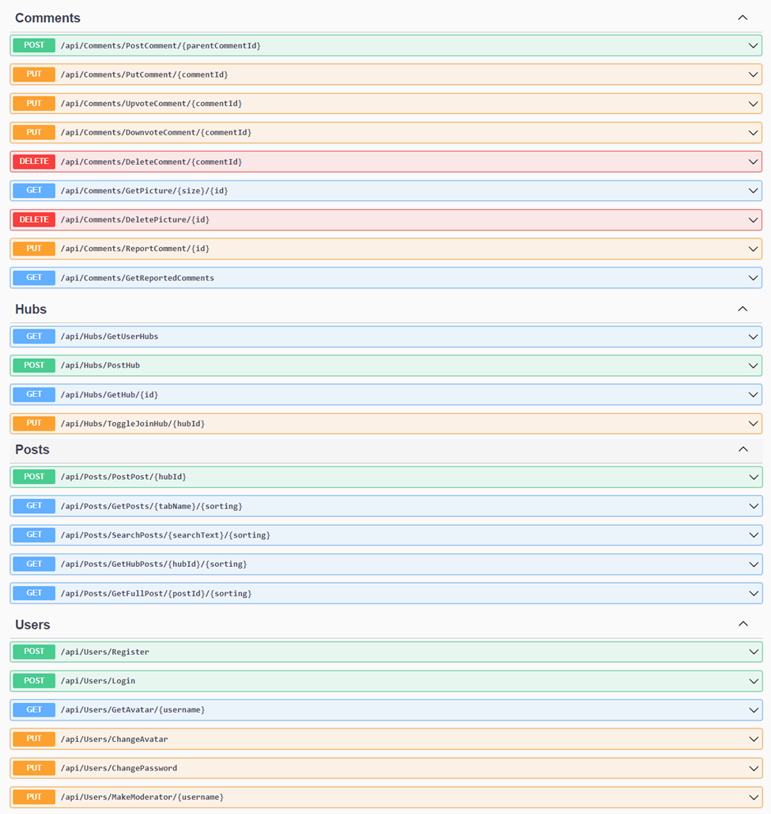
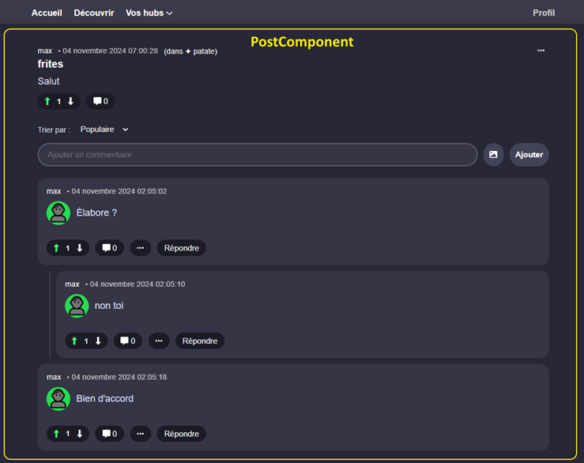
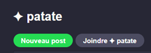
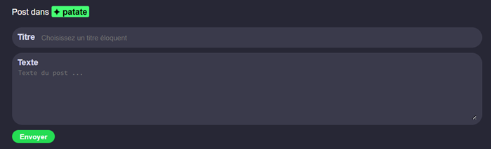
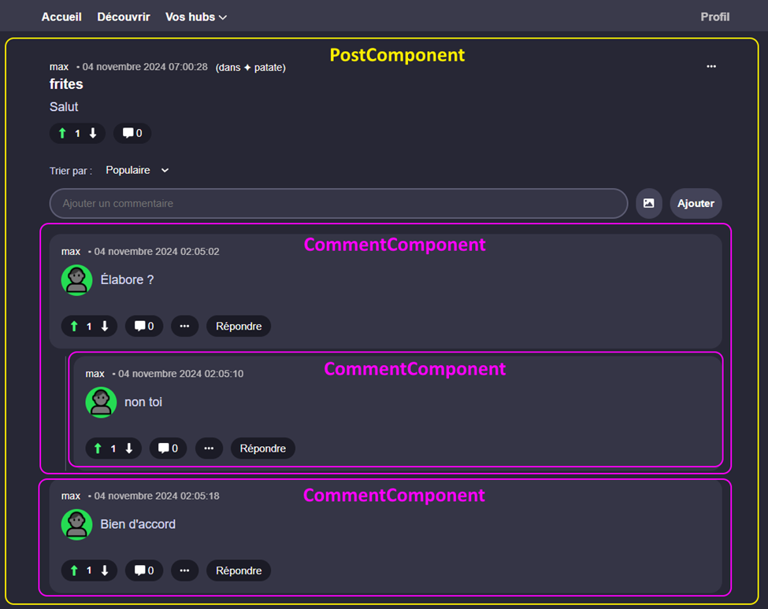

# TP4 - Post Hub (25%)

## 📝 Consignes

* 👥 Le TP est fait en **équipe de deux imposée**.
* 📦 Le projet client utilise le framework **Angular** et le projet serveur utilise le framework **ASP.NET Core**. (Projets de départ fournis)
* 👀 Attention au plagiat
* 🖥 Il faudra respecter la structure existante dans les deux projets.
* ⏰ Attention, il y a une **remise partielle le 1 mai à 17h**. (Parties A à C)
* 📬 La remise est le **17 mai à 23h59**.

:::tip

Pendant le TP, ne vous cassez jamais la tête à régler les conflits de merge pour les **migrations**. Faites simplement une nouvelle migration dans chaque nouvelle branche.

:::

## 📦 Projets de départ

Les [projets Angular + ASP.NET Core](../../static/files/tp4.zip) sont fournis pour ce TP. 

Une application qui sert de multi-forums de discussion vous est fournie. Vous devrez ajouter des fonctionnalités à l'application, principalement pour la gestion d'images et de rôles.

En résumé, l'application contient des `hubs`, des `posts` et des `commentaires`.

* Un `hub` contient des `posts` sur un **thème commun** et un `post` contient des `commentaires`.
* On peut répondre à un `commentaire` avec des sous-`commentaires` à l'infini.

Ci-dessous, on peut voir un `post` avec plusieurs `commentaires` :

## 📜 Résumé des fonctionnalités

👥 Chaque équipe aura un **membre hot-dog 🌭** et un **membre trottinette 🛴**. Vous serez **évalués séparément** pour la plupart des fonctionnalités. Vous êtes obligés d'implémenter seulement vos propres fonctionnalités, telles que listées ci-dessous.

🔍 Ceci n'est qu'un résumé des fonctionnalités, vérifiez les énoncés **par membre** pour avoir tous les détails et indices.

<table>
<tr>
    <th>Membre 🌭</th>
    <th>Membre 🛴</th>
</tr>
<tr>
    <td colspan="2">
    Étape A-🌭🛴  
    Décidez quel membre sera 🛴 et quel membre sera 🌭. Si votre partenaire est absent(e), vous êtes obligé(e) de choisir seul(e) pour pouvoir commencer le travail dès maintenant.
    </td>
</tr>
<tr>
    <td colspan="2">
    Étape B-🌭🛴  
    Suivez les étapes dans les notes de cours sur Git :
    * Créez un repo de départ avec les deux projets.
    * Ajoutez l'autre membre et l'enseignant(e) en collaborateur.
    * Créer la branche `dev`. Il faudra créer une nouvelle branche individuelle pour chaque étape du TP. Il faudra effectuer un merge une fois chaque étape terminée.
    </td>
</tr>
<tr>
    <td>
        Étape C-🌭  
        Lorsqu’on crée un commentaire, on doit être capable d’y joindre zéro à plusieurs images.
    </td>
    <td>
        Étape C-🛴  
        Lorsqu’on crée un post, on doit être capable d’y joindre zéro à plusieurs images.
    </td>
</tr>
<tr>
    <td colspan="2">
    🛑 HALTE ! 
    * Au plus tard le **1 mai à 17h**, vous devez, à deux, vous présenter en classe et prendre 5 minutes pour montrer les étapes A, B et C à l'enseignant(e).
    * Si vous ne le faites pas, il y aura une **pénalité de 25%**.
    * Il n'y a rien à préparer pour la présentation, à part le TP.
    </td>
</tr>
<tr>
    <td>
        Étape D-🌭  
        Les utilisateurs doivent pouvoir choisir un avatar personnalisé. Il est affiché à côté de leurs commentaires. (Mais pas dans le message principal d’un post) L’avatar peut être changé à tout moment.
    </td>
    <td>
        Étape D-🛴  
        Si un post (commentaire principal d’un post) contient plus de 4 images, les images sont affichées avec un carrousel glidejs plutôt qu’en simple rangée. Les commentaires d’un post n’ont jamais de carrousel.
    </td>
</tr>
<tr>
    <td>
        Étape E-🌭  
        Cliquer sur une image doit permettre de l’afficher en pleine taille, dans un autre onglet.
    </td>
    <td>
        Étape E-🛴  
        Lorsqu’on modifie un commentaire ou un post, on doit pouvoir ajouter une ou plusieurs images supplémentaires en même temps de modifier le texte. (Les anciennes images du commentaire, s’il y en avait, sont préservées)
    </td>
</tr>
<tr>
    <td>
        Étape F-🌭  
        On doit pouvoir supprimer les images d’un commentaire / post, individuellement.
    </td>
    <td>
        Étape F-🛴  
        Lorsqu’on supprime un commentaire ou un post, toutes ses images doivent être supprimées.
    </td>
</tr>
<tr>
    <td>
        Étape G-🌭  
        Les utilisateurs peuvent signaler (Report) les commentaires / posts des autres utilisateurs.
    </td>
    <td>
        Étape G-🛴  
        Les utilisateurs doivent pouvoir se connecter en utilisant leur nom d’utilisateur OU leur adresse courriel. (Plutôt que seulement leur nom d’utilisateur) Les utilisateurs doivent pouvoir changer leur mot de passe.
    </td>
</tr>
<tr>
    <td>
        Étape H-🌭  
        Un rôle modérateur existe. Les modérateurs peuvent voir la liste des commentaires signalés. Ils peuvent supprimer les commentaires de leur choix via cette liste. Un utilisateur avec le rôle modérateur est ajouté dans le seed.
    </td>
    <td>
        Étape H-🛴  
        Un rôle administrateur existe. Les administrateurs peuvent ajouter le rôle modérateur à des utilisateurs. Un utilisateur avec le rôle administrateur est ajouté dans le seed.

    </td>
</tr>
<tr>
    <td colspan="2">
    Étape I-🌭🛴  
    S’assurer que les critères communs (Voir grille de correction) sont respectés. S’assurer que tout a été merge dans dev, puis dans main. S’assurer que tout fonctionne.
    </td>
</tr>
</table>

## ✅ Grille de correction

### Membre 🌭 (30 pts)

<table>
    <tr>
        <th>Critère</th>
        <th>Points</th>
    </tr>
    <tr>
        <td>On peut ajouter des images lorsqu’on crée un commentaire et les voir ensuite.</td>
        <td>8 pts</td>
    </tr>
    <tr>
        <td>Les utilisateurs peuvent choisir un avatar (et le prévisualiser) et le modifier à volonté.</td>
        <td>4 pts</td>
    </tr>
    <tr>
        <td>Toute image (sauf les avatars) peut être cliquée pour être affichée en grand dans un nouvel onglet.</td>
        <td>2 pts</td>
    </tr>
    <tr>
        <td>Les images des posts et des commentaires peuvent être supprimées individuellement par l’auteur.</td>
        <td>6 pts</td>
    </tr>
    <tr>
        <td>Les posts / commentaires des autres utilisateurs peuvent être signalés si on est connecté.</td>
        <td>4 pts</td>
    </tr>
    <tr>
        <td>Le rôle de modérateur existe, permet de supprimer des commentaires signalés et présente un utilisateur avec le rôle dans le seed.</td>
        <td>6 pts</td>
    </tr>
</table>

### Membre 🛴 (30 pts)

<table>
    <tr>
        <th>Critère</th>
        <th>Points</th>
    </tr>
    <tr>
        <td>On peut ajouter des images lorsqu’on crée un post et les voir ensuite.</td>
        <td>8 pts</td>
    </tr>
    <tr>
        <td>Les images d’un post sont affichées dans un carrousel à 5 images ou plus.</td>
        <td>4 pts</td>
    </tr>
    <tr>
        <td>La modification de post / commentaire permet d’ajouter des images.</td>
        <td>6 pts</td>
    </tr>
    <tr>
        <td>Supprimer un post ou un commentaire supprime ses images.</td>
        <td>3 pts</td>
    </tr>
    <tr>
        <td>La connexion fonctionne avec le nom d’utilisateur et le courriel.</td>
        <td>1 pt</td>
    </tr>
    <tr>
        <td>On peut modifier son mot de passe à volonté.</td>
        <td>2 pt</td>
    </tr>
    <tr>
        <td>Le rôle d’administrateur existe, permet de nommer des modérateurs et présente un utilisateur avec le rôle dans le seed.</td>
        <td>6 pts</td>
    </tr>
</table>

### Commun (20 pts)

<table>
    <tr>
        <th>Critère</th>
        <th>Points</th>
    </tr>
    <tr>
        <td>Sécurité sur le serveur (Aucune action ne peut être exécutée par un utilisateur qui n’en a pas le droit) Ceci touche les objets qui ne peuvent être modifiés que par leur auteur et les opérations qui ne peuvent être utilisées que par les modérateurs / administrateurs. Cela touche aussi à des choses plus subtiles comme ne pas pouvoir signaler son propre commentaire.</td>
        <td>6 pts</td>
    </tr>
    <tr>
        <td>Fausse sécurité sur le client Angular. (Aucun bouton permettant de faire une action qu’on n’a pas le droit de faire ne doit être VISIBLE dans les pages Web.)</td>
        <td>3 pts</td>
    </tr>
    <tr>
        <td>L’architecture du projet serveur respecte les lignes directrices vues dans les notes de cours. (Les contrôleurs n’ont pas accès au DbContext, usage de Models et de DTOs au besoin, etc.) De plus, sur le serveur, évitez la répétition de code dans la mesure du raisonnable.</td>
        <td>3 pts</td>
    </tr>
    <tr>
        <td>Toute image supprimée / remplacée dans la BD doit être supprimée du disque également.</td>
        <td>1 pt</td>
    </tr>
    <tr>
        <td>L’architecture du projet client respecte les lignes directrices du cours. (Pas de requête avec HttpClient dans un composant, usage de Models, services, composants, etc.)</td>
        <td>2 pts</td>
    </tr>
    <tr>
        <td>
            Git a été utilisé de manière appropriée, c’est-à-dire :
            * Une branche dev a été créée et elle a seulement été merge dans main à la toute fin du TP.
            * Une branche a été créée à partir de la branche dev pour chaque étape / fonctionnalité pour limiter les conflits avec son coéquipier.
            * ⛔ Le français est évalué dans les messages des commits.
            * Les titres et les descriptions des commits sont présents, appropriés et clairs.
        </td>
        <td>5 pts</td>
    </tr>
    <tr>
        <td>Des fonctionnalités qui étaient déjà implémentées se sont mises à ne plus fonctionner.</td>
        <td>-10 pts</td>
    </tr>
    <tr>
        <td>L'interface est déformée ou ne correspond pas grossièrement aux exemples illustrés dans l'énoncé.</td>
        <td>-5 pts</td>
    </tr>
    <tr>
        <td>La présentation des étapes A à C n'a pas été faite.</td>
        <td>-12.5 pts</td>
    </tr>
</table>

## 📶 Liste des requêtes pour référence

## 🔍 Composants mélangeants

### PostComponent

`PostComponent` est utilisé pour afficher un post en entier.

### EditPostComponent

`EditPostComponent` est utilisé pour créer un nouveau post. Il est accessible si on clique sur « Nouveau post » dans un hub.

### CommentComponent

`CommentComponent` est utilisé **pour chaque commentaire** qui ne soit pas le message principal d'un post.

## 👥 Équipes

### Groupe 1010

|Personne 1|Personne 2|
|:-:|:-:|
|⛰|💩|
|🧠|🤔|
|🦊|🕹|
|🎸|🎵|
|🖼|📝|
|👻|👻|
|🏍|🐠|
|❌|👀|
|✅|📚|
|🤿|🦥|
|👉|👈|

### Groupe 1020

|Personne 1|Personne 2|
|:-:|:-:|
|🏕|😴|
|🐱‍👤|🌹|
|🤵|🔴|
|💾|👋|
|2️⃣|🌅|
|🎈|🔍|
|👁|🐥|
|🦆|😂|
|9️⃣|🔄|

### Mixte

|Personne 1|Personne 2|
|:-:|:-:|
|🍟|🎨|
|🐇|🗣|
