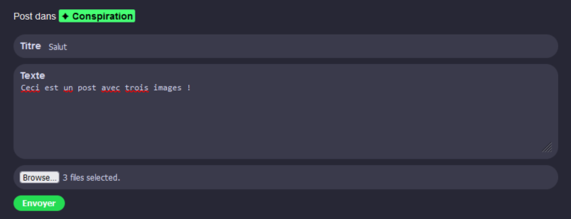
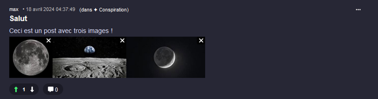
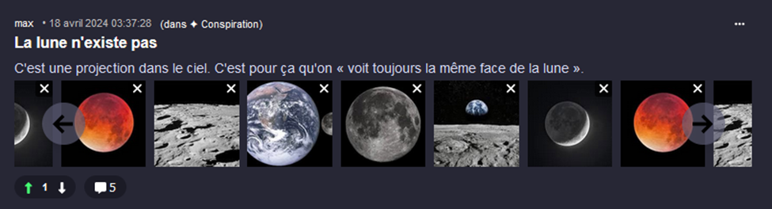
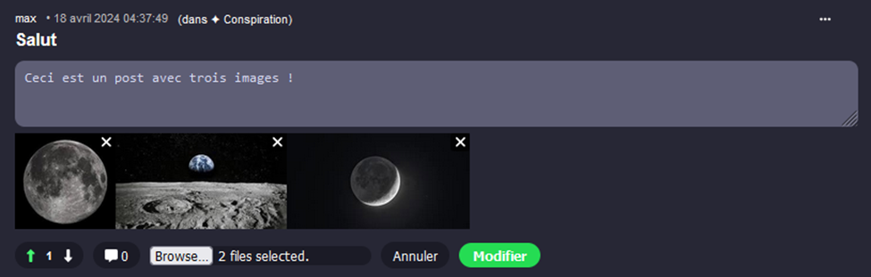
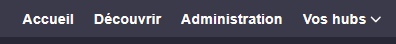
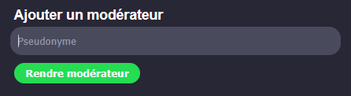

# TP4 - 🛴

Cet énoncé précise les fonctionalités du membre 🛴 et donne quelques pistes pour réussir.

## Étape C

Lorsqu'on crée un `post` (`EditPostComponent`), on doit être capable d'y joindre zéro à plusieurs images, qui seront sauvegardées en taille originale et en miniature.

(Il faudra ajouter l'`<input>` vous-mêmes !)

* Le serveur reçoit déjà un `PostDTO` et un `hubId` dans la requête `POST`. Comme on va potentiellement envoyer plusieurs fichiers, il faudra remplacer ces deux choses par un **formData**. (Le `PostDTO` va devenir inutile)
* N’oubliez pas d’afficher les images dans le composant `PostComponent`. Pour y arriver, il faudra que le client Angular reçoivent la liste des ids des images du `post`.
* Gardez à l'esprit que le serveur n'envoie pas de `Post.cs` au client Angular, seulement des `PostDisplayDTO.cs` !

:::danger

⛔ Attention ! Un `Post`, c'est seulement un **titre**. Le message qu'on voit sous le titre est un `Comment`. Lorsqu'on crée un `Post`, cela crée un `Post` ET un `Comment`. (Qui contient le texte et les upvotes / downvotes) Si on regarde dans le modèle `Post`, il y a une propriété nommée `MainComment` ! Bref, les images seront associées au `MainComment` (donc à un `Comment`) et non au `Post`!

:::

  
(Ignorez les petits X sur les images, ça viendra plus tard)

:::warning

Il est pas mal **obligatoire** de faire le merge de la branche de cette étape en présence de votre partenaire ! (Seulement lorsque la 2e personne fera son merge) Il y aura **beaucoup de conflits**, et il faut que les deux partenaires soient présents pour bien comprendre comment résoudre ces conflits.

:::

## Étape D

Si un `post` (commentaire principal d’un post) contient plus de 4 images, les images sont affichées avec un **carrousel glidejs** plutôt qu’en simple rangée. Les commentaires qui ne sont pas le commentaire principal du `post` n’ont jamais de carrousel.

## Étape E

Lorsqu’on modifie un `commentaire` ou un `post`, on doit pouvoir ajouter une ou plusieurs images supplémentaires en même temps de modifier le texte. (Les anciennes images du commentaire, s’il y en avait, sont préservées)

* Vous allez vous inspirer largement des actions `PostPost` / `PostComment`  pour cette étape. N’oubliez pas qu’il y a deux endroits où on peut modifier un commentaire : dans `PostComponent` et dans `CommentComponent`.
* Encore une fois, le **formData** va remplacer tout `DTO` qui était précédemment utilisé.

On voit, ci-dessous, que je modifie mon message et que j’ai ajouté 2 images dans l’input.

## Étape F

Lorsqu’on supprime un `commentaire` ou un `post`, toutes ses images doivent être supprimées.

* Vous remarquerez que l’action `DeleteComment` fait peur. C’est parce qu’elle _hard-supprime_ également tout sous-commentaires ou commentaires parents qui étaient déjà _soft-supprimés_. Ne vous inquiétez pas trop avec cela : votre objectif est seulement de supprimer les images du commentaire cliqué s’il en avait. (Vous n'avez RIEN à ajouter dans la boucle de l'action donc. Ça se passe avant ou après)
* Les images du commentaire supprimé doivent être cachées immédiatement dans la page Web.

## Étape G

Les utilisateurs doivent pouvoir se connecter en utilisant leur nom d’utilisateur OU leur adresse courriel. (Plutôt que seulement leur nom d’utilisateur) Les utilisateurs doivent pouvoir changer leur mot de passe.

* Indice : Pas besoin de modifier la structure du `LoginDTO`... Dites-vous juste que `username` contiendra le pseudo OU le courriel.
* C'est une des rares questions où il n'y aura pas la réponse dans les notes de cours. Vérifiez les fonctions qui existent avec `UserManager`. Il y en a une pour changer un mot de passe et une pour trouver un utilisateur via son courriel.
* Tout se passera dans `ProfilComponent` et dans `UsersController`.

## Étape H

Un rôle administrateur existe. Les administrateurs peuvent ajouter le rôle modérateur à des utilisateurs. Un utilisateur avec le rôle administrateur est ajouté dans le seed.

* Votre partenaire s'occupera de rendre utiles les modérateurs, mais pour le moment créez juste le rôle s'il n'existe pas déjà.
* Il faudra rendre disponible un onglet supplémentaire **seulement visible pour les administrateurs**. L'usage d'un **⛔ signal** sera obligatoire pour le `*ngIf` qui permettra de cacher cet onglet. Inspirez-vous fortement du laboratoire 21.

* Dans cet onglet, créez un mini composant avec un simple formulaire permettant d'ajouter un modérateur via le pseudo d'un utilisateur existant.

