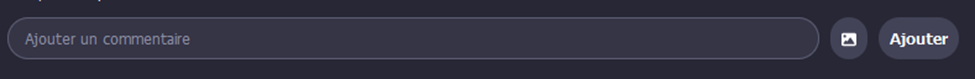
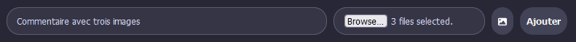
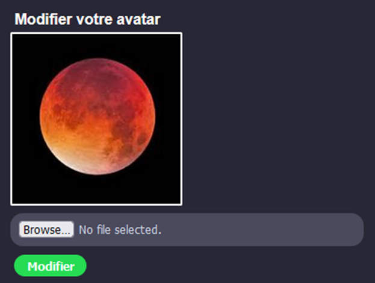
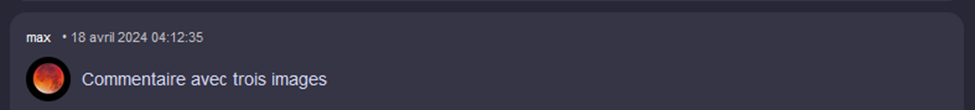
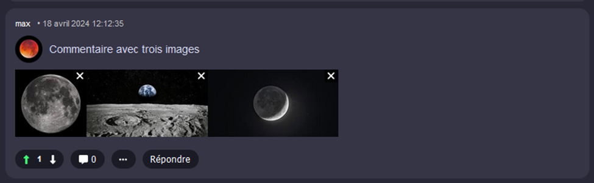
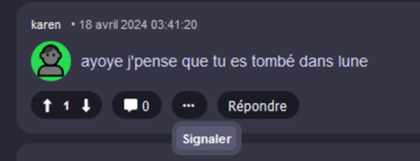
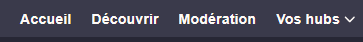
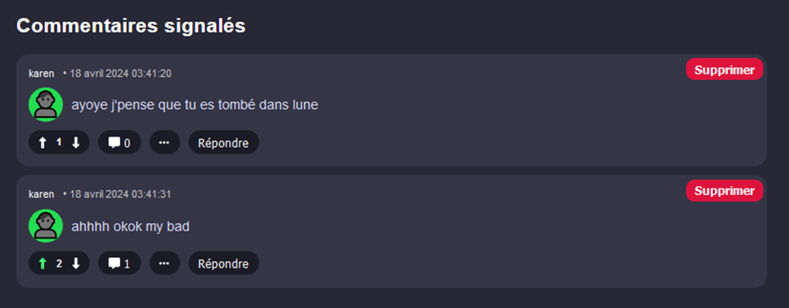

# TP4 - 🌭

Cet énoncé précise les fonctionalités du membre 🌭 et donne quelques pistes pour réussir.

## Étape C

Lorsqu’on crée un commentaire, on doit être capable d’y joindre zéro à plusieurs images, qui seront sauvegardées en taille originale et en miniature.

:::danger

⛔ Attention ! On peut créer des commentaires à deux endroits : dans `PostComponent` (quand on veut créer un commentaire ordinaire) et dans `CommentComponent` (qaund on veut créer un sous-commentaire en réponse à un autre commentaire) Vous devrez faire pas mal de travail en double **côté Angular**. (Surtout du copié-collé à quelques détails près)

:::

* Cliquer sur le bouton avec l’icône d’image permet déjà d’afficher un input.

* Le serveur reçoit un `CommentDTO` dans le corps de la requête actuellement pour créer un nouveau commentaire… ce ne sera plus possible car on va maintenant devoir envoyer un **formData**. Il faudra remplacer le `DTO` (qui va devenir inutile) par un **formData**.
* N’oubliez pas d’afficher les images dans le composant `CommentComponent`. Pour y arriver, il faudra que le client Angular reçoive la liste des ids des images du commentaire.
* Gardez à l’esprit que le serveur n’envoie pas de `Comment.cs` à Angular, mais bien des `CommentDisplayDTO.cs` !

## Étape D

Les utilisateurs doivent pouvoir choisir un avatar personnalisé. Il est affiché à côté de leurs commentaires. (Mais pas dans le message principal d’un post) L’avatar peut être changé à tout moment. On doit pouvoir prévisualiser l'image choisie quand on change son avatar.

* Ceci se déroule surtout dans le composant `ProfileComponent` et dans le `UsersController`. (N’oubliez pas l’affichage dans le composant `CommentComponent` !)
* N’utilisez pas une classe séparée pour les avatars, ajoutez seulement un `FileName` et un `MimeType` dans la classe `User`, c’est plus simple. Exceptionnellement, vous pouvez vous en tirer sans utiliser de service côté serveur pour cette fois. (À l’aide de `UserManager`)
* La requête pour afficher l’avatar sera plus simple si le paramètre dans l’URL est le **pseudo de l’utilisateur**.

## Étape E

Cliquer sur une image dans un post (commentaire principal d’un post) doit permettre de l’afficher en pleine taille, dans un autre onglet.

* Ne vous compliquez pas la vie : Ajoutez une balise `<a>` avec un `href` qui contient la requête vers l’image en **pleine taille**. Cela redirigera vers une autre page qui contient seulement l’image. C’est suffisant. Vous devez ouvrir l’image dans un nouvel onglet.
* Ceci concerne TOUTES les images qui ne sont pas des avatars. (Dont le **carrousel** fait par l’équipier 🛴 à l’étape D) N’en oubliez pas.

## Étape F

On doit pouvoir supprimer les images d’un commentaire / post, individuellement.

* L’image doit disparaître immédiatement de la page lorsqu’on le fait.
* Cette suppression concerne une seule image à la fois. Les autres ne sont pas touchées.
* Bien entendu, on peut seulement supprimer les images **de nos propres commentaires / posts**. On ne veut pas voir le petit X si on n’est pas l’auteur du message.

:::tip

Pour placer les petits X en haut à droite des images facilement :

* Les `` doivent être dans un `
` qui possède le CSS `position:relative`.
* Le X doit être dans un `
` ou un `` qui possède le CSS `position:absolute`, `top:0px` et `right:0px`.

:::

## Étape G

Les utilisateurs peuvent signaler (Report) les commentaires / posts des autres utilisateurs.

* Il n’est pas obligatoire d’offrir un feedback dans la page lorsqu’on clique sur ce bouton. Tant que le commentaire est flaggé comme signalé côté serveur.
* Le signalement d'un commentaire peut être un simple `bool` mis à `true` ou encore une `List<User> Reporters` si vous voulez faire ça proprement.

## Étape H

Un rôle modérateur existe. Les modérateurs peuvent voir la liste des commentaires signalés. Ils peuvent supprimer les commentaires de leur choix via cette liste. Un utilisateur avec le rôle modérateur est ajouté dans le seed.

* Le composant `ModerateCommentsComponent` existe déjà et est accessible avec la route `/reports`, mais il faudra rendre disponible un onglet supplémentaire **seulement visible pour les modérateurs** permettant de s'y rendre. L'usage d'un **⛔ signal** sera obligatoire pour le `*ngIf` qui permettra de cacher cet onglet. Inspirez-vous fortement du laboratoire 21.

* Il suffira de remplir une liste dans le composant `ModerateCommentsComponent` avec tous les commentaires ayant été signalés. Le bouton `Supprimer` appelera exactement la même action du serveur que si un utilisateur supprimait son propre message. Il faudra donc permettre aux modérateurs ET à l'auteur d'un message de le supprimer.

