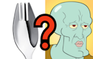
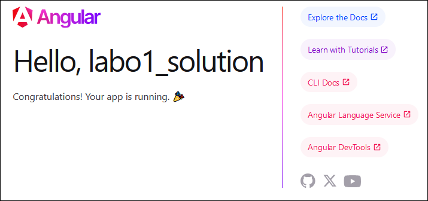
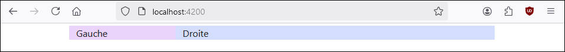
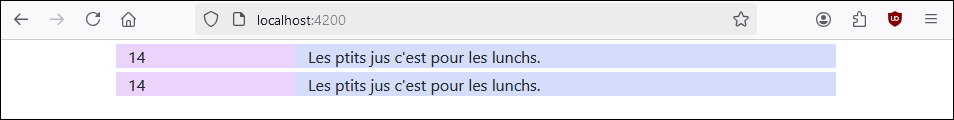
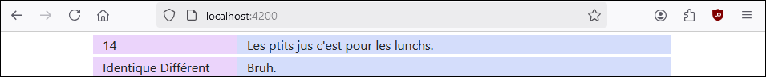
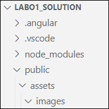
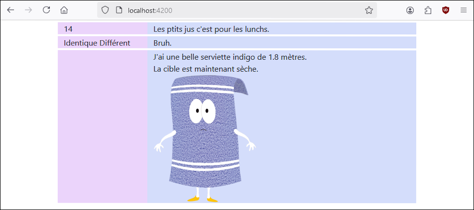
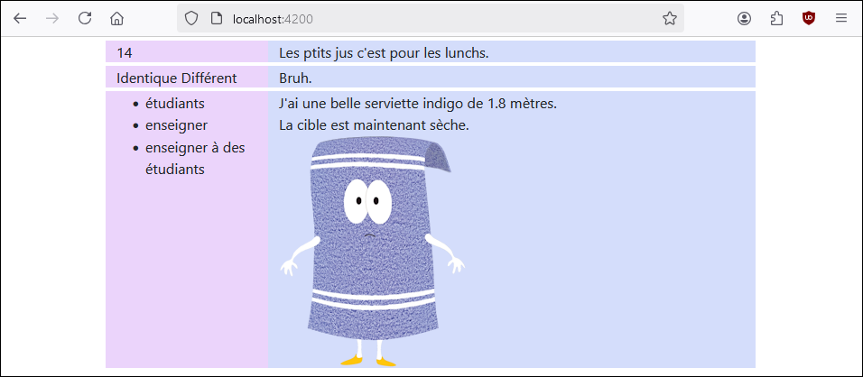

# Laboratoire 1

Pour ce premier laboratoire il n'y aura pas de matériel de départ. Pour tous les laboratoires, 
n'hésitez jamais à cliquer sur l'ampoule 💡 à côté d'un énoncé pour être redirigé vers la section
des notes de cours où les notions associées sont abordées. Pour garder la page du laboratoire
ouverte en cliquant sur l'💡, maintenez `ctrl` appuyé.

## ✊ Étape 1 - Git Good

### **1 -** Créer le projet Angular

[💡](/cours/rencontre1.1#-créer-un-projet-angular) Créez un nouveau projet Angular et nommez-le `labo1` ou `lab1` ou `laboratoire1` ou `labo01` ou `lab01` ou
`laboratoire01` ou `labo_1` ou `labo_01` ou `lab_1` ou `lab_01` ou `laboratoire_1` ou `laboratoire_01` ou 
`coccinelle`.

N'ouvrez pas votre projet avec Visual Studio Code immédiatement, nous avons quelques manipulations à faire avant.

### **2 -** Créer le repo

[💡](/cours/rencontre1.1#-créer-un-nouveau-projet-et-son-repository) Créez un nouveau repository Git vide à l'aide de **Fork** 🔱 ou **GitKraken** 🦑. Par contre, 
faites-le en prenant un moment de grande considération...

#### 🔱🦑 Fourchette ou Carlos le calamar ?

<center></center>

Je vous invite à choisir une des deux applications pour le reste de la session. Voici les pours et les contres :

|Aspect|GitKraken|Fork|
|-|-|-|
|Licence|Payante, mais gratuite pour les étudiants. Vous risquez de ne plus l'utiliser après la technique. Il faut renouveler la licence une fois par année en envoyant une preuve (ex : photo de carte étudiante) et ça prend 24+ heures... 💩|Gratuit.|
|Gestion des branches et merge (TP4)|Clairement représenté visuellement. Plus facile pour l'apprentissage.|Légèrement moins riche visuellement, mais ça fonctionne.|
|Gestion des conflits lors d'un merge (TP4)|Gestion de conflits intégrée. Très confortable.|Renvoie vers les IDE (Visual Studio / VS Code) pour gérer les conflits là-bas. Moins confortable.|

#### 🦸‍♂️ Tous pour un ou Un pour tous ?

Si vous ne comptez pas utiliser Git pour vos labos -> faites-le au moins une fois avant le TP1 (Cours 4) car pour les TPs vous
serez forcés.

Si vous comptez utiliser Git pour vos labos -> décidez si vous voulez faire 1 repo avec TOUS vos labos (moins de bordel sur GitHub) ou bien 1 repo par labo. (Projets mieux séparés... mais bordel sur GitHub)

### **3 -** Préparer le repo

[💡](/cours/rencontre1.1#-créer-un-nouveau-projet-et-son-repository) Déplacez votre projet Angular dans le repository vide, mais ⛔ assurez-vous de d'abord supprimer le dossier `.git` dans votre
projet Angular s'il y en a un ! (Ne supprimez pas celui dans le repo vide par contre)

Faites un premier commit et un premier push.

:::tip

Pour la suite du laboratoire, n'hésitez pas à faire un commit et un push à la fin de chaque étape pour ne jamais perdre votre travail.

:::

## 🚬 Étape 2 - Mon étrange dépendance

### **4 -** Installer deux dépendances

[💡](/cours/rencontre1.1#-installer-une-d%C3%A9pendance) Installez deux dépendances : `jquery` et `bootstrap`. Attention à l'orthographe, si vous faites la moindre faute dans leur nom ça n'installera pas la bonne chose. 🙄

Ensuite, assurez-vous que ces deux lignes ont bel et bien été ajoutées dans le fichier `package.json` :

```json
"bootstrap": "^5.3.3",
"jquery": "^3.7.1",
```

(Les versions pourraient varier légèrement, c'est normal.)

✨ Vous pouvez maintenir ouvrir votre projet Angular avec **Visual Studio Code**.

Pour que **jQuery** et **Bootstrap** fonctionnent bel et bien dans notre projet, nous allons devoir modifier le fichier
`angular.json` pour importer certains scripts :

```json
"styles": [  
    "./node_modules/bootstrap/dist/css/bootstrap.css",
    "src/styles.css"
],
"scripts": [               
    "node_modules/jquery/dist/jquery.min.js",
    "node_modules/bootstrap/dist/js/bootstrap.min.js"
]
```

⛔ **Attention !** Les noeuds `styles` et `scripts` sont présents deux fois dans le fichier `angular.json`. Dans
notre cas, on doit seulement modifier la **première occurence** de ces noeuds. (On ne touche pas à ceux vers
la fin du fichier ! 😠)

:::note

Notez que c'est la dernière fois de la session que nous utiliserons Bootstrap. Ce n'est pas une librairie très
amicale avec Angular. À l'image d'un rhinocéros 🦏 dans une boutique de poteries ⚱, Bootstrap génère des
conflits et brise plusieurs mécanismes lorsque plusieurs librairies sont utilisées. 

:::

### **5 -** Lancer le projet

[💡](/cours/rencontre1.1#-ouvrir-et-exécuter-un-projet-angular) Vous pouvez maintenant exécuter la commande `ng serve` dans le terminal de Visual Studio Code pour exécuter le projet. Si vous aviez déjà lancé le projet, il faudra l'arrêter (Ctrl + C dans le terminal) et le démarrer à nouveau.

:::note

À chaque fois que vous travaillerez sur un projet Angular, une fois les dépendances installées (`npm install`) et le projet ouvert avec
**VS Code**, l'étape suivante sera toujours de lancer l'exécution du projet avec `ng serve`. Ça permet de compiler tous les changements
à chaque fois qu'on sauvegarde un fichier du projet et de rapidement intercepter les erreurs. Ça permet aussi de visualiser son site Web
à l'adresse `http://localhost:4200` dans le navigateur de son choix.

:::

Si ce n'est pas déjà fait, affichez votre site Web dans le navigateur de votre choix (Il n'y a pas de mauvais choix à part tout ce qui
n'est pas **Firefox** 🦊🔥) à l'aide de l'adresse `http://localhost:4200`.

### **6 -** Un peu de HTML / CSS

Pour le moment, si vous jetez un coup d'oeil à votre page Web dans le navigateur, ça ressemble à ceci :

<center></center>

[💡](/cours/rencontre1.1#-les-composants) Supprimez tout le code HTML présent dans le fichier `app.component.html` et sauvegardez. À présent, la page
Web devrait être complètement vide. (Tout ce qu'il reste, c'est un `<body></body>` relativement vide.)

Copiez-collez ce HTML dans le composant `app` à la place :

```html showLineNumbers
<div class="container">
  <div class="row mt-1">
    <div class="col-3 socialisme">
      Gauche
    </div>
    <div class="col-9 conservatisme">
      Droite
    </div>
  </div>
</div>
```

Si vous avez bien installé et importé `bootstrap`, les deux colonnes devraient bien être côte-à-côte.
Notez que les classes `socialisme` et `conservatisme` ne font rien pour le moment et n'ont pas de lien avec `bootstrap`.

[💡](/cours/rencontre1.1#-les-composants) Ajoutez du CSS _au bon endroit_ (ce CSS ne doit s'appliquer qu'au
composant `app` !) pour obtenir un résultat similaire à celui ci-dessous. Vous êtes invités à choisir des couleurs 
qui représentent bien l'âme de l'esprit du mental de la tête de l'aura de votre personne. 

<center></center>

Ouf ! C'est assez de CSS pour le moment. Vous êtes probablement _é-pui-sé(e)_.

## 👶 Étape 3 - Mon tout premier TypeScript

Avant de se lancer, profitez-en pour aérer le projet en supprimant le fichier `app.component.spec.ts`. 
Pour rappel, c'est un fichier de tests unitaires que nous n'utiliserons pas avant la semaine 6.

### **7 -** Afficher une variable

[💡](/cours/rencontre1.1#-afficher-une-variable-dans-la-page-web) Déclarez une variable
nommée `myWisdom` dans votre composant `app`. _Typez-la_ en `string` et affectez-lui une phrase qui vous inspire.

Déclarez une deuxième variable nommée `n` (sans la typer car vous êtes un _bandit_) et affectez-lui un nombre
de votre choix entre 7 et 13. (Mais surtout pas plus que 13.)

Remplacez ensuite, dans le HTML, le mot « Droite » par la valeur de la variable `myWisdom` à l'aide des
doubles accolades. De plus, remplacez le mot « Gauche » par la valeur de la variable `n`.

<center></center>

### **8 -** Afficher des résultats de fonction

[💡](/cours/rencontre1.1#fonctions-de-classe) Nous allons créer deux fonctions dans le composant `app`.

La première fonction se nomme `bruh`, ne reçoit aucun paramètre et retourne un `string`. La fonction retourne
la valeur `"Bruh."`.

La deuxième fonction se nomme `equalToN`, reçoit un `number` en paramètre et retourne un `string`. La fonction
retourne `"Identique"` si le paramètre reçu est identique à la valeur de la variable de classe `n` et retourne `"Différent"` sinon.

Avant de poursuivre, dupliquez votre « `row` » dans le HTML car nous allons ajouter du contenu dans la page.

<center></center>

[💡](/cours/rencontre1.1#-afficher-le-résultat-dune-fonction) Affichez le résultat de la fonction `equalToN()`
deux fois dans la colonne de gauche de la 2e rangée : une fois en fournissant un paramètre qui est égal à votre variable `n` et
une autre fois en fournissant un paramètre qui n'est pas égal à votre variable `n`.

De plus, affichez le résultat de la fonction `bruh()` dans la colonne de droite de la 2e rangée.

Vous devriez avoir un résultat similaire :

<center></center>

## 🧩 Étape 4 - Sais un peu plus compliquais

### **9 -** Créer une classe

[💡](/cours/rencontre1.1#-créer-et-afficher-un-objet-personnalisé) Nous allons maintenant créer une classe personnalisée.

Préparez un nouveau dossier `models` qui pourra accueillir une classe. Voici la classe à créer :

La classe `Towel`, qui possède trois propriétés :

* `color` : un `string` assigné par le constructeur.
* `length` : un `number` assigné par le constructeur.
* `image` : un `string` assigné par le constructeur.
* `wet` : un `boolean` automatiquement assigné à `false`.

...et qui possède une fonction :

* `use()` : ne possède pas de paramètre et retourne un `string`. Retourne "La cible est maintenant sèche."
 si la serviette n'est pas mouillée et retourne "Ça ne fonctionne pas..." sinon.

### **10 -** Afficher un objet

Dupliquez (encore) une des rangées dans le HTML pour qu'on puisse ajouter du contenu dans une 3e rangée.

Trouvez, sur **Google images**, une image inspirante de serviette. Placez-la dans le dossier `public/assets/images` de votre
projet (vous aurez à le créer) :

<center></center>

[💡](/cours/rencontre1.1#-créer-et-afficher-un-objet-personnalisé) Créez une variable de type serviette
dans le composant `app`. Donnez lui votre couleur préférée (sauf si votre couleur préférée est bleu, dans ce cas
choisissez `brun`), une taille de `1.8` et le nom de votre fichier image. (Ex : `"servietteBleue.jpeg"`)

Dans la colonne de droite, faites-le nécessaire pour obtenir un affichage similaire à celui ci-dessous. J'ai utilisé
un élément `<br>` pour les sauts de ligne.

Pour l'image, vous aurez besoin d'un élément `` dans lequel vous glisserez `/assets/images/{{serviette.image}}` dans l'attribut `src`.

<center></center>

### **11 -** Afficher un tableau

[💡](/cours/rencontre1.1#-créer-et-afficher-un-tableau) Déclarez un tableau de `string` nommé `hateList` dans le composant `app` et affectez-lui un tableau
avec trois choses que vous détestez.

Dans le HTML du composant `app`, à l'aide d'un élément `<ul>` qui contient trois éléments `<li>`, affichez
les trois éléments du tableau `hateList` dans la colonne de gauche de la dernière rangée.

<center></center>

## 👋 Étape 5 - J'aI fInI mOnSiEuR

### **12 -** Ranger son projet et quitter

Faites un dernier commit et un dernier push et allez toucher un peu de gazon. 🌱

Si vous n'utilisez pas Git 🙄, transférez votre projet dans l'espace de stockage de votre choix, mais n'oubliez surtout
pas de d'abord supprimer les dossiers `node_modules` et `.angular` !