# Laboratoire 2

Pour ce deuxième laboratoire il y aura un projet de départ à télécharger. Le [voici](../../static/files/labo2.zip). 🎁

## 😵 Étape 1 - J'ai déjà tout oublié Angular

### **1 -** Télécharger et lancer le projet

[💡](/cours/rencontre1.1#-node_modules)[💡](/cours/rencontre1.1#-ouvrir-et-exécuter-un-projet-angular) Téléchargez le projet, initialisez un repo Git au besoin, réinstallez les dépendances avec `npm install` 
en vous situant à l'intérieur du projet, ouvrez le projet avec Visual Studio Code et exécutez l'application
avec un terminal dans Visual Studio Code en tapant la commande `ng serve`. Et voilà, on est prêt à se lancer
tête première dans le laboratoire 2. On s'amuse déjà ! 😐

## 👄 Étape 2 - Je commence à saisir le potentiel d'Angular

Commençons par nous familiariser avec les directives *ngFor / *ngIf et les événements.

### **2 -** Liste avec *ngFor

Déclarez une variable nommée `loveList` dans le composant `app`. Ce doit être un tableau de `string` 
immédiatement initialisé avec trois choses que vous aimez plus que la _Prog Web_. 😱😍

[💡](/cours/rencontre1.2#-boucles-ngfor) Dans le HTML, utilisez un `*ngFor` pour parcourir votre liste et dupliquer un élément `<li>` trois
fois à l'intérieur d'un élément `<ul>` pour afficher tous les éléments de votre liste élégamment.

Exemple de résultat :

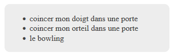

### **3 -** Condition avec *ngIf

Déclarez une variable nommée `userAge` et affectez-lui la valeur 19.

[💡](/cours/rencontre1.2#-conditions-ngif) Dans le HTML, rédigez la phrase « J'aime les `???`. » Selon la valeur de `userAge`,
remplacez `???` par un texte différent :

* Si userAge est supérieur ou égal à 18 : `cigarettes`.
* Si userAge est inférieur à 18 : `LEGO Star Wars`.

Vous pourrez jouer avec la variable `userAge` pour tester que les deux possibilités fonctionnent.

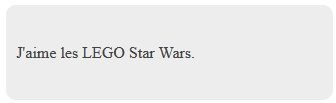

### **4 -** Événement avec (click)

Cette fois-ci je vous donne un peu moins de pistes alors soyez prudents. 👷‍♂️👷‍♀️

[💡](/cours/rencontre1.2#-événements) Trouvez le moyen, en créant une variable et une fonction dans le composant `app`,
que cliquer 10 fois sur le bouton « Compte à rebours » remplace la bombe 💣 par
une explosion 💥. (Bref, après avoir cliqué 10 fois sur le bouton, on affiche
💥 plutôt que 💣. Cliquer plus de 10 fois ne change rien.) De plus, on voit un
décompte qui commence à 10 et se rend jusqu'à 0 à mesure qu'on clique sur le bouton.

N'hésitez pas à modifier le HTML. Personnellement j'ai dû ajouter deux `` pour réussir.
Bien entendu, vous aurez également besoin de `*ngIf`.

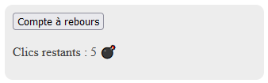

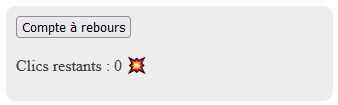

### **5 -** Thème sombre

Présentement, la classe `light` est appliquée à l'élément parent principal dans le HTML.
Nous aimerions que le bouton « Changer le thème » permette de basculer cette classe vers
`dark`. (Puis à nouveau vers `light` si on clique encore)

En exploitant les **événements**, en créant une **variable** et en créant une **fonction**, trouvez le
moyen de rendre tout cela fonctionnel.

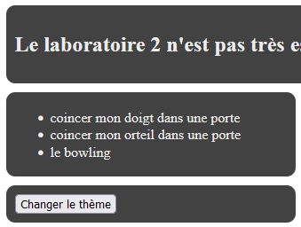

## 🧾 Étape 3 - La formule R

Pour les prochains exercices, nous travaillerons avec des éléments de formulaire. Nous ferons
un usage excessif de `[(ngModel)]`. C'est un outil indispensable pour toute la session, car ça
permet d'accéder à l'input utilisateur facilement.

### **6 -** Saluer avec le nom fourni

[💡](/cours/rencontre1.2#-formulaires) Créez un champ texte, associez-le à une variable de type `string`. Le but est de pouvoir
entrer son nom dans le champ, puis, de cliquer sur le bouton pour faire afficher le 
message `"Salut nom"`. Vous aurez besoin d'une fonction qui appelera `alert(...nom...)`
dans le composant.

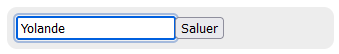

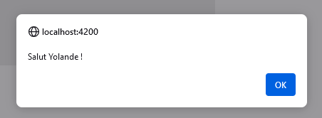

### **7 -** Choix d'une couleur de fond

À l'aide d'un champ `<select>`, on doit pouvoir choisir parmi trois couleurs de fond pour
un élément HTML. (Les trois couleurs possibles doivent être `lightcyan`, `mistyrose` et
`lightyellow`) Avec un champ `<select>`, l'attribut `[(ngModel)]` fonctionne un peu différemment...

L'attribut `[(ngModel)]` **aura seulement à être placée à un endroit** : dans la balise `<select>`.
La variable associée au champ `<select>` grâce à `[(ngModel)]` va contenir la valeur spécifiée
dans l'attribut `value` de l'élément `<option>` qui aura été choisi par l'utilisateur. (Relisez cette
phrase plusieurs fois au besoin 😬)

Si je le formule autrement, ça donnerait « Dans le fond l'`<option>` que t'as choisie, ben c'est sa `value` 
qui va aller dans la variable associée au `<select>`. Genre, si t'as choisi l'option **Bleu**, ben ta variable
va contenir `"lightcyan"`. ». 

[💡](/cours/rencontre1.2#-chaîne-de-caractères-dans-le-html) Le but sera simplement d'utiliser cette valeur dans le `style`. Avec un peu de concaténation vous
y arriverez.

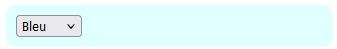

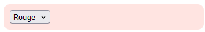

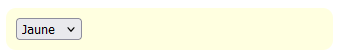

### **8 -** Formulaire pour créer un objet

[💡](/cours/rencontre1.2#exemple-de-formulaire-plus-sophistiqué) Complétez le formulaire fourni pour qu'il permette d'ajouter un `VideoGame` dans la liste
`videoGames`. (Ça ressemblera à `this.videoGames.push(new VideoGame(...)))`)

Vous aurez quelques défis pour certains types de champs :

* Pour la **checkbox**, associez simplement le champ à une variable de type `boolean` et 
affectez-lui la valeur `true` ou `false` par défaut.

* Pour les boutons **radio**, ça fonctionne un peu comme un `<select>`... sauf qu'il faut
répéter l'attribut `[(ngModel)]` dans chaque bouton avec la même variable. La variable prendra
simplement la valeur (`value`) du bouton sélectionné.

* Pour les genres séparés par des virgules (ex : `action,rpg,solo`), ce sera bel et bien
un `string`, mais lorsque vous allez créer votre `VideoGame` avec `new VideoGame(...)`,
vous devrez fournir un tableau `string[]` au constructeur en faisant `maChaine.split(",")`,
ce qui va convertir la chaîne de caractères en tableau `string[]` en prenant chaque élément
entre les virgules.

L'affichage avec un `*ngFor` est déjà fourni pour être sûr que ça fonctionne bien lorsque
vous testerez.

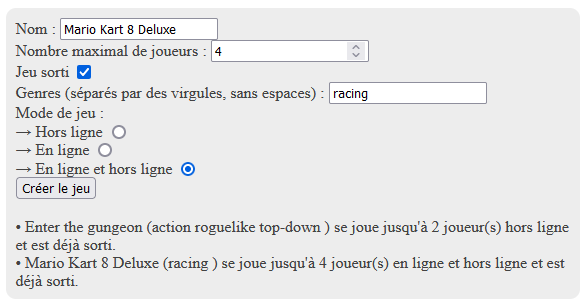

## 🔀 Étape 4 - Travailler en double

### **9 -** Liste avec @for et @empty

[💡](/cours/rencontre1.2#-for) Répétez l'affichage qui était sous le formulaire... mais en utilisant `@for` plutôt que
`*ngFor`. (Il y aura un `@for` imbriqué pour l'affichage des genres !) De plus, utilisez
un `@empty` pour afficher un message spécial si jamais il n'y a aucun jeu dans la liste.

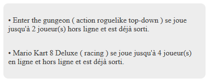

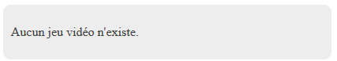

### **10 -** Condition avec @if et @else

[💡](/cours/rencontre1.2#-if) Affichez un message différent selon le thème actuellement sélectionné :

* Clair : aaaaaaaaaaaaaaa mes yeux.

* Sombre : C'est bien sombre ici.

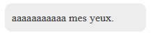

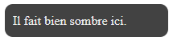

### **11 -** Branchement @switch

[💡](/cours/rencontre1.2#-switch) Selon le nombre d'éléments dans la liste `videoGames`, un message différent est affiché :

* 1 : Un jeu ? C'est peu 🤏
* 2 : Deux jeux ? Ça occupe 🙄
* 3 : Tu dois sûrement faire partie du 1% ! 💰
* Tous les autres cas : Aucun ou trop de jeux 🤔

Bravo, c'est tout ! Pour le reste de la session, vous pourrez choisir entre `*ngIf` + `*ngFor` ou `@if` + `@for` 
(ou un mélange de tout ça) 