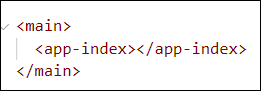
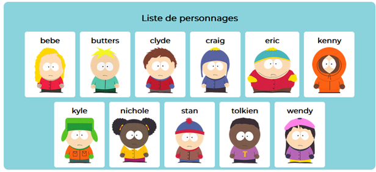
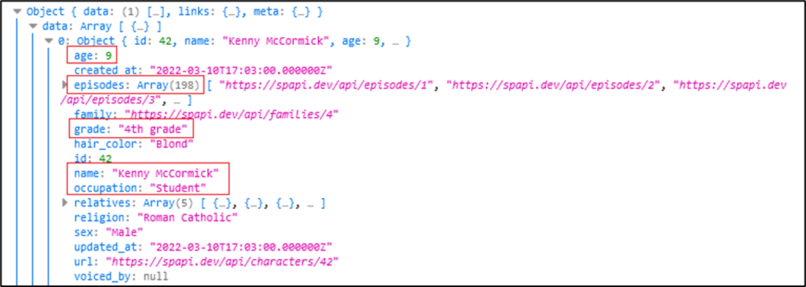
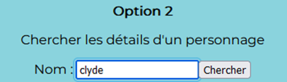

# Laboratoire 5

Dans ce laboratoire, [texte d'introduction qui parle des composants pour stimuler les étudiant(e)s à
apprendre et à prendre le laboratoire au sérieux] !

## ☃ Étape 1 - Parc du sud

Téléchargez le [projet de départ](../../static/files/labo5.zip).

Réinstallez les dépendances avec `npm install`, ouvrez Visual Studio Code et exécutez l'application Web avec `ng serve`.

## 📦 Étape 2 - Les cons, posant du code*

*Vous n'êtes pas con(ne), mais le jeu de mots n'as pas pu être évité.

Pour le moment, les composants **app**, **index** et **list** existent. En exécutant l'application, on peut voir le composant
`app` dans la page. (C'est le composant **racine** de la page, avec le header, le nav et le footer) Le composant `app` sera affiché
en permanence car il sert de squelette ☠ dans lequel on peut insérer un autre composant pour meubler le `<main>`.

Étant donné que le composant `app` contient le composant `index`, on peut voir le HTML du composant `index` également.

<center></center>

### ⛵ 1 - Routage et menu de navigation

[💡](/cours/rencontre3.1#-créer-un-nouveau-composant) Commencez par créer un nouveau composant nommé `details`. 
On le laisse vide pour le moment, comme notre espoir en un monde meilleur.

[💡](/cours/rencontre3.1#-routage) Nous aimerions que le `<main>` du composant `app` affiche un composant différent
selon la route actuelle. Créez des **règles de routage** et faites les modifications nécessaires au HTML de `app` pour
que ... :

* Le composant `index` soit affiché **par défaut** et avec la route `localhost:4200/index`.
* Le composant `list` soit affiché avec la route `localhost:4200/list`.
* Le composant `details` soit affiché avec la route `localhost:4200/details`.

De plus, assurez-vous que les trois boutons du menu de navigation soient fonctionnels pour changer de route et donc de composant.

### 🚗 2 - Deux boutons de navigation de plus

* Dans le composant `index`, cliquer sur le bouton « Voir une liste de personnages » mène vers la route `/list`.
* Le bouton « Chercher » doit mener vers la route `/details`. (Pour le moment on ne touche pas à l'`<input>` au-dessus)

## 😇 Étape 3 - Jeunes et innocents

Nous allons surtout travailler sur le composant `list` et le composant `card`. (Qui n'existe pas encore)

### 👶 3 - Créer un autre composant

[💡](/cours/rencontre3.1#-créer-un-nouveau-composant) Créez un nouveau composant nommé `card`. Il servira à afficher
**un** personnage. (Son nom et son image) Voici le HTML et le CSS pour le composant `card` :

```html showLineNumbers
<div class="card" title="Afficher les détails de ???">
    <h4>???</h4>
    
</div>

```

```css showLineNumbers
.card{
    background-color:white; text-align: center; padding:5px;
    border-radius:5px; overflow: hidden; cursor:pointer; min-width:100px;
}

.card img{ height:100px; }

.card h4{ margin:5px 0px; }
```

Ce composant ne sera pas accessible via le menu de navigation. Il sera intégré dans le composant `list` dans les étapes qui suivent.

### 🎎 4 - Intégration d'un composant en poupée russe

[💡](/cours/rencontre3.1#-poupées-russes) Dans le TypeScript du composant `list`, remarquez qu'il y a une liste de personnages.
Le but est, **pour chaque personnage de cette liste**, d'afficher un composant `card` auquel nous enverrons un nom de personnage, via
un paramètre (un `@Input()`) nommé `characterName`.

* En gros, grâce à un `*ngFor`, vous allez afficher le composant `card` qui reçoit le nom `bebe`, puis un qui reçoit le nom `butters`,
puis un qui reçoit le nom `clyde`, etc.

Dans le HTML de `card`, remplacez tous les `???` par la variable `characterName`, qui sert d'`@Input()` et qui contient le nom du personnage
à afficher. Cela complètera l'affichage.

<center></center>

Le composant `card` peut sembler un peu inutile. (Pourquoi ne pas directement tout mettre dans `list` ?) Cela dit, disons qu'on réutilise
cet affichage d'un personnage n'importe où d'autre dans le site Web, alors on aurait qu'à intégrer le composant `card` à nouveau à cet
endroit plutôt que de dupliquer tout le code HTML, CSS et TypeScript.

:::tip

Lorsque vous remarquez que du HTML et / ou du CSS se répète, songez à refactoriser un morceau de page Web en un composant.

:::

## 📜 Étape 4 - Des détails sans intérêt

C'est au tour du composant `details` (qui est encore vide) de subir nos manipulations maladroites.

Voici le HTML et le CSS à utiliser initialement :

```html showLineNumbers
<h3>Détails sur ???</h3>


<div *ngIf="false">
  <table>
    <tr><td><b>Nom complet</b> : </td><td>???</td></tr>
    <tr><td><b>Âge</b> : </td><td>???</td></tr>
    <tr><td><b>Occupation</b> : </td><td>???</td></tr>
    <tr><td><b>Grade</b> : </td><td>???</td></tr>
    <tr><td><b>Nombre d'épisodes</b> : </td><td>???</td></tr>
  </table>
</div>

```

```css showLineNumbers
td:first-child{text-align:right;}

td:last-child{text-align: left;}

```

### 📶 5 - Implémenter une requête

Dans le **TypeScript** de `details`, créez deux variables :

* `characterName`, un `string | null`. Affectez-lui la valeur `null`.
* `characterDetails`, un `Character | null`. Affectez-lui la valeur `null`.

Ensuite, dans la fonction `ngOnInit()` :

* Affectez la valeur `"kenny"` à la variable `characterName`. (Ceci est temporaire)
* [💡](/cours/rencontre2.1#-envoyer-une-requête) Envoyez la requête suivante et tentez de créer un objet de type `Character` pour remplir
la variable `characterDetails`.

```ts showLineNumbers
"https://spapi.dev/api/characters?search=" + this.characterName
```

<center>  
Pour le nombre d'épisodes... vous êtes besoin de `.length` !</center>

<br/>

À l'aide des variables `characterName` et `characterDetails`, remplacez tous les `???` dans le HTML.

* Le nom et l'image au début utiliseront `characterName`.
* Toutes les données dans le tableau utiliserons `characterDetails.property`.

## 🔌 Étape 5 - Quelques derniers branchements

### 📬 6 - Paramètres de routes

Pour le moment, le composant `details` affiche toujours les informations sur Kenny.

[💡](/cours/rencontre3.1#-routage) Ajoutez une règle de routage qui permet d'envoyer un **paramètre de route** au composant `details`.
(Il faut encore pouvoir accéder au composant `details` sans paramètre de route par contre)
* Ce paramètre de route servira à envoyer le nom d'un personnage comme « tolkien », « wendy », etc.

Dans le composant `details`, dans `ngOnInit()`, vérifiez si un paramètre de route a été reçu.
* Si oui, on le met dans la variable `characterName` et on l'utilise donc dans la requête.
* Si non, on met toujours `"Kenny"` dans `characterName` et on l'utilise par défait pour la requête.

Dans le composant `card`, ajoutez un `[routerLink]` sur le `<div>` pour rediriger vers le chemin
`/details/nom_du_personnage_cliqué`. (Par exemple, cliquer sur le `<div>` de Wendy va nous rediriger
vers `/details/wendy`)

### 📝 7 - Mini formulaire

Dans le composant `index`, faites les modifications nécessaires pour qu'on puisse écrire le nom d'un
personnage dans l'`<input>` et que ce nom soit ensuite utilisé comme **paramètre de route** quand on 
appuie sur le bouton « Chercher » qui mène vers la route `/details`. (Donc, si on écrit « eric » dans l'`<input>`,
le bouton va rediriger vers `/details/eric`)

<center>  </center>

Ce n'est pas grave si le composant `details` fonctionne mal avec un nom invalide.

🥳 Bravo, grâce à [texte conclusif sur l'usage des composants qui offre une perspective satisfaisante
sur l'apprentissage réalisé] !