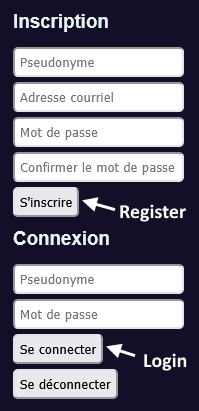
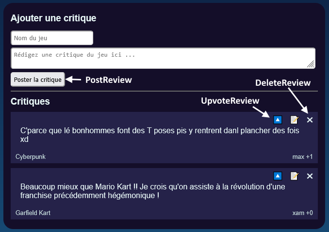
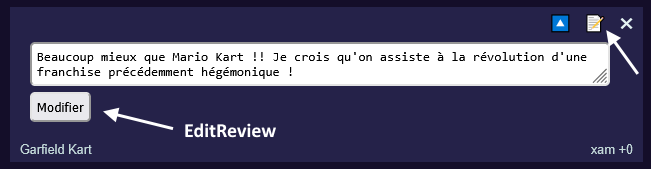

# Laboratoire 16½

Ce laboratoire couvre les notions des cours 16 et 17.

Téléchargez les [projets de départ](../../static/files/labo16.zip). N'oubliez pas de mettre à jour la base de données avec `dotnet ef database update`.

**Ce labo peut sembler intimidant**, mais au final c'est principalement (presque) copier-coller 5 actions à partir des exemples dans la section Access Control du cours 17.

## 🔍 Qui êtes-vous ?

La gestion des utilisateurs (inscription et connexion) est déjà largement implémentée **côté serveur**. Il restera juste à compléter l'implémentation **côté client**.

Vous aurez à faire toute l'implémentation **côté serveur** en faisant le **TP3** très bientôt et ce sera déjà assez.

### 1 - Inscription

[💡](/cours/rencontre8.2#-inscription) Complétez le code **côté Angular** pour que l'inscription soit fonctionnelle.

Testez si cela fonctionne en créant un utilisateur.

### 2 - Connexion

[💡](/cours/rencontre8.2#-connexion) Complétez le code **côté Angular** pour que la connexion soit fonctionnelle.

Testez si cela fonctionne en vous connectant.

## 💼 Et que voulez-vous ?

Dans cette section, vous aurez à compléter toutes les actions de `ReviewsController`. Pas besoin d'utiliser un **service** (À part **UserManager**) dans ce laboratoire. Codez tout directement dans les actions du contrôleur.

### 3 - PostReview

[💡](/cours/rencontre9.1#-post) Complétez l'action `Post` qui permettra d'ajouter un `Review` dans la base de données.

[💡](/cours/rencontre8.2#-action-réservée-aux-utilisateurs) Cette action devra seulement être utilisable par les utilisateurs authentifiés.

[💡](/cours/rencontre8.2#-exemple-de-requête-utilisant-le-token) Assurez-vous de joindre le token à la requête puisqu'elle nécessitera l'authentification.

[💡](/cours/rencontre8.1#-data-transfer-objects) Il faudra un DTO pour envoyer le **nom du jeu** et le **texte de la critique**.

[💡](/cours/rencontre8.2#%EF%B8%8F%EF%B8%8F-déterminer-qui-envoie-la-requête) Il faudra vérifier qui envoie la requête pour l'associer à la nouvelle `Review`.

[💡](/cours/rencontre9.1#-data-transfer-objects) Il faudra retourner, avec `Ok(...)`, un objet un peu différent du modèle `Review`. Vérifiez le modèle `Review` côté Angular pour créer et utiliser le parfait **DTO** !

### 4 - GetReview

:::note

Gardez à l'esprit que cette requête est déjà automatiquement appelée lorsque la page Web est réactualisée.

:::

[💡](/cours/rencontre9.1#-data-transfer-objects) Il faudra simplement retourner la liste de tous les `Review` convertis avec le même **DTO** que créé plus haut pour `Post`.

[💡](/cours/rencontre8.2#-action-réservée-aux-utilisateurs) Cette action doit être disponible pour tous, même si nous ne sommes pas authentifiés.

### 5 - DeleteReview

[💡](/cours/rencontre9.1#-delete) Seul l'auteur d'une critique doit être capable de la supprimer.

### 6 - EditReview

[💡](/cours/rencontre9.1#-put) Seul l'auteur d'une critique doit être capable de la modifier.

[💡](/cours/rencontre9.1#-put) Seul le texte de la critique doit pouvoir être modifié. (Utilisez le même **DTO** que pour `Post` et ignorez le nom du jeu, par exemple !)

### 7 - UpvoteReview

[💡](/cours/rencontre9.1#-put) Seul un utilisateur authentifié **qui N'est PAS** l'auteur d'une critique doit être capable de la _posivoter_.

Notez que si on _posivote_ une critique qu'on a **déjà _posivité_**, ça doit annuler / retirer notre upvote.

## 🔑 Qualité > Quantité

### 8 - Interceptor

[💡](/cours/rencontre8.2#-intercepteurs) Normalement, vous avez joint un token pour plusieurs requêtes dans le **projet Angular**. Remplacez ce code répétitif par un **intercepteur**.