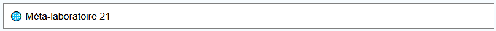
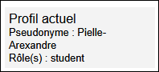
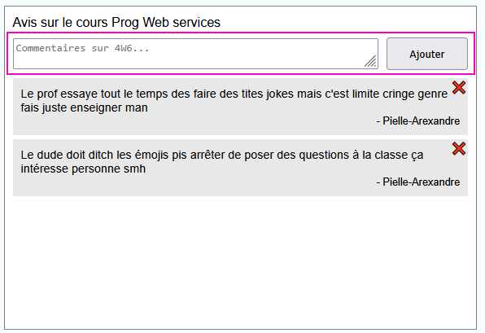
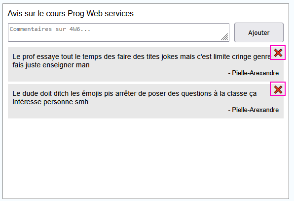

# Laboratoire 21

<center></center>

C'est le dernier laboratoire ! 😭 Téléchargez les [projets de départ](../../static/files/labo21.zip) en séchant vos larmes 💦

## 😩 Jeu de rôles

### 1 - Créer des rôles

[💡](/cours/rencontre11.1#-créer-un-rôle) Créer deux rôles nommés **student** et **corruptedTeacher** dans le seed.

### 2 - Attribuer des rôles

[💡](/cours/rencontre11.1#-créer-un-rôle) Toujours dans le seed, attribuez le rôle **student** à **Pielle-Arexandre** et à **Masie-Carrandra**.
De plus, attribuez le rôle **corruptedTeacher** à **maxou**.

### 3 - Limiter l'accès à des actions

[💡](/cours/rencontre11.1#-limiter-laccès-aux-actions) L'action `PostReview` doit seulement être utilisable par des **student**. De plus, l'action `DeleteReview` doit seulement être utilisable par **l'auteur d'un review OU par un corruptedTeacher**. (Un **corruptedTeacher** peut supprimer tous les reviews et un **student** peut seulement supprimer ses propres reviews.)

Assurez-vous de bien tester toutes ces nouvelles contraintes et n'hésitez pas à créer de nouveaux utilisateurs sans rôle en vous inscrivant.

<center>
|Utilisateur|Mot de passe|Rôle|
|-|-|-|
|maxou|allo|corruptedTeacher|
|Pielle-Arexandre|allo|student|
|Masie-Carrandra|allo|student|
</center>

## 📜 Qui suis-je ?

L'objectif de cette section sera afficher les données de l'utilisateur côté Angular. Comme le modèle `User` n'existe pas côté client et qu'on n'a pas accès à la base de données et aux rôles, il faudra être un peu créatif. (Mais pas beaucoup)

<center></center>

### 4 - Modifier la connexion

Côté serveur, dans l'action `Login`, ajoutez deux choses dans **l'objet JSON qui contient le token** :

* Le pseudonyme de l'utilisateur.
* La liste de strings avec tous les rôles de l'utilisateur.

Ces deux informations ne sont pas censées être difficiles à trouver dans le code existant.

### 5 - Afficher le profil

Côté Angular, dans le `ReviewService`, sous la requête `Login`, on va maintenant attraper ces deux nouvelles informations. Avant de faire ça, nous allons préparer des variables dans le `ReviewService` pour **stocker le pseudo et le(s) rôle(s)** de l'utilisateur présentement connecté.

[💡](/cours/rencontre11.1#-signal-pour-plusieurs-composants) Créez deux paires de signaux (la version composée d'un signal modifiable **privé** + un signal non-modifiable) :

* Un signal privé de type `string|null` initialisé avec la valeur `null`.
* Un signal privé de type `string[]` initialisé avec un tableau vide `[]`.

N'oubliez pas de créer les signaux non-modifiables associés ! (Comme ça on pourra accéder à ces valeurs en dehors du service)

💾 Toujours dans le `ReviewService`, dans la fonction `Login()`, en plus du **token** qui est déjà stocké dans le stockage local :

* Stockez le pseudo de l'utilisateur **dans le stockage local** ET **dans le signal de type `string|null`**.
* Stockez les rôles de l'utilisateur **dans le stockage local** ET **dans le signal de type `string[]`**.

:::warning

[💡](/cours/rencontre4.1#-sauvegarder-une-donnée-dun-autre-type-que-string) Comme la liste des rôles **n'est pas un `string`**, N'oubliez pas d'utiliser `JSON.parse(...)`.

:::

✍ Modifiez le HTML de `AppComponent` ... :

* Affichez le pseudo de l'utilisateur connecté à l'aide du bon signal.
* Affichez les rôles de l'utilisateur connecté à l'aide du bon signal. (Pas besoin de `*ngFor`)
* Cacher toute la boîte du profil lorsque le pseudo de l'utilisateur est `null`.

:::note

Hélas, ce fonctionnement est brisé si on réactualise la page. Pas de panique : c'est pour ça qu'on a stocké le pseudo et les rôles dans le **stockage local** !

:::

⚙ Ajoutez les deux fonctions suivantes dans votre `ReviewService`. Elles permettront au `AppComponent` de modifier les valeurs des signaux :

```ts showLineNumbers
setUsername(username : string | null){
    this.SIGNAL_DU_PSEUDO.set(username);
}

setRoles(roles : string[]){
    this.SIGNAL_DES_ROLES.set(roles);
}
```

⏰ Finalement, modifiez la fonction `ngOnInit()` dans le `AppComponent` pour qu'elle :

* Récupère le pseudo et les rôles, qui sont dans le **stockage local**.
* Modifie les signaux pour indiquer le pseudo et les rôles à l'aide des deux fonctions qu'on vient d'ajouter.

Désormais, le panneau du profil devrait être fonctionnel en tout temps, même si on réactualise la page : 

<center></center>

🔌 Un dernier détail important : la déconnexion ! Modifiez la fonction `logout()` dans le `ReviewService` :

* Elle doit supprimer le **token**, le **pseudo** et les **rôles** du stockage local.
* Elle doit réinitialiser les signaux avec les valeurs `null` et `[]`.

Assurez-vous qu'en vous déconnectant, le panneau du profil devienne invisible.

## 👀 Ce qu'on ne voit pas ne nous fait pas de mal

### 6 - Cacher des éléments selon le profil

À l'aide de `*ngIf` et des **signaux** qu'on a créés, vous devrez cacher certains éléments dans la page Web.

<center></center>

📝 La zone pour créer un `Review` doit seulement être visible pour les utilisateurs avec le rôle `student`. (L'instruction en JavaScript `monTableau.includes(valeur)`, qui retourne un booléen, sera utile !)

<center></center>

❌ Le bouton pour supprimer un `Review` doit seulement être visible pour l'auteur du `Review` ET pour tous les `corruptedTeacher`. (Comparez le pseudo dans le signal avec le nom de l'auteur du `Review`...)

Testez avec les quatre types d'utilisateurs (aucun rôle, corruptedTeacher, student auteur et student pas auteur) si tous les éléments graphiques sont bien cachés au bon moment.

<center>
|Utilisateur|Mot de passe|Rôle|
|-|-|-|
|maxou|allo|corruptedTeacher|
|Pielle-Arexandre|allo|student|
|Masie-Carrandra|allo|student|
</center>

<center>👄 Merci d'avoir complété le dernier laboratoire 👄</center>